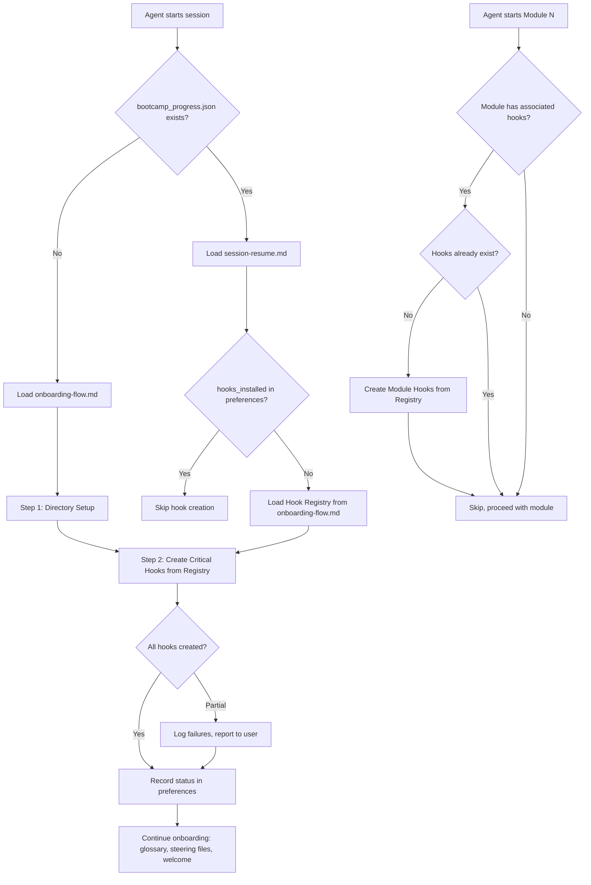
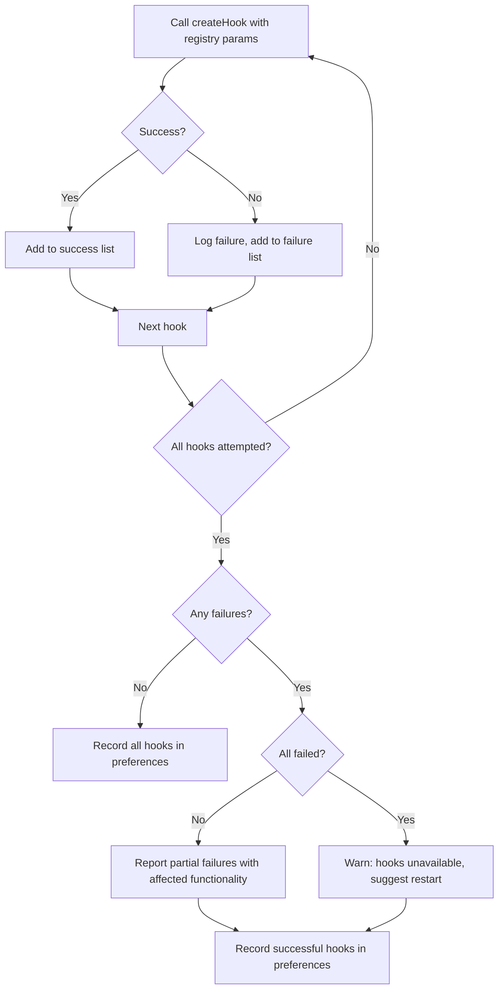

# Design Document: Hooks Distribution via createHook

## Overview

When the Senzing Bootcamp power is installed via Kiro's power system, only `steering/`, `mcp.json`, and `POWER.md` are distributed. The `hooks/` directory is excluded, causing the onboarding step that copies `.kiro.hook` files to silently fail — all 18 hooks become unavailable.

This design replaces file-copy-based hook installation with programmatic hook creation using Kiro's `createHook` tool. Hook definitions are embedded directly in the onboarding steering file as a structured registry. During onboarding, the agent reads the registry and calls `createHook` for each hook. This approach works regardless of whether the power was installed via Kiro's power system (no `hooks/` directory) or cloned from the source repository.

All deliverables are steering file and documentation updates — no executable code is produced.

## Architecture

The solution has three layers:

1. **Hook Registry** — A structured data section embedded in `onboarding-flow.md` containing all 18 hook definitions with their `createHook` parameters
2. **Agent Directives** — Updated instructions in `onboarding-flow.md` and `agent-instructions.md` telling the agent to use `createHook` instead of file copying
3. **Documentation** — Updated `HOOKS_INSTALLATION_GUIDE.md` and `hooks/README.md` reflecting the new installation method



## Components and Interfaces

### Component 1: Hook Registry (in `onboarding-flow.md`)

The Hook Registry is a new section appended to `onboarding-flow.md`. It contains all 18 hook definitions organized into two groups: Critical Hooks and Module Hooks. Each definition maps directly to `createHook` tool parameters.

**Format:** Each hook is defined as a fenced block with key-value pairs that the agent reads and passes to `createHook`. The format uses a simple labeled structure rather than JSON, since the agent parses natural language and structured text equally well, and this avoids escaping issues with the long `outputPrompt` values.

#### Critical Hooks (7 hooks — created during onboarding)

These hooks provide core bootcamp functionality that must be active from the start.

**Hook 1: capture-feedback**

| Parameter | Value |
|-----------|-------|
| id | `capture-feedback-hook` |
| name | `Capture Bootcamp Feedback` |
| description | `Fires on every message submission. Checks for feedback trigger phrases and initiates the feedback workflow with automatic context capture.` |
| eventType | `promptSubmit` |
| hookAction | `askAgent` |
| outputPrompt | `Check if the bootcamper's message contains any of these feedback trigger phrases (case-insensitive): "bootcamp feedback", "power feedback", "submit feedback", "provide feedback", "I have feedback", "report an issue". If NONE of these phrases appear in the message, do nothing — let the conversation continue normally. If a trigger phrase IS found, immediately do the following: (1) Read config/bootcamp_progress.json to get the current module number and completed modules. If the file doesn't exist, record module as "Unknown". (2) Note what the bootcamper was doing in the recent conversation. (3) Note which files are open in the editor. (4) Load steering file feedback-workflow.md and follow its complete workflow, pre-filling the context fields with what you just captured. Do NOT ask the bootcamper to re-explain their context — you already have it.` |

**Hook 2: enforce-feedback-path**

| Parameter | Value |
|-----------|-------|
| id | `enforce-feedback-path` |
| name | `Enforce Feedback File Path` |
| description | `Before any write operation, checks if the agent is writing feedback content. If so, ensures it goes to docs/feedback/SENZING_BOOTCAMP_POWER_FEEDBACK.md and nowhere else.` |
| eventType | `preToolUse` |
| hookAction | `askAgent` |
| toolTypes | `write` |
| outputPrompt | `Check if you are currently in the feedback collection workflow (i.e., the bootcamper said 'bootcamp feedback', 'power feedback', or similar, and you are writing a feedback entry). If you are NOT in the feedback workflow, do nothing — let the write proceed normally. If you ARE writing feedback content (an improvement entry with Date, Module, Priority, Category, What Happened, Why It's a Problem sections), verify the target file path is exactly 'docs/feedback/SENZING_BOOTCAMP_POWER_FEEDBACK.md'. If the path is different, STOP and redirect the write to 'docs/feedback/SENZING_BOOTCAMP_POWER_FEEDBACK.md' instead. Do NOT write feedback to any other file. Do NOT submit feedback to any external service.` |

**Hook 3: enforce-working-directory**

| Parameter | Value |
|-----------|-------|
| id | `enforce-working-dir` |
| name | `Enforce Working Directory Paths` |
| description | `Checks that file write operations do not use /tmp, %TEMP%, or any path outside the working directory. Enforces the file storage policy automatically.` |
| eventType | `preToolUse` |
| hookAction | `askAgent` |
| toolTypes | `write` |
| outputPrompt | `Before writing this file, verify: Does the file path or any path in the file content reference /tmp/, %TEMP%, ~/Downloads, or any location outside the working directory? If so, replace those paths with project-relative equivalents (database/G2C.db for databases, data/temp/ for temporary files, src/ for source code). Do NOT proceed with the write if it would place files outside the working directory.` |

**Hook 4: verify-senzing-facts**

| Parameter | Value |
|-----------|-------|
| id | `verify-senzing-facts` |
| name | `Verify Senzing Facts Before Writing` |
| description | `Reminds the agent to verify Senzing-specific facts via MCP tools before writing code or documentation that contains Senzing attribute names, SDK method calls, or configuration values.` |
| eventType | `preToolUse` |
| hookAction | `askAgent` |
| toolTypes | `write` |
| outputPrompt | `Before writing this file, verify that any Senzing-specific content (attribute names, SDK method signatures, configuration values, error code explanations) was retrieved from the Senzing MCP server tools (mapping_workflow, generate_scaffold, get_sdk_reference, search_docs, explain_error_code, sdk_guide) and not stated from training data. Per SENZING_INFORMATION_POLICY.md, all Senzing facts must come from MCP tools.` |

**Hook 5: code-style-check**

| Parameter | Value |
|-----------|-------|
| id | `code-style-check` |
| name | `Code Style Check` |
| description | `Automatically checks source code files for language-appropriate coding standards when edited.` |
| eventType | `fileEdited` |
| hookAction | `askAgent` |
| filePatterns | `*.py, *.java, *.cs, *.rs, *.ts, *.js` |
| outputPrompt | `A source code file was just edited. Check it for language-appropriate coding standards (Python: PEP-8 with max line length 100; Java: standard conventions; C#: .NET conventions; Rust: rustfmt/clippy; TypeScript: ESLint conventions). If violations are found, suggest specific fixes. If compliant, acknowledge briefly and continue.` |

**Hook 6: summarize-on-stop**

| Parameter | Value |
|-----------|-------|
| id | `summarize-on-stop` |
| name | `Summarize Progress on Stop` |
| description | `When the agent finishes working, it summarizes what was accomplished, which files changed, and what the next step is.` |
| eventType | `agentStop` |
| hookAction | `askAgent` |
| outputPrompt | `Before finishing, provide a brief summary for the bootcamper: (1) What did you just accomplish in this interaction? (2) Which files were created or modified — list the specific file paths. (3) What is the next step the bootcamper should expect when they continue? Keep it concise — a few sentences, not a wall of text.` |

**Hook 7: commonmark-validation**

| Parameter | Value |
|-----------|-------|
| id | `commonmark-validation` |
| name | `CommonMark Validation` |
| description | `Validates that all Markdown files conform to CommonMark standards when edited.` |
| eventType | `fileEdited` |
| hookAction | `askAgent` |
| filePatterns | `**/*.md` |
| outputPrompt | `The markdown file that was just edited should be validated for CommonMark compliance. Please check for: 1. MD022: Headings should be surrounded by blank lines. 2. MD040: Fenced code blocks should have a language specified. 3. Bold text followed by colons should use format: **Label:** (with space before colon). 4. MD031: Fenced code blocks should be surrounded by blank lines. 5. MD032: Lists should be surrounded by blank lines. EXCEPTION: If the file is CHANGELOG.md, ignore MD024 (duplicate headings). If any issues are found, fix them automatically.` |

#### Module Hooks (11 hooks — created when the associated module starts)

These hooks support specific modules and are created on-demand when the bootcamper reaches the relevant module.

**Hook 8: data-quality-check** (Module 5)

| Parameter | Value |
|-----------|-------|
| id | `data-quality-check` |
| name | `Senzing Data Quality Check` |
| description | `Automatically check data quality when transformation programs are saved.` |
| eventType | `fileEdited` |
| hookAction | `askAgent` |
| filePatterns | `src/transform/*.*` |
| outputPrompt | `The transformation program was just updated. Please review the changes and suggest running data quality validation tests to ensure the output still meets quality standards (>70% attribute coverage).` |

**Hook 9: validate-senzing-json** (Module 5)

| Parameter | Value |
|-----------|-------|
| id | `validate-senzing-json` |
| name | `Validate Senzing JSON Output` |
| description | `Validate Senzing JSON format when transformation output files are created or modified.` |
| eventType | `fileEdited` |
| hookAction | `askAgent` |
| filePatterns | `data/transformed/*.jsonl, data/transformed/*.json` |
| outputPrompt | `Senzing JSON output was modified. Please use the analyze_record MCP tool to validate a sample of records from this file to ensure they conform to the Senzing Generic Entity Specification.` |

**Hook 10: analyze-after-mapping** (Module 5)

| Parameter | Value |
|-----------|-------|
| id | `analyze-after-mapping` |
| name | `Analyze After Mapping` |
| description | `After completing a mapping task, reminds the agent to validate the transformation output using analyze_record before proceeding to loading.` |
| eventType | `fileCreated` |
| hookAction | `askAgent` |
| filePatterns | `data/transformed/*.jsonl, data/transformed/*.json` |
| outputPrompt | `A new Senzing JSON file was created in data/transformed/. Before proceeding to loading (Module 6), use the analyze_record MCP tool to validate a sample of records from this file. Check feature distribution, attribute coverage, and data quality. Quality score should be >70% before loading.` |

**Hook 11: backup-before-load** (Module 6)

| Parameter | Value |
|-----------|-------|
| id | `backup-before-load` |
| name | `Backup Database Before Loading` |
| description | `Remind to backup database before running loading programs.` |
| eventType | `fileEdited` |
| hookAction | `askAgent` |
| filePatterns | `src/load/*.*` |
| outputPrompt | `A loading program was modified. Before running this in production, remind the user to backup the database using: python scripts/backup_project.py` |

**Hook 12: run-tests-after-change** (Module 6)

| Parameter | Value |
|-----------|-------|
| id | `run-tests-on-change` |
| name | `Run Tests After Code Change` |
| description | `Reminds the agent to run the test suite after source code changes in loading, query, or transformation programs.` |
| eventType | `fileEdited` |
| hookAction | `askAgent` |
| filePatterns | `src/load/*.*, src/query/*.*, src/transform/*.*` |
| outputPrompt | `Source code was modified. If tests exist in the tests/ directory, remind the user to run them to verify the change didn't break anything. Suggest the appropriate test command for the chosen language.` |

**Hook 13: verify-generated-code** (Module 6)

| Parameter | Value |
|-----------|-------|
| id | `verify-generated-code` |
| name | `Verify Generated Code Runs` |
| description | `When bootcamp source code is created, prompts the agent to run it on sample data and report results before moving on.` |
| eventType | `fileCreated` |
| hookAction | `askAgent` |
| filePatterns | `src/transform/*.*, src/load/*.*, src/query/*.*` |
| outputPrompt | `A new bootcamp source file was created. Before moving to the next step, verify this code actually runs: (1) Execute it on a small sample (10-100 records from data/samples/ or data/raw/). (2) Check for errors or exceptions. (3) If it produces output, inspect the first few records. (4) Report the results to the bootcamper — did it work, and if not, what needs fixing? Do not skip this verification step.` |

**Hook 14: offer-visualization** (Module 8)

| Parameter | Value |
|-----------|-------|
| id | `offer-visualization` |
| name | `Offer Entity Graph Visualization` |
| description | `After query programs are created in Module 8, prompts the agent to offer generating an interactive entity graph visualization.` |
| eventType | `fileCreated` |
| hookAction | `askAgent` |
| filePatterns | `src/query/*` |
| outputPrompt | `A query program was just created. If the bootcamper is in Module 8 and hasn't been offered the entity graph visualization yet, offer it: 'Would you like me to help you build an interactive entity graph visualization? It shows resolved entities as a force-directed network graph with clustering, search, and detail panels. I can create a self-contained HTML file you can open in any browser.' If they accept, load steering file visualization-guide.md and follow its workflow.` |

**Hook 15: enforce-visualization-offers** (Module 8)

| Parameter | Value |
|-----------|-------|
| id | `enforce-viz-offers` |
| name | `Enforce Module 8 Visualization Offers` |
| description | `When the agent stops during Module 8, checks whether both visualization offers were made. If either was missed, prompts the agent to offer it before closing.` |
| eventType | `agentStop` |
| hookAction | `askAgent` |
| outputPrompt | `First, read config/bootcamp_progress.json and check the current_module field. If the current module is NOT 8, do nothing — let the conversation end normally. If the current module IS 8, review the conversation history and check whether you offered BOTH of these visualizations during this interaction: 1. Entity graph visualization — an interactive force-directed network graph of resolved entities (offered after exploratory queries in step 3). 2. Results dashboard — an HTML page showing query results and validation metrics (offered after documenting findings in step 7). If BOTH were offered (regardless of whether the bootcamper accepted or declined), do nothing. If EITHER was NOT offered, ask the bootcamper if they would like that visualization before wrapping up. WAIT for the bootcamper's response before finishing.` |

**Hook 16: module12-phase-gate** (Module 12)

| Parameter | Value |
|-----------|-------|
| id | `module12-phase-gate` |
| name | `Module 12 Phase Gate` |
| description | `After packaging tasks complete in Module 12, displays a phase gate prompt asking the bootcamper whether to proceed to deployment or stop.` |
| eventType | `postTaskExecution` |
| hookAction | `askAgent` |
| outputPrompt | `First, read config/bootcamp_progress.json and check the current_module field. If the current module is NOT 12, do nothing. If the current module IS 12, display a packaging-complete summary showing all packaging steps are done (containerized, multi-env config, CI/CD, checklist, rollback plan) and note that nothing has been deployed yet — it is safe to stop here. Then ask: "Would you like to actually deploy this now, or would you prefer to stop here and deploy later on your own?" WAIT for the bootcamper's response. Do NOT proceed to deployment steps until the bootcamper explicitly says they want to deploy.` |

**Hook 17: backup-project-on-request** (any module)

| Parameter | Value |
|-----------|-------|
| id | `backup-on-request` |
| name | `Backup Project on Request` |
| description | `Run project backup when user clicks the hook button.` |
| eventType | `userTriggered` |
| hookAction | `askAgent` |
| outputPrompt | `The user wants to back up their project. Run the backup script: python3 scripts/backup_project.py (on Linux/macOS) or python scripts/backup_project.py (on Windows). Create the backups/ directory first if it doesn't exist.` |

**Hook 18: git-commit-reminder** (any module)

| Parameter | Value |
|-----------|-------|
| id | `git-commit-reminder` |
| name | `Git Commit Reminder` |
| description | `Reminds the user to commit their work after completing a module. Triggered manually via button click.` |
| eventType | `userTriggered` |
| hookAction | `askAgent` |
| outputPrompt | `The user wants to commit their bootcamp progress. Check config/bootcamp_progress.json for the current module number and list of completed modules. Then suggest a git commit with a descriptive message like: git add . && git commit -m "Complete Module [N]: [Module Name]". Show the user the command and ask if they'd like you to run it.` |

### Component 2: Onboarding Flow Changes (`onboarding-flow.md`)

The onboarding flow's Step 1 (Directory Structure) is modified to replace file copying with `createHook` calls.

**Current Step 1.2:**

```
2. Install hooks: copy `senzing-bootcamp/hooks/*.kiro.hook` to `.kiro/hooks/`.
```

**New Step 1.2:**

```
2. Install Critical Hooks: For each hook in the Hook Registry's "Critical Hooks" section below,
   call the createHook tool with the specified parameters. If a createHook call fails, log the
   failure and continue with the remaining hooks. After all attempts, report any failures to the
   bootcamper with the affected functionality. If all fail, warn that hooks are unavailable and
   suggest restarting onboarding.
```

**Verification sub-step added after hook creation:**

```
2b. Verify hooks: Check that each Critical Hook exists in .kiro/hooks/. If any are missing,
    retry creation once. Record the hook installation status (list of installed hook names and
    timestamp) in config/bootcamp_preferences.yaml under a `hooks_installed` key.
```

The step ordering is preserved: directory creation (1) → hook creation (2) → glossary copy (3) → steering file generation (4).

### Component 3: Agent Instructions Changes (`agent-instructions.md`)

The Hooks section in `agent-instructions.md` is updated:

**Current:**

```markdown
## Hooks

Install to `.kiro/hooks/` from `senzing-bootcamp/hooks/`. Create directory if needed.
The `capture-feedback` hook is critical — it guarantees feedback is captured when bootcampers use trigger phrases. Verify it is installed.
```

**New:**

```markdown
## Hooks

Create hooks using the createHook tool with definitions from the Hook Registry in `onboarding-flow.md`. Critical hooks are created during onboarding. Module hooks are created when the relevant module starts — check the Hook Registry for module associations and create any missing hooks for the current module before beginning module work.

The `capture-feedback` hook is critical — it guarantees feedback is captured when bootcampers use trigger phrases. Verify it is installed.

On session resume: check `config/bootcamp_preferences.yaml` for `hooks_installed`. If present and populated, skip hook creation. If absent, create Critical Hooks from the Hook Registry.
```

### Component 4: Session Resume Behavior

When `session-resume.md` is loaded (returning bootcamper), the agent checks `config/bootcamp_preferences.yaml` for the `hooks_installed` key:

- **Key exists with hook names and timestamp** → Skip hook creation entirely. Hooks are already installed.
- **Key is missing or empty** → Load the Hook Registry from `onboarding-flow.md` and create Critical Hooks. This handles the case where a bootcamper started before this feature was implemented, or where preferences were reset.

This check happens during Step 1 (Read All State Files) of `session-resume.md`, before the welcome-back banner.

### Component 5: Fallback and Verification Logic

The agent follows this sequence for each hook creation:



**Failure impact messages** — when a critical hook fails, the agent reports what functionality is lost:

| Hook | Impact Message |
|------|---------------|
| capture-feedback | "Feedback trigger phrases will not be automatically detected. Use the feedback workflow manually." |
| enforce-feedback-path | "Feedback may be written to incorrect file locations." |
| enforce-working-directory | "File writes to /tmp or external paths will not be automatically blocked." |
| verify-senzing-facts | "Senzing facts will not be automatically verified against MCP tools before writing." |
| code-style-check | "Code style will not be automatically checked on save." |
| summarize-on-stop | "Session summaries will not be automatically generated when the agent stops." |
| commonmark-validation | "Markdown files will not be automatically checked for CommonMark compliance." |

### Component 6: Documentation Updates

**HOOKS_INSTALLATION_GUIDE.md** changes:
- Replace "Automatic Installation" section: hooks are created programmatically via `createHook` during onboarding, not copied from files
- Replace "Manual Installation" section: primary method is "Ask the agent: Please recreate the bootcamp hooks". Remove file-copy commands and `scripts/install_hooks.py` references
- Update hook count from 11 to 18
- Update the hook table to list all 18 hooks

**hooks/README.md** changes:
- Add `createHook`-based installation as the primary method (Option 1)
- Demote file-copying to secondary method for development environments
- Remove `scripts/install_hooks.py` from recommended methods
- Add a note that `.kiro.hook` files are the canonical source and the Hook Registry in `onboarding-flow.md` must be kept in sync

## Data Models

### Hook Installation Status (in `config/bootcamp_preferences.yaml`)

```yaml
hooks_installed:
  timestamp: "2026-04-20T14:30:00Z"
  method: "createHook"
  critical_hooks:
    - capture-feedback-hook
    - enforce-feedback-path
    - enforce-working-dir
    - verify-senzing-facts
    - code-style-check
    - summarize-on-stop
    - commonmark-validation
  module_hooks:
    - data-quality-check
    - validate-senzing-json
    # ... added as modules are started
```

This structure allows the agent to:
- Check if hooks were installed (`hooks_installed` key exists)
- Know which hooks are installed (to avoid duplicates)
- Know the installation method (for debugging)
- Determine if module hooks need creation (check if a module's hooks are in the list)

### Hook Registry Format (in `onboarding-flow.md`)

Each hook definition uses a markdown table with `Parameter | Value` columns. This format was chosen because:
- The agent parses markdown tables natively
- No JSON escaping issues with long prompt strings
- Easy for maintainers to read and edit
- Each parameter maps 1:1 to a `createHook` tool parameter

## Error Handling

| Scenario | Behavior |
|----------|----------|
| Single critical hook creation fails | Log failure, continue with remaining hooks, report failure with impact message after all attempts |
| All critical hook creations fail | Warn bootcamper that hooks are unavailable, suggest restarting onboarding or manually creating hooks later |
| Module hook creation fails | Log failure, continue with module work without blocking |
| Hook already exists (duplicate creation) | `createHook` tool handles this — no error, existing hook is preserved |
| `bootcamp_preferences.yaml` missing during resume | Treat as no hooks installed, create Critical Hooks |
| `bootcamp_preferences.yaml` corrupted | Treat as no hooks installed, create Critical Hooks |
| `onboarding-flow.md` not loadable | Fatal — cannot proceed with onboarding (this is an existing failure mode, not new) |

## Testing Strategy

Property-based testing is not applicable to this feature. All deliverables are steering file content and documentation updates — there are no pure functions, parsers, serializers, or algorithms with variable input spaces. The appropriate testing approaches are:

### Manual Verification

1. **Power distribution test**: Install the power via Kiro's power system, start a fresh bootcamp, and verify all 7 critical hooks appear in `.kiro/hooks/` after onboarding completes
2. **Source repository test**: Clone the repository, start a fresh bootcamp, and verify the same 7 critical hooks are created (confirming backward compatibility)
3. **Module hook test**: Progress to Module 5 and verify the 3 Module 5 hooks are created
4. **Session resume test**: Close and reopen a session, verify hooks are not recreated (check preferences file)
5. **Failure test**: Temporarily break a hook definition in the registry, verify the agent reports the failure and continues

### Document Content Verification

- Verify `onboarding-flow.md` no longer contains `copy senzing-bootcamp/hooks/` instruction
- Verify `onboarding-flow.md` contains the complete Hook Registry with all 18 definitions
- Verify `agent-instructions.md` references `createHook` and the Hook Registry
- Verify `HOOKS_INSTALLATION_GUIDE.md` lists 18 hooks and uses `createHook` as primary method
- Verify `hooks/README.md` lists `createHook` as primary and file-copy as secondary
- Verify all 18 `.kiro.hook` files are retained in `senzing-bootcamp/hooks/`

### Consistency Verification

- For each of the 18 hooks, verify the Hook Registry entry matches the canonical `.kiro.hook` file's parameters (name, description, event type, action type, prompt/command, patterns, tool types)
