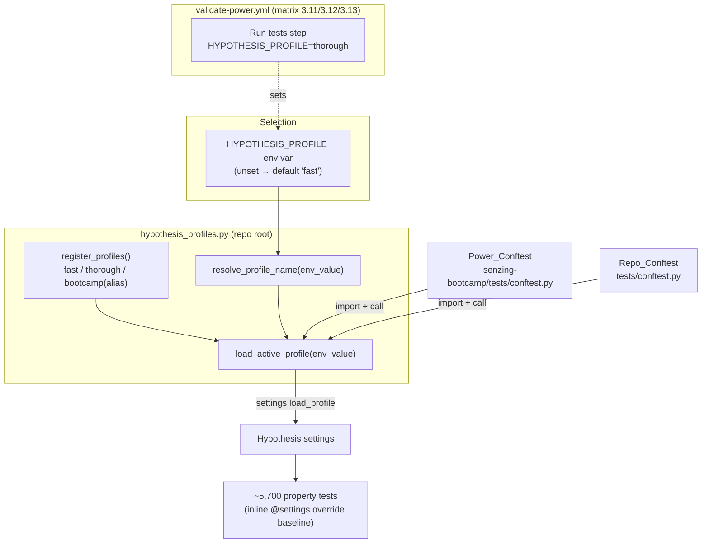

# Design Document

## Overview

This feature replaces the two duplicated, hand-maintained `bootcamp` Hypothesis
profiles (one in `senzing-bootcamp/tests/conftest.py`, one in `tests/conftest.py`)
with a single shared registry module that registers a small hierarchy of named
profiles and selects the active one from an environment variable. The fast
profile is the local default for quick iteration; the thorough profile is forced
in CI so merged changes are always validated against the full example baseline.

The design is deliberately small and additive. It touches one new module, two
`conftest.py` files, one CI workflow, one steering file, and one previously
hand-lowered test. It introduces **no new runtime or test dependencies** — only
the already-present `pytest` and `hypothesis` — in keeping with the stdlib-only
tech-stack rule.

### Resolved Open Design Decisions

The requirements deferred eight decisions to design. Each is resolved here, with
rationale; the rest of the document builds on these choices.

| # | Decision | Resolution | Rationale |
|---|----------|------------|-----------|
| 1 | Profile names | Canonical profiles are **`fast`** and **`thorough`**. The legacy name **`bootcamp`** is retained as an alias registered with the thorough settings. | `fast`/`thorough` describe intent better than `dev`/`ci`. Keeping `bootcamp` as an alias means any stray `load_profile("bootcamp")` or external reference keeps working with no weaker coverage. |
| 2 | Default profile | Default (when the env var is unset) is **`fast`**. No non-CI automation needs a different default. | The brief calls for fast local iteration by default; CI overrides explicitly via the env var (Decision 4). |
| 3 | Example counts | **`fast` = 10**, **`thorough` = 100**, `BASELINE` constant = 20. | `thorough = 100` equals Hypothesis's own default `max_examples`, so un-decorated property tests keep running exactly as many examples as they do today — coverage is provably not weakened (Req 4). `fast = 10` gives a meaningful local speedup while staying a useful smoke level. Both satisfy `thorough >= 20` and `fast < thorough`. |
| 4 | Environment variable | Adopt Hypothesis's conventional name **`HYPOTHESIS_PROFILE`**, but resolve and load it in our own registry code rather than relying on implicit framework behavior. | Reusing the well-known name aids discoverability; explicit resolution lets us raise a clear, value-naming error on an unknown profile (Req 3.3) and load exactly once (Req 3.4). |
| 5 | Module location & import | A new repo-root module **`hypothesis_profiles.py`**. Each conftest ensures the repo root is on `sys.path`, then imports it. | The two conftests live in different, non-package roots. The repo root is the one directory both can locate from `__file__`, and `Repo_Conftest` already adds it to `sys.path`. A repo-root module is dev/test tooling that is **not** shipped inside `senzing-bootcamp/`, satisfying the "no dev-only files in the power" rule. |
| 6 | `pyproject.toml` pytest section | **Do not** add `[tool.pytest.ini_options]`. Profile selection stays runtime/env-driven in the registry, conftests, and CI. | Hypothesis profile activation cannot be expressed in a static pytest ini table; adding one would not carry the behavior and would risk changing collection. The existing explicit CI invocation already names both roots. |
| 7 | Inline `@settings(max_examples=...)` migration | **Leave existing inline decorators as-is.** They remain valid explicit overrides. No bulk removal. | They are harmless on top of the baseline (Req 5), and a sweeping edit across hundreds of files is high-risk and out of scope. The reconciled convention (Req 7) is "profile sets the baseline; inline `@settings` overrides it." |
| 8 | Restore the hand-lowered test | **Yes** — restore the one test that was hand-lowered from `max_examples=20` to `10` by removing its inline override so it inherits the profile baseline. | This is the concrete motivating regression. The candidate lives in `senzing-bootcamp/tests/test_version_frontmatter_properties.py`; the exact decorator is confirmed against git history during implementation. Removing the ad-hoc count returns it to baseline-driven behavior. |

## Architecture

Today each collection root registers and loads its own copy of the `bootcamp`
profile at conftest import time. The two definitions can silently drift, and
neither sets `max_examples`, so un-decorated tests fall back to Hypothesis's
default of 100.

The new architecture inserts a single shared module between the conftests and
Hypothesis. Both conftests call into it; the module owns all profile definitions
and the env-var selection logic.



### Control Flow

1. pytest begins collection over `senzing-bootcamp/tests/` and `tests/`.
2. Each `conftest.py` is imported (order is not guaranteed and does not matter).
   At import time each conftest:
   a. computes its repo root from `__file__` and ensures it is on `sys.path`;
   b. imports `hypothesis_profiles`;
   c. calls `load_active_profile()`, which registers all profiles and loads the
      one named by `HYPOTHESIS_PROFILE` (or the default).
3. Registration is idempotent — the second conftest re-registers the same
   profiles (overwrite, no error) and loads the same profile. Both roots end up
   on identical settings.
4. Each property test runs with the active profile's `max_examples` as its
   baseline, unless it carries an inline `@settings(max_examples=...)`, which
   takes precedence for that test only.
5. In CI, the "Run tests" step exports `HYPOTHESIS_PROFILE=thorough` for every
   matrix entry, so step 2c always loads `thorough`.

### Why coverage cannot be weakened

`thorough` sets `max_examples = 100`, identical to Hypothesis's built-in
default. Tests that have no inline `@settings` therefore run the same number of
examples under the new thorough profile as they do today. Tests with an inline
override are unaffected by either profile (the override always wins). The only
behavioral change in CI is that profile registration is now centralized; the
example budget per test is unchanged or higher. The `fast` profile is reachable
only locally and is never selected by CI.

## Components and Interfaces

### New module: `hypothesis_profiles.py` (repo root)

A small, stdlib-plus-Hypothesis module. It follows the project's Python
conventions (`from __future__ import annotations`, type hints, Google-style
docstrings, line length 100).

Public surface:

```python
# Constants
FAST: str = "fast"
THOROUGH: str = "thorough"
LEGACY_ALIAS: str = "bootcamp"           # registered as an alias of THOROUGH
DEFAULT_PROFILE: str = FAST
ENV_VAR: str = "HYPOTHESIS_PROFILE"

BASELINE_EXAMPLE_COUNT: int = 20         # documented convention value
FAST_MAX_EXAMPLES: int = 10
THOROUGH_MAX_EXAMPLES: int = 100         # == Hypothesis default; never weakens CI

# Functions
def register_profiles() -> None:
    """Register every profile (fast, thorough, bootcamp alias).

    Idempotent: safe to call multiple times within one test-suite run; later
    calls overwrite the registration with identical settings and never raise.
    Every profile sets ``deadline=None`` and suppresses the ``too_slow``
    health check, preserving today's timing behavior.
    """

def registered_profile_names() -> tuple[str, ...]:
    """Return the names this module registers (for tests and validation)."""

def resolve_profile_name(env_value: str | None) -> str:
    """Map an env-var value to a registered profile name.

    Returns ``DEFAULT_PROFILE`` when ``env_value`` is None or empty. Returns the
    value unchanged when it names a registered profile. Raises ``ValueError``
    naming the offending value otherwise.
    """

def load_active_profile(env_value: str | None = None) -> str:
    """Register all profiles, resolve the active name, load it, and return it.

    When ``env_value`` is None the function reads ``os.environ[ENV_VAR]``.
    Loads exactly one profile per call.
    """
```

`resolve_profile_name` is a **pure function** (no I/O, no global mutation) —
deliberately separated from `load_active_profile` so the selection logic can be
property-tested without touching the global Hypothesis settings or the
environment.

### Modified: `Power_Conftest` (`senzing-bootcamp/tests/conftest.py`)

- Remove the inline `settings.register_profile("bootcamp", ...)` /
  `settings.load_profile("bootcamp")` block.
- Add: ensure repo root (`Path(__file__).resolve().parents[2]`) is on
  `sys.path`, `import hypothesis_profiles`, call
  `hypothesis_profiles.load_active_profile()`.
- All other behavior is preserved unchanged: the `scripts/` `sys.path` insert,
  the `_recover_stale_cwd` autouse fixture, and every existing fixture and
  strategy helper.

### Modified: `Repo_Conftest` (`tests/conftest.py`)

- Remove the inline `bootcamp` registration/load block.
- Add: `import hypothesis_profiles` (the repo root is already on `sys.path` via
  the existing `_PROJECT_ROOT` insert), call
  `hypothesis_profiles.load_active_profile()`.
- Preserve the `_restore_project_root_cwd` autouse fixture and the `tests/` and
  project-root `sys.path` inserts.

### Modified: CI workflow (`.github/workflows/validate-power.yml`)

- In the `tests` job's "Run tests" step, set `HYPOTHESIS_PROFILE: thorough`
  (step-level `env`). Because the step belongs to the job that runs the
  `['3.11','3.12','3.13']` matrix, the selection applies to all three entries.
- The pytest invocation continues to target both
  `senzing-bootcamp/tests/ tests/`.

### Modified: `Python_Conventions` (`.kiro/steering/python-conventions.md`)

- Replace the fixed `@settings(max_examples=20)` guidance with: profiles set the
  baseline (`fast=10`, `thorough=100`, default `fast`, selected via
  `HYPOTHESIS_PROFILE`); inline `@settings` are overrides used only when a test
  genuinely needs a non-baseline count.
- Document the local commands (e.g., default run uses `fast`;
  `HYPOTHESIS_PROFILE=thorough python -m pytest ...` for a full local run).

### Modified: hand-lowered test (`test_version_frontmatter_properties.py`)

- Remove the ad-hoc `@settings(max_examples=10)` override on the test that was
  hand-lowered from 20, so it inherits the active profile baseline.

## Data Models

This feature has no persisted data and no serialization. Its "data" is a small,
fixed configuration table plus the selection function's input/output domains.

### Profile table (registered by `register_profiles()`)

| Profile name | `max_examples` | `deadline` | `suppress_health_check` | Role |
|--------------|----------------|------------|--------------------------|------|
| `fast` | 10 | `None` | `[HealthCheck.too_slow]` | Local default |
| `thorough` | 100 | `None` | `[HealthCheck.too_slow]` | CI / full local run |
| `bootcamp` (alias) | 100 | `None` | `[HealthCheck.too_slow]` | Backward-compat alias of `thorough` |

Invariants enforced by construction:

- `FAST_MAX_EXAMPLES (10) < THOROUGH_MAX_EXAMPLES (100)`
- `THOROUGH_MAX_EXAMPLES (100) >= BASELINE_EXAMPLE_COUNT (20)`
- every registered profile has `deadline is None` and `too_slow` suppressed.

### `resolve_profile_name` domains

| Input (`env_value`) | Output |
|---------------------|--------|
| `None` or `""` | `DEFAULT_PROFILE` (`"fast"`) |
| any registered name (`"fast"`, `"thorough"`, `"bootcamp"`) | that same name |
| any other string | raises `ValueError` whose message contains the input value and the list of valid names |

The function is total over `str | None`, deterministic, and free of side
effects, so the same input always yields the same result for both collection
roots (Req 3.5).

## Correctness Properties

*A property is a characteristic or behavior that should hold true across all
valid executions of a system — essentially, a formal statement about what the
system should do. Properties serve as the bridge between human-readable
specifications and machine-verifiable correctness guarantees.*

Most acceptance criteria for this feature are fixed-configuration checks
(constant `max_examples` values, profile registration), structural wiring
(imports, `sys.path`), or static configuration (the CI YAML and documentation).
Those are covered by example-based, smoke, and config-scan tests in the Testing
Strategy below. Four criteria genuinely vary with input and express universal
rules — these are the property-based tests. They target the **pure logic** of
`hypothesis_profiles.py` (`resolve_profile_name` and `register_profiles`) so
iterations are cheap and isolated from global Hypothesis state.

### Property 1: A registered profile name resolves to itself, for both roots

*For any* registered profile name `n` (drawn from the set returned by
`registered_profile_names()`), `resolve_profile_name(n)` returns `n`. Because
`resolve_profile_name` is a pure, deterministic function, the same input yields
the same result regardless of which conftest calls it, so both collection roots
load the same profile for a given environment value.

**Validates: Requirements 3.1, 3.5, 8.4**

### Property 2: An unrecognized profile value raises an error naming the value

*For any* string `s` that is not a registered profile name and is non-empty,
`resolve_profile_name(s)` raises a `ValueError` whose message contains `s`
(verbatim), so the failure points the developer at the exact offending value.

**Validates: Requirements 3.3, 8.6**

### Property 3: Every registered profile preserves the timing settings

*For any* profile name in `registered_profile_names()`, the registered profile
has `deadline is None` and includes `HealthCheck.too_slow` in its
`suppress_health_check` set. This holds uniformly across `fast`, `thorough`, and
the `bootcamp` alias, guaranteeing the centralized profiles never regress the
timing behavior the two inline profiles provided.

**Validates: Requirements 1.1, 1.6**

### Property 4: Profile registration is idempotent

*For any* number of repeated calls to `register_profiles()` within a single
run, no error is raised and the resulting registered profiles and their settings
are identical to those after a single call. This guarantees that two conftests
(or any re-import) registering the same profiles never collide.

**Validates: Requirements 2.4**

## Error Handling

| Condition | Handling | Requirement |
|-----------|----------|-------------|
| `HYPOTHESIS_PROFILE` set to a value that is not a registered profile | `resolve_profile_name` raises `ValueError` whose message names the bad value and lists the valid names; this surfaces at conftest import time, failing collection fast with an actionable message rather than silently running a wrong/zero profile. | 3.3 |
| `HYPOTHESIS_PROFILE` unset or empty | Treated as "not specified" → `DEFAULT_PROFILE` (`fast`) is loaded. Not an error. | 3.2 |
| Repeated registration (two conftests, re-import) | No error — registration is idempotent and overwrites with identical settings. | 2.4 |
| Repo root not yet on `sys.path` when a conftest imports the registry | Each conftest defensively inserts its computed repo root onto `sys.path` before importing `hypothesis_profiles`, so the import never depends on collection order or the other conftest having run first. | 2.1, 2.2 |
| A test relies on the default Hypothesis example count | Preserved: `thorough = 100` equals the Hypothesis default, so CI behavior for un-decorated tests is unchanged. | 4.2 |

Design choice: selection errors are raised eagerly at import time (when the
profile is loaded) rather than lazily per-test, so a typo in the env var fails
the whole run immediately with a clear message instead of producing confusing
partial results.

## Testing Strategy

### Dual approach

- **Property-based tests** verify the four universal properties above against
  the pure logic in `hypothesis_profiles.py`.
- **Unit / example tests** verify the fixed configuration values, the default
  and single-load behavior, and the preserved conftest fixture behaviors.
- **Config-scan tests** verify the static CI YAML and source-level
  de-duplication facts.
- **Smoke tests** verify import/`sys.path` wiring (largely implied by the suite
  collecting at all).

### Property-based testing library and configuration

- Use **Hypothesis** (already a project dependency) — do not hand-roll
  generators.
- Each property test runs a **minimum of 100 iterations**. These tests exercise
  pure functions with no I/O, so 100+ iterations are cheap.
- The four property tests live in a new test module (e.g.,
  `tests/test_hypothesis_profiles_properties.py`, at the repo root so the module
  under test imports cleanly). Each test draws strings/names with Hypothesis
  strategies (registered names via `st.sampled_from(registered_profile_names())`;
  unrecognized values via `st.text()` filtered to exclude the registered set and
  the empty string).
- Each property test is tagged with a comment referencing its design property in
  the format: **Feature: hypothesis-settings-centralization, Property {number}:
  {property_text}**.

Mapping of properties to tests:

| Property | Test focus | Iterations |
|----------|-----------|------------|
| Property 1 | `resolve_profile_name(n) == n` for sampled registered names | ≥100 |
| Property 2 | `resolve_profile_name(s)` raises `ValueError` containing `s` for arbitrary non-registered strings | ≥100 |
| Property 3 | each registered profile has `deadline is None` and `too_slow` suppressed | ≥100 |
| Property 4 | repeated `register_profiles()` is error-free and stable | ≥100 |

### Example-based / unit tests

- **Counts and registration (Req 1.1–1.5, 8.1–8.3):** assert `fast` and
  `thorough` are registered; `fast` max_examples `== 10`; `thorough` `== 100`;
  `thorough >= BASELINE_EXAMPLE_COUNT (20)`; `fast < thorough`.
- **Default and single-load (Req 3.2, 3.4, 8.5):** `resolve_profile_name(None)`
  and `resolve_profile_name("")` both return `fast`; `load_active_profile`
  returns exactly the resolved name.
- **Override semantics (Req 5.1–5.3):** representative tests confirming an
  un-decorated `@given` test inherits the active profile's `max_examples`, and a
  test with `@settings(max_examples=v)` reports effective `max_examples == v`
  under both profiles. (This verifies Hypothesis's documented merge behavior at
  a representative level rather than re-testing the library exhaustively.)
- **Preserved conftest behavior (Req 6.1–6.3):** representative tests/regressions
  that the cwd-restoring autouse fixtures still snap back to the project root and
  that script/helper imports still resolve.
- **Dependency policy (Req 6.4):** assert `hypothesis_profiles` imports only
  stdlib plus `hypothesis`.

### Config-scan tests

- **De-duplication (Req 2.3, 2.5):** scan both `conftest.py` files and assert
  neither contains an inline `settings.register_profile(` call — registration
  lives only in `hypothesis_profiles.py`.
- **CI wiring (Req 4.1, 4.3, 4.4):** parse `.github/workflows/validate-power.yml`
  and assert the `tests` job's "Run tests" step sets
  `HYPOTHESIS_PROFILE: thorough`, that the matrix lists `3.11`, `3.12`, `3.13`,
  and that the pytest command still targets both `senzing-bootcamp/tests/` and
  `tests/`.
- **Documentation (Req 7.1–7.5):** optional scan asserting
  `python-conventions.md` documents the profile names, the env var, the default
  profile, and the override semantics.

### Full-suite verification

After implementation, run the complete suite locally under the thorough profile
(`HYPOTHESIS_PROFILE=thorough python -m pytest senzing-bootcamp/tests/ tests/ -v --tb=short`)
to confirm centralization does not destabilize the ~5,700 existing tests, and a
fast run (default) to confirm the local speedup path works. Run `ruff check` over
the new module and edited files to satisfy the lint gate.
