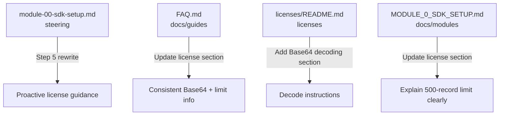

# Design: Better License Guidance in Module 0

## Overview

This design improves the license guidance experience during Module 0 (SDK Setup) by making the 500-record evaluation limit, license placement, and Base64 decoding proactive and explicit. Currently, license information is scattered across multiple files and presented reactively. The change consolidates and surfaces this guidance at the right moment in the bootcamp flow — Step 5 of Module 0.

The changes are purely documentation and steering file updates. No code, scripts, or new files are introduced.

## Architecture

This feature modifies existing content in the Senzing Bootcamp power's documentation and steering layers. No new architectural components are needed.

### Files to Modify



| File                                                   | Change Type            | Rationale                                                                  |
| ------------------------------------------------------ | ---------------------- | -------------------------------------------------------------------------- |
| `senzing-bootcamp/steering/module-00-sdk-setup.md`     | Rewrite Step 5         | Primary agent-facing workflow — where the proactive guidance lives          |
| `senzing-bootcamp/docs/guides/FAQ.md`                  | Update license Q&A     | User-facing reference — must be consistent with steering                   |
| `senzing-bootcamp/licenses/README.md`                  | Add Base64 section     | License-specific docs — missing decode instructions                        |
| `senzing-bootcamp/docs/modules/MODULE_0_SDK_SETUP.md`  | Update license section | User-facing module docs — needs 500-record explanation                     |

### Files NOT Modified (already adequate)

| File                                             | Reason                                                                                                                       |
| ------------------------------------------------ | ---------------------------------------------------------------------------------------------------------------------------- |
| `senzing-bootcamp/POWER.md`                      | Already mentions 500-record eval license; brief mention is appropriate for overview                                          |
| `senzing-bootcamp/steering/onboarding-flow.md`   | Already mentions "Built-in 500-record eval license" in introduction; detailed guidance belongs in Module 0, not onboarding   |

## Components and Interfaces

### Component 1: Module 0 Steering — Step 5 Rewrite

The primary change. Step 5 ("Configure License") in `module-00-sdk-setup.md` is rewritten to be proactive rather than reactive.

**Current behavior:** The agent checks for an existing license, then asks if the user has one. The 500-record limit is mentioned only as a fallback ("the SDK works with evaluation limits").

**New behavior:** The agent proactively explains:

1. Senzing includes a built-in 500-record evaluation license — no file needed
2. This is enough for the bootcamp demo modules but will hit SENZ9000 at record 501 with larger datasets
3. If the user has a custom license (evaluation or production), guide them to place it at `licenses/g2.lic`
4. If the license is Base64-encoded (common when received via email), decode it first

**New Step 5 structure:**

```text
Step 5: Configure License

1. EXPLAIN the 500-record built-in evaluation license proactively
   - "Senzing includes a built-in evaluation license limited to 500 records.
     This works for the bootcamp's demo and small datasets. If you load more
     than 500 records, you'll get a SENZ9000 error at record 501."
   - "For larger datasets, you need a custom license file."

2. ASK: "Do you have a Senzing license file or Base64-encoded license key?"
   WAIT for response.

3. IF user has a Base64-encoded string:
   - Guide them to decode it:
     Linux/macOS: echo '<BASE64_STRING>' | base64 --decode > licenses/g2.lic
     Windows:     [System.Convert]::FromBase64String('<BASE64_STRING>') |
                  Set-Content -Path licenses\g2.lic -AsByteStream
   - Verify the file is binary (not text): file licenses/g2.lic
   - Confirm: "License decoded and saved to licenses/g2.lic."

4. IF user has a .lic file:
   - Guide them to copy it: cp /path/to/g2.lic licenses/g2.lic

5. IF user has no license:
   - Confirm the 500-record evaluation is active
   - Mention they can get a free evaluation license from support@senzing.com
   - Record license: evaluation in preferences

6. Configure LICENSEFILE in engine config if custom license exists
```

### Component 2: FAQ License Section Update

Update the "Do I need a Senzing license?" answer in `FAQ.md` to:

- Lead with the 500-record evaluation limit explanation
- Add explicit Base64 decoding instructions
- Cross-reference `licenses/README.md` for full details

### Component 3: licenses/README.md Base64 Section

Add a new section "Decoding a Base64-Encoded License" between "How to Obtain" and "License File Placement" that covers:

- When you'd have a Base64 string (received via email, copied from a portal)
- Decode commands for Linux/macOS and Windows
- How to verify the decoded file is binary

### Component 4: MODULE_0_SDK_SETUP.md License Section Update

Update the "Senzing License Requirements" section to:

- Explicitly state the 500-record limit and what happens at record 501 (SENZ9000)
- Add Base64 decoding instructions
- Make the tone proactive ("here's what you need to know") rather than reactive

## Data Models

No data model changes. This feature modifies only Markdown documentation content.

## Error Handling

No error handling changes in code. The design does address error *prevention*:

- By explaining the 500-record limit proactively, users avoid the unexpected SENZ9000 error at record 501
- By providing Base64 decoding instructions, users avoid placing a text-encoded file where a binary file is expected (which causes "Invalid license" errors)

## Testing Strategy

Property-based testing is **not applicable** to this feature. The changes are purely documentation and steering file content — there are no functions, parsers, serializers, or code logic to test with generated inputs.

**Appropriate testing approach:**

- **Manual review:** Verify each modified file contains the required content (500-record explanation, Base64 decoding instructions, proactive tone)
- **Cross-reference consistency check:** Ensure the 500-record limit explanation, Base64 decode commands, and license placement path (`licenses/g2.lic`) are consistent across all four modified files
- **Steering flow walkthrough:** Trace through the Module 0 Step 5 flow to confirm the agent would present license guidance proactively before asking the user for input
- **CommonMark validation:** Run `python senzing-bootcamp/scripts/validate_commonmark.py` on modified Markdown files to ensure formatting compliance
