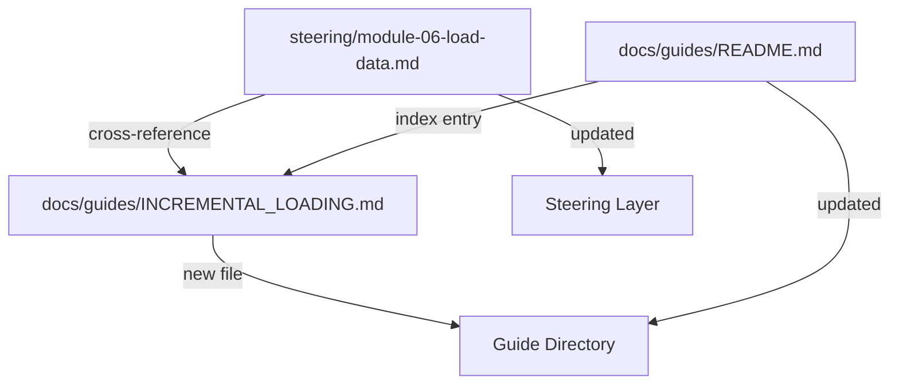

# Design Document: Incremental Loading Guide

## Overview

This feature creates a new guide at `docs/guides/INCREMENTAL_LOADING.md` that teaches bootcampers how to transition from the batch loading workflow in Module 6 to incremental loading patterns used in production Senzing deployments. The guide covers three core topics: adding new records to an existing database, processing redo records after incremental loads, and monitoring the health of an ongoing ingestion pipeline.

The implementation is pure documentation — no new Python scripts, no new steering workflows, no code templates. The guide follows the same structure and conventions as the existing `DATA_UPDATES_AND_DELETIONS.md` guide: prose explanations, concrete scenarios, and agent instruction blocks that call MCP tools (`generate_scaffold`, `search_docs`, `find_examples`) at runtime to produce code examples in the bootcamper's chosen language.

In addition to the guide itself, Module 6's root steering file gets a cross-reference to the new guide as optional advanced reading, and the guides README gets an index entry.

### Design Decisions

1. **Agent instruction blocks for code examples**: Rather than shipping static code snippets, the guide uses `> **Agent instruction:**` blocks that direct the agent to call MCP tools at runtime. This ensures code examples always reflect the current SDK version and the bootcamper's chosen language — consistent with the pattern established in `DATA_UPDATES_AND_DELETIONS.md`.

2. **Build on Module 6 patterns, not new APIs**: The guide explicitly references the bootcamper's existing loading program from Module 6 and uses the same SDK functions (`add_record`, redo processing functions). This avoids introducing unfamiliar APIs and reinforces what the bootcamper already learned.

3. **Conceptual scheduling, not framework-specific**: File-watching and scheduling patterns are presented as conceptual approaches with pseudocode rather than requiring specific scheduling frameworks (cron, Airflow, etc.). This keeps the guide focused on Senzing SDK patterns and avoids introducing third-party dependencies.

4. **Separate guide from DATA_UPDATES_AND_DELETIONS.md**: Although both guides cover post-load topics, incremental loading is a distinct workflow (ongoing ingestion of new data) versus data updates/deletions (correcting or removing existing records). Keeping them separate avoids a monolithic guide and lets bootcampers find the topic they need.

5. **Further Reading section uses MCP tools**: The guide closes with a section directing bootcampers to use `search_docs` and `find_examples` for the latest incremental loading guidance, consistent with the MCP-first content strategy.

## Architecture

The feature touches three files across two layers of the bootcamp:



### File Changes

| File | Change Type | Description |
|---|---|---|
| `docs/guides/INCREMENTAL_LOADING.md` | New | The incremental loading guide |
| `docs/guides/README.md` | Modified | Add index entry for the new guide |
| `steering/module-06-load-data.md` | Modified | Add cross-reference in Advanced Reading section |

### Guide Structure

The guide follows a linear progression that mirrors how a bootcamper would adopt incremental loading:

1. **Introduction** — What incremental loading is, how it differs from batch loading, when to use each
2. **Adding New Records** — How to add records to an existing database, deduplication behavior, structuring incremental input files, code example via `generate_scaffold`
3. **Redo Processing for Incremental Loads** — Why redo records are generated, volume-to-redo relationship, scheduling redo processing, code example via `generate_scaffold`
4. **Monitoring Incremental Load Health** — Four health indicators, warning signs of an unhealthy pipeline, code example for querying entity/record counts
5. **Further Reading** — MCP tool pointers for latest guidance

## Components and Interfaces

### 1. Incremental Loading Guide (`docs/guides/INCREMENTAL_LOADING.md`)

The primary deliverable. Structure:

Level-1 heading: `# Incremental Loading`

Introduction paragraph: Explains the difference between batch loading (load everything at once, as in Module 6) and incremental loading (add new records over time to an existing database). States when each approach applies: batch for initial loads and full refreshes, incremental for ongoing data ingestion.

Section — Adding New Records:

- Explains that `add_record` with a new `RECORD_ID` adds a record to the existing database without affecting previously loaded data
- Explains deduplication behavior: same `DATA_SOURCE` + `RECORD_ID` = replace (update), new `RECORD_ID` = additive (new record)
- Explains how to structure incremental input files: only new or changed records, not the entire data source. Covers file-based approaches (new files per batch, tracking last-loaded position) and conceptual approaches (file watching, scheduled directory scans)
- Agent instruction block: `generate_scaffold(language='<chosen_language>', workflow='add_records', version='current')` for the code example
- Agent instruction block: `search_docs(query="incremental loading add records", version="current")` for authoritative context on incremental record addition

Section — Redo Processing for Incremental Loads:

- Explains why incremental loads generate redo records: new records may change how previously loaded records should resolve
- Explains the relationship between incremental load volume and redo queue growth: larger batches produce more redo records
- Describes a scheduling pattern: after each incremental load completes, check the redo queue, process all pending redo records, and verify the queue is drained before the next load
- Explains how to check whether the redo queue is empty
- Agent instruction block: `generate_scaffold(language='<chosen_language>', workflow='redo', version='current')` for the redo processing code example
- Agent instruction block: `search_docs(query="redo processing incremental", version="current")` for authoritative context

Section — Monitoring Incremental Load Health:

- Describes four health indicators:
  1. Records loaded per interval (throughput)
  2. Error count and error rate
  3. Redo queue depth over time
  4. Entity count trend after each incremental load
- Describes warning signs of an unhealthy pipeline:
  - Growing redo queue that never drains
  - Declining throughput
  - Increasing error rate
  - Entity count not changing despite new records being loaded
- Agent instruction block: `generate_scaffold` or `search_docs` for a code example that queries Senzing for current entity and record counts, suitable for a monitoring script or health check
- Agent instruction block: `find_examples(query="monitoring entity count record count", version="current")` for working code references

Section — Further Reading:

- Directs bootcampers to use `search_docs(query="incremental loading")` for the latest guidance
- Directs bootcampers to use `find_examples(query="incremental loading")` for working code from indexed Senzing repositories
- References `DATA_UPDATES_AND_DELETIONS.md` for record update and deletion patterns (complementary topic)

### 2. Module 6 Cross-Reference Update (`steering/module-06-load-data.md`)

**Change location**: The existing "Advanced Reading" section at the bottom of the file.

**Current content** of the Advanced Reading section:

```markdown
## Advanced Reading

> **After completing Module 6**, see `docs/guides/DATA_UPDATES_AND_DELETIONS.md` for guidance on record updates, deletions, entity re-evaluation, and redo processing implications — relevant for production systems where source data changes over time.
```

**New content**: Add a second paragraph referencing the incremental loading guide:

```markdown
## Advanced Reading

> **After completing Module 6**, see `docs/guides/DATA_UPDATES_AND_DELETIONS.md` for guidance on record updates, deletions, entity re-evaluation, and redo processing implications — relevant for production systems where source data changes over time.

> For production systems that receive ongoing data, see `docs/guides/INCREMENTAL_LOADING.md` for incremental loading patterns — adding new records to an existing database, processing redo records after incremental loads, and monitoring pipeline health over time.
```

The reference is presented as optional further reading, not a required step. It is placed alongside the existing `DATA_UPDATES_AND_DELETIONS.md` reference, which establishes the pattern.

### 3. Guides README Update (`docs/guides/README.md`)

**Change 1 — Reference Documentation section**: Add an entry for `INCREMENTAL_LOADING.md` after the `DATA_UPDATES_AND_DELETIONS.md` entry (topically related):

```markdown
**[INCREMENTAL_LOADING.md](INCREMENTAL_LOADING.md)**

- Incremental loading patterns for adding new records to an existing Senzing database
- Redo processing after incremental loads: scheduling, queue monitoring, and drain verification
- Pipeline health monitoring: throughput, error rates, redo queue depth, and entity count trends
```

**Change 2 — Documentation Structure tree**: Add `INCREMENTAL_LOADING.md` to the `guides/` directory listing, alphabetically:

```text
│   ├── INCREMENTAL_LOADING.md
```

## Data Models

This feature does not introduce any data models, configuration files, or persistent state. All deliverables are static Markdown documentation. The guide references existing Senzing concepts (DATA_SOURCE, RECORD_ID, redo records, entity counts) but does not define new data structures.

## Error Handling

Since this feature is pure documentation, there are no runtime error conditions to handle. The agent instruction blocks in the guide rely on MCP tool availability:

- **MCP server unavailable**: If the Senzing MCP server is unreachable when the agent processes an instruction block, the agent follows the bootcamp's existing offline handling pattern (see `OFFLINE_MODE.md`). The guide's prose explanations remain useful even without generated code examples.
- **MCP tool returns no results**: If `search_docs` or `find_examples` returns no results for a query, the agent should inform the bootcamper and suggest alternative queries. The guide's prose content is self-contained enough to be useful without MCP results.
- **Unsupported language**: If `generate_scaffold` does not support the bootcamper's chosen language for a particular workflow, the agent should note this and offer the example in a supported language, consistent with the bootcamp's existing language fallback behavior.

## Testing Strategy

### Why Property-Based Testing Does Not Apply

This feature consists entirely of:

- **One new Markdown guide** (`INCREMENTAL_LOADING.md`) — static documentation with agent instruction blocks
- **Two Markdown file modifications** (`README.md` and `module-06-load-data.md`) — adding index entries and cross-references

There are no pure functions, parsers, serializers, or algorithmic logic. There is no code with meaningful input variation. PBT requires functions with inputs and outputs — this feature has none.

### Testing Approach

Testing focuses on **structural validation** and **content verification**:

#### 1. Guide File Existence and Structure (unit tests)

- Verify `docs/guides/INCREMENTAL_LOADING.md` exists
- Verify the file starts with a level-1 heading (`# Incremental Loading`)
- Verify the file contains required sections: "Adding New Records", "Redo Processing", "Monitoring" (or equivalent headings), and "Further Reading"
- Verify the file contains at least three agent instruction blocks (one per code example section)
- Verify agent instruction blocks reference MCP tools: `generate_scaffold`, `search_docs`, `find_examples`

#### 2. Guide Content Validation (unit tests)

- Verify the introduction explains the difference between batch and incremental loading
- Verify the "Adding New Records" section mentions `DATA_SOURCE`, `RECORD_ID`, and deduplication/replace behavior
- Verify the "Redo Processing" section mentions redo queue, scheduling, and drain verification
- Verify the "Monitoring" section mentions at least four health indicators (throughput, error rate, redo queue depth, entity count)
- Verify the "Further Reading" section references `search_docs` and `find_examples`
- Verify the guide references the bootcamper's Module 6 loading program as a starting point
- Verify the guide does not introduce third-party tools or libraries beyond what the bootcamp already uses

#### 3. Cross-Reference Validation (integration tests)

- Verify `steering/module-06-load-data.md` contains a reference to `INCREMENTAL_LOADING.md` in the Advanced Reading section
- Verify the reference describes the guide as covering incremental loading patterns for production systems
- Verify the reference is presented as optional (not a required step)

#### 4. Guides README Validation (integration tests)

- Verify `docs/guides/README.md` contains an entry for `INCREMENTAL_LOADING.md` in the Reference Documentation section
- Verify the entry includes a Markdown link to the file
- Verify the entry description mentions incremental loading, redo processing, and pipeline health monitoring
- Verify `INCREMENTAL_LOADING.md` appears in the Documentation Structure tree under `guides/`

#### 5. CI Pipeline

The existing CI pipeline (`validate-power.yml`) validates all new and modified files:

- `validate_power.py` — validates power structure including new guide file
- `validate_commonmark.py` — validates Markdown compliance for the new guide
- `measure_steering.py --check` — validates token counts for modified steering file
- `pytest` — runs all tests including new structural validation tests

New tests should be added to `senzing-bootcamp/tests/` following the existing test file patterns (e.g., `test_incremental_loading_guide.py`).
