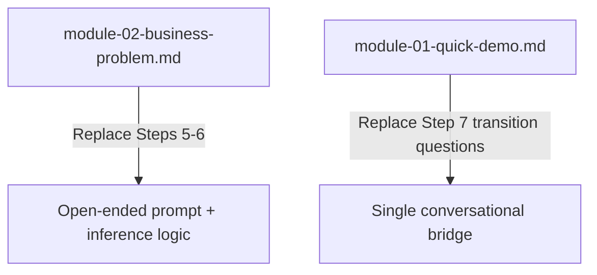

# Design: Infer Business Problem Details

## Overview

This design replaces the sequential, interrogation-style questions in Module 2 (and the transition questions at the end of Module 1) with a single open-ended prompt. The agent then infers record types, source count, and other details from the user's free-form response — only asking follow-up questions for genuine information gaps.

Two steering files are modified:

1. `senzing-bootcamp/steering/module-02-business-problem.md` — the primary change: replace the five sequential guided discovery questions (Steps 5–6) with an open-ended prompt, inference logic, confirmation step, and targeted follow-ups.
2. `senzing-bootcamp/steering/module-01-quick-demo.md` — the transition at the end of Module 1 (Step 7) currently asks three direct questions ("What kind of records…", "How many source systems…", "What does a duplicate look like…"). These must be replaced with a single conversational bridge that sets up Module 2's open-ended approach.

No code, scripts, or new files are introduced. The changes are purely Markdown steering content.

## Architecture

### Files to Modify



| File | Change | Rationale |
|------|--------|-----------|
| `senzing-bootcamp/steering/module-02-business-problem.md` | Rewrite Steps 5–6 (set expectations + guided discovery) | Core of the feature — replace sequential questions with open-ended approach |
| `senzing-bootcamp/steering/module-01-quick-demo.md` | Rewrite Step 7 transition questions | Consistency — Module 1's transition currently asks the same direct questions Module 2 is removing |

### Files NOT Modified

| File | Reason |
|------|--------|
| `senzing-bootcamp/steering/module-transitions.md` | Generic transition framework — not affected |
| `senzing-bootcamp/steering/module-completion.md` | Module completion workflow — not affected |
| `senzing-bootcamp/docs/modules/MODULE_2_BUSINESS_PROBLEM.md` | User-facing reference doc — describes the module's purpose, not the agent's question strategy |
| `senzing-bootcamp/docs/modules/MODULE_1_QUICK_DEMO.md` | User-facing reference doc — not affected by agent flow changes |

## Components and Interfaces

### Component 1: Module 1 Transition Rewrite (Step 7)

**Current behavior (Step 7 in module-01-quick-demo.md):**

After closing Module 1, the agent asks three direct questions one at a time:
- "What kind of records do you work with — people, organizations, or both?"
- "How many distinct source systems or feeds will you be ingesting from?"
- "What does a 'duplicate' look like in your world?"

Then personalizes the transition based on answers.

**New behavior:**

Replace the three questions with a single conversational bridge that previews Module 2's open-ended approach:

```text
Step 7: Transition to Module 2

After Module 1 is closed, introduce Module 2 with a clear contrast:

"Starting with Module 2, we shift to YOUR use case — your data, your problem,
your success criteria. This is where the real work begins."

"When we get there, I'll ask you to describe the problem you're trying to
solve in your own words — what data you have, where it comes from, and what
success looks like. That single description will tell me most of what I need
to know."

Do NOT ask record-type, source-count, or duplicate-definition questions here.
Module 2 will handle discovery through its open-ended prompt.

If the user has no specific use case:
"The bootcamp works great with sample data too — we'll figure out the best
path for you in Module 2."
```

**Rationale:** The current transition questions duplicate what Module 2 asks. Removing them avoids the user answering the same things twice and keeps Module 1's closure clean.

### Component 2: Module 2 Open-Ended Prompt (Steps 5–6 Rewrite)

**Current behavior (Steps 5–6 in module-02-business-problem.md):**

Step 5 sets expectations with a brief statement. Step 6 asks five sequential questions one at a time:
1. What problem are you trying to solve?
2. What data sources are involved?
3. What types of entities?
4. What matching criteria matter most?
5. What's the desired outcome?

**New behavior — replace Steps 5 and 6 with three new steps:**

```text
Step 5: Open-ended discovery prompt

Ask a single open-ended question:

"Tell me about the problem you're trying to solve — what data do you have,
where does it come from, and what would success look like?"

If the user selected a design pattern in Step 4:
"You picked [pattern name]. Tell me how that applies to your situation —
what data do you have, where does it come from, and what would success
look like?"

WAIT for the user's full response. Do NOT interrupt with follow-up
questions until they've finished describing their situation.
```

```text
Step 6: Infer details from response

Parse the user's response to extract:

A. RECORD TYPES (people / organizations / both)
   Look for signals:
   - People: mentions of customers, patients, employees, members, contacts,
     individuals, names, SSN, DOB, phone numbers, email addresses
   - Organizations: mentions of companies, vendors, suppliers, businesses,
     firms, EIN, DUNS, corporate entities
   - Both: mentions of both categories, or phrases like "customers and
     their employers", "people and the companies they work for"
   - If unclear: default to "not yet determined"

B. SOURCE COUNT AND NAMES
   Look for signals:
   - Explicit mentions: "three systems", "CRM and billing", "we have 5 feeds"
   - Implicit mentions: each named system counts as a source (e.g., "Salesforce,
     our billing database, and a CSV export" = 3 sources)
   - If only one system mentioned: note it, but don't assume there aren't others
   - If unclear: default to "not yet determined"

C. PROBLEM CATEGORY
   Map to: Customer 360, Fraud Detection, Data Migration, Compliance,
   Marketing, Healthcare, Supply Chain, KYC, Insurance, Vendor MDM
   Look for signals:
   - "duplicates across systems" → Customer 360
   - "fraud", "suspicious", "identity theft" → Fraud Detection
   - "migrating", "consolidating databases" → Data Migration
   - "compliance", "regulatory", "KYC", "AML" → Compliance / KYC
   - If unclear: default to "not yet categorized"

D. MATCHING CRITERIA
   Look for signals:
   - Attributes mentioned: names, addresses, phone, email, SSN, DOB, etc.
   - Quality concerns: "messy data", "inconsistent formats", "typos"
   - If unclear: will be determined during data mapping (Module 5)

E. DESIRED OUTCOME
   Look for signals:
   - Output format: "master list", "golden record", "API", "report", "export"
   - Frequency: "one-time cleanup", "ongoing", "real-time"
   - Integration: mentions of downstream systems
   - If unclear: default to "not yet determined"
```

```text
Step 7: Confirm inferred details and fill gaps

Present what was inferred in a concise summary:

"Based on what you've described, here's what I'm picking up:
- **Problem:** [inferred category / description]
- **Record types:** [people / organizations / both / not yet determined]
- **Data sources:** [count and names, or 'not yet determined']
- **Key attributes:** [matching criteria mentioned, or 'we'll figure this out
  during data mapping']
- **Desired outcome:** [format/frequency, or 'not yet determined']

Does that sound right? Anything I missed or got wrong?"

WAIT for confirmation or corrections.

After confirmation, ask ONLY about items marked "not yet determined":

- If record types unknown: "Are you working with people records,
  organization records, or both?"
- If source count unknown: "How many distinct data sources or systems
  will we be working with?"
- If desired outcome unknown: "What does the end result look like for
  you — a clean master list, an API, reports, or something else?"

Ask these as a single grouped question, not one at a time.
Do NOT ask about items the user already covered.
```

**Rationale:** This approach feels conversational rather than interrogative. Users naturally provide most details when describing their problem. The confirmation step catches misunderstandings. Follow-ups target only genuine gaps.

### Component 3: Interaction Between Design Pattern Selection and Open-Ended Prompt

Steps 3–4 in Module 2 (design pattern gallery) remain unchanged. The open-ended prompt in the new Step 5 adapts based on whether a pattern was selected:

- **Pattern selected:** The prompt references the pattern and asks the user to describe how it applies to their situation. The inference step (Step 6) uses the pattern's typical entity types and source structure as priors, making it easier to fill gaps.
- **No pattern selected:** The prompt is fully open-ended with no assumptions.

The existing Step 4 logic ("If they select a pattern, use it as a template for their problem statement") still applies — it just feeds into the inference step rather than the sequential questions.

## Data Models

No data model changes. The `docs/business_problem.md` template (Step 9 in Module 2) remains unchanged — it's populated from the same information, just gathered differently.

## Error Handling

No code error handling. The design addresses conversational failure modes:

- **User gives a very short response** (e.g., "deduplication"): The inference step marks most fields as "not yet determined," and the follow-up step asks about the gaps. This gracefully degrades to targeted questions rather than failing.
- **User gives an unrelated response**: The agent should acknowledge what was said and gently redirect: "That's helpful context. To make sure I set up the bootcamp right for you, could you tell me a bit about the data you're working with?"
- **User corrects an inference**: The confirmation step explicitly invites corrections ("Anything I missed or got wrong?"). The agent updates its understanding and re-confirms if the correction was significant.

## Testing Strategy

Property-based testing is **not applicable** to this feature. The changes are purely Markdown steering file content — there are no functions, parsers, serializers, or code logic to test with generated inputs.

**Appropriate testing approach:**

- **Manual review:** Verify each modified steering file contains the required content (open-ended prompt, inference logic, confirmation step, follow-up strategy)
- **Cross-reference consistency check:** Ensure Module 1's transition no longer asks direct record-type/source-count questions, and Module 2's discovery flow uses the open-ended approach
- **Steering flow walkthrough:** Trace through the Module 1 → Module 2 transition to confirm:
  1. Module 1 Step 7 does NOT ask record-type, source-count, or duplicate-definition questions
  2. Module 2 Step 5 asks a single open-ended question
  3. Module 2 Step 6 contains inference logic for all five categories
  4. Module 2 Step 7 presents a confirmation summary and only asks about gaps
- **CommonMark validation:** Run `python senzing-bootcamp/scripts/validate_commonmark.py` on modified Markdown files to ensure formatting compliance
