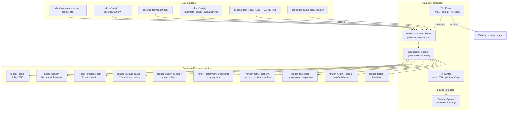

# Design Document: Interactive Dashboard

## Overview

This feature extends `senzing-bootcamp/scripts/status.py` with an `--html` flag that generates a self-contained HTML progress dashboard. Instead of terminal text, the dashboard renders module completion cards, a progress bar, data quality scores with color-coded bands, performance metrics, entity resolution statistics, a module completion timeline, and project health checks — all in a single portable HTML file with inline CSS and JavaScript.

The design prioritizes:
- **Minimal footprint**: extends the existing `status.py` rather than creating a new script, reusing its data-loading logic
- **Zero dependencies**: stdlib-only (no third-party packages), matching existing script conventions
- **Testability**: pure-function logic for data collection, HTML rendering, and health checks — separated from I/O so each can be property-tested
- **Graceful degradation**: missing data sections are omitted, never fatal; partial data still produces a useful dashboard
- **Cross-platform**: Linux, macOS, Windows via `pathlib` and `webbrowser`

## Architecture



The architecture separates concerns into:
1. **CLI layer** — argument parsing; routes to terminal output or dashboard generation
2. **Data collection layer** — `DashboardData` dataclass assembled by `DashboardDataCollector` from filesystem sources
3. **Rendering layer** — `DashboardRenderer` converts `DashboardData` into a complete HTML string via section-level render methods
4. **Output layer** — writes file, prints summary, optionally opens browser

## Components and Interfaces

### DashboardData (dataclass)

```python
@dataclasses.dataclass
class DashboardData:
    # Module progress
    modules_completed: list[int]       # sorted list of completed module numbers
    current_module: int                # 1-12
    status: str                        # "Not Started" | "In Progress" | "Ready to Start" | "Complete"
    language: str | None               # chosen programming language
    completion_pct: int                # 0-100

    # Module completion timestamps (module_number -> ISO 8601 string)
    completion_timestamps: dict[int, str]

    # Quality scores per data source
    quality_scores: list[QualityScoreData]

    # Performance metrics
    performance: PerformanceData | None

    # Entity resolution statistics
    entity_stats: EntityStatsData | None

    # Project health checks
    health_checks: list[HealthCheckItem]
    health_score: int                  # count of passing checks
    health_total: int                  # total checks

    # Metadata
    generated_at: str                  # ISO 8601 timestamp
    has_progress_data: bool            # whether any progress source was found
```

### QualityScoreData (dataclass)

```python
@dataclasses.dataclass
class QualityScoreData:
    source_name: str
    overall: float                     # 0-100
    completeness: float | None         # 0-100
    consistency: float | None          # 0-100
    format_compliance: float | None    # 0-100
    uniqueness: float | None           # 0-100

    @property
    def band(self) -> str:
        """'green' if >=80, 'yellow' if >=70, 'red' if <70."""
```

### PerformanceData (dataclass)

```python
@dataclasses.dataclass
class PerformanceData:
    loading_throughput_rps: float | None   # records per second
    query_avg_ms: float | None             # average query response time ms
    query_p95_ms: float | None             # P95 query response time ms
    database_type: str | None              # "sqlite" | "postgresql"
    wall_clock_seconds: float | None       # total loading wall-clock time
```

### EntityStatsData (dataclass)

```python
@dataclasses.dataclass
class EntityStatsData:
    total_records: int | None
    total_entities: int | None
    match_count: int | None
    duplicate_count: int | None
    cross_source_matches: int | None
```

### HealthCheckItem (dataclass)

```python
@dataclasses.dataclass
class HealthCheckItem:
    label: str          # e.g. "Data directory"
    path: str           # e.g. "data/raw"
    exists: bool        # whether the path exists
```


### DashboardDataCollector

```python
class DashboardDataCollector:
    def __init__(self, project_root: str): ...

    def collect(self) -> DashboardData:
        """Gather all data sources and return a populated DashboardData."""

    def _load_progress(self) -> tuple[list[int], int, str, str | None, int | None]:
        """Load module progress from JSON or markdown fallback.
        Returns (completed, current_module, status, language, current_step)."""

    def _load_completion_timestamps(self, progress_data: dict) -> dict[int, str]:
        """Extract module completion timestamps from step_history."""

    def _scan_quality_scores(self) -> list[QualityScoreData]:
        """Scan project artifacts for quality score reports."""

    def _scan_performance_metrics(self) -> PerformanceData | None:
        """Scan project artifacts for performance metrics."""

    def _scan_entity_stats(self) -> EntityStatsData | None:
        """Scan project artifacts for entity resolution statistics."""

    def _check_health(self) -> tuple[list[HealthCheckItem], int, int]:
        """Run project health checks. Returns (items, passing_count, total)."""
```

The `_scan_*` methods use regex patterns to extract numeric values from markdown documentation files — the same artifacts that the export-results feature discovers. Each scanner catches all exceptions internally and returns `None` / empty list on failure.

### DashboardRenderer

```python
class DashboardRenderer:
    def render(self, data: DashboardData) -> str:
        """Generate complete self-contained HTML dashboard string."""

    def _render_head(self) -> str:
        """Return <head> with inline <style> — responsive CSS, print styles, no external refs."""

    def _render_header(self, data: DashboardData) -> str:
        """Return <header> with title, status badge, language, progress fraction."""

    def _render_progress_bar(self, data: DashboardData) -> str:
        """Return progress bar section with percentage fill and 'X / 12 modules' label."""

    def _render_module_cards(self, data: DashboardData) -> str:
        """Return <section> with 12 Module_Cards, each showing completed/in-progress/not-started."""

    def _render_quality_section(self, scores: list[QualityScoreData]) -> str:
        """Return quality scores section with color-coded bands and sub-scores.
        Returns empty string if scores is empty."""

    def _render_performance_section(self, perf: PerformanceData | None) -> str:
        """Return performance metrics section. Returns empty string if perf is None."""

    def _render_entity_section(self, stats: EntityStatsData | None) -> str:
        """Return entity resolution stats section. Returns empty string if stats is None."""

    def _render_timeline(self, data: DashboardData) -> str:
        """Return timeline section showing completed modules chronologically.
        Returns empty string if no completion timestamps available."""

    def _render_health_section(self, data: DashboardData) -> str:
        """Return health checks section with pass/fail indicators and overall score."""

    def _render_footer(self, data: DashboardData) -> str:
        """Return <footer> with generation timestamp."""
```

### CLI Integration (in status.py main)

The existing `main()` function is extended with argument parsing:

```python
def main():
    parser = argparse.ArgumentParser(description="Senzing Bootcamp - Project Status")
    parser.add_argument("--html", action="store_true", help="Generate HTML dashboard")
    parser.add_argument("--output", type=str, default=None,
                        help="Dashboard output path (default: docs/dashboard.html)")
    parser.add_argument("--no-open", action="store_true",
                        help="Don't auto-open dashboard in browser")
    parser.add_argument("--sync", action="store_true", help="Sync progress tracker")
    args = parser.parse_args()

    if args.html:
        generate_dashboard(args.output, args.no_open)
    else:
        # existing terminal output logic (unchanged)
        ...
```

### generate_dashboard function

```python
def generate_dashboard(output_path: str | None, no_open: bool) -> None:
    """Orchestrate dashboard generation: collect data, render, write, open."""
    project_root = Path(__file__).resolve().parent.parent
    collector = DashboardDataCollector(str(project_root))
    data = collector.collect()
    renderer = DashboardRenderer()
    html = renderer.render(data)

    out = Path(output_path) if output_path else project_root / "docs" / "dashboard.html"
    out.parent.mkdir(parents=True, exist_ok=True)
    out.write_text(html, encoding="utf-8")

    size_kb = out.stat().st_size / 1024
    print(f"Dashboard written to {out} ({size_kb:.1f} KB)")

    if not no_open:
        try:
            import webbrowser
            webbrowser.open(out.as_uri())
        except Exception:
            print(f"Could not open browser. Open manually: {out}")
```

## Data Models

### Module Status Derivation

Each of the 12 modules is classified into one of three states:

| Condition | Status | Visual Indicator |
|---|---|---|
| Module number in `modules_completed` | Completed | Green checkmark, filled card |
| Module number equals `current_module` and not in `modules_completed` | In Progress | Yellow spinner/dot, highlighted card |
| Otherwise | Not Started | Gray outline, dimmed card |

### Quality Score Band Colors

| Score Range | Band | CSS Color |
|---|---|---|
| ≥ 80 | green | `#2d8a4e` |
| 70–79 | yellow | `#b08800` |
| < 70 | red | `#cf222e` |

These match the existing quality scoring methodology colors used in the export-results feature.

### Health Check Items

The dashboard checks the same 8 paths as the terminal output:

| Path | Label |
|---|---|
| `data/raw` | Data directory |
| `database` | Database directory |
| `src` | Source directory |
| `scripts` | Scripts directory |
| `.gitignore` | .gitignore |
| `.env.example` | .env.example |
| `README.md` | README.md |
| `backups` | Backups directory |

### Progress Data Sources (Priority Order)

1. `config/bootcamp_progress.json` — primary source (JSON with `modules_completed`, `current_module`, `language`, `step_history`)
2. `docs/guides/PROGRESS_TRACKER.md` — fallback (parsed via regex for checked/unchecked modules)
3. Neither exists — dashboard shows "no progress data" notice and only the health section

### Completion Timestamps Source

Module completion timestamps are extracted from `step_history` in `bootcamp_progress.json`. Each entry's `updated_at` field provides the ISO 8601 timestamp. Only modules present in both `modules_completed` and `step_history` appear in the timeline.

### HTML Document Structure

```html
<!DOCTYPE html>
<html lang="en">
<head>
    <meta charset="UTF-8">
    <meta name="viewport" content="width=device-width, initial-scale=1.0">
    <title>Senzing Bootcamp Dashboard</title>
    <style>/* all CSS inline */</style>
</head>
<body>
    <header><!-- title, status, language, progress fraction --></header>
    <main>
        <section id="progress"><!-- progress bar --></section>
        <section id="modules"><!-- 12 module cards --></section>
        <section id="quality"><!-- quality scores (conditional) --></section>
        <section id="performance"><!-- performance metrics (conditional) --></section>
        <section id="entities"><!-- entity stats (conditional) --></section>
        <section id="timeline"><!-- completion timeline (conditional) --></section>
        <section id="health"><!-- health checks --></section>
    </main>
    <footer><!-- generation timestamp --></footer>
    <script>/* minimal inline JS for interactivity */</script>
</body>
</html>
```

Conditional sections (quality, performance, entities, timeline) are omitted entirely from the HTML when their data is not available — no empty containers or placeholder text.


## Correctness Properties

*A property is a characteristic or behavior that should hold true across all valid executions of a system — essentially, a formal statement about what the system should do. Properties serve as the bridge between human-readable specifications and machine-verifiable correctness guarantees.*

### Property 1: Self-contained HTML output

*For any* `DashboardData`, the rendered HTML SHALL NOT contain any `<link rel="stylesheet">`, `<script src="...">`, `<link href="http...">`, or `` references to external resources. It SHALL contain a `<style>` tag with CSS rules and all JavaScript SHALL be inline within `<script>` tags.

**Validates: Requirements 2.1, 2.2, 2.3**

### Property 2: Semantic HTML structure with required elements

*For any* `DashboardData`, the rendered HTML SHALL contain `<header>`, `<main>`, `<section>`, and `<footer>` elements, a `<meta charset="UTF-8">` declaration, and the `generated_at` timestamp string within the `<footer>`.

**Validates: Requirements 2.4, 2.6, 12.3**

### Property 3: Progress bar reflects completion state

*For any* `DashboardData` with `modules_completed` as a subset of 1–12, the rendered HTML SHALL contain a progress bar displaying the percentage equal to `len(modules_completed) / 12 × 100` (integer) and the fraction string `"{len(modules_completed)} / 12"`.

**Validates: Requirements 4.1, 4.2**

### Property 4: Module cards reflect correct status for all 12 modules

*For any* `DashboardData`, the rendered HTML SHALL contain exactly 12 module cards. Each module in `modules_completed` SHALL have a completed indicator, the `current_module` (if not in `modules_completed`) SHALL have an in-progress indicator, and all other modules SHALL have a not-started indicator.

**Validates: Requirements 4.3, 4.4, 4.5, 4.6**

### Property 5: Header displays status and language metadata

*For any* `DashboardData` with a `status` string from {"Not Started", "In Progress", "Ready to Start", "Complete"} and an optional `language` string, the rendered HTML SHALL contain the status string, and SHALL contain the language string when it is not None.

**Validates: Requirements 4.7, 4.8**

### Property 6: Quality section conditional rendering

*For any* `DashboardData`, the rendered HTML SHALL contain a quality scores section if and only if `quality_scores` is non-empty. When present, the section SHALL contain each source's `source_name` and `overall` score value, and SHALL display sub-scores (completeness, consistency, format_compliance, uniqueness) when they are not None.

**Validates: Requirements 5.1, 5.2, 5.4, 5.5**

### Property 7: Performance section conditional rendering

*For any* `DashboardData`, the rendered HTML SHALL contain a performance metrics section if and only if `performance` is not None. When present, the section SHALL contain each non-None metric value: `loading_throughput_rps`, `query_avg_ms`, `query_p95_ms`, `database_type`, and `wall_clock_seconds`.

**Validates: Requirements 6.1, 6.2, 6.3, 6.4, 6.5, 6.6**

### Property 8: Entity statistics section conditional rendering

*For any* `DashboardData`, the rendered HTML SHALL contain an entity resolution statistics section if and only if `entity_stats` is not None. When present, the section SHALL contain each non-None stat value: `total_records`, `total_entities`, `match_count`, `duplicate_count`, and `cross_source_matches`.

**Validates: Requirements 7.1, 7.2, 7.3, 7.4, 7.5, 7.6, 7.7**

### Property 9: Timeline conditional rendering in chronological order

*For any* `DashboardData`, the rendered HTML SHALL contain a timeline section if and only if `completion_timestamps` is non-empty. When present, the timeline SHALL list each completed module with its module number and name, and the entries SHALL appear in chronological order based on their timestamp values.

**Validates: Requirements 8.1, 8.2, 8.3, 8.4**

### Property 10: Health section displays all checks with correct indicators and score

*For any* `DashboardData` with a list of `HealthCheckItem`s, the rendered HTML SHALL contain each item's `label` with a pass indicator when `exists` is True and a fail indicator when `exists` is False. The section SHALL display the health score as `"{health_score}/{health_total}"` and the corresponding percentage.

**Validates: Requirements 9.1, 9.2, 9.3**

### Property 11: Quality band classification

*For any* float score in the range 0–100, `QualityScoreData.band` SHALL return `"green"` when score ≥ 80, `"yellow"` when 70 ≤ score < 80, and `"red"` when score < 70.

**Validates: Requirements 5.3**

### Property 12: Rendering never raises unhandled exceptions

*For any* `DashboardData` (including edge cases with empty lists, None optional fields, and boundary values), calling `DashboardRenderer.render()` SHALL complete without raising an exception and SHALL return a non-empty string.

**Validates: Requirements 11.3**

## Error Handling

| Scenario | Behavior |
|---|---|
| `config/bootcamp_progress.json` missing | Fall back to `PROGRESS_TRACKER.md`; if also missing, show notice + health only |
| `config/bootcamp_progress.json` malformed JSON | Print warning to stderr, treat as missing, continue with fallback/health-only |
| Individual artifact file unreadable | Log warning, skip that data source, continue with available data |
| Output directory does not exist | Create with `Path.mkdir(parents=True, exist_ok=True)` |
| Output file write fails (permissions/disk) | Print descriptive error to stderr, `sys.exit(1)` |
| `webbrowser.open()` fails | Print file path to stdout so user can open manually |
| Quality/performance/entity artifact parsing fails | Skip that section, continue rendering other sections |
| No progress data and no artifacts | Generate dashboard with health section only + "no progress data" notice |

All error handling follows the existing script convention: print human-readable messages, never crash with unhandled exceptions during normal operation.

## Testing Strategy

### Property-Based Tests (Hypothesis)

The project already uses Hypothesis for PBT (see `test_pbt_checkpointing.py`). The same pattern applies here.

**Library**: [Hypothesis](https://hypothesis.readthedocs.io/) (Python)
**Minimum iterations**: 100 per property
**Tag format**: `Feature: interactive-dashboard, Property {N}: {title}`

Each of the 12 correctness properties maps to a single property-based test. Key strategies:

- `QualityScoreData` generator: random source_name (text), overall 0–100, optional sub-scores 0–100
- `PerformanceData` generator: optional throughput (0–10000), optional query times (0–5000), optional db type from {"sqlite", "postgresql"}, optional wall_clock (0–86400)
- `EntityStatsData` generator: optional counts (0–1M)
- `HealthCheckItem` generator: random label (text), random path (text), random exists (bool)
- `DashboardData` generator: composite of above — random modules_completed (subset of 1–12), current_module (1–12), status from defined set, optional language, random completion_timestamps, random quality/perf/entity data (each optionally None/empty), 8 health check items, ISO 8601 generated_at

Rendering tests call `DashboardRenderer.render()` with generated data and assert structural properties of the HTML output using string matching and regex.

### Unit Tests (pytest)

Unit tests cover specific examples and edge cases not suited for PBT:

- CLI argument parsing: `--html`, `--output`, `--no-open`, `--sync`, backward compatibility without `--html` (Req 1.1–1.4)
- Output directory auto-creation (Req 1.5)
- File path and size printed to stdout after generation (Req 1.6)
- Browser auto-open with mocked `webbrowser.open` (Req 3.1)
- `--no-open` suppresses browser opening (Req 3.2)
- Browser failure prints file path (Req 3.3)
- Progress JSON primary source, markdown fallback, neither-exists notice (Req 10.1–10.3)
- Artifact scanning populates sections (Req 10.4)
- File read error skips data source gracefully (Req 10.5)
- Write failure prints error and exits non-zero (Req 11.1)
- Invalid JSON prints warning and continues (Req 11.2)

### Test File Location

`senzing-bootcamp/scripts/test_dashboard.py` — follows existing convention alongside `test_pbt_checkpointing.py` and `test_status_steps.py`.
