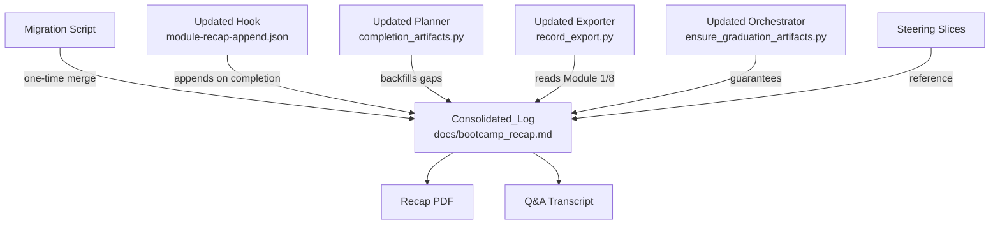

# Design Document: Journal-Recap Consolidation

## Overview

This feature consolidates two near-duplicate per-module log files (`docs/bootcamp_recap.md` and `docs/bootcamp_journal.md`) into a single Consolidated_Log at `docs/bootcamp_recap.md`. The journal's four narrative fields are folded into each recap section as a new `### Journal` subsection. The legacy journal file is retired and a one-time migration merges existing content without loss.

The change is cross-cutting: it touches the module-completion workflow (steering slices), the recap-append Stop hook, three Python scripts (`completion_artifacts.py`, `record_export.py`, `ensure_graduation_artifacts.py`), the CI token budgets, and the test suite.

### Design Rationale

The single-file approach was chosen over alternatives (e.g., a new neutral filename `docs/bootcamp_log.md`) because:
- `docs/bootcamp_recap.md` is already the enforced, machine-parseable source of truth referenced by the majority of dependents (PDF renderer, transcript reconciler, graduation orchestrator, backfill applier).
- Renaming would force churn across every default path and user-facing reference for no functional gain.
- Appending a `### Journal` subsection is additive — existing parsers that don't know about the subsection simply ignore it (forward-compatible).

## Architecture

The consolidation is structured as three coordinated changes applied together:



### Key Architectural Decisions

1. **Append-only mutation model**: All writes to the Consolidated_Log are append-only. Existing bytes are never rewritten. The migration appends Journal subsections to existing sections; the hook appends new consolidated sections at EOF.

2. **Single parsing contract**: A unified parser extracts structured content from the Consolidated_Log. All consumers (PDF renderer, transcript reconciler, record exporter, backfill applier) use the same parsing logic.

3. **Idempotent migration**: The migration script detects whether a section already has a `### Journal` subsection and skips it. Re-running is always safe.

4. **Backward-compatible CLI**: The `--journal` argument in `completion_artifacts.py` and `ensure_graduation_artifacts.py` becomes a no-op (accepted but ignored with a deprecation warning) rather than being removed, so existing invocations in steering/hooks don't break during the transition.

## Components and Interfaces

### 1. Migration Utility (`migrate_journal_to_recap`)

A new function in `completion_artifacts.py` (or callable as a standalone mode via `--migrate`) that performs the one-time merge.

**Interface:**
```python
def migrate_journal_to_recap(
    recap_path: str,
    journal_path: str,
) -> MigrationReport:
    """Merge journal entries into matching recap sections.

    Args:
        recap_path: Path to docs/bootcamp_recap.md.
        journal_path: Path to docs/bootcamp_journal.md.

    Returns:
        A MigrationReport with modules_merged, modules_created, and already_consolidated.
    """
```

**Behavior:**
- Parses the journal file into per-module entries (module number, narrative fields).
- For each journal entry, finds the matching `## Module N:` section in the recap.
- If found and no `### Journal` subsection exists: appends the Journal subsection after `### Duration` (or after the last existing subsection if Duration is absent).
- If no matching section exists: creates a minimal `## Module N:` section with the Journal subsection (and placeholder subsections for Information Shared, Q&R, Actions Taken).
- If the section already has a `### Journal` subsection: skip (idempotent).
- Preserves all existing bytes — operates by reading, computing insertions, then writing the complete result.

### 2. Updated Recap-Append Hook (`hooks/module-recap-append.json`)

The hook prompt is updated to instruct the agent to produce the consolidated format including the `### Journal` subsection in each appended section.

**Changes to the hook prompt:**
- After the `### Duration` field, add instructions to produce `### Journal` with the four narrative fields.
- Remove references to `docs/bootcamp_journal.md` (the separate journal step is eliminated).
- The `--journal` argument in the planner invocation within the prompt is removed or pointed to the recap.

**Consolidated section template in the hook:**
```markdown
## Module N: [Module Name] — [ISO 8601 timestamp]

### Information Shared
- [content]

### Questions & Responses
- **Q:** [question]
    - **R:** [response]

### Actions Taken
- [content]

### Duration
[value from planner]

### Journal
**What we did:** [summary]
**What was produced:** [artifact paths]
**Why it matters:** [explanation]
**Bootcamper's takeaway:** [takeaway or N/A]

---
```

### 3. Updated Completion Planner (`completion_artifacts.py`)

**CLI changes:**
- `--journal` argument: accepted but ignored (no-op with a stderr deprecation note). Internally, the planner no longer tracks `journal_modules` or `journal_entries` in its gap report.
- New `--migrate` mode: runs the migration utility.
- `ArtifactGapReport.missing_journal` and `BackfillPlan.journal_modules`: kept as empty lists for backward compatibility but never populated with gaps.

**Behavioral changes:**
- `detect_artifact_gaps()`: no longer reports journal gaps (always returns `missing_journal=[]`).
- `plan_backfill()`: `journal_modules` is always `[]`.
- `render_backfill_section()`: updated to include a `### Journal` scaffold (with N/A placeholders) in every backfilled section.
- `backfill_recap_sections()`: the `journal` parameter is accepted but unused.
- `is_bug_condition()`: the `missing_journal` clause is removed from the bug condition.

### 4. Updated Record Exporter (`record_export.py`)

**Changes to `DecisionCollector`:**
- `collect_business_problem()`: reads from `docs/bootcamp_recap.md` instead of `docs/bootcamp_journal.md`. Parses the Module 1 `### Journal` subsection's `**What we did:**` and the `### Information Shared` content to extract the business problem.
- `collect_performance_tuning()`: reads Module 8 from `docs/bootcamp_recap.md` `### Journal` subsection instead of from `docs/bootcamp_journal.md`.
- Both methods fall back gracefully (return `None` with a warning) when the target content is absent.

**New parsing helper:**
```python
def _extract_journal_subsection(section_content: str) -> dict[str, str]:
    """Parse a ### Journal subsection into its four fields.

    Args:
        section_content: The text of a single ## Module N: section.

    Returns:
        Dict with keys 'what_we_did', 'what_was_produced',
        'why_it_matters', 'bootcamper_takeaway'.
    """
```

### 5. Updated Graduation Orchestrator (`ensure_graduation_artifacts.py`)

**Changes:**
- `ArtifactPaths.journal`: field kept for signature compatibility but defaults to `docs/bootcamp_recap.md` (same as recap).
- `ensure_recap_md()`: the `journal` parameter is accepted but unused internally. The `backfill_recap_sections()` call drops the journal kwarg.
- `--journal` CLI argument: accepted but ignored with a deprecation note.

### 6. Updated Steering Slices

| File | Change |
|------|--------|
| `module-completion.md` | Step ordering changes from 6 steps to 5. "journal_entry" step is removed. "recap_append" becomes "consolidated_append" in description. References updated. |
| `module-completion-artifacts.md` | "Bootcamp Journal" section removed entirely. "Recap Append" section updated to describe the consolidated format including Journal subsection. |
| `module-completion-error-handling.md` | References to "journal_entry" step removed. Error handling now covers the single consolidated step. |
| `module-completion-next-steps.md` | "After the journal entry" phrasing updated to "After the consolidated recap append". |
| `module-completion-track.md` | References to `docs/bootcamp_journal.md` updated to reference the Consolidated_Log. The `--journal` arg in example commands removed or noted as no-op. |

### 7. Steering Index Update

After steering slices change size, `steering/steering-index.yaml` token counts are re-measured with `measure_steering.py` and the recorded values updated.

## Data Models

### Consolidated_Log Section Structure

```
## Module N: [Name] — [ISO 8601 timestamp]

### Information Shared
- [item]

### Questions & Responses
- **Q:** [question]
    - **R:** [response]

### Actions Taken
- [item]

### Duration
[elapsed time string]

### Journal
**What we did:** [summary]
**What was produced:** [artifact paths]
**Why it matters:** [explanation]
**Bootcamper's takeaway:** [takeaway or N/A]

---
```

### MigrationReport

```python
@dataclass
class MigrationReport:
    """Result of running the journal-to-recap migration.

    Attributes:
        modules_merged: Module numbers whose journal entries were merged
            into existing recap sections.
        modules_created: Module numbers for which new recap sections were
            created (journal entry existed but no recap section).
        already_consolidated: Module numbers skipped because they already
            had a ### Journal subsection.
        journal_path: Path to the legacy journal file (for retirement).
    """
    modules_merged: list[int]
    modules_created: list[int]
    already_consolidated: list[int]
    journal_path: str
```

### ParsedRecapSection

```python
@dataclass
class ParsedRecapSection:
    """Structured representation of one ## Module N: section.

    Attributes:
        module_number: The module number.
        module_name: The module display name.
        timestamp: The completion timestamp string.
        information_shared: List of items.
        questions_responses: List of (question, response) pairs.
        actions_taken: List of items.
        duration: Duration string or None.
        journal: JournalFields or None.
    """
    module_number: int
    module_name: str
    timestamp: str
    information_shared: list[str]
    questions_responses: list[tuple[str, str]]
    actions_taken: list[str]
    duration: str | None
    journal: JournalFields | None


@dataclass
class JournalFields:
    """The four narrative fields in a ### Journal subsection.

    Attributes:
        what_we_did: Summary of module activities.
        what_was_produced: Comma-separated artifact paths.
        why_it_matters: Explanation of module significance.
        bootcamper_takeaway: Bootcamper's stated takeaway or 'N/A'.
    """
    what_we_did: str
    what_was_produced: str
    why_it_matters: str
    bootcamper_takeaway: str
```

## Correctness Properties

*A property is a characteristic or behavior that should hold true across all valid executions of a system — essentially, a formal statement about what the system should do. Properties serve as the bridge between human-readable specifications and machine-verifiable correctness guarantees.*

### Property 1: Round-trip parsing preserves structure

*For any* valid Consolidated_Log content (containing one or more Recap_Sections with optional Journal_Subsections), parsing the content into structured `ParsedRecapSection` objects and then rendering those objects back to Markdown and parsing again SHALL produce equivalent structured content.

**Validates: Requirements 2.7, 1.3, 1.6**

### Property 2: Exactly one section per completed module

*For any* set of completed module numbers and any sequence of consolidation operations (migration, backfill, hook append), the resulting Consolidated_Log SHALL contain exactly one `## Module N:` heading per completed module number — no duplicates and no omissions.

**Validates: Requirements 1.2**

### Property 3: Journal subsection present in every consolidated section

*For any* consolidated Recap_Section produced by the module-completion workflow (hook append or backfill), the section SHALL contain a `### Journal` subsection with all four narrative fields (`**What we did:**`, `**What was produced:**`, `**Why it matters:**`, `**Bootcamper's takeaway:**`).

**Validates: Requirements 1.4, 5.4**

### Property 4: Migration preserves all journal content

*For any* Legacy_Journal_File containing N module entries, after migration completes, every field value from every journal entry SHALL appear in the corresponding module's `### Journal` subsection within the Consolidated_Log.

**Validates: Requirements 2.1, 2.6**

### Property 5: Migration and backfill are idempotent

*For any* Consolidated_Log state, running the migration a second time SHALL produce no changes to the file. Similarly, running `--backfill` on an already-consistent log SHALL produce no changes.

**Validates: Requirements 2.4, 5.5, 6.3**

### Property 6: Existing content is preserved (append-only)

*For any* existing Consolidated_Log content, after migration or backfill, every byte of the original content that was not inside an insertion point SHALL remain unchanged at the same position (for append operations) or at a deterministic offset (for inline Journal insertion).

**Validates: Requirements 2.3**

### Property 7: Record export extracts correct content from consolidated log

*For any* Consolidated_Log containing a Module 1 section with a `### Journal` subsection, the Record_Exporter SHALL extract the business problem fields. *For any* Consolidated_Log containing a Module 8 section with a `### Journal` subsection, the Record_Exporter SHALL extract the performance tuning evidence.

**Validates: Requirements 7.1, 7.2**

### Property 8: Duration computation from timestamps is correct

*For any* set of ISO 8601 timestamps in `step_history` where consecutive modules have parseable, ordered timestamps, the computed per-module Duration SHALL equal the difference between the module's `updated_at` and its predecessor's `updated_at` (or `started_at` for the first module), and the Total Duration SHALL equal the sum of all per-module durations.

**Validates: Requirements 5.6**

## Error Handling

### Migration Errors

| Condition | Behavior |
|-----------|----------|
| Legacy journal file absent | No-op; treat as already consolidated. Return empty MigrationReport. |
| Legacy journal file unparseable | Log warning, skip unparseable entries, merge what can be parsed. |
| Recap file absent | Create it with minimal header, then proceed with migration. |
| Recap file not writable | Raise OSError; caller handles (non-blocking in workflow context). |
| Module number collision (journal entry for module already has Journal subsection) | Skip that module (idempotent). |

### Hook Append Errors

| Condition | Behavior |
|-----------|----------|
| `docs/bootcamp_recap.md` not writable | Log warning: "⚠️ consolidated_append skipped: [reason]". Continue to next step. |
| Timeout > 30 seconds | Log warning: "⚠️ consolidated_append skipped: Timed out after 30 seconds." Continue. |
| Section already exists for this module | Preserve existing content; do not overwrite. |
| Planner cannot be run | Omit Duration fields; continue with remaining content. |

### Planner Errors

| Condition | Behavior |
|-----------|----------|
| Progress file not found | Exit 1 with descriptive stderr message. |
| Progress file invalid JSON | Exit 1 with descriptive stderr message. |
| Recap file not found (for --check/--plan) | Report 0 sections found; all modules missing. |
| Recap file not writable (for --backfill) | Exit 1 with error message. |

### Record Exporter Errors

| Condition | Behavior |
|-----------|----------|
| Consolidated_Log absent | `collect_business_problem()` returns None; warning added. |
| Module 1 section has no Journal subsection | Returns None; warning added. |
| Module 8 section absent | `collect_performance_tuning()` returns None; no warning (optional module). |

## Testing Strategy

### Testing Approach

This feature uses a **dual testing approach**:
- **Property-based tests (Hypothesis)**: Verify universal correctness properties across randomly generated inputs. Each property test references a design document property.
- **Unit/integration tests (pytest)**: Verify specific examples, edge cases, error conditions, and integration between components.

### Property-Based Testing

**Library**: Hypothesis (already in project)
**Configuration**: Uses the project's centralized Hypothesis profiles (`fast` for local, `thorough` for CI). No inline `@settings(max_examples=...)` unless a test genuinely needs a non-baseline count.

**Tag format**: Each property test includes a docstring comment referencing the design property:
```python
# Feature: journal-recap-consolidation, Property N: [property text]
```

**Generators (st_ prefix strategies):**

```python
@composite
def st_journal_fields(draw) -> JournalFields:
    """Generate random but valid journal narrative fields."""

@composite
def st_recap_section(draw, *, with_journal: bool = ...) -> ParsedRecapSection:
    """Generate a random but valid recap section."""

@composite
def st_consolidated_log(draw, *, min_modules: int = 1) -> str:
    """Generate a complete consolidated log with N modules."""

@composite
def st_legacy_journal(draw, modules: list[int] = ...) -> str:
    """Generate a legacy journal file with entries for given modules."""
```

**Property tests to implement:**

| Property | Test Class | Key Assertion |
|----------|-----------|---------------|
| 1: Round-trip | `TestRoundTripProperty` | `parse(render(parse(log))) == parse(log)` |
| 2: One section per module | `TestSectionUniqueness` | `len(sections) == len(set(module_numbers))` |
| 3: Journal subsection present | `TestJournalPresence` | Every section has `### Journal` with all 4 fields |
| 4: Migration preserves content | `TestMigrationPreservation` | All journal field values found in output |
| 5: Idempotence | `TestIdempotence` | `f(f(x)) == f(x)` for migration and backfill |
| 6: Append-only | `TestAppendOnly` | Original content bytes preserved |
| 7: Record export extraction | `TestRecordExportExtraction` | Extracted fields match input journal fields |
| 8: Duration computation | `TestDurationComputation` | Computed duration == timestamp difference |

### Unit and Integration Tests

**Files to create/update:**

| Test File | Coverage |
|-----------|----------|
| `tests/test_journal_recap_migration.py` | Migration utility: merge, create, idempotent, edge cases |
| `tests/test_module_completion_artifacts_properties.py` | Updated: backfill produces Journal scaffold |
| `tests/test_module_completion_artifacts_integration.py` | Updated: single consolidated step |
| `tests/test_module_completion_process_integration.py` | Updated: 5-step ordering, no journal_entry |
| `tests/test_record_export.py` | Updated: extraction from consolidated log |
| `tests/test_ensure_graduation_artifacts_unit.py` | Updated: --journal no-op behavior |
| `tests/test_consolidated_log_properties.py` | New: all 8 property tests |

### Integration Tests (non-PBT)

- **Steering consistency**: Verify no steering slice references `docs/bootcamp_journal.md` as a live artifact.
- **Hook schema validity**: Verify `module-recap-append.json` remains valid hook JSON.
- **CI gate smoke**: Verify `validate_commonmark.py`, `sync_hook_registry.py --verify`, and `measure_steering.py --check` pass.
- **End-to-end workflow**: Simulate a module completion with boundary detection and verify the consolidated section appears with all subsections.
