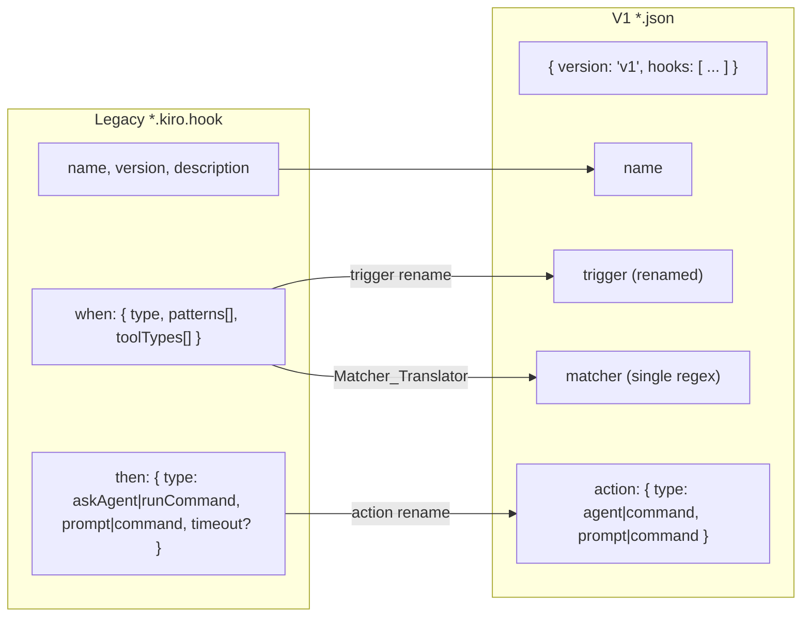
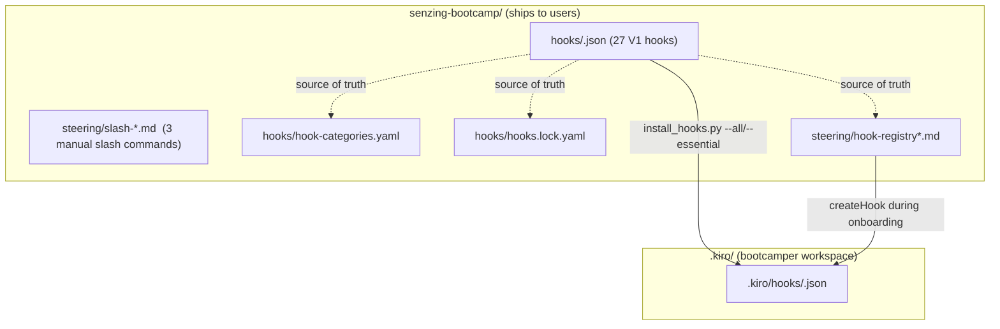
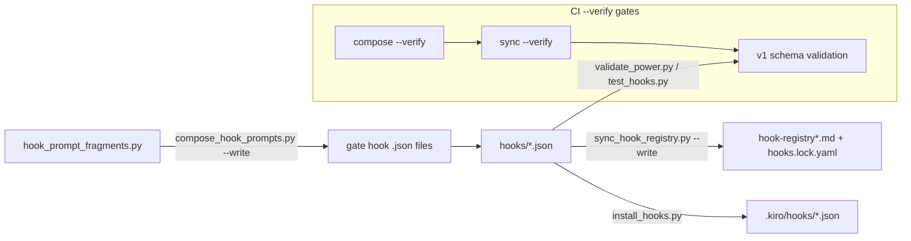
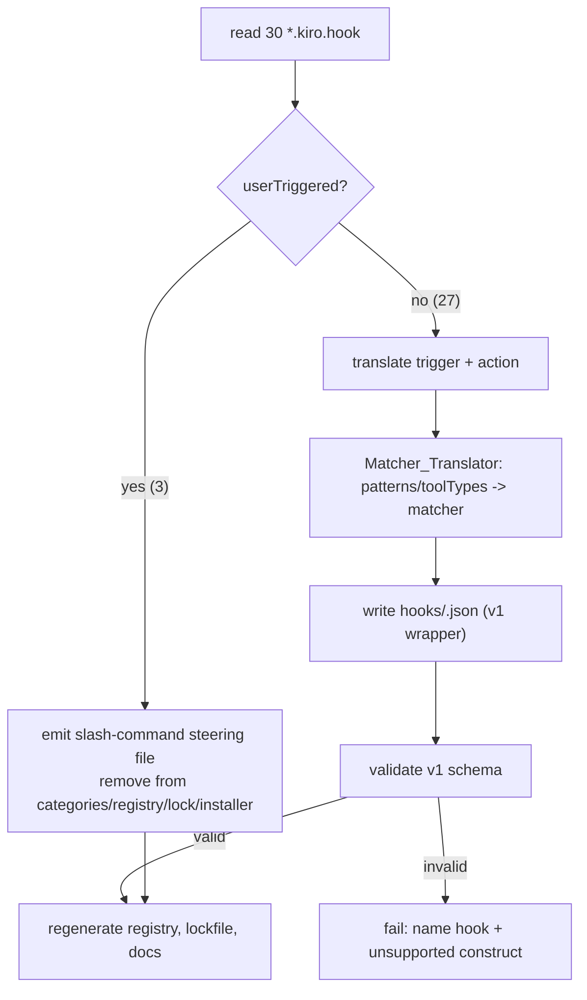

# Design Document

## Overview

This design migrates the entire senzing-bootcamp Kiro Power from the legacy
`*.kiro.hook` model to the Kiro IDE 1.0 hook and permissions model. The
migration is a coordinated, single-pass change across seven surfaces that all
encode the legacy schema today: the shipped hook definitions, the build/verify
tooling (validator, registry generator, prompt composer, installer), the
category/lockfile configs, the steering and docs, the onboarding hook-creation
path, and CI.

The central technical problem is a **schema translation**: 30 legacy hooks with
a `when`/`then` shape must become 1.0 `V1_Hook` entries with `trigger`,
`matcher`, and `action`. The translation is deterministic and mechanical for 27
non-manual hooks, and a **model change** for the 3 manual (`userTriggered`)
hooks, which 1.0 no longer supports as an automatic trigger — they become
manual-invocation slash-command steering files.

Everything under `senzing-bootcamp/` ships to bootcampers, so the migration's
guiding constraint is **internal consistency across the shipped artifacts**: the
hook JSON, the category map, the lockfile, the registry slices, the docs, and
the installer must all reference the same hook set with the same 1.0 trigger
names, or a `--verify` CI gate fails. The design therefore treats the migration
as "change the schema, keep every gate green" rather than a feature addition.

Key design decisions:

- **Keep one hook per file.** Each shipped hook stays in its own file, renamed
  from `<id>.kiro.hook` to `<id>.json`, wrapping a single-entry `v1` array. This
  preserves the 1:1 file-to-hook-id mapping that the categories sync, registry
  slices, installer, and composer byte-stability all depend on, minimizing
  churn in the tooling.
- **A single deterministic `Matcher_Translator`.** All glob→regex and
  toolType→tool-name-regex logic lives in one new stdlib module imported by the
  migration/build tooling, so the translation has one tested definition and one
  set of correctness properties.
- **Behavior preservation is verbatim.** Prompt and command text, hook `name`
  labels, and the write-gate tool scoping are carried across byte-for-byte; the
  migration changes envelope shape, never policy content.
- **The write gates are protected.** The three `PreToolUse` write gates keep
  their tool matcher and prompt text, and any change that would remove or
  disable a write gate is blocked behind explicit maintainer approval.

### Requirements Coverage Map

| Requirement | Design Section |
|---|---|
| 1. Convert non-manual hooks to v1 JSON | Data Models; Migration Pipeline; Matcher_Translator |
| 2. Trigger/action renames | Rename Mapping Tables; Matcher_Translator |
| 3. Patterns/toolTypes → single matcher | Matcher_Translator; Correctness Properties 1–4 |
| 4. Manual hooks → slash-command steering | Manual-Hook Conversion |
| 5. Preserve write-gate enforcement | Write-Gate Preservation |
| 6. v1 schema validation | Hook_Validator |
| 7. Registry + lockfile in v1 terms | Registry_Generator |
| 8. Prompt composer v1 output | Prompt_Composer |
| 9. Installer v1 | Hook_Installer |
| 10. Onboarding hook-creation path | Onboarding_Flow |
| 11. Docs + steering to v1 | Docs & Steering Updates |
| 12. Permissions + MCP auto-approve | Permissions & MCP |
| 13. Back-compat decision + version bump | Versioning & Back-Compat |
| 14. CI green under constraints | Testing Strategy; CI Pipeline |

## Architecture

### Legacy vs. 1.0 hook shape

The migration reshapes the hook envelope while preserving the payload:



### Shipped vs. installed layout

Shipped definitions live under the Power; the installer and onboarding path
materialize them into the bootcamper's workspace:



### Build / verify data flow (CI order preserved)

The composer runs before the registry sync so fragment drift is reported before
registry drift, matching the current CI ordering:



### Migration pipeline

The one-time migration itself is a deterministic transform from the 30 legacy
files to the shipped 1.0 artifact set:



## Components and Interfaces

### Matcher_Translator (new module: `scripts/hook_matcher.py`)

A new stdlib-only module that is the single source of truth for converting
legacy scoping (`when.patterns`, `when.toolTypes`) into a 1.0 `matcher` regex.
It is imported by the migration transform and by any tooling that needs to
reason about matchers. Isolating it in one module gives the correctness
properties a single implementation to bind to.

Interface:

```python
def glob_to_regex(glob: str) -> str:
    """Translate one workspace-relative glob into an anchored regex fragment.

    Raises GlobTranslationError if the glob cannot be represented.
    """

def patterns_to_matcher(patterns: list[str]) -> str:
    """Combine globs into a single anchored file-path matcher: ^(?:f1|f2|...)$."""

def tooltypes_to_matcher(tool_types: list[str]) -> str:
    """Map a toolTypes category list to a tool-name regex.

    'write' -> 'fs_write|str_replace|fs_append'
    'shell' -> the 1.0 shell/command tool-name regex
    """

def translate_scope(when: dict) -> str | None:
    """Return the matcher for a legacy `when` block, or None for unscoped triggers."""
```

Glob→regex algorithm (applied to a forward-slash-normalized, workspace-relative
path domain — the same domain the legacy engine matched against):

1. Escape all regex metacharacters except the glob wildcards `*`, `?`, `[`, `]`.
2. `**/` → `(?:.*/)?` (zero or more leading path segments).
3. Remaining `**` → `.*` (any characters, crossing `/`).
4. Single `*` → `[^/]*` (any characters within one path segment).
5. `?` → `[^/]` (single non-separator character).
6. Literal `.` → `\.`.
7. Preserve balanced `[...]` character classes; reject unbalanced brackets.
8. Anchor each fragment and alternate: `^(?:frag1|frag2|...)$`.

Design rationale for anchoring: the legacy globs were evaluated relative to the
workspace root, so anchoring the combined regex front-and-back over the
workspace-relative path domain reproduces the "matches iff a glob matched"
semantics for the representative path sample (Req 3.2). Examples the algorithm
must satisfy (drawn from the actual hooks):

| Legacy glob | Regex fragment | Notes |
|---|---|---|
| `src/**/*.py` | `src/(?:.*/)?[^/]*\.py` | recursive subtree, `.py` suffix |
| `src/load/*.*` | `src/load/[^/]*\.[^/]*` | single segment, any extension |
| `config/*credentials*` | `config/[^/]*credentials[^/]*` | substring within segment |
| `.env*` | `\.env[^/]*` | leading-dot literal, prefix |
| `data/transformed/*.jsonl` | `data/transformed/[^/]*\.jsonl` | fixed extension |

Unscoped-trigger handling (Req 3.4): `agentStop`, `promptSubmit`, and
`postTaskExecution` legacy hooks carry no `patterns` or `toolTypes`.
`translate_scope` returns `None`; the emitter then omits the `matcher` key (or
emits the empty value the 1.0 schema requires for unscoped triggers). This is a
single, explicit code path rather than a per-hook special case.

Idempotence (Req 3.5): `patterns_to_matcher` is a pure function of its input
list, so re-running it yields a byte-identical regex string and therefore an
identical match set over any path sample. There is no hidden state, ordering
dependence beyond the input order, or environment input.

Error handling (Req 3.6): `glob_to_regex` raises `GlobTranslationError` naming
the offending pattern; the migration transform wraps this to name the owning
hook, then fails the migration.

### Rename Mapping Tables

Two deterministic lookup tables drive the trigger and action renames. They are
defined once (in the migration transform and re-used by the validator's
accept-list).

Trigger rename (Req 2.1–2.8):

| Legacy trigger | 1.0 Trigger | Hooks affected |
|---|---|---|
| `fileEdited` | `PostFileSave` | 7 |
| `fileCreated` | `PostFileCreate` | 5 |
| `fileDeleted` | `PostFileDelete` | 0 (none shipped; mapping kept for completeness) |
| `agentStop` | `Stop` | 6 |
| `promptSubmit` | `UserPromptSubmit` | 1 |
| `postTaskExecution` | `PostTaskExec` | 3 |
| `preToolUse` | `PreToolUse` | 3 |
| `postToolUse` | `PostToolUse` | 2 |
| `userTriggered` | *(removed — becomes slash command)* | 3 |

Action rename (Req 2.9–2.10):

| Legacy action | 1.0 Action |
|---|---|
| `askAgent` + `prompt` | `{"type": "agent", "prompt": <original>}` |
| `runCommand` + `command` | `{"type": "command", "command": <original>}` |

Command timeout (Req 1.6): `session-log-events` is the only `runCommand` hook
and carries `"timeout": 10`. The emitter preserves an equivalent command
timeout in the 1.0 action where the 1.0 schema supports it; if 1.0 does not
model a command timeout, the migration records the omission and the command
remains functionally equivalent (it already guards its own execution). This is
the single point where a 1.0-schema capability question exists, and it is
localized to one hook.

### toolTypes coverage note (design gap surfaced)

Req 3.3 fixes the `write` category mapping to `fs_write|str_replace|fs_append`.
The shipped hooks also use one other category: `error-recovery-context` is a
`postToolUse` hook with `toolTypes: ["shell"]`. Because all 27 non-manual hooks
must migrate (Req 1.1), the design defines a `shell` mapping in
`tooltypes_to_matcher` to the 1.0 shell/command execution tool-name regex. The
exact 1.0 shell tool name is the one detail to confirm against the Kiro 1.0 tool
taxonomy; the `write` mapping is fixed by requirement and is not in question.

### Hook_Validator (`scripts/validate_power.py` `check_hooks`, `scripts/test_hooks.py`)

Both validators switch their discovery glob from `*.kiro.hook` to `*.json` and
validate the 1.0 schema (Req 6):

- Top level: object with `version == "v1"` and a `hooks` array (Req 6.1).
- Each entry: `name`, `trigger`, `action`; `matcher` where the trigger requires
  scoping (Req 6.2).
- Accept only the 1.0 trigger names (the right column of the rename table);
  reject any legacy trigger name (Req 6.3).
- Accept only action types `agent` and `command`; reject `askAgent`/`runCommand`
  (Req 6.4).
- When a `matcher` is present, confirm it compiles with `re.compile` (Req 6.5).
- If any file still uses the legacy `*.kiro.hook` schema (legacy filename or a
  `when`/`then` shape), report an error naming the file (Req 6.6, 14.5).
- Cross-check that shipped hook ids and registry ids match (Req 6.7); this
  reuses the existing `check_registry_consistency` logic against the v1 files.

The existing `VALID_EVENT_TYPES`/`valid_events` sets and the
`("askAgent","runCommand")` action check are replaced with the 1.0 sets. The
`FILE_EVENT_TYPES`/`TOOL_EVENT_TYPES` classification (used to decide whether a
matcher is required) is re-expressed in 1.0 trigger names:
`PostFileSave/PostFileCreate/PostFileDelete` require a file-path matcher;
`PreToolUse/PostToolUse` require a tool-name matcher; `Stop`,
`UserPromptSubmit`, and `PostTaskExec` are unscoped.

### Registry_Generator (`scripts/sync_hook_registry.py`)

- Discovery glob `*.kiro.hook` → `*.json`; `parse_hook_file` reads the `v1`
  wrapper, iterates `hooks[]`, and maps `trigger`/`action.type`/`matcher` onto
  the existing `HookEntry` dataclass fields (`event_type` now holds the 1.0
  trigger; `action_type` holds `agent`/`command`) (Req 7.1, 7.2).
- `_format_event_flow` and `format_hook_entry` render 1.0 trigger names and the
  single matcher instead of `filePatterns`/`toolTypes` (Req 7.2, 7.3).
- Full V1 prompt text and 1.0 `createHook` parameters are emitted into
  `hook-registry-critical.md` and the per-module `hook-registry-module-*.md`
  slices (Req 7.3).
- `hooks.lock.yaml` records each id with its 1.0 `event_type` (trigger) (Req 7.4).
- The generator lists exactly the migrated set (27 hooks), because the 3 manual
  hooks no longer exist as hook files (Req 7.6).
- `--verify` remains a byte-for-byte compare and exits 0 when the committed
  registry/lockfile match regenerated output (Req 7.5).

### Prompt_Composer (`scripts/compose_hook_prompts.py`)

- The three Module 3 gate hooks (`gate-module3-visualization`,
  `enforce-mandatory-gate`, `enforce-gate-on-stop`) are composed as V1 hooks
  (Req 8.1); templates are unchanged in fragment content, but the composed
  object is the `v1` wrapper with `trigger`/`matcher`/`action` (Req 8.2 preserves
  fragment text verbatim).
- `compose_hook` reads static fields (`name`, `trigger`, `matcher`) from the
  on-disk v1 file and swaps only `action.prompt`.
- `serialize_hook` continues to produce byte-identical output; the inline
  scalar-array rule still applies to any array in the v1 file (e.g., the
  wrapper's `hooks` array is an array of objects, rendered multi-line; there are
  no scalar arrays left once `toolTypes` is gone, so the matcher is a plain
  string) (Req 8.3).
- `--write` is byte-stable and `--verify` exits 0 against the committed v1 gate
  files (Req 8.3, 8.4); the composer still runs before the registry sync in CI
  (Req 8.5).

### Hook_Installer (`scripts/install_hooks.py`)

- `discover_hooks` globs `*.json` and reads `name` from `hooks[0].name` in the
  wrapper (Req 9.1, 9.3); the `HOOK_METADATA` display overlay keys change from
  `<id>.kiro.hook` to `<id>.json`.
- Installs into `.kiro/hooks/` unchanged in destination (Req 9.2).
- The manual hook ids are absent from the shipped file set, so no
  `userTriggered` hook can be installed; `ESSENTIAL`/`CAPTURE_CRITICAL` sets are
  re-derived from the migrated `hook-categories.yaml`, and the critical set
  excludes `commonmark-validation` (now a slash command) (Req 9.4, 9.5).
- The completion summary reports the actual count of installed `*.json` files
  rather than a hardcoded number (Req 9.6).

### Onboarding_Flow (steering)

- The hook-creation instructions in `onboarding-flow.md`,
  `onboarding-phase2-track-setup.md`, `agent-instructions.md`, and
  `session-resume-phase2-setup-recovery.md` are re-expressed in 1.0
  `trigger`/`matcher`/`action` terminology sourced from the registry (Req 10.1,
  10.2).
- The capture-critical hooks `ask-bootcamper`, `module-recap-append`, and
  `session-log-events` are created as V1 hooks during onboarding/resume (Req 10.3).
- `commonmark-validation` is removed from the critical-hook creation list and
  its failure-impact messages; bootcampers are pointed to the slash command
  instead (Req 10.4, 10.5).
- Session-start presence checks look for `<id>.json` in `.kiro/hooks/` (Req 10.6).

### Manual-Hook Conversion

Each manual hook becomes a manual-invocation steering file (slash command) under
`senzing-bootcamp/steering/`, e.g. `slash-backup-project.md`,
`slash-git-commit.md`, `slash-commonmark-validation.md`, with `inclusion: manual`
frontmatter and a name a bootcamper invokes directly (Req 4.1–4.3). The
instruction text of each legacy prompt is preserved in the body (Req 4.2). The
three ids are removed from `hook-categories.yaml`, the registry files, the
installer metadata, and `hooks.lock.yaml` so no `userTriggered` hook remains
(Req 4.4, 4.5). Each new steering file's token count and size category are added
to `steering-index.yaml` `file_metadata` (Req 4.6), and the three removed hook
entries are deleted from `file_metadata` tracking where present.

### Write-Gate Preservation

`write-policy-gate`, `enforce-mandatory-gate`, and `gate-module3-visualization`
migrate to `PreToolUse` with the fixed matcher `fs_write|str_replace|fs_append`
(Req 5.1, 5.2) and their full policy prompt text carried verbatim (Req 5.3). A
CI guard (extending `validate_governance_rules.py` / a new check) asserts these
three ids remain present as `PreToolUse` write-scoped hooks; if a change would
remove or disable any of them, the gate fails and blocks the change pending
explicit maintainer approval (Req 5.4). Maintainer approval is expressed by
updating the guard's expected set in the same change, which is the explicit,
reviewable approval signal that lets the removal proceed (Req 5.5).

### Permissions & MCP

- A new `Permissions_Doc` (under `docs/guides/`) describes the 1.0 write, shell,
  and MCP capabilities the bootcamp requests and the recommended approval scope
  for file writes, Python script executions, and Senzing MCP calls (Req 12.1,
  12.2).
- `mcp.json` `autoApprove` is populated with the read-only Senzing MCP tools the
  bootcamp uses (the 12 active tools from `mcp_tool_inventory.ACTIVE_TOOLS`:
  `get_capabilities`, `mapping_workflow`, `analyze_record`, `download_resource`,
  `explain_error_code`, `search_docs`, `find_examples`, `generate_scaffold`,
  `get_sample_data`, `get_sdk_reference`, `sdk_guide`, `reporting_guide`) so
  read-only calls do not stall (Req 12.3). `submit_feedback` stays in
  `disabledTools` (Req 12.4), and `mcp.json` remains the sole source of the
  server URL (Req 12.5).

### Versioning & Back-Compat

The legacy `*.kiro.hook` files are removed so only v1 definitions ship (Req 13.1).
`POWER.md` states the Power requires Kiro 1.0 or later (Req 13.2). `VERSION` is
bumped to a new semantic version greater than `0.1.3` (proposed `0.2.0` — a
minor bump reflecting the migration) (Req 13.4), and the `POWER.md` frontmatter
version is set equal to `VERSION` (Req 13.5). `CHANGELOG.md` records the
migration under a new released version section in Keep a Changelog format (Req 13.3).

## Data Models

### V1_Hook file (shipped and installed)

```json
{
  "version": "v1",
  "hooks": [
    {
      "name": "to check code style",
      "trigger": "PostFileSave",
      "matcher": "^(?:src/(?:.*/)?[^/]*\\.py|src/(?:.*/)?[^/]*\\.java)$",
      "action": { "type": "agent", "prompt": "A source code file was just edited. ..." }
    }
  ]
}
```

For a `PreToolUse` write gate:

```json
{
  "version": "v1",
  "hooks": [
    {
      "name": "to process your response",
      "trigger": "PreToolUse",
      "matcher": "fs_write|str_replace|fs_append",
      "action": { "type": "agent", "prompt": "<verbatim write-policy-gate prompt>" }
    }
  ]
}
```

For an unscoped trigger (e.g., `Stop`):

```json
{
  "version": "v1",
  "hooks": [
    { "name": "to wait for your answer", "trigger": "Stop",
      "action": { "type": "agent", "prompt": "<verbatim ask-bootcamper prompt>" } }
  ]
}
```

### Legacy inventory (source of the migration)

30 legacy hooks decompose as:

| Legacy trigger | Count | 1.0 Trigger | Scoped by |
|---|---|---|---|
| `fileEdited` | 7 | `PostFileSave` | patterns → file-path matcher |
| `fileCreated` | 5 | `PostFileCreate` | patterns → file-path matcher |
| `agentStop` | 6 | `Stop` | unscoped (no matcher) |
| `postTaskExecution` | 3 | `PostTaskExec` | unscoped (no matcher) |
| `preToolUse` | 3 | `PreToolUse` | toolTypes:["write"] → tool-name matcher |
| `postToolUse` | 2 | `PostToolUse` | toolTypes:["write"] / ["shell"] → tool-name matcher |
| `promptSubmit` | 1 | `UserPromptSubmit` | unscoped (no matcher) |
| `userTriggered` | 3 | *(removed)* | → slash-command steering files |

Manual hooks (removed as hooks, converted to slash commands):
`backup-project-on-request`, `git-commit-reminder`, `commonmark-validation`.

### HookEntry (internal, `sync_hook_registry.py` / `test_hooks.py`)

The existing `HookEntry` dataclass is reused; field semantics shift to 1.0:
`event_type` now stores the 1.0 trigger name, `action_type` stores
`agent`/`command`, and a single `matcher: str | None` replaces the separate
`file_patterns`/`tool_types` display fields.

### hooks.lock.yaml (regenerated)

Same structure, 27 entries, `event_type` carries the 1.0 trigger:

```yaml
hooks:
  - id: ask-bootcamper
    version: "4.0.0"
    category: critical
    event_type: Stop
  - id: write-policy-gate
    version: "1.0.0"
    category: critical
    event_type: PreToolUse
```

## Correctness Properties

*A property is a characteristic or behavior that should hold true across all
valid executions of a system — essentially, a formal statement about what the
system should do. Properties serve as the bridge between human-readable
specifications and machine-verifiable correctness guarantees.*

The migration's genuinely input-varying, pure-function logic is the
`Matcher_Translator`, the trigger/action rename, the migrate→emit→validate
pipeline, and the deterministic generators (registry, composer). These are ideal
for property-based testing. The properties below are derived from the prework
classification and consolidated to remove redundancy (schema-validity criteria
fold into the migrate→validate round trip; content-preservation criteria fold
into one preservation property; the registry/composer criteria fold into
round-trip properties). Documentation, config, versioning, and CI criteria are
covered by example/edge/smoke tests in the Testing Strategy, not by properties.

### Property 1: Glob-to-regex match-set equivalence

*For any* legacy `when.patterns` glob list and *any* workspace-relative path in
a representative sample, the translated file-path Matcher matches the path *if
and only if* at least one glob in the list matches that path.

**Validates: Requirements 3.1, 3.2**

### Property 2: Translation determinism and idempotence

*For any* legacy `when.patterns` glob list, translating it to a Matcher is a
pure function: repeated translation yields a byte-identical Matcher regex, and
evaluating that Matcher preserves the same set of matched sample paths across
repeated translation.

**Validates: Requirements 3.5**

### Property 3: Write tool-type produces the fixed write matcher

*For any* legacy hook whose `when.toolTypes` contains `write`, the
`Matcher_Translator` produces exactly the tool-name Matcher
`fs_write|str_replace|fs_append` (this includes the three `PreToolUse` write
gates).

**Validates: Requirements 3.3, 5.2**

### Property 4: Unscoped triggers omit the matcher

*For any* legacy hook whose trigger carries neither `when.patterns` nor
`when.toolTypes` (`agentStop`, `promptSubmit`, `postTaskExecution`), the migrated
V1_Hook omits the Matcher (or sets it to the empty value the 1.0 schema requires
for unscoped triggers).

**Validates: Requirements 3.4**

### Property 5: Trigger and action rename totality and range

*For any* legacy trigger drawn from the supported legacy set, the migration
produces the mapped 1.0 Trigger, and every produced Trigger is a member of the
1.0 Trigger set; likewise, *for any* legacy action, `askAgent` maps to
`{"type":"agent"}` and `runCommand` maps to `{"type":"command"}`, and every
produced Action type is `agent` or `command`.

**Validates: Requirements 2.1, 2.2, 2.3, 2.4, 2.5, 2.6, 2.7, 2.8, 2.9, 2.10**

### Property 6: Name and action text are preserved verbatim

*For any* non-manual legacy hook, the migrated V1_Hook's `name` equals the
legacy `name`, and the migrated Action's `prompt`/`command` equals the legacy
`then.prompt`/`then.command` byte-for-byte.

**Validates: Requirements 1.4, 1.5, 4.2, 5.3**

### Property 7: Migration produces schema-valid V1 hooks (migrate → validate round trip)

*For any* non-manual legacy hook, the migrated V1_Hook is accepted by the
Hook_Validator: the file wraps `{"version":"v1","hooks":[...]}`, each entry has
`name`, `trigger`, and `action`, a `matcher` is present when the trigger
requires it, and any present Matcher compiles as a valid regular expression.

**Validates: Requirements 1.2, 1.3, 6.1, 6.2, 6.5**

### Property 8: Registry generation round-trip and identifier consistency

*For any* valid set of V1_Hook definitions, running the Registry_Generator in
`--write` then `--verify` succeeds (generation is a stable fixed point), the
generated lockfile records each hook identifier with its 1.0 Trigger, and the
set of identifiers in the generated registry equals the set of shipped V1_Hook
identifiers.

**Validates: Requirements 7.1, 7.2, 7.4, 7.5, 14.4**

### Property 9: Prompt composer byte-stability round-trip

*For any* fragment set, composing the Module 3 gate hooks is deterministic:
`--write` produces byte-identical output on repeat and equals the committed V1
gate files, so composing then running `--verify` reports no drift.

**Validates: Requirements 8.2, 8.3, 8.4**

### Property 10: No shipped hook is manual

*For any* shipped V1_Hook file, its trigger is never `userTriggered`/manual, and
none of the three Manual_Hook identifiers appears in any shipped install set.

**Validates: Requirements 4.4, 9.4**

## Error Handling

The migration tooling fails loud and specific — a partial or ambiguous migration
is worse than a blocked one, because the shipped artifacts must stay mutually
consistent.

| Condition | Handling | Requirement |
|---|---|---|
| Legacy hook cannot be represented as valid V1 (unsupported construct) | Abort migration; message names the hook id and the unsupported construct | 1.7 |
| Glob or toolType cannot be translated to a valid regex (e.g., unbalanced brackets) | `GlobTranslationError` names the offending pattern; migration wrapper names the owning hook and fails | 3.6 |
| A migration change would remove/disable a `PreToolUse` write gate | Governance guard fails the build and blocks the change pending explicit maintainer approval | 5.4 |
| Shipped file still uses the legacy `*.kiro.hook` schema | Hook_Validator reports an error identifying the file | 6.6 |
| Shipped hook ids and registry ids diverge | Consistency check fails naming the orphaned/stale ids | 6.7 |
| Registry/lockfile out of sync with hook definitions | `sync_hook_registry.py --verify` exits non-zero with the remediation command | 7.5, 14.4 |
| Composed gate prompt drifts from committed file | `compose_hook_prompts.py --verify` exits non-zero listing each drifted hook id | 8.4 |
| Any stale legacy schema reference remains after migration (hook file, config, steering, or doc) | A CI gate fails and identifies the stale reference | 14.5 |
| Capture-critical hook missing at session start | Onboarding/resume check warns which capture-critical hooks are missing and how to install them (advisory, non-blocking) | 10.3 |
| MCP server unreachable | Existing behavior preserved: block and surface the MCP connection-troubleshooting steps in POWER.md; no offline fallback | 12.5 |

The `Matcher_Translator` treats an empty or whitespace-only glob and an
unbalanced character class as translation errors rather than silently producing
a matcher that under- or over-matches, preserving the equivalence guarantee of
Property 1.

## Testing Strategy

### Dual approach

- **Property tests** (pytest + Hypothesis) cover the input-varying pure logic:
  the `Matcher_Translator`, the rename mapping, the migrate→validate pipeline,
  and the deterministic generators. These implement Properties 1–10 and satisfy
  Req 14.3.
- **Example / edge / smoke tests** cover the finite, deterministic, or one-shot
  criteria: file counts, content preservation for specific artifacts, config
  values, versioning, governance guards, CI ordering, and stale-reference gates.

All tooling changes use the Python standard library only (Req 14.2); property
tests use pytest + Hypothesis per the project's test conventions. Repo-level
hook tests that validate the real shipped hook files live in the repo-root
`tests/`; new pure-logic unit/property tests for the `Matcher_Translator` and
generators live in `senzing-bootcamp/tests/`.

### Property-based testing configuration

- Use the repo's registered Hypothesis profiles (`fast` locally, `thorough` in
  CI at 100 examples). Do not hand-set `max_examples` to restate the baseline;
  add an inline `@settings` override only for a property that genuinely needs a
  deeper run (Property 1 equivalence is a good candidate for a higher override).
- Each property test is tagged with a comment referencing its design property in
  the form **Feature: kiro-1-0-migration, Property {N}: {property text}**.
- Each correctness property (1–10) is implemented by a single property-based
  test. Strategies are prefixed `st_` (e.g., `st_glob()`, `st_path()`,
  `st_legacy_hook()`, `st_v1_hook_set()`).

### Strategy sketch

- `st_glob()` — draws from the shipped glob vocabulary (`src/**/*.py`,
  `src/load/*.*`, `config/*credentials*`, `.env*`, fixed-extension globs) plus
  fuzzed segment/wildcard combinations, including edge cases (leading dot,
  substring wildcards, `**` at various positions).
- `st_path()` — draws workspace-relative POSIX paths that both hit and miss the
  glob vocabulary (matching and non-matching depth, extensions, dotfiles).
- Property 1 uses `fnmatch`/`pathlib.PurePosixPath.match` semantics as the
  oracle for "at least one glob matched" and compares against the compiled
  Matcher over the sampled paths.
- `st_legacy_hook()` — synthesizes legacy `when`/`then` structures across all
  trigger/action variants (including timeout and both toolType categories) to
  drive Properties 3–7.

### Example, edge, and smoke coverage

- **Migration completeness** (Req 1.1): exactly 27 v1 hook files, one per
  non-manual legacy id; three slash-command steering files exist (Req 4.1–4.3,
  4.6).
- **Rename negatives** (Req 6.3, 6.4, 6.6): the validator rejects legacy trigger
  names, `askAgent`/`runCommand`, and any residual `*.kiro.hook` file.
- **Write-gate governance** (Req 5.4, 5.5): the guard fails when a gate is
  absent and passes when the expected set is updated (the approval signal).
- **Installer** (Req 9.1–9.6): install into a temp `.kiro/hooks`, assert v1 files
  are copied, sets are derived from files, manual ids and `commonmark-validation`
  are excluded from the appropriate sets, and the reported count equals the
  installed count.
- **Onboarding/docs** (Req 10.x, 11.x): steering and docs use 1.0 trigger names
  and the migrated count, check for `.json` presence, and route former manual
  hooks to slash commands; a CI grep gate catches stale legacy references
  (Req 14.5).
- **Permissions/MCP** (Req 12.x): `autoApprove` lists the 12 read-only active
  tools, `submit_feedback` stays disabled, and no hardcoded MCP URL exists
  outside `mcp.json`.
- **Versioning** (Req 13.x): no `*.kiro.hook` files remain, `POWER.md` declares
  Kiro 1.0+, `CHANGELOG.md` has a new released section, `VERSION` > `0.1.3`, and
  the `POWER.md` frontmatter version equals `VERSION`.
- **CI order** (Req 8.5): the workflow runs `compose_hook_prompts.py --verify`
  before `sync_hook_registry.py --verify`.

### CI pipeline

The existing gate sequence is preserved; only the hook-schema semantics change.
`validate_power.py`, `test_hooks.py`, `compose_hook_prompts.py --verify`,
`sync_hook_registry.py --verify`, `measure_steering.py --check`, and the pytest
suite (with `HYPOTHESIS_PROFILE=thorough`) must all stay green after migration
(Req 14.1). A new stale-legacy-reference gate is added to the sequence to satisfy
Req 14.5, and the write-gate governance guard is added to protect Req 5.4.
