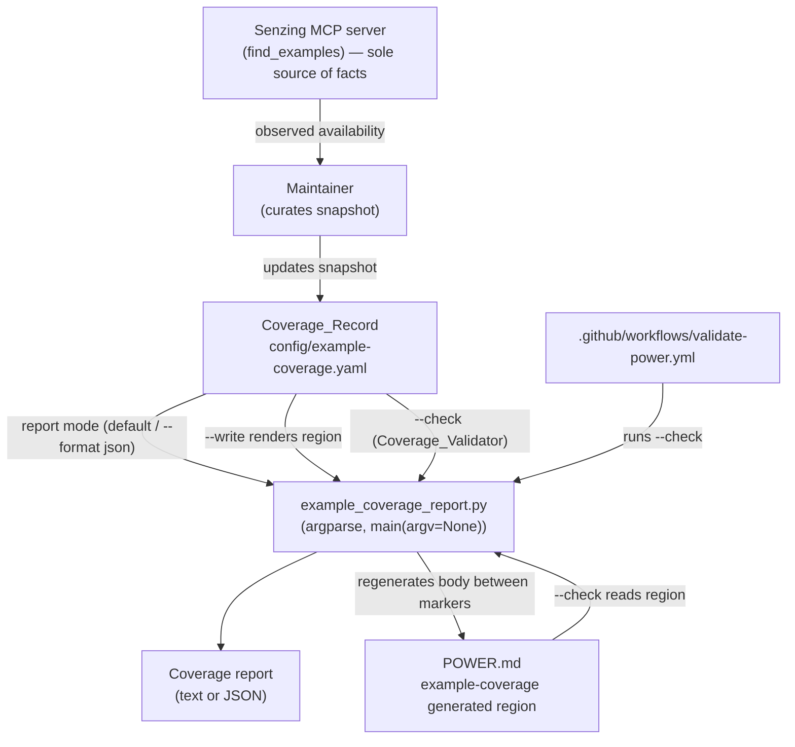

# Design Document

## Overview

This feature makes the cross-language supplementary-example-coverage gap in the
senzing-bootcamp Kiro Power **visible and trackable** instead of merely disclaimed in
prose. Today the gap is described only as static text in `POWER.md`
("Python and Java currently have the most extensive example coverage"); nothing keeps
that prose honest as the underlying MCP `find_examples` coverage changes.

The design introduces four cooperating pieces, all of which follow the existing power
conventions captured in the workspace steering files (`tech.md`, `structure.md`,
`python-conventions.md`, `security.md`):

1. **Coverage_Record** — a canonical, machine-readable YAML file at
   `senzing-bootcamp/config/example-coverage.yaml` that stores, per supported language
   and per tracked topic, whether supplementary examples are available, plus snapshot
   provenance metadata. It is a *maintainer-curated snapshot* of observed MCP
   `find_examples` results; it never hardcodes Senzing knowledge that belongs to the
   MCP server.
2. **Coverage_Report_Script** — a stdlib-only (plus PyYAML) Python CLI at
   `senzing-bootcamp/scripts/example_coverage_report.py` with an `argparse` interface and
   a `main(argv=None)` entry point. It reads the Coverage_Record and produces a
   per-language report that surfaces gaps and coverage proportions, in human-readable or
   machine-readable (`--format json`) form.
3. **Coverage_Disclosure generated region** — a marker-delimited region in `POWER.md`
   (`<!-- BEGIN GENERATED: example-coverage --> … <!-- END GENERATED: example-coverage -->`)
   whose body is rendered deterministically from the Coverage_Record, using the same
   marker scheme already established by `generate_power_docs.py`. This keeps the prose
   disclosure consistent with the tracked record.
4. **Coverage_Validator** — a `--check` mode of the same script that validates the
   Coverage_Record schema and verifies the `POWER.md` disclosure region is consistent
   with the language ranking derived from the record. It runs as a step in
   `.github/workflows/validate-power.yml`.

### Design Principles

- **MCP is the sole source of Senzing facts.** The Coverage_Record contains only
  maintainer-curated snapshots of `find_examples` observations. The script never queries
  the MCP server, and the record never contains MCP URLs (those live only in `mcp.json`).
- **Single source of truth → derived disclosure.** The prose in `POWER.md` is generated
  from the record, never edited by hand, so it cannot silently drift.
- **Honest scope.** Both the report and the disclosure state that the signal reflects
  *supplementary example availability only* and does not reflect `generate_scaffold` or
  `sdk_guide` output quality, which are equivalent for all supported languages.
- **Convention reuse.** The disclosure uses the existing generated-region marker scheme;
  the script follows the established `argparse` + `main(argv=None)` + exit-code pattern;
  tests use pytest + Hypothesis under `senzing-bootcamp/tests/`.

## Architecture

The feature is organized around a single canonical data file that feeds two read paths
(reporting and disclosure rendering) and is guarded by one validation path.



### Modes of the Coverage_Report_Script

The script is a single CLI exposing three modes, mirroring the established
`--write` / `--verify` / `--check` conventions used elsewhere in the power
(`generate_power_docs.py`, `measure_steering.py --check`):

| Mode | Invocation | Responsibility | Requirements |
|---|---|---|---|
| Report (default) | `example_coverage_report.py` | Print per-language summary, gaps, proportions, snapshot metadata, and honest-scope statement | 3.4, 3.5, 3.8, 6.3, 8.1 |
| Machine-readable report | `example_coverage_report.py --format json` | Emit per-language coverage proportions in a structured format for cross-snapshot comparison | 8.2 |
| Write disclosure | `example_coverage_report.py --write` | Regenerate the `example-coverage` region body in `POWER.md` from the record | 4.3, 4.4 |
| Validate (Coverage_Validator) | `example_coverage_report.py --check` | Validate record schema and verify disclosure region matches the record-derived ranking; non-zero exit on any violation or drift | 4.1, 4.2, 7.1–7.4 |

The `--check` mode is the CI entry point (Requirement 7.5).

### Why disclosure generation lives in this script (design decision)

`generate_power_docs.py` already owns several `POWER.md` generated regions (MCP tools,
hooks, steering files, modules) and runs `--verify` in CI. Two viable placements exist:

- **(A) Add an `example-coverage` Region to `generate_power_docs.py`.** Maximizes reuse
  of the existing region machinery but couples coverage logic into an unrelated generator
  and splits the feature across two scripts.
- **(B) Render and verify the disclosure region from `example_coverage_report.py`
  (chosen).** Keeps the whole feature — record, report, disclosure, validation — cohesive
  in one script and one CI step (Requirement 7.5 explicitly calls for a Coverage_Validator
  CI step). It still uses the **same marker scheme** as `generate_power_docs.py`
  (Requirement 4.3), so the region remains compatible with the established convention, and
  the two generators never touch the same marker id, so they cannot conflict.

Choice **(B)** is taken for feature cohesion and a single, self-describing CI gate. The
shared marker scheme (`<!-- BEGIN GENERATED: <id> --> … <!-- END GENERATED: <id> -->`,
scoped to one region id, body-only replacement) is reproduced so behavior matches the
existing convention exactly.

## Components and Interfaces

All paths below are relative to the repository root. The script lives at
`senzing-bootcamp/scripts/example_coverage_report.py` and resolves the power root and
config/POWER.md paths relative to its own location (as `validate_dependencies.py` and
`generate_power_docs.py` do), so it behaves identically regardless of working directory.

### Loading and parsing

```python
def load_coverage_record(path: Path) -> CoverageRecord:
    """Read and parse the Coverage_Record YAML.

    Raises CoverageError if the file is missing or cannot be parsed.
    PyYAML is imported inside this function, not at module top level
    (consistent with validate_dependencies.py).
    """
```

- On missing or unparseable file the script prints a descriptive error to stderr and
  exits with code 1 (Requirement 3.7).
- PyYAML is the only non-stdlib dependency and is imported lazily within the loader
  (Requirements 3.2, 5.2; `tech.md`).

### Schema validation (Coverage_Validator core)

```python
def validate_record(record_data: dict) -> list[Violation]:
    """Return all schema violations; empty list means valid.

    Checks (Requirement 7.1-7.3):
      - every coverage entry status is one of available|none|unknown
      - a coverage entry exists for every (language, topic) combination
      - required Snapshot_Metadata fields are present
      - every tracked topic has a human-readable label
    """
```

```python
def derive_ranking(record: CoverageRecord) -> list[str]:
    """Return languages ordered by 'available' proportion, descending.

    Ties are broken by the language order declared in the record so the
    result is deterministic. Used for both the disclosure and --check.
    """
```

### Reporting

```python
def build_report(record: CoverageRecord) -> Report:
    """Compute the per-language report model:
      - count of topics at each status per language (Req 3.4)
      - list of 'none'/'unknown' topics per language (gaps) (Req 3.5)
      - proportion 'available' per language (Req 8.1)
      - snapshot metadata for display (Req 3.8)
    """

def render_report_text(report: Report) -> str: ...   # human-readable
def render_report_json(report: Report) -> str: ...   # structured, stable keys (Req 8.2)
```

Both renderings include the honest-scope statement that the report reflects
supplementary example availability only and does not reflect `generate_scaffold` /
`sdk_guide` output quality (Requirement 6.3).

### Disclosure region rendering and verification

```python
def render_disclosure(record: CoverageRecord) -> str:
    """Render the deterministic Markdown body for the example-coverage region:
      - names the top-ranked language(s) by available proportion (Req 4.1)
      - states the signal reflects supplementary example availability only (Req 6.1)
      - states generate_scaffold/sdk_guide are equivalent across languages (Req 6.2)
    """

def write_disclosure_region(power_md: Path, body: str) -> None:
    """Replace only the body between the example-coverage markers; leave all
    other POWER.md content byte-for-byte unchanged (Req 4.4). Atomic write."""

def check_disclosure(power_md: Path, record: CoverageRecord) -> list[Violation]:
    """Compare the committed region body to render_disclosure(record); a
    mismatch (drift) is a violation (Req 4.1, 4.2)."""
```

The marker scheme matches `generate_power_docs.py` exactly: an anchored,
whitespace-tolerant regex locates the unique begin/end comment pair for the
`example-coverage` id, and only the text strictly between them is replaced.

### CLI surface

```python
def main(argv: list[str] | None = None) -> int:
    """argparse-based entry point.

    Options:
      --format {text,json}   report output format (default: text)   (Req 8.2)
      --write                regenerate the POWER.md disclosure region (Req 4.3)
      --check                run Coverage_Validator: schema + disclosure (Req 7)
      --record PATH          override Coverage_Record path (testing)
      --power-md PATH        override POWER.md path (testing)

    Returns 0 on success, 1 on any error/violation (Req 3.6, 3.7, 4.2, 7.4).
    """

if __name__ == "__main__":
    sys.exit(main())
```

### CI integration

A single step is added to `.github/workflows/validate-power.yml`, placed alongside the
other validators (e.g., after `generate_power_docs.py --verify`):

```yaml
      - name: Validate example-coverage record and disclosure
        run: python senzing-bootcamp/scripts/example_coverage_report.py --check
```

This satisfies Requirement 7.5. The existing `Run tests` step already collects the new
tests under `senzing-bootcamp/tests/` (Requirement 7.6).

## Data Models

### Coverage_Record (`config/example-coverage.yaml`)

The file uses the `.yaml` extension with snake_case naming consistent with other configs
(`module-dependencies.yaml`, `governance-rules.yaml`) per Requirement 1.7. Illustrative
shape (values are maintainer-curated snapshots, not authoritative Senzing facts):

```yaml
metadata:
  description: >
    Per-language supplementary-example coverage, curated from observed Senzing
    MCP find_examples results. This is a maintainer-maintained snapshot, not a
    live query and not model training data.
  signal_definition: >
    Coverage = availability of supplementary examples via the MCP find_examples
    tool for a given topic and language. It does NOT reflect generate_scaffold or
    sdk_guide output quality, which are equivalent across all supported languages.
  status_meanings:
    available: "At least one supplementary example was observed via find_examples."
    none: "No supplementary example was observed via find_examples."
    unknown: "This topic/language combination has not yet been observed via the MCP server."
  maintenance: >
    Coverage entries are updated by a maintainer from observed find_examples
    results, never from model training data.
  snapshot:
    last_observed: "2026-06-09"     # date coverage data was last observed
    senzing_version: "4.0.0"        # Senzing version it was observed against

languages:                          # tracked Supported_Language keys (Req 1.2)
  - python
  - java
  - csharp
  - rust
  - typescript

topics:                             # tracked Coverage_Topic identifiers (Req 1.3, 2.4)
  add_records:
    label: "Add records to the repository"
  query:
    label: "Query and search for entities"
  redo:
    label: "Process redo records"
  container_deployment:
    label: "Container deployment"

coverage:                           # exactly one entry per (language, topic) (Req 1.4)
  python:
    add_records: available
    query: available
    redo: available
    container_deployment: available
  java:
    add_records: available
    query: available
    redo: available
    container_deployment: unknown
  csharp:
    add_records: available
    query: none
    redo: unknown
    container_deployment: unknown
  rust:
    add_records: none
    query: none
    redo: unknown
    container_deployment: unknown
  typescript:
    add_records: available
    query: none
    redo: unknown
    container_deployment: unknown
```

| Field | Type | Requirement | Notes |
|---|---|---|---|
| `metadata.signal_definition` | str | 2.1 | Defines the coverage signal as `find_examples` availability |
| `metadata.status_meanings.available` | str | 2.2 | Embedded description of `available` |
| `metadata.status_meanings.unknown` | str | 2.3 | Embedded description of `unknown` |
| `metadata.maintenance` | str | 5.4 | States entries are maintainer-curated, not training data |
| `metadata.snapshot.last_observed` | str (date) | 1.6, 8.3 | Most recent observation date |
| `metadata.snapshot.senzing_version` | str | 1.6, 8.3 | Senzing version observed against |
| `languages` | list[str] | 1.2 | Tracked Supported_Language keys |
| `topics.<id>.label` | str | 1.3, 2.4 | Human-readable label per topic |
| `coverage.<lang>.<topic>` | enum | 1.4, 1.5 | One of `available`, `none`, `unknown` |

Constraints enforced by the Coverage_Validator: every status is in
`{available, none, unknown}` (1.5, 7.1); a `coverage` entry exists for every
(language, topic) pair (1.4, 7.2); snapshot fields present (1.6, 7.3); each topic has a
label (2.4). The file contains **no MCP URLs** (5.3) and only curated snapshot data (5.1).

### In-memory model

```python
@dataclass(frozen=True)
class Snapshot:
    last_observed: str
    senzing_version: str

@dataclass(frozen=True)
class CoverageRecord:
    languages: tuple[str, ...]
    topics: dict[str, str]                       # topic id -> label
    coverage: dict[str, dict[str, str]]          # lang -> {topic -> status}
    snapshot: Snapshot

@dataclass(frozen=True)
class LanguageSummary:
    language: str
    counts: dict[str, int]                       # status -> count
    gaps: tuple[str, ...]                         # topics with none/unknown
    available_proportion: float

@dataclass(frozen=True)
class Report:
    languages: tuple[LanguageSummary, ...]
    snapshot: Snapshot

@dataclass(frozen=True)
class Violation:
    description: str
```

The valid statuses are a module-level constant `VALID_STATUSES = ("available", "none",
"unknown")`, used by both validation and report counting so they cannot diverge.

## Correctness Properties

*A property is a characteristic or behavior that should hold true across all valid
executions of a system — essentially, a formal statement about what the system should do.
Properties serve as the bridge between human-readable specifications and machine-verifiable
correctness guarantees.*

The feature has substantial pure logic (schema validation, status counting, gap
derivation, proportion math, ranking, JSON serialization, and marker-scoped region
rewriting), all of which is a strong fit for property-based testing. The criteria that are
one-time configuration/placement facts (1.1, 1.3 existence, 1.7, 3.1, 3.2, 5.1, 5.2, 7.5,
7.6) are covered by smoke/example tests, not properties (see Testing Strategy).

After reflection, redundant criteria were consolidated: schema checks 7.1, 7.2, 7.3
duplicate 1.5, 1.4, 1.6 respectively and are validated by the same properties; the
disclosure scope/equivalence/ranking-naming criteria (4.1, 6.1, 6.2) are combined into one
disclosure-content property plus the round-trip property; report-display criteria (3.8,
6.3) are combined into one report-content property.

### Property 1: Schema completeness

*For any* Coverage_Record declaring a set of languages L and topics T, `validate_record`
reports no completeness violation when a coverage entry exists for every (language, topic)
pair in L × T, and reports a violation whenever any single such entry is missing.

**Validates: Requirements 1.4, 7.2**

### Property 2: Status value constraint

*For any* Coverage_Record, `validate_record` reports a violation if and only if at least
one coverage entry has a status outside the set `{available, none, unknown}`.

**Validates: Requirements 1.5, 7.1**

### Property 3: Required fields present

*For any* Coverage_Record, `validate_record` reports a violation if and only if a required
Snapshot_Metadata field (`last_observed` or `senzing_version`) is missing or any tracked
topic lacks a human-readable label.

**Validates: Requirements 1.6, 2.4, 7.3**

### Property 4: Validation result drives the check exit code

*For any* Coverage_Record, `main(["--check"])` returns a non-zero exit code and emits a
non-empty descriptive message when the record contains at least one schema violation, and
returns 0 when the record is schema-valid and its disclosure is consistent.

**Validates: Requirements 7.4**

### Property 5: Per-language status counts are exhaustive and accurate

*For any* Coverage_Record, the report's per-language status counts sum to the number of
tracked topics, and each per-status count equals the true number of that language's
entries holding that status.

**Validates: Requirements 3.4**

### Property 6: Gap list equals the none/unknown topics

*For any* Coverage_Record and language, the report's listed gap topics for that language
equal exactly the set of topics whose status is `none` or `unknown`.

**Validates: Requirements 3.5**

### Property 7: Available proportion is the available fraction

*For any* Coverage_Record with at least one topic and any language, the computed
`available_proportion` equals (count of that language's `available` topics) ÷ (number of
tracked topics) and lies within the closed interval [0, 1].

**Validates: Requirements 8.1**

### Property 8: JSON report proportions round-trip

*For any* Coverage_Record, parsing the `--format json` output yields a structure whose
per-language coverage proportions equal the proportions computed by `build_report`.

**Validates: Requirements 8.2**

### Property 9: Report content includes snapshot metadata and honest-scope statement

*For any* Coverage_Record, the rendered report contains both Snapshot_Metadata values
(`last_observed` and `senzing_version`) and a statement that the report reflects
supplementary example availability only and does not reflect `generate_scaffold` or
`sdk_guide` output quality.

**Validates: Requirements 3.8, 6.3**

### Property 10: Disclosure content states scope, equivalence, and names the top-ranked language

*For any* Coverage_Record, the rendered disclosure body contains a statement that the
tracked signal reflects supplementary example availability only, a statement that
`generate_scaffold` and `sdk_guide` produce equivalent results for all supported
languages, and names the language(s) ranked highest by `available` proportion.

**Validates: Requirements 4.1, 6.1, 6.2**

### Property 11: Disclosure render/check round-trip is drift-free

*For any* Coverage_Record, writing the disclosure region from that record into a POWER.md
document and then running `check_disclosure` against the same record reports no drift.

**Validates: Requirements 4.1**

### Property 12: Disclosure drift is detected

*For any* Coverage_Record, mutating the committed disclosure region so it names a language
ranking inconsistent with the record causes `check_disclosure` to report a drift
violation and `main(["--check"])` to return a non-zero exit code.

**Validates: Requirements 4.2**

### Property 13: Disclosure write is scoped to the generated region

*For any* POWER.md document containing the `example-coverage` markers and any
Coverage_Record, writing the disclosure region changes only the text strictly between the
begin and end markers and leaves all other bytes of the document unchanged.

**Validates: Requirements 4.4**

### Property 14: Report-mode exit codes

*For any* schema-valid Coverage_Record, report mode (`main([])`) returns exit code 0; and
*for any* missing path or unparseable record content, `main` returns exit code 1 after
emitting a non-empty descriptive error message.

**Validates: Requirements 3.6, 3.7**

## Error Handling

| Condition | Handling | Exit | Requirement |
|---|---|---|---|
| Coverage_Record file missing | Print `error: coverage record not found: <path>` to stderr | 1 | 3.7 |
| Coverage_Record not valid YAML | Catch `yaml.YAMLError`, print `error: cannot parse coverage record: <detail>` | 1 | 3.7 |
| Top-level YAML not a mapping | Print descriptive error naming the file | 1 | 3.7 |
| Schema violation(s) in `--check` | Print each `Violation.description`; print summary count | non-zero | 7.4 |
| Disclosure drift in `--check` | Print drift detail and the regeneration command (`example_coverage_report.py --write`) | non-zero | 4.2 |
| `example-coverage` markers missing/unpaired in POWER.md (`--write`/`--check`) | Raise a marker error, print descriptive message, leave POWER.md unchanged | non-zero | 4.4 |
| Topic set empty (proportion denominator 0) | Treat `available_proportion` as 0.0; never raise `ZeroDivisionError` | n/a | 8.1 |
| Valid record, report mode | Print report | 0 | 3.6 |

Conventions: errors are written to stderr; the script never partially writes POWER.md
(atomic replace via temp file + `os.replace`, matching `generate_power_docs.py`); PyYAML
is imported only inside the loader so a missing PyYAML failure is localized.

## Testing Strategy

Tests live under `senzing-bootcamp/tests/` and use pytest + Hypothesis, following
`python-conventions.md`: scripts are imported via `sys.path` manipulation (scripts are not
packages), test classes are named `class TestFeatureName:`, Hypothesis strategies are
prefixed `st_`, and property test classes document the requirements they validate.

Planned test files:

- `test_example_coverage_report_properties.py` — the 14 correctness properties above.
- `test_example_coverage_report_unit.py` — example/edge/smoke cases.

### Property-based tests

- Library: **Hypothesis** (already a CI dependency; do not hand-roll generators).
- Each property test runs **at least 100 iterations** (`@settings(max_examples=100)` or
  higher) given the randomized inputs.
- Each property test carries a tag comment in the form:
  `# Feature: language-example-coverage, Property {number}: {property_text}`
- Each correctness property is implemented by a **single** property-based test.
- Core strategy `st_coverage_record()` generates records with random language and topic
  sets, random per-cell statuses (drawn from valid and, for negative properties, invalid
  pools), and random snapshot metadata. Derived strategies mutate a valid record to inject
  a single defect (missing cell, bad status, missing snapshot field, missing label) for
  Properties 1–4, and mutate a rendered disclosure for Property 12.

### Unit / example / edge / smoke tests

These cover the criteria that are not universal properties:

- **Smoke**: record file exists at `config/example-coverage.yaml` (1.1); filename uses
  `.yaml` snake_case (1.7); script exists at `scripts/example_coverage_report.py` (3.1);
  only stdlib + lazily-imported PyYAML at top level (3.2); script makes no MCP/network
  calls (5.2); record contains no MCP URL substring (5.3); workflow runs
  `example_coverage_report.py --check` (7.5).
- **Example**: committed record lists the expected supported languages (1.2) and a
  non-empty topic set (1.3); `signal_definition` references `find_examples` (2.1);
  `status_meanings.available` / `.unknown` present and non-empty (2.2, 2.3);
  `metadata.maintenance` present (5.4); `main(argv=...)` accepts an explicit argv and
  `--help` works (3.3); POWER.md contains the `example-coverage` markers (4.3); snapshot is
  a single current object (8.3).

### Why PBT applies here

The Coverage_Report_Script and Coverage_Validator are pure functions over an in-memory
record (validation, counting, gap derivation, proportion math, ranking, JSON output, and
marker-scoped text rewriting). These have meaningful, infinite input spaces (arbitrary
language/topic sets, status matrices, surrounding documents) where 100+ generated inputs
reveal edge cases — exactly where property-based testing earns its keep. Pure
configuration and placement facts are excluded and tested with smoke/example tests, per
the guidance on when not to use PBT.
