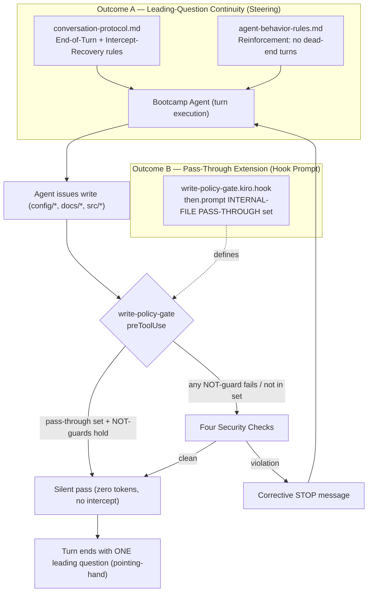

# Design Document

## Overview

This feature corrects a conversation-continuity regression in the Senzing Bootcamp guided flow. It has two independent but related outcomes, each implemented in a different artifact class:

- **Outcome A — Leading-question continuity (steering).** Strengthen the bootcamp's turn-taking steering so that *every* turn that yields control to the bootcamper ends with exactly one leading question — explicitly including turns whose primary action was a write re-issued after a `write-policy-gate` intercept. This is a behavioral guarantee expressed in agent steering Markdown, not code.

- **Outcome B — Reduced intercept churn (hook prompt).** Extend the `write-policy-gate` hook's INTERNAL-FILE PASS-THROUGH set to include two additional routine power-managed config files — `config/data_sources.yaml` and `config/visualization_tracker.json` — so they pass silently on the first attempt. All four existing security checks and all NOT-guards remain fully intact.

The two outcomes are complementary. Outcome B removes a major *source* of leading-question-less turns (the intercept/retry cycle on routine config writes), while Outcome A guarantees that even when an intercept does occur (for any non-pass-through write), the recovery turn still ends with a leading question. Neither outcome weakens the security posture of the gate.

### Design Principles

1. **No new output strings.** The pass-through extension reuses the existing zero-token silent outcome. It introduces no new corrective messages and no new narration.
2. **Exact-match only.** New pass-through entries are matched by exact path equality, never by prefix, glob, or fuzzy resemblance, so the pass-through scope cannot widen unintentionally.
3. **Security checks are inviolable.** The four checks (Senzing SQL blocking, single-question enforcement, feedback append-only guard, root placement enforcement) and the NOT-guards that protect them are preserved verbatim. Any NOT-guard failure falls through to the checks.
4. **Steering owns the leading-question guarantee.** The closing-question responsibility belongs to the agent via steering, not to any hook. The `ask-bootcamper` hook remains a safety net only.

### Grounded Facts

- The hook is `senzing-bootcamp/hooks/write-policy-gate.kiro.hook`: a `preToolUse` hook on `toolTypes: ["write"]`. Its `then.prompt` contains an INTERNAL-FILE PASS-THROUGH block evaluated *before* the FAST PATH GATE.
- Current pass-through set: `config/bootcamp_progress.json`, `config/bootcamp_preferences.yaml`, `config/progress_{id}.json`, `config/preferences_{id}.yaml`, and power-written session/recap logs (`docs/progress/MODULE_*_COMPLETE.md` and recap/journal logs).
- The pass-through applies only when ALL NOT-guards hold: path is NOT `config/.question_pending`, NOT the feedback file, NOT a root-blocked placement, and content contains NO Senzing SQL.
- Leading-question / turn behavior is governed by `senzing-bootcamp/steering/conversation-protocol.md` and `senzing-bootcamp/steering/agent-behavior-rules.md`.
- `config/.question_pending` records the single pending leading question; line 1 is a question type (`track_selection`, `module_transition`, `step_question`, `confirmation`, `choice`), subsequent lines are the question text.

## Architecture

The feature touches two artifact classes with no runtime coupling between them. Both are evaluated by the Kiro agent at conversation time; there is no compiled component.

### Gate Evaluation Order (Outcome B)

The pass-through block is evaluated **first**, before the FAST PATH GATE and before the four checks. The decision sequence for any write is:

1. **INTERNAL-FILE PASS-THROUGH** — if the path exactly matches a pass-through entry AND all four NOT-guards hold, produce zero tokens, re-invoke silently, no interception.
2. If any NOT-guard fails, fall through to the four checks (no pass-through).
3. **FAST PATH GATE** — clean non-pass-through writes proceed silently (but are still intercepted/re-issued).
4. **CHECK 1–4** — violations emit corrective output.

The only change in Outcome B is adding two exact-match entries to the pass-through enumeration in step 1. The ordering, the NOT-guards, and steps 2–4 are unchanged.

### Turn Lifecycle (Outcome A)

A turn is a unit of agent activity ending by yielding control. The steering guarantee is: **a turn only yields when it ends with exactly one pointing-hand leading question and `config/.question_pending` has been written.** A turn whose primary action was a re-issued write after an intercept is not exempt — the agent must append the next-step leading question before yielding rather than ending on bare tool activity or a "." acknowledgment.

## Components and Interfaces

### Component 1: `conversation-protocol.md` (Outcome A — primary)

**Type:** Agent steering Markdown (`inclusion: auto`).

**Responsibility:** Defines turn-taking, end-of-turn, and question-stop protocols. This is where the intercept-recovery continuity rule is added.

**Change:** Add an explicit **Intercept-Recovery Continuity** subsection to the End-of-Turn Protocol stating that when a turn's primary action was a write re-issued after a `write-policy-gate` intercept, the turn is *not* complete until a single pointing-hand leading question reflecting the next step is appended and `config/.question_pending` is written. The bare-acknowledgment ("." / empty) outcome on an intercept-recovery turn is classified as a protocol violation equivalent to a dead-end response. No existing rule text is removed; the One Question Rule and Question Stop Protocol continue to govern the *shape* of that question.

**Interface (with the agent):** Read as steering context at turn-execution time. Output contract: every yielding turn contains exactly one pointing-hand-prefixed question as visible text, and `config/.question_pending` exists with the structured format.

### Component 2: `agent-behavior-rules.md` (Outcome A — reinforcement)

**Type:** Agent steering Markdown (`inclusion: auto`).

**Responsibility:** Houses the four core behavior rules, including Rule 4 (consistent pointing-hand pointer indicator) and the no-dead-end expectation.

**Change:** Reinforce that an intercept/retry cycle does not relieve the agent of the closing-question obligation — a re-issued write is "work completed in the turn" and still requires the pointing-hand call-to-action. This is a short clarification cross-referencing the conversation-protocol rule, kept minimal to respect token budgets.

### Component 3: `write-policy-gate.kiro.hook` (Outcome B)

**Type:** Hook JSON (`.kiro.hook`) with required fields `name`, `version`, `when`, `then`.

**Responsibility:** `preToolUse` write gate performing the INTERNAL-FILE PASS-THROUGH evaluation followed by the four security checks.

**Change:** In `then.prompt`, extend the "Routine power-managed internal files (the exact set — do not over-match)" enumeration to add exactly two lines:

- `config/data_sources.yaml`
- `config/visualization_tracker.json`

No other prompt text changes. The NOT-guard block, the FAST PATH GATE, and CHECK 1–4 remain byte-for-byte identical. The hook's `when` (`preToolUse` / `toolTypes: ["write"]`) and the other top-level fields are untouched.

**Interface:** The hook JSON schema (`name`, `version`, `when`, `then`) and the `then.prompt` text are consumed by the Kiro hook runtime and validated by repo-root tests and `sync_hook_registry.py --verify`.

### Component 4: Supporting CI / registry artifacts

- `senzing-bootcamp/steering/steering-index.yaml` — token budgets for the two edited steering files may need adjustment; verified by `measure_steering.py --check`.
- Hook registry — verified by `sync_hook_registry.py --verify` after the prompt edit.
- CommonMark validity of the edited steering Markdown — verified by `validate_commonmark.py`.

## Data Models

These are conceptual models used by tests and by the gate decision model (`tests/gate_decision_model.py`); no new persistent data structures are introduced.

### Pass-Through Set

The exact set of routine power-managed internal file paths that pass silently. After this change:

| Entry | Match kind |
|---|---|
| `config/bootcamp_progress.json` | exact |
| `config/bootcamp_preferences.yaml` | exact |
| `config/data_sources.yaml` | exact **(new)** |
| `config/visualization_tracker.json` | exact **(new)** |
| `config/progress_{id}.json` | regex `^config/progress_[A-Za-z0-9_-]+\.json$` |
| `config/preferences_{id}.yaml` | regex `^config/preferences_[A-Za-z0-9_-]+\.yaml$` |
| `docs/progress/MODULE_*_COMPLETE.md` | regex `^docs/progress/MODULE_[^/]*_COMPLETE\.md$` |
| recap/journal session logs | power-written log pattern |

### NOT-Guards (pass-through preconditions)

The pass-through is granted only when ALL hold for the candidate write:

| Guard | Condition |
|---|---|
| Not pending-question | path != `config/.question_pending` |
| Not feedback file | path != `docs/feedback/SENZING_BOOTCAMP_POWER_FEEDBACK.md` |
| Not root-blocked | path is not a blocked file type placed in the project root outside the ROOT WHITELIST |
| No Senzing SQL | content has no SQL pattern targeting a Senzing DB indicator |

If any guard is false, no pass-through is granted; the write is evaluated against the four checks.

### Gate Decision

Modeled (in tests) as `(outcome, intercepted, category)`:

- `outcome` is one of `PASS_SILENT`, `INTERCEPT_CORRECTIVE`.
- `intercepted: bool` — whether the write was held (produces an IDE "Rejected" pair). A pass-through write has `intercepted = False`.
- `category` — corrective category when `INTERCEPT_CORRECTIVE`, else `None`.

### Question-Pending Record

`config/.question_pending` content:

- **Line 1:** question type, one of `track_selection`, `module_transition`, `step_question`, `confirmation`, `choice` (default `step_question`).
- **Lines 2+:** the single leading-question text.

### Turn (Outcome A model)

A turn is characterized by:

- `primary_action` — e.g., `content`, `write`, `reissued_write_after_intercept`.
- `yields: bool` — whether control returns to the bootcamper.
- `leading_question_count: int` — number of pointing-hand questions in visible output.

The continuity invariant: `yields` implies `leading_question_count == 1` for all turns, regardless of `primary_action`.

## Correctness Properties

*A property is a characteristic or behavior that should hold true across all valid executions of a system — essentially, a formal statement about what the system should do. Properties serve as the bridge between human-readable specifications and machine-verifiable correctness guarantees.*

This feature supports property-based testing in two layers, both already established in the repo:

- **Gate decision model** (`tests/gate_decision_model.py`): a model of the live hook prompt that classifies any write as `PASS_SILENT` / `INTERCEPT_CORRECTIVE` and tracks interception. Outcome B properties run against this model so they exercise the *actual* prompt text.
- **Turn model**: a model of a yielding turn (`primary_action`, `yields`, `leading_question_count`) plus steering-content assertions. Outcome A properties run against this model and the live steering files.

The prework collapsed the eight Outcome-A criteria into one continuity invariant plus a question-shape property, and grouped the Outcome-B criteria into a small set of non-redundant gate properties. The properties below are the result.

### Property 1: Every yielding turn ends with exactly one leading question

*For any* turn that yields control to the bootcamper — regardless of its primary action, including a write re-issued after a `write-policy-gate` intercept — the turn ends with exactly one visible-text leading question (one pointing-hand prompt), and `config/.question_pending` is written. Equivalently, any turn with zero visible leading questions is not classified as yielding.

**Validates: Requirements 1.1, 1.2, 1.3, 2.1, 2.2, 2.3**

### Property 2: Leading questions are single and unambiguous

*For any* leading-question text the agent emits, it satisfies the single-question rule: exactly one question mark, no conjunctions joining separate choices, no appended alternative, and one unambiguous meaning for "yes" and for "no". A compound or ambiguous question is rejected.

**Validates: Requirements 1.4**

### Property 3: New routine config files pass through silently on first attempt

*For any* write whose target path is exactly `config/data_sources.yaml` or exactly `config/visualization_tracker.json`, with content that triggers no NOT-guard, the gate decision is `PASS_SILENT` with `intercepted = False` (zero output tokens, no intercept/retry), and the literal path appears in the INTERNAL-FILE PASS-THROUGH enumeration of `then.prompt`.

**Validates: Requirements 3.1, 3.2, 3.4**

### Property 4: Existing pass-through entries still pass through silently (preservation)

*For any* path in the pre-existing Pass_Through_Set — `config/bootcamp_progress.json`, `config/bootcamp_preferences.yaml`, any `config/progress_{id}.json`, any `config/preferences_{id}.yaml`, and power-written session/recap logs (`docs/progress/MODULE_*_COMPLETE.md`) — with NOT-guard-clean content, the gate decision remains `PASS_SILENT` with `intercepted = False`.

**Validates: Requirements 3.3**

### Property 5: Pass-through membership is exact-match only

*For any* path that is not exactly equal to a Pass_Through_Set entry (including adversarial near-misses such as a changed extension `config/data_sources.yml`, an added suffix `config/data_sources.yaml.bak`, an extra parent directory `sub/config/data_sources.yaml`, or a case change `config/DATA_SOURCES.yaml`), the gate does not grant the silent pass-through and instead evaluates the write against the four security checks.

**Validates: Requirements 4.1, 4.2, 4.3**

### Property 6: Any NOT-guard failure declines pass-through and routes to the security checks

*For any* candidate pass-through path, if any NOT-guard fails — the content contains Senzing SQL, or the path is the feedback file, or the path is `config/.question_pending`, or the path is a root-blocked placement — the gate declines the silent pass-through and evaluates the write against the four security checks, producing the corrective outcome matching the failing guard (Senzing SQL block, feedback append-only block, single-question enforcement, or root-placement block respectively).

**Validates: Requirements 5.1, 5.2, 5.3, 5.4, 5.5**

### Property 7: The pass-through extension introduces no new output strings

*For any* state of the edited hook prompt, the INTERNAL-FILE PASS-THROUGH block continues to instruct a zero-token silent outcome and introduces no new corrective or narration strings beyond those already present; the FAST PATH GATE and CHECK 1 through CHECK 4 text remain byte-for-byte identical to the established baseline.

**Validates: Requirements 3.4, 5.1, 5.2, 5.3, 5.4**

## Error Handling

Because the change set is steering Markdown and a hook JSON prompt (no runtime code), "error handling" centers on malformed artifacts and on the gate's own corrective behavior.

### Hook artifact integrity

- **Invalid hook JSON.** If the edit breaks JSON validity or drops a required field (`name`, `version`, `when`, `then`), the schema-conformance tests (`tests/test_hook_schema_conformance.py`, `test_hook_structural_validation.py`) and `sync_hook_registry.py --verify` fail. Mitigation: edit only the `then.prompt` string value; never touch structural fields. Validate with `get_diagnostics` and the schema tests after editing.
- **Registry drift.** If the prompt changes but the hook registry is not re-synced, `sync_hook_registry.py --verify` fails in CI. Mitigation: run the sync/verify step as part of the task.

### Gate corrective outcomes (preserved behavior)

The gate's existing error paths are unchanged and must remain so:

- **Senzing SQL detected** (CHECK 1): emit SDK-guidance corrective message; block the write.
- **Compound `.question_pending` question** (CHECK 2): emit `COMPOUND QUESTION DETECTED — REWRITE REQUIRED`; block until rewritten.
- **Feedback overwrite / in-place edit** (CHECK 3 append-only guard): emit the append-only block; require `fs_append`.
- **Root-blocked placement** (CHECK 4): emit corrective routing to the correct subdirectory.

### Steering ambiguity

- **Missing closing question (the regression).** If a turn would end without a leading question, the steering now classifies it as a protocol violation (dead-end / not-yielding). The `ask-bootcamper` hook remains a safety net that fires but produces no output when `config/.question_pending` is correctly written. Steering must not instruct reliance on the hook for the closing question.
- **Token-budget overflow.** Steering edits may push a file over its `steering-index.yaml` budget. Mitigation: keep the Intercept-Recovery addition minimal and update the budget entry; `measure_steering.py --check` gates this.

## Testing Strategy

Testing follows the repo's established conventions: pytest + Hypothesis, class-based organization, `@given(...)` with `@settings(max_examples=...)` of at least 100 for property tests, strategies prefixed `st_`, and each property-test class documenting the requirements it validates. Hook-prompt and steering validation tests live in repo-root `tests/`; power-behavior tests live in `senzing-bootcamp/tests/`.

### Property-based tests (minimum 100 iterations each)

Each property test is tagged with a comment referencing the design property, in the form:
`# Feature: leading-question-continuity, Property N: <property text>`

| Property | Model / artifact under test | Generator focus |
|---|---|---|
| Property 1 | Turn model + `conversation-protocol.md` content | Turns with varied `primary_action`, especially `reissued_write_after_intercept`, `yields=True` |
| Property 2 | Single-question detector + One Question Rule text | Single vs compound/ambiguous question strings |
| Property 3 | `gate_decision_model.gate()` over live prompt | Benign content for the two new exact paths |
| Property 4 | `gate_decision_model.gate()` | Existing exact paths + member-id regex instances + `MODULE_*_COMPLETE.md` |
| Property 5 | `gate_decision_model.gate()` | Near-miss path mutations (extension, suffix, prefix dir, case) |
| Property 6 | `gate_decision_model.gate()` | Pass-through paths with one injected NOT-guard failure each |
| Property 7 | Live `then.prompt` text | Baseline-equality and no-new-string assertions |

Property 6's generator pairs each pass-through path with each NOT-guard violation so every NOT-guard-to-corrective-category mapping is exercised (Senzing SQL to `senzing_sql`, feedback path to `feedback_append_only`, `.question_pending` to `single_question`, root placement to `root_placement`).

### Example / unit tests

- **Requirement 2.4** (non-computable "without requiring a prompt"): an example-based test asserting `conversation-protocol.md` states the closing question is the agent's responsibility and is not deferred to a hook.
- **Hook schema conformance**: the edited hook still has `name`, `version`, `when.type == preToolUse`, `when.toolTypes == ["write"]`, `then.type == askAgent`, non-empty `then.prompt` (extends existing `test_hook_schema_conformance.py`).
- **Exact corrective message text** for each of the four checks (1–3 representative examples each), confirming the preserved baseline strings.
- **Pass-through enumeration**: assert both new literal path strings are present, and the two new lines are the only additions (diff-style assertion against the baseline enumeration).

### Integration / CI checks (not PBT)

These are infrastructure verifications run once in CI, not property tests:

- `validate_power.py` — overall power structure.
- `measure_steering.py --check` — steering token budgets after the Outcome A edits.
- `validate_commonmark.py` — CommonMark validity of edited steering Markdown.
- `sync_hook_registry.py --verify` — hook registry matches the edited hook.
- Full pytest suite (power + repo-root), including the existing `test_write_policy_gate_*` and `test_consolidated_hook_properties.py` suites that already guard the gate's behavior, to confirm no regression.

### Why these test types

- The gate properties (3–7) test *our* gate logic over a large path/content input space where input variation reveals edge cases (near-misses, NOT-guard interactions), so 100+ iterations add real value.
- The continuity and question-shape properties (1–2) test universal turn-level invariants over generated turns and question strings.
- Schema, baseline-text, and CI checks are deterministic one-shot verifications and are intentionally kept as example/integration tests rather than property tests.
