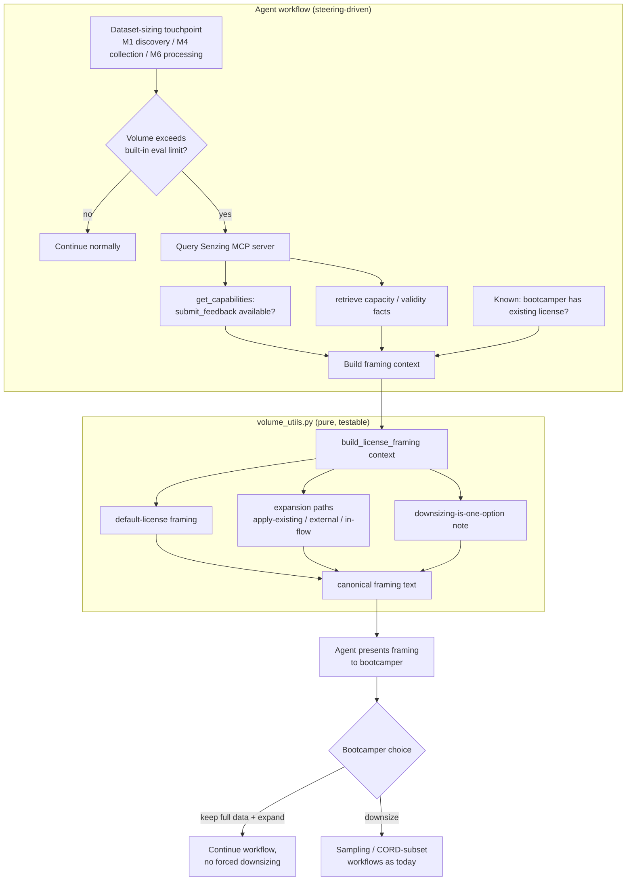

# Design Document

## Overview

This feature corrects how the Senzing Bootcamp Power frames the built-in 500-record evaluation license. Today, the figure is surfaced in several places as a hard cap that nudges the bootcamper toward shrinking their dataset (notably Module 4, Data Collection). The desired behavior is already established by the Module 1 discovery licensing flow (`module-01-phase1-discovery.md`, Steps 6a–6e): the 500-record limit is a *default evaluation license the bootcamper already has*, and there are three *expansion paths* — apply an existing license, request one through the external support channel, and (when available) request one in-flow via the Senzing MCP `submit_feedback` tool. Downsizing is just one option among those.

The change is intentionally **content-and-helper-centric**, not a new subsystem:

1. A single source-of-truth helper in `scripts/volume_utils.py` produces the canonical "default license + expansion paths + downsizing-is-optional" framing text. Every dynamic guidance flow calls it, so the wording cannot drift between touchpoints (Requirement 4).
2. The helper is refactored so it **never embeds a hardcoded capacity or validity figure**. Specific Senzing facts are passed in by the agent after it retrieves them from the Senzing MCP server at request time, and are omitted when the MCP server does not return them (Requirements 1.3, 1.4, 4.4).
3. Steering files (Module 4 data collection, Module 6 data processing) and user-facing docs (QUICK_START, POWER, Module 2 / Module 4 companion docs) are reworded to use the same framing and to stop presenting 500 as a wall.

### Key Research Findings

- **The canonical flow already exists.** `module-01-phase1-discovery.md` Steps 6b–6d already: trigger license guidance only when total records exceed 500; check `submit_feedback` availability via `get_capabilities` (waiting up to 30s); present three paths; route an existing-license holder to the apply-existing path and omit the in-flow option; and retrieve capacity/validity from MCP, omitting the figure when unavailable. The design treats this flow as the reference contract that all other touchpoints must match (Requirements 2.5, 4.2).
- **There is a real pure-function surface.** `volume_utils.get_license_guidance(tier)` already generates license guidance text for Module 6's volume step. It currently hardcodes a `"built-in 500-record evaluation license"` string (demo tier) and an MCP server URL (non-demo tiers). Both conflict with the new requirements: the hardcoded `500` violates R1.3/R1.4 (figures must come from MCP), and the hardcoded URL conflicts with the single-source-of-truth rule that MCP URLs live only in `mcp.json`. This function is the natural home for the canonical framing helper and is property-testable.
- **MCP availability is a runtime, agent-side concern.** The Python helpers are pure and cannot call MCP. Tool-availability checks (`get_capabilities`, `submit_feedback`) and fact retrieval happen in the steering-driven agent workflow. The design separates these cleanly: the agent discovers facts/flags and passes them into the pure helper, which is then deterministically testable.
- **Content-validation tests are an established pattern.** Tests such as `test_debrittling_intent_preserved.py` and `test_record_volume_guidance_integration.py` already assert on steering/doc content and on `get_license_guidance` output, so the markdown touchpoints can be guarded by example/content tests in the same style.

## Architecture

The feature spans two layers that already exist in the bootcamp: the **steering-driven agent workflow** (markdown) and the **Python helper scripts**. No new runtime services are introduced.



### Separation of concerns

| Concern | Where it lives | Tested by |
|---|---|---|
| Detect volume exceeds limit; gate on it | Steering (M1 6a, M4, M6) | content tests |
| Check `submit_feedback` availability | Steering (calls `get_capabilities`) | not unit-testable (MCP) |
| Retrieve capacity/validity facts | Steering (MCP tool call) | not unit-testable (MCP) |
| Build canonical framing text | `volume_utils.py` (pure) | property tests |
| Consistent wording across docs | Steering + docs content | content/example tests |

The agent is the only component that talks to MCP. It passes the discovered facts (capacity, validity) and flags (`submit_feedback` available, has-existing-license) into the pure helper. This keeps all Senzing-fact sourcing at request time and out of both training data and hardcoded literals.

## Components and Interfaces

### 1. License framing helper (`scripts/volume_utils.py`)

New and refactored pure functions that own the canonical wording. All take plain Python values (no I/O, no MCP), so they are deterministic and property-testable.

```python
# Expansion path identifiers (stable, ordered)
PATH_APPLY_EXISTING = "apply_existing"      # apply an existing Senzing license
PATH_EXTERNAL_REQUEST = "external_request"  # request via support channel
PATH_IN_FLOW_MCP = "in_flow_mcp"            # request in-flow via submit_feedback

def build_expansion_paths(
    submit_feedback_available: bool,
    has_existing_license: bool,
) -> list[str]:
    """Return the applicable expansion path ids, in canonical order.

    - apply-existing is always included.
    - external-request is always included.
    - in-flow MCP is included only when submit_feedback_available is True
      AND the bootcamper does not already have a license.
    """

def build_license_framing(
    *,
    capacity: int | None = None,
    validity: str | None = None,
    submit_feedback_available: bool = False,
    has_existing_license: bool = False,
    mention_downsizing: bool = True,
) -> str:
    """Build the canonical 'default license + expansion paths' framing text.

    Guarantees (enforced by property tests):
    - Describes the limit as a built-in evaluation license the bootcamper
      already has; never uses hard-cap / hard-maximum phrasing.
    - Presents expansion options before/alongside any downsizing mention.
    - Includes exactly the expansion paths from build_expansion_paths(...).
    - Includes the capacity/validity figures only when provided; when a
      figure is None, omits it and states the value is unavailable from the
      MCP server. Never substitutes a hardcoded figure.
    - Never contains a hardcoded MCP URL.
    """

def get_license_guidance(
    tier: str | None,
    *,
    capacity: int | None = None,
    validity: str | None = None,
    submit_feedback_available: bool = False,
    has_existing_license: bool = False,
) -> str | None:
    """Module 6 volume-step guidance. Refactored to delegate to
    build_license_framing for non-demo tiers and to stop hardcoding the
    capacity figure and the MCP URL. Returns None when tier is None (skip)."""
```

Design notes:
- `get_license_guidance` keeps its existing signature shape (positional `tier`) for backward compatibility with current callers and tests, adding keyword-only fact/flag parameters with safe defaults. Defaults (`capacity=None`, `submit_feedback_available=False`) produce the *figure-omitted, in-flow-omitted* framing — the safe behavior when MCP facts are unavailable (R1.4, R2.3).
- The demo tier no longer asserts "500-record"; it states the built-in evaluation license is sufficient for the stated volume, with the specific figure included only if the agent supplies it.
- The MCP URL is removed from the text; the helper refers to "the Senzing MCP server" by name. The URL stays solely in `mcp.json` (single source of truth).

### 2. Steering touchpoints

| File | Change |
|---|---|
| `steering/module-04-data-collection.md` | Where dataset size vs. the evaluation limit comes up, present the default-license-with-expansion-paths framing and present downsizing (sampling, CORD subset, smaller substitute) as one option alongside expansion — not the only path. Defer to the Module 1 flow's tool-availability checks and MCP fact sourcing rather than restating numbers. |
| `steering/module-06-data-processing.md` and `module-06-phase*` | Ensure the volume/license guidance step uses the refactored `get_license_guidance` output and the same framing; remove any hard-cap phrasing. |
| `steering/module-01-phase1-discovery.md` | Reference contract — left functionally intact. Only adjust wording if it introduces a hardcoded figure that should come from MCP. |

A short canonical-framing snippet (the default-license + expansion-paths + downsizing-is-optional message) is documented once and referenced by the other touchpoints so the message stays identical (Requirement 4).

### 3. User-facing docs

| File | Change |
|---|---|
| `docs/guides/QUICK_START.md` | "Licensing: ... built-in evaluation license for 500 records. Bring your own license for more capacity." → reframe as a default with expansion options, not a hard cap. |
| `POWER.md` | Same reframe in the Licensing blurb. |
| `docs/modules/MODULE_2_SDK_SETUP.md` | Keep the factual SENZ9000-at-501 explanation, but frame the limit as the default evaluation license with expansion options. |
| `docs/modules/MODULE_4_DATA_COLLECTION.md` | Companion doc: present the limit as default-with-expansion, mirroring the steering change. |

Docs may keep human-readable references to the current 500 figure where they are explaining how the evaluation license works (these are not live agent assertions), but they must not present it as a wall and must point to the expansion paths. Steering files must not introduce hardcoded MCP/external URLs (R4.4).

## Data Models

The feature is text-generation over small value objects; no persistence schema changes.

```python
from dataclasses import dataclass

@dataclass(frozen=True)
class LicenseFramingContext:
    """Inputs the agent gathers (from MCP + known state) for framing.

    capacity / validity are None when the MCP server does not return them
    or cannot be reached — the framing then omits the figure entirely.
    """
    capacity: int | None = None                 # records, from MCP at request time
    validity: str | None = None                 # validity period, from MCP at request time
    submit_feedback_available: bool = False      # from get_capabilities
    has_existing_license: bool = False           # from bootcamp preferences / answer
    mention_downsizing: bool = True
```

Expansion-path ordering is a fixed canonical list: `apply_existing`, `external_request`, then `in_flow_mcp` (when applicable). Volume tiers reuse the existing `VALID_TIERS` (`demo`, `small`, `medium`, `large`) and `TIER_BOUNDARIES` already defined in `volume_utils.py`; the demo tier (≤ 500) is the only one within the built-in evaluation license.

## Correctness Properties

*A property is a characteristic or behavior that should hold true across all valid executions of a system — essentially, a formal statement about what the system should do. Properties serve as the bridge between human-readable specifications and machine-verifiable correctness guarantees.*

These properties target the **pure framing helper** in `volume_utils.py` (`build_expansion_paths`, `build_license_framing`, and the refactored `get_license_guidance`). Those functions take plain values and produce text deterministically, so universal invariants over many randomized framing contexts are meaningful and cheap to run. The runtime MCP interactions (availability checks, fact retrieval, timeouts) and the cross-document wording consistency are **not** property-tested — they are covered by content/example and integration tests in the Testing Strategy.

The properties below were consolidated during prework to remove redundancy (figure-handling, downsizing co-presentation, and expansion-path selection each merged several acceptance criteria into one comprehensive property).

### Property 1: Framing presents a default license, never a hard cap

*For any* `LicenseFramingContext`, the text produced by `build_license_framing` SHALL describe the limit as a built-in evaluation license the bootcamper already has by default and SHALL NOT contain hard-cap / fixed-maximum phrasing (e.g., "hard cap", "maximum of", "cannot exceed", "you are limited to").

**Validates: Requirements 1.1**

### Property 2: Expansion-path selection is correct

*For any* booleans `submit_feedback_available` and `has_existing_license`, `build_expansion_paths` SHALL always include the apply-existing and external-request paths, and SHALL include the in-flow MCP path if and only if `submit_feedback_available` is true AND `has_existing_license` is false.

**Validates: Requirements 2.1, 2.2, 2.3, 2.4**

### Property 3: Rendered framing includes every selected expansion path

*For any* `LicenseFramingContext`, the text produced by `build_license_framing` SHALL render a description for every expansion path id returned by `build_expansion_paths` for that context, and SHALL NOT render the in-flow MCP path when that id is absent.

**Validates: Requirements 2.1, 2.2, 2.4**

### Property 4: Capacity and validity figures are sourced, never hardcoded

*For any* `LicenseFramingContext`, when `capacity` (or `validity`) is provided the produced text SHALL contain that exact value verbatim; when it is `None` the produced text SHALL omit any specific figure, SHALL state the value is currently unavailable from the MCP server, and SHALL NOT contain a substituted hardcoded figure.

**Validates: Requirements 1.3, 1.4**

### Property 5: Downsizing is co-presented, never the sole or primary path

*For any* `LicenseFramingContext` with `mention_downsizing` true, the produced text SHALL include the expansion options, and the expansion options SHALL appear before or alongside the downsizing mention (the first expansion-options position SHALL NOT come after the downsizing mention), so downsizing is never presented as the only or first path forward.

**Validates: Requirements 1.2, 3.1, 3.2**

### Property 6: Framing output contains no hardcoded MCP or external URL

*For any* `LicenseFramingContext`, the text produced by `build_license_framing` and `get_license_guidance` SHALL NOT contain a hardcoded MCP server URL or any external web URL; it SHALL refer to the Senzing MCP server by name only.

**Validates: Requirements 4.4**

## Error Handling

The feature has no new runtime services, so error handling is about degrading gracefully when Senzing facts cannot be obtained and about keeping the bootcamper unblocked.

| Condition | Handling | Requirement |
|---|---|---|
| MCP server unreachable, or `get_capabilities`/fact tool returns no capacity/validity | Agent passes `capacity=None` / `validity=None` into the helper; framing omits the figure and states it is "currently unavailable from the MCP server". No hardcoded or remembered figure is substituted. | 1.3, 1.4 |
| `submit_feedback` reported unavailable, returns an error, or no response within the Module 1 30s window | Agent sets `submit_feedback_available=False`; helper omits the in-flow MCP path and presents the apply-existing and external-request paths. The bootcamper is never blocked. | 2.2, 2.3 |
| Bootcamper already has a license | Agent sets `has_existing_license=True`; helper routes to the apply-existing path and omits the in-flow MCP option. | 2.4 |
| Bootcamper keeps the full dataset and chooses an expansion path | The data-collection workflow continues without requiring a reduced dataset; no downsizing gate. | 3.3 |
| Bootcamper chooses to downsize | Existing sampling / CORD-subset / smaller-substitute workflows proceed unchanged. | 3.4 |
| `get_license_guidance` called with `tier=None` | Returns `None` (skip), preserving existing Module 6 behavior. | — |
| Existing SENZ error codes during collection/processing (e.g., SENZ9000 at record 501) | Unchanged: the agent still calls `explain_error_code`; docs keep the factual SENZ9000 explanation but framed as the evaluation default with expansion options. | 4.1, 4.3 |

The helper functions themselves are total over their typed inputs (no exceptions raised for valid `bool` / `int | None` / `str | None` arguments); invalid tier handling in `get_license_guidance` retains the existing fallback behavior.

## Testing Strategy

Two complementary layers, matching the existing repo conventions (`pytest` + Hypothesis in `senzing-bootcamp/tests/`, content-assertion tests in the style of `test_debrittling_intent_preserved.py` and `test_record_volume_guidance_integration.py`).

### Property-based tests (pure helper)

- Library: **Hypothesis** (already used in the repo).
- Location: `senzing-bootcamp/tests/test_license_framing.py` (new), importing `volume_utils` via the established `sys.path` insertion pattern.
- Each property in this design maps to a **single** property-based test, configured with **minimum 100 iterations** (`@settings(max_examples=100)`).
- Each test is tagged with a comment in the form:
  `# Feature: license-capacity-framing, Property {number}: {property_text}`
- Strategies (prefixed `st_` per conventions): `st_license_framing_context()` generating random `capacity` (`None` or non-negative `int`), `validity` (`None` or text), and the two booleans; plus direct `st.booleans()` cross-products for Property 2.
- Edge cases folded into generators: `capacity=None`, `capacity=0`, very large capacities, empty/whitespace `validity`, both booleans in all four combinations.

| Property | Test focus |
|---|---|
| P1 | Output describes a default/built-in evaluation license; no hard-cap phrasing present. |
| P2 | `build_expansion_paths` inclusion logic across the boolean cross-product. |
| P3 | Rendered text contains a description for each selected path id; in-flow absent when not selected. |
| P4 | Provided figures appear verbatim; `None` → figure omitted + "unavailable from the MCP server" + no hardcoded number. |
| P5 | Expansion options present and positioned before/alongside the downsizing mention. |
| P6 | No MCP URL and no external web URL in the output. |

### Example / content-validation tests

These guard the markdown touchpoints and cross-document consistency that PBT cannot express (Requirements 2.5, 3.3, 3.4, 4.1, 4.2, 4.3, and the steering-file URL lint half of 4.4):

- `test_license_framing_content.py` (new) asserts:
  - Module 4 data-collection steering presents the default+expansion framing and contains no hard-cap phrasing (4.1, 3.1).
  - Module 6 data-processing steering and Module 1 discovery steering use consistent framing and the same `submit_feedback` availability gate / existing-license routing (2.5, 4.2).
  - Module 4 steering still supports continuing with the full dataset (no mandatory downsizing gate, 3.3) and retains the existing sampling / CORD-subset steps (3.4).
  - User docs — `QUICK_START.md`, `POWER.md`, `MODULE_2_SDK_SETUP.md`, `MODULE_4_DATA_COLLECTION.md` — present the limit as a default with expansion options and avoid hard-cap phrasing (4.3).
  - Edited steering files contain no hardcoded MCP URL and no external web URL (4.4 steering side). This also re-uses the repo's existing security expectations.

### Integration / not-unit-tested

The live MCP interactions behind Requirements 1.3 and 2.3 (actually calling `get_capabilities`, retrieving capacity/validity, honoring the 30s timeout, handling error responses) are runtime agent behaviors against the Senzing MCP server. They are validated through the Module 1 flow's existing manual/integration verification, not through property tests, because their behavior does not vary meaningfully with generated inputs and they depend on an external service.

### Regression

Existing `test_record_volume_guidance_integration.py` assertions on `get_license_guidance` must continue to pass. Because the refactor changes the demo-tier wording (removing the hardcoded "500-record" string and the MCP URL), any existing assertion that depends on those exact substrings will be updated to assert the new framing invariants (default-license phrasing, evaluation mention) rather than the removed literals.
