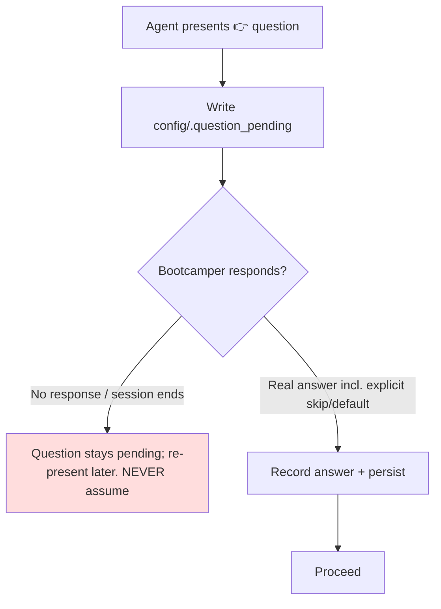

# Design Document

## Overview

The power already forbids the agent from *fabricating* answers to gate questions (`self-answering-prevention-v2`, `mandatory-gate-enforcement`). This spec closes the remaining gap: **silent defaults**. Two onboarding steps (verbosity, comprehension) currently let the agent proceed with an agent-supplied answer when the bootcamper says nothing. The design generalizes the existing "no self-answering" stance into one **Answer_Required_Rule**: every `👉` question needs a Real_Answer before the flow advances; optionality is expressed as an Explicit_Default_Choice the bootcamper actively picks, never as license for the agent to move on unanswered.

This is primarily a steering-text change (remove Assumed_Answer paths, add one normative rule) plus enforcement alignment in the existing hooks and matching test updates. No new runtime service is required.

## Architecture

The key rule: the only two exits from a `👉` question are (1) a Real_Answer or (2) the question stays outstanding. There is no third exit where the agent supplies the answer.

### Files Touched

| File | Change |
| --- | --- |
| `steering/onboarding-phase1b-intro-language.md` (or phase 2 after the preface reorder) | Detail_Level_Step: remove "if the bootcamper skips without answering, apply the `standard` preset as the default"; mark ⛔; keep "standard (recommended)" as an Explicit_Default_Choice; keep the `🛑 STOP` wait directive. |
| onboarding comprehension step | Any_Questions_Step: reword from "not a gate / can skip" to "requires a Real_Answer"; keep the answer→re-present loop for clarification questions. |
| `steering/conversation-protocol.md` | Add the single normative Answer_Required_Rule. |
| `steering/agent-behavior-rules.md`, `steering/agent-instructions.md` | Reference the Answer_Required_Rule; sweep for and remove any "apply default when skipped" / "proceed without an answer" phrasing tied to `👉` questions. |
| `steering/verbosity-control.md` | The "Session Start: if key missing apply standard" default is fine (that is a *stored-preference-absent-at-load* fallback, not an unanswered *question*); but remove/annotate any onboarding-time "skip → default" wording so it is not read as authorizing an unanswered question. |
| `steering/onboarding-phase2-track-setup.md` | Advanced_Knowledge_Check: either require a Real_Answer to its `👉` question, or reword so it does not present a `👉` question if truly optional (Req 5.3). |
| `hooks/write-policy-gate.json`, `hooks/ask-bootcamper.json` | Align enforcement (see below). |
| Onboarding tests | Update to assert the new mandatory/no-default behavior. |

### Design Decision: Explicit_Default_Choice, Not Silent Default

Removing the silent default must not make the bootcamp feel heavier. The design keeps the default one keystroke away: the verbosity question already lists "standard *(recommended)*". Selecting it is a Real_Answer. The only change is that the agent stops *assuming* it when the bootcamper is silent. This preserves UX while satisfying the guarantee.

### Design Decision: Distinguish "Unanswered Question" From "Absent Stored Preference"

`verbosity-control.md` says: on session start, if the `verbosity` key is absent, apply `standard`. That is legitimate — it is a fallback for a *missing stored value on load*, not the resolution of an *outstanding question*. The design preserves that load-time fallback and only removes the onboarding-time "skip the question → default" path. The requirements and tests target the onboarding Question, not the load-time fallback.

## Components and Interfaces

No new components. Enforcement uses the existing hooks:

### `write-policy-gate` (PreToolUse) Alignment

The gate already validates question shape at write time. Extend its prompt so that a write which marks a Question-owning step complete (progress/preferences) without a corresponding recorded Real_Answer is flagged for rewrite — i.e., the agent may not "complete" the verbosity or comprehension step by writing a default it chose itself. This reuses the existing gate mechanism rather than adding a new hook. (Integrates naturally with the single-ask spec's Question_Ledger `mark-answered` signal if that spec is also implemented; if not, the gate relies on the presence of a captured answer in the turn.)

### `ask-bootcamper` (Stop) Alignment

Unchanged ownership. Reaffirm in its prompt that it must not emit content that advances past an unanswered `👉` question; when a Question is pending, it defers (existing behavior).

## Data Models

No schema changes. `config/bootcamp_preferences.yaml` still stores `verbosity`; the difference is that the value is only written after a Real_Answer (including an explicit default selection).

## Error Handling

- **Session ends before an answer:** the `.question_pending` marker keeps the Question outstanding; a later turn re-presents it. No Assumed_Answer (Req 1.5).
- **Ambiguous response:** treat as a clarification/answer per existing answer-processing priority; do not infer a default.
- **Load-time missing preference (not an onboarding question):** the existing `verbosity-control.md` fallback to `standard` remains and is explicitly out of scope for the "no silent default" rule.
- **Conflict with truly optional steps:** resolved by Req 5.3 — an optional step must not present a `👉` question that the agent then answers; make it a statement or give it an Explicit_Default_Choice.

## Testing Strategy

This is a steering-text and hook-prompt change; content assertions (consistent with the existing hook-prompt test framework and onboarding tests) are the primary vehicle. No new Python logic → no new property-based tests here (the single-ask spec covers ledger PBT if adopted).

### Content Tests

- Assert `onboarding-*` Detail_Level_Step: contains ⛔/`🛑 STOP`, contains an Explicit_Default_Choice ("standard (recommended)"), and does NOT contain the "apply the `standard` preset as the default" / "skips without answering" phrasing.
- Assert the Any_Questions_Step text requires a response (no "not a gate … can skip it" authorizing an unanswered advance) and retains the clarification→re-present loop.
- Corpus sweep test: grep the `steering/` tree for Assumed_Answer phrasings tied to `👉` questions ("apply … default", "if the bootcamper skips without answering", "proceed without …") and assert none authorize advancing an unanswered `👉` question. Maintain a small allowlist for the legitimate load-time preference fallback in `verbosity-control.md`.
- Assert `conversation-protocol.md` contains the normative Answer_Required_Rule and that `agent-behavior-rules.md` / `agent-instructions.md` reference it.
- Assert `write-policy-gate.json` prompt includes the "no completing a question-step without a recorded answer" check.

### Existing Tests to Update

- `test_comprehension_check.py`, `test_onboarding_question_ownership.py`, `test_onboarding_session_ux.py`, and any verbosity-onboarding test that currently encodes the silent-default behavior.
- Cross-check `eula-answer-skipped`, `agent-skips-git-question`, `skip-reflection-questions` specs/tests for consistency (these are prior "don't skip an answer" fixes; the new rule must not contradict them).

### Verification Approach

1. `python -m pytest senzing-bootcamp/tests/ tests/` green.
2. `sync_hook_registry.py --verify` after hook edits; hook JSON schema valid.
3. `validate_commonmark.py` on edited Markdown.
4. Manual trace: verbosity step with no bootcamper input → agent waits (does not default); with "use standard" → persists standard and proceeds.

### What NOT to Test

- Do not re-test self-answering fabrication (owned by `self-answering-prevention-v2`); test only the silent-default / unanswered-advance dimension added here.
- Do not test the load-time preference fallback as a violation — it is intentionally preserved.
