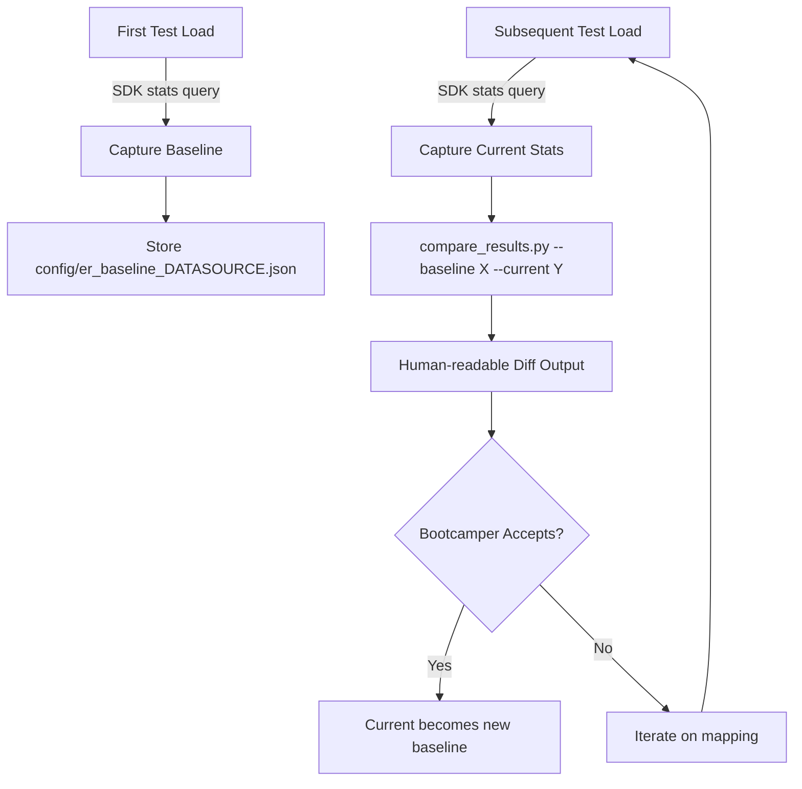

# Design: Mapping Regression Testing

## Overview

This feature adds a lightweight comparison mechanism that lets bootcampers see the impact of mapping changes on entity resolution results during Module 5 Phase 3. A Python script (`scripts/compare_results.py`) compares baseline and current ER statistics, producing a human-readable diff with quality change assessment. The workflow integrates into the existing test-load steering so that baseline capture and comparison happen automatically as bootcampers iterate on their mappings.

**Design Rationale:** Bootcampers in Module 5 often iterate multiple times on data mappings. Without a comparison tool, they have no way to quantify whether a mapping change improved or degraded entity resolution quality. This feature closes that feedback loop with minimal tooling — a single stdlib-only Python script and JSON baseline files.

## Architecture



The architecture is intentionally simple:
- **No new dependencies** — stdlib-only Python script
- **No database** — JSON files in the project's `config/` directory
- **No daemon** — runs on-demand during the test-load workflow
- **Stateless comparison** — the script itself is a pure function over two JSON files

## Components and Interfaces

### 1. `scripts/compare_results.py`

The main comparison script. Located at `senzing-bootcamp/scripts/compare_results.py`.

**CLI Interface:**

```text
python3 senzing-bootcamp/scripts/compare_results.py --baseline <file> --current <file>
```

**Internal Components:**

| Component | Responsibility |
|-----------|---------------|
| `ERStatistics` | Dataclass holding entity_count, record_count, match_count, possible_match_count, relationship_count |
| `ComparisonResult` | Dataclass holding per-metric deltas and quality assessment |
| `load_statistics(path)` | Reads and validates a JSON statistics file |
| `compare(baseline, current)` | Pure function computing deltas between two `ERStatistics` |
| `format_report(result)` | Formats `ComparisonResult` as human-readable text |
| `assess_quality(result)` | Determines net quality change (improved/degraded/unchanged) |
| `baseline_path(datasource)` | Constructs the canonical baseline file path |
| `accept_baseline(current_path, datasource)` | Copies current stats to become the new baseline |
| `main(argv)` | CLI entry point with argparse |

### 2. Steering Integration

Updates to `senzing-bootcamp/steering/module-05-phase3-test-load.md`:

- **After step 24 (ER evaluation):** Add a sub-step that captures statistics to a JSON file using the Senzing SDK (via `generate_scaffold` or `find_examples`).
- **Baseline detection:** If no baseline exists for the datasource, the captured stats become the baseline automatically.
- **Comparison trigger:** If a baseline exists, run `compare_results.py` and present the diff to the bootcamper.
- **Accept/reject gate:** Ask the bootcamper whether to accept the new results as the baseline.

### 3. Baseline Storage

Baseline files stored at: `config/er_baseline_{datasource}.json`

The `{datasource}` placeholder is the lowercase datasource name (e.g., `customers`, `vendors`). This lives in the bootcamper's project `config/` directory (not the power's `config/`).

## Data Models

### ERStatistics JSON Schema

```json
{
  "datasource": "CUSTOMERS",
  "entity_count": 847,
  "record_count": 1000,
  "match_count": 153,
  "possible_match_count": 12,
  "relationship_count": 45,
  "captured_at": "2026-04-20T14:30:00Z"
}
```

All count fields are non-negative integers. The `captured_at` field is ISO 8601 UTC.

### ComparisonResult Structure

```python
@dataclasses.dataclass
class ComparisonResult:
    entity_delta: int          # current - baseline (negative = fewer entities = more dedup)
    record_delta: int          # should be 0 if same data, positive if more records loaded
    match_delta: int           # positive = more matches found
    possible_match_delta: int  # positive = more possible matches
    relationship_delta: int    # positive = more relationships discovered
    quality_assessment: str    # "improved", "degraded", or "unchanged"
```

### Quality Assessment Logic

The quality assessment uses a simple heuristic:
- **Improved:** match_count increased OR entity_count decreased (more deduplication) with no decrease in match_count
- **Degraded:** match_count decreased OR entity_count increased (less deduplication) with no increase in match_count
- **Unchanged:** No meaningful change in match_count or entity_count

This is deliberately simple — the bootcamper makes the final judgment call based on the full diff output.

## Correctness Properties

*A property is a characteristic or behavior that should hold true across all valid executions of a system — essentially, a formal statement about what the system should do. Properties serve as the bridge between human-readable specifications and machine-verifiable correctness guarantees.*

### Property 1: Comparison produces correct deltas with complete output

*For any* two valid `ERStatistics` instances (baseline and current), the comparison output SHALL contain the correct arithmetic delta (current - baseline) for each metric (entity_count, match_count, possible_match_count, relationship_count) and SHALL include a quality assessment string that is one of "improved", "degraded", or "unchanged".

**Validates: Requirements 1, 3**

### Property 2: Baseline path construction

*For any* valid datasource name string, the `baseline_path` function SHALL produce a path matching the pattern `config/er_baseline_{datasource_lower}.json` where `datasource_lower` is the lowercase version of the input.

**Validates: Requirements 7**

### Property 3: Incremental baseline update preserves last accepted state

*For any* sequence of `ERStatistics` snapshots with associated accept/reject decisions, after processing the sequence, the stored baseline SHALL equal the most recently accepted snapshot. If no snapshot was accepted, the original baseline SHALL remain unchanged.

**Validates: Requirements 8**

### Property 4: Quality assessment consistency

*For any* two valid `ERStatistics` where match_count increased and entity_count did not increase, the quality assessment SHALL be "improved". *For any* two valid `ERStatistics` where match_count decreased and entity_count did not decrease, the quality assessment SHALL be "degraded".

**Validates: Requirements 3**

## Error Handling

| Scenario | Behavior |
|----------|----------|
| Baseline file missing | Print informative message: "No baseline found for {datasource}. Current stats saved as baseline." Exit 0. |
| Current file missing | Print error: "Current statistics file not found: {path}". Exit 1. |
| Invalid JSON in either file | Print error: "Failed to parse {path}: {error}". Exit 1. |
| Missing required fields in JSON | Print error: "Missing required field '{field}' in {path}". Exit 1. |
| Negative count values | Print warning but continue (data may be from a partial load). |
| Permission error on file write | Print error: "Cannot write baseline file: {error}". Exit 1. |

The script follows the project convention of exit code 0 on success, 1 on error.

## Testing Strategy

**Test file:** `senzing-bootcamp/tests/test_compare_results.py`

**Dual approach:**

### Property-Based Tests (Hypothesis)

Property-based tests validate the correctness properties above using generated inputs. Each property test runs a minimum of 100 iterations.

- **Library:** Hypothesis (already used throughout the project)
- **Configuration:** `@settings(max_examples=100)`
- **Tag format:** Comments referencing design properties

| Property | Test Class | What It Generates |
|----------|-----------|-------------------|
| Property 1 | `TestComparisonDeltaProperties` | Random pairs of ERStatistics with non-negative integer counts |
| Property 2 | `TestBaselinePathProperties` | Random datasource name strings (alphanumeric + underscores) |
| Property 3 | `TestIncrementalBaselineProperties` | Random sequences of (ERStatistics, accept: bool) pairs |
| Property 4 | `TestQualityAssessmentProperties` | Constrained ERStatistics pairs where match/entity deltas have known direction |

### Example-Based Unit Tests

| Test Class | Scenarios |
|-----------|-----------|
| `TestIdenticalBaselines` | Baseline == current → all deltas zero, assessment "unchanged" |
| `TestImprovedResults` | More matches, fewer entities → assessment "improved" |
| `TestDegradedResults` | Fewer matches, more entities → assessment "degraded" |
| `TestMissingBaselineFile` | Graceful handling when baseline doesn't exist |
| `TestInvalidJSON` | Malformed JSON produces clear error message |
| `TestCLIArgParsing` | Verify --baseline and --current flags work correctly |

### Structural Tests

| Test | What It Verifies |
|------|-----------------|
| `TestSteeringIntegration` | Module 5 Phase 3 steering contains baseline capture step |
| `TestPowerMdIntegration` | POWER.md Useful Commands section lists compare_results.py |
