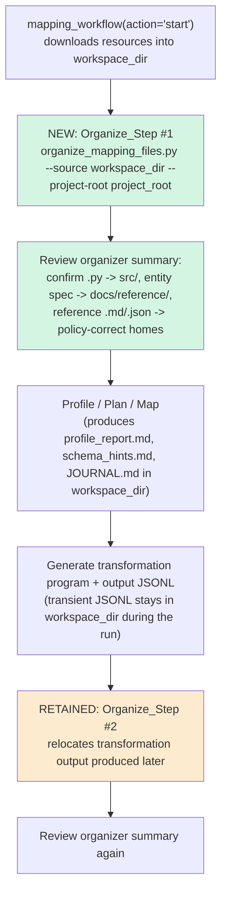

# Design Document

## Overview

This feature is a **documentation-and-steering change** to Module 5 (Data
Quality & Mapping). It changes *when* the Module 5 guidance tells the agent to
run the existing organizer (`senzing-bootcamp/scripts/organize_mapping_files.py`)
so that reusable resources downloaded by the `mapping_workflow` MCP tool are
relocated to policy-correct locations **immediately after the download
completes**, rather than only later in the workflow. It also documents the
canonical home of the Senzing entity specification and the set of transient run
artifacts that intentionally stay in the workspace during a run.

The change touches exactly two files inside the bootcamp:

- `senzing-bootcamp/docs/modules/MODULE_5_DATA_QUALITY_AND_MAPPING.md`
  (companion doc — user-facing)
- `senzing-bootcamp/steering/module-05-phase2-data-mapping.md`
  (agent steering — drives the step-by-step workflow)

It does **not** modify:

- the `mapping_workflow` MCP tool (owned by the Senzing MCP server),
- the organizer's routing rules or any other behavior in
  `organize_mapping_files.py`,
- the `write-policy-gate` hook policy.

### Why this is not a code change

The organizer already routes `.py`, the entity specification, reference
`.md`/`.json` files, and JSONL exactly where the File_Placement_Policy requires
(verified below). The only gap the feedback identified is **timing**: the
bootcamp's guidance invoked the organizer too late, leaving downloaded scripts
and reference docs sitting in the scratch `workspace_dir` while the bootcamper
continued working. The fix is to move/insert the organize instruction in the
guidance so it runs right after the download. No executable behavior in the
organizer needs to change.

### Key design insight: timing, not filtering

The organizer is **filename/extension-based and first-match-wins** — it has no
concept of "reusable" versus "transient." It would route any `.md` it sees to
`docs/mapping` and any `.jsonl` to `data`. Therefore the *only* lever the
Module 5 guidance has to keep transient run artifacts in the workspace is
**when** it points the organizer at `workspace_dir`:

- The new **post-download** organize step runs at a point where only the
  downloaded **Reusable_Resource** files exist in `workspace_dir`. The
  transient artifacts (`profile_report.md`, `schema_hints.md`, `JOURNAL.md`,
  generated JSONL) are produced **later** by profiling, validation, and
  transformation, so they are simply not present yet and cannot be swept.
- The existing **post-transformation** organize step is retained so the
  transformation **output** generated later is also relocated.

This timing model is the heart of the design and is what reconciles
"relocate reusable resources immediately" (Req 1) with "keep transient
artifacts in the workspace during the run" (Req 3, Req 5.2).

## Architecture

### Affected systems and ownership

| System | Owner | Changed here? |
|---|---|---|
| Mapping_Workflow_Tool (`mapping_workflow`) | Senzing MCP server | No |
| Organizer (`organize_mapping_files.py`) | Bootcamp scripts | No |
| Write_Policy_Gate (`write-policy-gate` hook) | Bootcamp hooks | No |
| Module 5 companion doc | Bootcamp docs | **Yes** |
| Module 5 Phase 2 steering | Bootcamp steering | **Yes** |

The bootcamp guidance is a thin instructional wrapper around the MCP tool and
the organizer. This feature edits only that wrapper.

### Workflow timing (target state)



At the moment Organize_Step #1 runs, `workspace_dir` contains only the
just-downloaded reusable resources, so only those are relocated. The transient
artifacts are created afterward and remain in `workspace_dir` for the
workflow's continued use (for example, `analyze_record` reading from
`workspace_dir`).

### Organize step invocation (unchanged contract)

Both organize steps invoke the existing CLI exactly as it already supports:

```bash
python3 senzing-bootcamp/scripts/organize_mapping_files.py \
  --source <workspace_dir> \
  --project-root <bootcamper_project_root>
```

`--dry-run` remains available for previewing moves. No new flags or behaviors
are introduced.

## Components and Interfaces

### Component 1: Module 5 Phase 2 steering (`module-05-phase2-data-mapping.md`)

This file drives the agent's step-by-step behavior. Current state:

- Step 1 calls `mapping_workflow(action='start')` (the download point).
- An "Organize mapping output files" agent instruction currently lives in
  **Step 5** ("Generate starter code"), after `action='paths'`.

Changes:

1. **Add a post-download Organize_Step instruction** immediately after the
   `action='start'` download in Step 1. It invokes the organizer with
   `--source <workspace_dir>` and `--project-root <bootcamper_project_root>`
   and instructs the agent to review the summary output. (Req 1.1, 1.2, 1.4)
2. **Retain an Organize_Step after transformation output is generated.** The
   existing organize instruction (currently in Step 5) is kept so output files
   produced later are also relocated. (Req 1.3)
3. **Document the transient run artifacts** that remain in `workspace_dir`
   during the run: `profile_report.md`, `schema_hints.md`, `JOURNAL.md`, and
   generated JSONL output. The guidance must not relocate, delete, or redirect
   these out of `workspace_dir` while the run is in progress. (Req 3.1, 3.2,
   5.2)
4. **State the reliance on existing routing.** The guidance references the
   organizer's existing routing rules and introduces no alternative
   destinations. (Req 2.4, 5.3)
5. **Document graceful handling** of unrouted files and blocked writes by
   pointing the agent at the organizer's summary output (see Error Handling).
   (Req 5.4, 5.5)

### Component 2: Module 5 companion doc (`MODULE_5_DATA_QUALITY_AND_MAPPING.md`)

This file is user-facing reference documentation. Changes:

1. **Document the Organize_Step in the Phase 2 narrative** — that it runs after
   the `mapping_workflow` download completes and before further mapping work,
   to place reusable resources in policy-correct locations. (Req 4.2)
2. **Document the Entity_Specification by file name** and state that its
   canonical home after the Organize_Step completes is `docs/reference/`, so a
   bootcamper can locate it at that path without inspecting `workspace_dir`.
   (Req 4.1, 4.3)

### Component 3: Organizer (`organize_mapping_files.py`) — interface only, unchanged

The guidance depends on the organizer's existing, verified routing behavior.
The organizer is **not modified**. Its relevant contract:

- CLI: `--source`, `--project-root`, `--dry-run`.
- Routing is first-match-wins over an ordered rule list.
- It deduplicates the canonical single-copy `senzing_entity_specification.md`.
- It reports `moved`, `skipped`, `deduplicate`, and `unrouted` outcomes in its
  summary (moves to stdout; skipped/dedup/unrouted notices to stderr).
- Files matching no rule are left in place and reported as `Warning:` /
  unrouted.

## Data Models

### File classification (conceptual, enforced by timing)

| Category | Examples | Disposition during a run |
|---|---|---|
| Reusable_Resource (`.py`) | `sz_schema_generator.py`, `sz_json_analyzer.py`, `sz_verbatim_check.py`, `sz_routing_report.py` | Relocated by Organize_Step #1 to `src/mapping` |
| Reusable_Resource (entity spec) | `senzing_entity_specification.md` | Relocated to `docs/reference` (single canonical copy; deduped) |
| Reusable_Resource (reference `.md`/`.json`) | `senzing_mapping_examples.md`, `identifier_crosswalk.json` | Relocated to policy-correct homes (`docs/mapping`, `config`) |
| Transient_Run_Artifact | `profile_report.md`, `schema_hints.md`, `JOURNAL.md`, generated JSONL | Left in `workspace_dir` during the run (produced after Organize_Step #1) |

### Routing rules relied upon (existing organizer — not changed)

First-match-wins, top to bottom:

| Match | Destination | Policy mapping |
|---|---|---|
| name `senzing_entity_specification.md` | `docs/reference` | non-README `.md` → `docs/` (canonical reference home) |
| suffix `*_mapper.md` | `docs/mapping` | non-README `.md` → `docs/` |
| extension `.md` | `docs/mapping` | non-README `.md` → `docs/` |
| extension `.py` | `src/mapping` | `.py` → `src/` subdirectory |
| extension `.jsonl` | `data` | data → `data/` |
| extension `.json` | `config` | config JSON → `config/` |

Every destination above is permitted by the File_Placement_Policy, so the
Write_Policy_Gate blocks none of the writes the Organize_Step performs. (Req
2.1, 2.2, 2.3, 5.1)

## Error Handling

The guidance does not add new error paths; it documents and defers to the
organizer's existing, non-fatal handling and instructs the agent to read the
summary.

- **Unrouted files (Req 5.4):** If a downloaded file matches no routing rule,
  the organizer leaves it in `workspace_dir` and reports it as a `Warning:`
  (unrouted) in its summary. The guidance instructs the agent to review the
  summary and surface unrouted files to the bootcamper rather than forcing a
  destination.
- **Blocked writes (Req 5.5):** If the Write_Policy_Gate blocks a write during
  the Organize_Step, the affected file remains in `workspace_dir` and the
  blocked destination is reported as an error. Because every routing
  destination is policy-compliant (see Data Models), this is not expected in
  normal operation; the guidance treats it as a signal to review rather than to
  retry against a different location.
- **Transient artifacts during the run (Req 5.2):** The guidance explicitly
  instructs the agent **not** to relocate, delete, or redirect transient run
  artifacts out of `workspace_dir` while the run is in progress, preserving the
  workflow's ability to read its own intermediate files.
- **Summary review (Req 1.4):** After each Organize_Step, the agent reviews the
  organizer summary to confirm files landed at the expected locations
  (`.py` → `src/`, entity spec → `docs/reference/`, reference `.md`/`.json` →
  policy-correct homes) before proceeding.

## Testing Strategy

### Property-based testing is not applicable to this feature

This feature changes only Markdown documentation and agent steering. It writes
no new executable logic, and it explicitly does not modify the organizer, the
MCP tool, or the write-policy-gate. There is no pure function or input/output
behavior introduced here for which a "for all inputs X, property P(X) holds"
statement could be written. Per the testing guidance, documentation/steering
changes use review and example-based verification, not property-based tests.
Accordingly, this design intentionally **omits a Correctness Properties
section**.

The organizer's own correctness is already covered by an existing
property-based suite (`senzing-bootcamp/tests/test_organize_mapping_files.py`,
feature `docs-file-placement`), which this change leaves untouched. Those
properties already validate that `.py` → `src/mapping`, the entity spec →
`docs/reference`, `*_mapper.md` and generic `.md` → `docs/mapping`, JSONL →
`data`, JSON → `config`, and that the entity spec is deduplicated to a single
canonical copy. The behavior this feature relies on is therefore already
guaranteed by tests we are not modifying.

### Verification approach for this change

1. **Documentation review against acceptance criteria.** Confirm each edited
   file satisfies its mapped requirements:
   - Steering: post-download Organize_Step added (1.1, 1.2), invoked with the
     correct `--source`/`--project-root` flags (1.2), summary-review instruction
     present (1.4), post-transformation Organize_Step retained (1.3), transient
     artifacts named and protected (3.1, 3.2, 5.2), reliance on existing routing
     stated with no new destinations (2.4, 5.3), unrouted/blocked handling
     documented (5.4, 5.5).
   - Companion doc: Organize_Step timing documented (4.2), entity spec named and
     its `docs/reference/` canonical home stated (4.1, 4.3).
2. **CommonMark/lint validation.** Run the repository's existing checks
   (`validate_commonmark.py`, `measure_steering.py --check`) so the edited files
   stay within steering token budgets and pass markdown validation in CI.
3. **Behavioral spot-check via the existing organizer (no code change).** Use
   the organizer's `--dry-run` against a sample directory containing the
   representative downloaded resources (`sz_*.py`,
   `senzing_entity_specification.md`, `senzing_mapping_examples.md`,
   `identifier_crosswalk.json`) to confirm the documented destinations match
   actual routing. This validates the *claims the docs make*, using the
   organizer as-is.
4. **Steering-index consistency.** If token counts change, update
   `steering-index.yaml` so `measure_steering.py --check` passes.

### Out of scope for testing

- The organizer's routing logic (already covered by its unchanged PBT suite).
- The `mapping_workflow` MCP tool behavior (owned by the MCP server).
- The `write-policy-gate` policy (unchanged).
