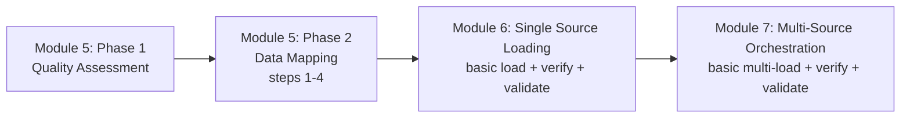
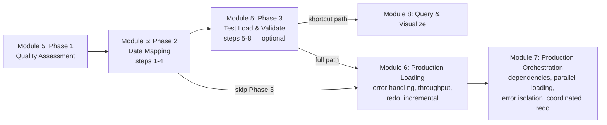
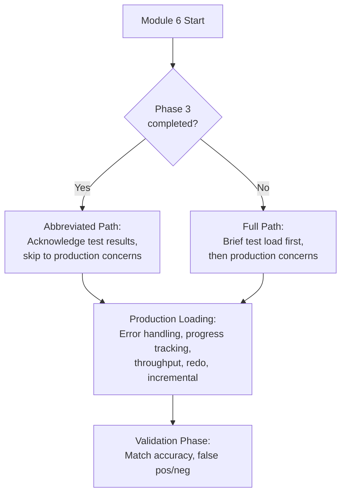

# Design Document: Mapping Workflow Integration

## Overview

This feature integrates `mapping_workflow` steps 5–8 into Module 5 as a new Phase 3 ("Test Load and Validate"), then refocuses Module 6 on production-quality loading and Module 7 on production-quality multi-source orchestration. The goal is to eliminate redundancy between the mapping workflow's test-load capabilities and the basic load-and-verify patterns currently repeated in Modules 6 and 7.

The changes span six file categories:
1. **Module 5 steering file** — add Phase 3 with steps 5–8, decision gate, shortcut path, and checkpoint logic
2. **Module 5 documentation** — add Phase 3 section, shortcut path, updated success criteria
3. **Module 6 steering file** — refocus on production-quality loading, add conditional workflow based on Phase 3 completion
4. **Module 6 documentation** — update overview, learning objectives, and workflow description
5. **Module 7 steering file** — refocus on production-quality orchestration, reference Phase 3 results
6. **Module 7 documentation** — update overview, learning objectives, and "When to Use" section
7. **POWER.md** — update module table descriptions and track descriptions
8. **Data source registry** — add `test_load_status` field to schema

### Design Rationale

The current bootcamp flow has bootcampers complete `mapping_workflow` steps 1–4 in Module 5, then repeat similar load-and-verify patterns in Modules 6 and 7. Since `mapping_workflow` steps 5–8 already provide SDK detection, test loading, validation reporting, and entity resolution evaluation, integrating them into Module 5 gives immediate feedback on mapping quality. Modules 6 and 7 can then focus on production concerns (error handling, throughput, redo processing, orchestration patterns) that represent genuinely new skills.

## Architecture

### Current Flow



### Proposed Flow



### Conditional Workflow in Module 6

Module 6 adapts based on whether the bootcamper completed Phase 3:



## Components and Interfaces

### Files Modified

| File | Change Type | Description |
|------|-------------|-------------|
| `senzing-bootcamp/steering/module-05-data-quality-mapping.md` | Major addition | Add Phase 3 (steps 5–8), decision gate, shortcut path, checkpoint logic, session resume |
| `senzing-bootcamp/docs/modules/MODULE_5_DATA_QUALITY_AND_MAPPING.md` | Major addition | Add Phase 3 section, shortcut path section, updated success criteria |
| `senzing-bootcamp/steering/module-06-single-source.md` | Major revision | Refocus on production-quality loading, add conditional workflow, add incremental loading guidance |
| `senzing-bootcamp/docs/modules/MODULE_6_SINGLE_SOURCE_LOADING.md` | Major revision | Update overview, learning objectives, "What You'll Do", conditional workflow documentation |
| `senzing-bootcamp/steering/module-07-multi-source.md` | Moderate revision | Refocus on production orchestration, reference Phase 3 results, add production patterns |
| `senzing-bootcamp/docs/modules/MODULE_7_MULTI_SOURCE_ORCHESTRATION.md` | Moderate revision | Update overview, learning objectives, "When to Use", add Phase 3 integration description |
| `senzing-bootcamp/POWER.md` | Minor update | Update module table descriptions, track descriptions |
| `senzing-bootcamp/scripts/data_sources.py` | Minor update | Add `test_load_status` to valid fields and schema validation |

### Component Interactions

**Phase 3 → Data Source Registry:** Phase 3 writes `test_load_status: complete` and `test_entity_count: N` to `config/data_sources.yaml` for each source that completes test loading.

**Phase 3 → Bootcamp Progress:** Phase 3 writes step-level checkpoints to `config/bootcamp_progress.json` continuing sequentially from Phase 2's last step (step 20). Phase 3 steps will be numbered 21–26.

**Module 6 → Data Source Registry:** Module 6 reads `test_load_status` from the registry to determine which sources completed test loading, enabling the conditional workflow.

**Module 7 → Data Source Registry:** Module 7 reads `test_load_status` for multiple sources to inform load order planning and dependency management.

**Shortcut Path → Bootcamp Progress:** When a bootcamper chooses the shortcut path, the steering file instructs the agent to mark Modules 6 and 7 as `skipped` with a reason in `bootcamp_progress.json`.

## Data Models

### Data Source Registry Extension

Add two new optional fields to each data source entry in `config/data_sources.yaml`:

```yaml
sources:
  CUSTOMERS:
    name: "Customer CRM"
    file_path: "data/raw/customers.csv"
    format: csv
    record_count: 10000
    quality_score: 85
    mapping_status: complete
    load_status: not_loaded
    test_load_status: complete        # NEW — "complete" or "skipped" or null
    test_entity_count: 9850           # NEW — entity count from test load, or null
    added_at: "2026-04-14T10:00:00Z"
    updated_at: "2026-04-14T12:30:00Z"
```

**Field definitions:**
- `test_load_status`: One of `complete`, `skipped`, or `null`. Set by Phase 3 of Module 5.
- `test_entity_count`: Integer count of entities created during test loading, or `null`. Set when `test_load_status` is `complete`.

### Bootcamp Progress Extension

Phase 3 step numbers continue from Phase 2's last step (step 20):

| Step | Phase 3 Action | mapping_workflow Step |
|------|---------------|----------------------|
| 21 | SDK environment detection | Step 5 |
| 22 | Test data loading into fresh SQLite DB | Step 6 |
| 23 | Validation report generation | Step 7 |
| 24 | Entity resolution evaluation | Step 8 |
| 25 | Present results and decision gate | — |
| 26 | Shortcut path decision (if applicable) | — |

### Module Skip Schema in Bootcamp Progress

When a bootcamper chooses the shortcut path, the progress file records:

```json
{
  "modules_skipped": {
    "6": { "reason": "shortcut_path", "skipped_at": "2026-04-14T13:00:00Z" },
    "7": { "reason": "shortcut_path", "skipped_at": "2026-04-14T13:00:00Z" }
  }
}
```

## Correctness Properties

*A property is a characteristic or behavior that should hold true across all valid executions of a system — essentially, a formal statement about what the system should do. Properties serve as the bridge between human-readable specifications and machine-verifiable correctness guarantees.*

This feature is primarily documentation and steering file content changes. The only code-level change is the data source registry schema extension. Most acceptance criteria are structural content checks on markdown files (EXAMPLE-type tests). The one property-testable area is the registry schema validation.

### Property 1: Registry schema round-trip with test_load_status

*For any* valid data source registry entry that includes a `test_load_status` field (one of `complete`, `skipped`, or `null`) and an optional `test_entity_count` field (non-negative integer or `null`), serializing the registry to YAML and parsing it back SHALL produce an equivalent registry with the `test_load_status` and `test_entity_count` values preserved.

**Validates: Requirements 8.1**

### Property 2: Phase 3 step numbers are sequential continuations of Phase 2

*For any* Module 5 steering file, the step numbers assigned to Phase 3 checkpoint instructions SHALL form a strictly increasing sequence that starts at exactly one more than the last Phase 2 step number, with no gaps or overlaps.

**Validates: Requirements 8.3**

## Error Handling

### Phase 3 Error Scenarios

| Scenario | Handling |
|----------|----------|
| SDK not configured | Inform bootcamper that Module 2 is required; offer to skip Phase 3 |
| Test load fails (data issues) | Present error details; suggest returning to Phase 2 to fix mapping |
| Test load fails (system issues) | Present error; suggest checking SDK installation (Module 2) |
| Phase 3 skipped by choice | Record skip in progress; proceed to Module 6 normally |
| Session interrupted during Phase 3 | Resume from last checkpoint using mapping state + bootcamp progress |

### Module 6 Conditional Workflow Errors

| Scenario | Handling |
|----------|----------|
| Registry missing `test_load_status` field | Treat as Phase 3 not completed; use full path |
| Registry file doesn't exist | Treat as Phase 3 not completed; use full path |
| Phase 3 completed but results are stale | Agent notes the test load date and suggests re-running if data changed |

## Testing Strategy

### Testing Approach

This feature is primarily documentation and steering file content changes. Property-based testing applies only to the registry schema extension. The bulk of testing uses example-based structural checks on markdown file content.

### Unit Tests (Example-Based)

**Module 5 Steering File:**
- Verify Phase 3 section exists with references to `mapping_workflow` steps 5–8
- Verify Phase 3 is marked as optional with skip instructions
- Verify checkpoint step numbers (21–26) are present and sequential from step 20
- Verify decision gate content exists after Phase 3
- Verify shortcut path instructions exist with Module 6/7 skip logic
- Verify SDK-not-configured handling exists
- Verify session resume instructions for Phase 3 exist

**Module 5 Documentation:**
- Verify "Test Load and Validate" section exists
- Verify Phase 3 learning objectives are listed
- Verify output files are documented
- Verify success criteria include Phase 3 indicators
- Verify "Shortcut Path" section exists

**Module 6 Steering File:**
- Verify production-quality loading focus (error handling, progress tracking, throughput, redo)
- Verify conditional workflow based on Phase 3 completion
- Verify fallback test load step for skipped Phase 3
- Verify match accuracy review is retained
- Verify incremental loading guidance exists
- Verify registry read instruction for `test_load_status`

**Module 6 Documentation:**
- Verify updated overview describes production-quality loading
- Verify conditional workflow documentation
- Verify production-quality learning objectives
- Verify updated "What You'll Do" section

**Module 7 Steering File:**
- Verify production orchestration focus (dependencies, parallel loading, error isolation, coordinated redo)
- Verify Phase 3 results are referenced for planning
- Verify cross-source validation, UAT, and sign-off are retained
- Verify production orchestration patterns (retry with backoff, partial success, health monitoring)

**Module 7 Documentation:**
- Verify updated overview describes production-quality orchestration
- Verify Phase 3 results integration description
- Verify production orchestration learning objectives
- Verify updated "When to Use This Module" section

**POWER.md:**
- Verify Module 5 description mentions test load and validate phase
- Verify Module 6 description emphasizes production-quality loading
- Verify Module 7 description emphasizes production-quality orchestration
- Verify track descriptions mention Phase 3 shortcut path

### Property-Based Tests

**Registry Schema (Property 1):**
- Library: Hypothesis (Python)
- Generate random registry entries with `test_load_status` ∈ {`complete`, `skipped`, `null`} and `test_entity_count` ∈ {non-negative int, `null`}
- Serialize to YAML, parse back, verify round-trip equivalence
- Minimum 100 iterations
- Tag: **Feature: mapping-workflow-integration, Property 1: Registry schema round-trip with test_load_status**

**Step Number Continuity (Property 2):**
- Parse the Module 5 steering file and extract all checkpoint step numbers
- Verify Phase 3 steps form a strictly increasing sequence starting from Phase 2's last step + 1
- Tag: **Feature: mapping-workflow-integration, Property 2: Phase 3 step numbers are sequential continuations of Phase 2**

### Integration Tests

- Verify `data_sources.py` validates registries with the new `test_load_status` and `test_entity_count` fields
- Verify `data_sources.py` rejects invalid `test_load_status` values
- Verify `validate_module.py` (if applicable) handles the new Phase 3 steps

### Preservation Checks

- Verify existing Phase 1 and Phase 2 content in Module 5 steering file is unchanged
- Verify Module 6 retains match accuracy review and validation steps
- Verify Module 7 retains cross-source validation, UAT, and stakeholder sign-off
- Verify no regressions in existing checkpoint step numbers (steps 1–20 in Module 5)
