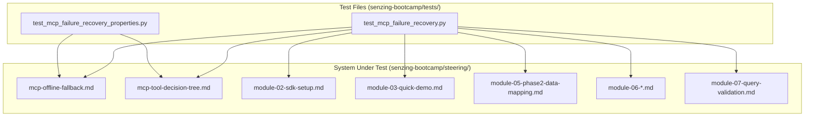

# Design Document: MCP Failure Recovery Testing

## Overview

This feature adds a comprehensive test suite that validates the completeness and correctness of MCP failure recovery steering content in the senzing-bootcamp power. The tests parse the offline fallback steering file (`mcp-offline-fallback.md`) and module steering files to verify:

- Fallback instructions exist for every MCP tool and are structurally sound
- MCP-dependent modules have inline failure handling or reference the offline fallback
- The reconnection procedure is complete, ordered, and references the correct verification call
- The troubleshooting table covers common failure modes with actionable fixes
- The bootcamper communication template contains all required messaging elements
- Continuable operations are comprehensive and don't reference MCP tools as dependencies
- Cross-document consistency between the MCP tool decision tree and offline fallback

The tests live in `senzing-bootcamp/tests/test_mcp_failure_recovery.py` (unit/example tests) and `senzing-bootcamp/tests/test_mcp_failure_recovery_properties.py` (property-based tests), using pytest + Hypothesis with Python 3.11+ stdlib only.

## Architecture



### Design Decisions

1. **Two test files** — one for example-based unit tests (`test_mcp_failure_recovery.py`) and one for property-based tests (`test_mcp_failure_recovery_properties.py`). This separates concerns and makes it clear which tests use Hypothesis.

2. **Parse-once pattern** — both files parse the steering documents at module level (outside test classes) so file I/O happens once per test session, not per test method. This follows the pattern established by `test_mcp_tool_decision_tree.py`.

3. **Regex-based Markdown table parsing** — extract table rows using regex patterns matching the pipe-delimited Markdown table format. This avoids external dependencies and handles the specific table formats used in the steering files.

4. **Section extraction by heading** — use heading-level markers (`##`, `###`) to extract document sections, enabling targeted validation of specific parts of the offline fallback file.

5. **Shared constants** — MCP tool names are defined once as a module-level constant list (matching the canonical 12 tools from the decision tree), reused across both test files.

## Components and Interfaces

### Parsing Utilities (module-level in test files)

```python
# Constants
_BOOTCAMP_DIR: Path  # senzing-bootcamp/
_STEERING_DIR: Path  # senzing-bootcamp/steering/
_OFFLINE_FALLBACK_PATH: Path  # steering/mcp-offline-fallback.md
_DECISION_TREE_PATH: Path  # steering/mcp-tool-decision-tree.md

ALL_MCP_TOOLS: list[str]  # 12 canonical tool names
MCP_DEPENDENT_MODULES: dict[str, Path]  # module name -> steering file path
ACTIONABLE_VERBS: list[str]  # verbs for continuable operations check
FORBIDDEN_PHRASES: list[str]  # "guess", "assume", "probably", "might be"

# Parsing functions
def parse_blocked_operations_table(content: str) -> list[dict[str, str]]: ...
def parse_fallback_instructions(content: str) -> dict[str, list[str]]: ...
def parse_continuable_operations(content: str) -> list[dict[str, str]]: ...
def parse_troubleshooting_table(content: str) -> list[dict[str, str]]: ...
def extract_section(content: str, heading: str) -> str: ...
def extract_reconnection_steps(content: str) -> list[str]: ...
def parse_call_pattern_tools(content: str) -> list[str]: ...
def parse_anti_pattern_tools(content: str) -> list[str]: ...
```

### test_mcp_failure_recovery.py

Classes:

- `TestOfflineFallbackCompleteness` — Req 1: tool coverage, fallback existence
- `TestModuleSteeringMCPHandling` — Req 2: per-module fallback/reference checks
- `TestReconnectionProcedure` — Req 3: step count, order, content
- `TestConnectivityTroubleshooting` — Req 4: table completeness, scenarios
- `TestBootcamperCommunicationTemplate` — Req 5: message template elements
- `TestContinuableOperationsCoverage` — Req 6: categories, content
- `TestDecisionTreeConsistency` — Req 7: cross-document consistency

### test_mcp_failure_recovery_properties.py

Classes:

- `TestFallbackStepCountBounds` — Property 1: 2-10 steps per fallback
- `TestNoForbiddenPhrases` — Property 2: no guessing language
- `TestFallbackConcreteResources` — Property 3: alternative resources present
- `TestBlockedOperationFallbackRoundTrip` — Property 4: table ↔ heading bijection
- `TestErrorHandlingFallbackPath` — Property 5: explain_error_code + fallback
- `TestTroubleshootingEntryCompleteness` — Property 6: non-empty Issue and Fix
- `TestContinuableOperationsTableStructure` — Property 7: required columns + actionable verbs
- `TestNoContinuableMCPDependency` — Property 8: no MCP tool references
- `TestDecisionTreeSupersetProperty` — Property 9: decision tree ⊇ blocked ops
- `TestNoMCPCallInFallbackSteps` — Property 10: no MCP tool calls in fallbacks

## Data Models

### Parsed Blocked Operation

```python
@dataclass
class BlockedOperation:
    operation: str       # e.g., "Attribute mapping"
    mcp_tool: str        # e.g., "mapping_workflow"
    affected_modules: str  # e.g., "5, 7"
    fallback_summary: str  # e.g., "Refer to docs.senzing.com..."
```

### Parsed Fallback Instruction

```python
@dataclass
class FallbackInstruction:
    tool_name: str       # e.g., "mapping_workflow"
    heading: str         # Full heading text
    steps: list[str]     # Numbered step texts
```

### Parsed Continuable Operation

```python
@dataclass
class ContinuableOperation:
    category: str        # e.g., "Data Preparation"
    activity: str        # e.g., "Define business problem"
    modules: str         # e.g., "2"
    what_to_do: str      # e.g., "Fully independent of MCP..."
```

### Parsed Troubleshooting Entry

```python
@dataclass
class TroubleshootingEntry:
    issue: str           # e.g., "Corporate proxy blocking MCP"
    fix: str             # e.g., "Allowlist mcp.senzing.com:443..."
```

### Hypothesis Strategies

```python
# Strategy drawing from parsed blocked operations
def st_blocked_operation() -> st.SearchStrategy[BlockedOperation]: ...

# Strategy drawing from parsed fallback instructions
def st_fallback_instruction() -> st.SearchStrategy[FallbackInstruction]: ...

# Strategy drawing from parsed continuable operations
def st_continuable_operation() -> st.SearchStrategy[ContinuableOperation]: ...

# Strategy drawing from parsed troubleshooting entries
def st_troubleshooting_entry() -> st.SearchStrategy[TroubleshootingEntry]: ...

# Strategy drawing from MCP-dependent module file paths
def st_mcp_dependent_module() -> st.SearchStrategy[Path]: ...
```

## Correctness Properties

*A property is a characteristic or behavior that should hold true across all valid executions of a system — essentially, a formal statement about what the system should do. Properties serve as the bridge between human-readable specifications and machine-verifiable correctness guarantees.*

### Property 1: Fallback instruction step count bounds

*For any* fallback instruction in the Offline_Fallback_Steering, the number of numbered steps SHALL be at least 2 and no more than 10.

**Validates: Requirements 1.2, 8.1**

### Property 2: No forbidden guessing phrases in fallback instructions

*For any* fallback instruction in the Offline_Fallback_Steering, no step text SHALL contain the phrases "guess", "assume", "probably", or "might be".

**Validates: Requirements 1.3**

### Property 3: Fallback instructions reference concrete alternative resources

*For any* fallback instruction in the Offline_Fallback_Steering, at least one step SHALL reference a concrete alternative resource (a URL matching `https://`, a local file path, or a backtick-formatted command).

**Validates: Requirements 1.4**

### Property 4: Blocked operation to fallback instruction round-trip

*For any* blocked operation in the Offline_Fallback_Steering table, the tool name extracted from the table SHALL appear in backtick-formatted code within exactly one corresponding fallback instruction heading, and every fallback instruction heading SHALL correspond to exactly one blocked operation entry.

**Validates: Requirements 1.5, 8.3**

### Property 5: Error handling sections reference explain_error_code with fallback path

*For any* MCP-dependent module steering file, the Error Handling section SHALL reference `explain_error_code` and SHALL include a fallback path for when that tool is unavailable (containing text about the tool returning no result or being unavailable).

**Validates: Requirements 2.6**

### Property 6: Troubleshooting entries have non-empty Issue and Fix

*For any* entry in the connectivity troubleshooting table, both the Issue column and the Fix column SHALL be non-empty strings with at least 5 characters.

**Validates: Requirements 4.2**

### Property 7: Continuable operations tables have required columns with actionable content

*For any* entry in the continuable operations tables, the entry SHALL have a "Modules" column value and a "What to do" column value, and the "What to do" value SHALL contain at least one actionable verb from the set {check, run, read, create, copy, update, review, write, document, commit}.

**Validates: Requirements 6.2, 6.3, 8.4**

### Property 8: No continuable operation references MCP tool as required dependency

*For any* entry in the continuable operations tables, the "What to do" column SHALL NOT reference any of the 12 MCP tool names as a required operation.

**Validates: Requirements 6.5**

### Property 9: Decision tree call pattern tools are superset of blocked operations tools

*For any* tool listed in the Blocked_Operation table of the Offline_Fallback_Steering, that tool SHALL appear in the Call Pattern Examples section of the MCP_Tool_Decision_Tree.

**Validates: Requirements 7.4**

### Property 10: No fallback instruction step references calling an MCP tool

*For any* fallback instruction in the Offline_Fallback_Steering, no step SHALL contain a reference to calling any of the 12 MCP tool names (since fallbacks assume MCP is unavailable).

**Validates: Requirements 8.2**

## Error Handling

- **Missing steering files**: Tests use `pytest.fixture` with early assertion if required files don't exist, providing clear error messages identifying the missing file path.
- **Malformed Markdown tables**: Parsing functions skip malformed rows (rows without the expected number of pipe-delimited columns) and log warnings via test assertions if the expected minimum row count isn't met.
- **Empty sections**: If a section heading exists but contains no content, parsing functions return empty lists, and tests assert on minimum expected counts.
- **Encoding issues**: All file reads use `encoding="utf-8"` explicitly.

## Testing Strategy

### Unit Tests (Example-Based)

Located in `test_mcp_failure_recovery.py`:

- **Offline fallback completeness** (Req 1): Verify all 12 MCP tools appear in blocked operations, verify fallback instruction sections exist for each blocked tool.
- **Module steering MCP handling** (Req 2): Per-module checks that each MCP-dependent module has inline fallback or reference to `mcp-offline-fallback.md` for the tools it uses.
- **Reconnection procedure** (Req 3): Verify exactly 6 steps, correct order, retry interval, `get_capabilities` reference, `agent-instructions.md` reference.
- **Connectivity troubleshooting** (Req 4): Verify >= 5 entries, specific scenarios present (proxy, network, server not started, timeouts, DNS), diagnostic command present.
- **Bootcamper communication template** (Req 5): Verify section exists, template mentions continuable work, blocked operations, periodic retry, and fallback steps.
- **Continuable operations coverage** (Req 6): Verify >= 4 categories, includes data preparation/documentation/code maintenance entries.
- **Decision tree consistency** (Req 7): Verify call pattern tools covered in fallback, anti-patterns overlap with blocked operations, `get_capabilities` cross-reference.

### Property-Based Tests (Hypothesis)

Located in `test_mcp_failure_recovery_properties.py`:

- **Library**: Hypothesis with `@settings(max_examples=100)`
- **Tag format**: `Feature: mcp-failure-recovery-testing, Property {N}: {title}`
- **Strategy pattern**: Use `st.sampled_from()` to draw from parsed document elements (blocked operations, fallback instructions, continuable operations, troubleshooting entries, module paths). This tests structural invariants across all entries in the actual documents.
- Each property test class validates one correctness property from the design document.
- Minimum 100 iterations per property test ensures each element is tested multiple times with different draw orders.

### Test Configuration

- Minimum 100 iterations per property test (`@settings(max_examples=100)`)
- Each property test references its design document property in a class docstring
- Tests run via `pytest senzing-bootcamp/tests/test_mcp_failure_recovery*.py`
- No external dependencies beyond pytest + Hypothesis
- All file paths resolved relative to `Path(__file__).resolve().parent.parent`
