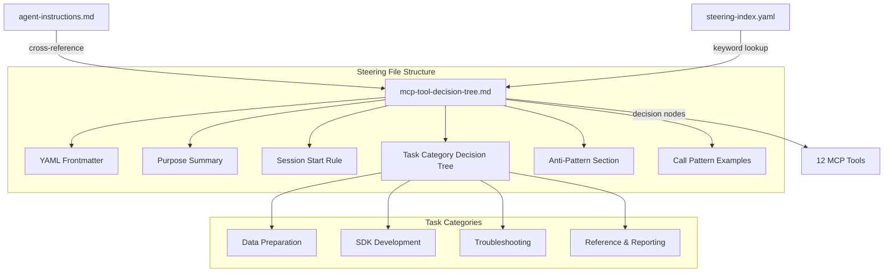

# Design Document: MCP Tool Decision Tree

## Overview

This feature adds a dedicated steering file (`senzing-bootcamp/steering/mcp-tool-decision-tree.md`) that provides structured decision logic for selecting the correct Senzing MCP tool based on the bootcamper's current task. The file is loaded on demand (`inclusion: manual`) and serves as the authoritative reference for tool selection, replacing the compressed one-liner in `agent-instructions.md` with a comprehensive, hierarchical decision tree.

The decision tree covers all 12 MCP tools, organizes them by task category, includes anti-pattern warnings with consequences, and provides concrete call-pattern examples. It integrates into the existing steering infrastructure via `steering-index.yaml` keyword registration and a cross-reference from `agent-instructions.md`.

### Design Rationale

The current tool selection guidance is scattered across `agent-instructions.md` (a one-liner mapping), `POWER.md` (tool list with examples), and `common-pitfalls.md` (anti-patterns in table form). This forces the agent to synthesize information from multiple sources when deciding which tool to call. A single, structured decision tree eliminates this synthesis step and reduces incorrect tool selection.

The decision tree format (question → branch → tool) was chosen over a flat lookup table because:

1. Many tasks map to the same tool with different parameters — branching captures this nuance
2. The hierarchical structure mirrors how the agent reasons about tasks (category first, then specifics)
3. It matches the existing `troubleshooting-decision-tree.md` convention, so the agent already knows how to consume this format

## Architecture

The feature touches three files in the `senzing-bootcamp/steering/` directory and requires no new infrastructure, scripts, or dependencies.



### File Dependency Map

| File | Role | Change Type |
|------|------|-------------|
| `mcp-tool-decision-tree.md` | New steering file | Create |
| `steering-index.yaml` | Keyword and metadata registry | Update (add `file_metadata` entry + keyword entries) |
| `agent-instructions.md` | Core agent rules | Update (add cross-reference directive in MCP Rules section) |

## Components and Interfaces

### Component 1: Decision Tree Steering File

**File:** `senzing-bootcamp/steering/mcp-tool-decision-tree.md`

**Structure:**

```text
---
inclusion: manual
---

# MCP Tool Decision Tree

[Purpose summary paragraph]

## Session Start
[get_capabilities directive]

## What Is the Bootcamper Trying to Do?
[Top-level decision tree with task category branches]

### Data Preparation
[Decision nodes for mapping_workflow, analyze_record, get_sample_data, download_resource]

### SDK Development
[Decision nodes for generate_scaffold, sdk_guide, get_sdk_reference, find_examples]

### Troubleshooting
[Decision nodes for explain_error_code, search_docs]

### Reference and Reporting
[Decision nodes for search_docs, reporting_guide, get_capabilities]

## Anti-Patterns: When NOT to Use
[Anti-pattern entries with consequences]

## Call Pattern Examples
[Code block examples for each of the 12 tools]
```

**Conventions (matching existing steering files):**

- YAML frontmatter with `inclusion: manual`
- H1 for file title, H2 for major sections, H3 for subsections
- ASCII tree diagrams using `├─→`, `└─→`, `│` (matching `troubleshooting-decision-tree.md`)
- Code blocks for call-pattern examples (matching `POWER.md` tool usage examples)
- Anti-pattern entries in a table format with "Instead" and "Consequence" columns (matching `common-pitfalls.md` style)

**Decision Tree Design:**

The top-level decision node asks "What is the bootcamper trying to do?" and branches into four task categories:

1. **Data Preparation** — Tasks involving data files, mapping, validation, and sample data
   - Mapping raw data to Senzing format → `mapping_workflow`
   - Validating mapped records → `analyze_record`
   - Getting sample datasets → `get_sample_data`
   - Downloading entity spec or analyzer script → `download_resource`

2. **SDK Development** — Tasks involving writing code that uses the Senzing SDK
   - Generating code scaffolds → `generate_scaffold`
   - Installing/configuring the SDK → `sdk_guide`
   - Looking up method signatures or flags → `get_sdk_reference`
   - Finding working code examples → `find_examples`

3. **Troubleshooting** — Tasks involving errors, failures, or unexpected behavior
   - Diagnosing a Senzing error code → `explain_error_code`
   - Searching docs for solutions → `search_docs`

4. **Reference and Reporting** — Tasks involving documentation lookup, reporting, or capability discovery
   - Searching documentation → `search_docs`
   - Getting reporting/visualization guidance → `reporting_guide`
   - Discovering available tools → `get_capabilities`

Each leaf node names the specific MCP tool and links to its call-pattern example section.

### Component 2: Steering Index Updates

**File:** `senzing-bootcamp/steering/steering-index.yaml`

Two updates required:

1. **`file_metadata` entry** — Add `mcp-tool-decision-tree.md` with `token_count` and `size_category`. The token count will be measured after the file is written (using `measure_steering.py`). Expected size category: `large` (estimated 2000–4000 tokens given the scope of 12 tools with examples and anti-patterns).

2. **`keywords` entries** — Add keyword mappings so the agent can discover the file:
   - `mcp tool` → `mcp-tool-decision-tree.md`
   - `tool selection` → `mcp-tool-decision-tree.md`
   - `which tool` → `mcp-tool-decision-tree.md`
   - `decision tree` → `mcp-tool-decision-tree.md`
   - `map data` → `mcp-tool-decision-tree.md`

### Component 3: Agent Instructions Cross-Reference

**File:** `senzing-bootcamp/steering/agent-instructions.md`

Add a single directive line in the MCP Rules section, after the existing one-liner tool mapping. The directive tells the agent to load the decision tree file when uncertain about tool selection, without duplicating any decision tree content.

The existing one-liner (`Attribute names → mapping_workflow | SDK code → generate_scaffold/sdk_guide | ...`) remains as a quick-reference summary. The new directive points to the decision tree as the detailed reference.

## Data Models

No new data models are introduced. The feature operates entirely within the existing steering file ecosystem:

- **Steering files**: Markdown with YAML frontmatter (existing format)
- **Steering index**: YAML with `file_metadata`, `keywords`, and `budget` sections (existing schema)
- **Agent instructions**: Markdown with `inclusion: always` frontmatter (existing format)

### Token Budget Impact

The new file adds to the total steering token budget tracked in `steering-index.yaml`. The current total is 92,318 tokens against a 200,000-token reference window. The estimated addition of 2,000–4,000 tokens keeps the total well below the 60% warn threshold (120,000 tokens).

If the file exceeds 5,000 tokens (the `split_threshold_tokens` policy), it must be reviewed for splitting per Requirement 8.4. The design targets staying under this threshold by keeping call-pattern examples concise and avoiding redundancy with existing files.

## Error Handling

This feature is pure content (Markdown and YAML). Error handling applies at the CI validation level:

| Error Scenario | Handling |
|---|---|
| Malformed YAML frontmatter | Caught by `validate_commonmark.py` in CI |
| Missing `inclusion` key in frontmatter | Caught by `validate_power.py` in CI |
| Token count mismatch in `steering-index.yaml` | Caught by `measure_steering.py --check` in CI |
| File referenced in index but missing from disk | Caught by `validate_power.py` in CI |
| Keywords pointing to nonexistent file | Caught by `validate_power.py` in CI |

No runtime error handling is needed — the agent loads steering files as static Markdown content.

## Testing Strategy

### Why Property-Based Testing Does Not Apply

This feature creates and modifies Markdown and YAML content files. There are no pure functions, parsers, serializers, or algorithmic logic to test with property-based testing. The "inputs" are static file contents, not a variable input space. PBT is not appropriate here.

### Validation Approach

The existing CI pipeline (`validate-power.yml`) already validates the structural integrity of steering files:

1. **`validate_power.py`** — Verifies all files referenced in `steering-index.yaml` exist on disk, frontmatter is valid, and cross-references resolve
2. **`measure_steering.py --check`** — Verifies `token_count` values in `steering-index.yaml` match actual file sizes
3. **`validate_commonmark.py`** — Verifies Markdown files are valid CommonMark

### Example-Based Tests

Add targeted tests in `senzing-bootcamp/tests/` to verify the decision tree file meets its structural requirements:

1. **All 12 tools covered** — Parse the decision tree file and verify each of the 12 MCP tool names appears at least once in a decision node context
2. **Anti-pattern entries present** — Verify the file contains anti-pattern entries for the six required scenarios (hand-coding mappings, guessing SDK names, relying on training data for signatures, skipping anti-pattern search, guessing error codes, fabricating sample data)
3. **Call-pattern examples present** — Verify each of the 12 tools has at least one code-block call-pattern example
4. **Frontmatter correct** — Verify the file has `inclusion: manual` in its YAML frontmatter
5. **Steering index consistency** — Verify `mcp-tool-decision-tree.md` appears in both `file_metadata` and `keywords` sections of `steering-index.yaml`
6. **Agent instructions cross-reference** — Verify `agent-instructions.md` contains a reference to `mcp-tool-decision-tree.md`
7. **Token budget compliance** — Verify the file's token count stays under the 5,000-token split threshold
