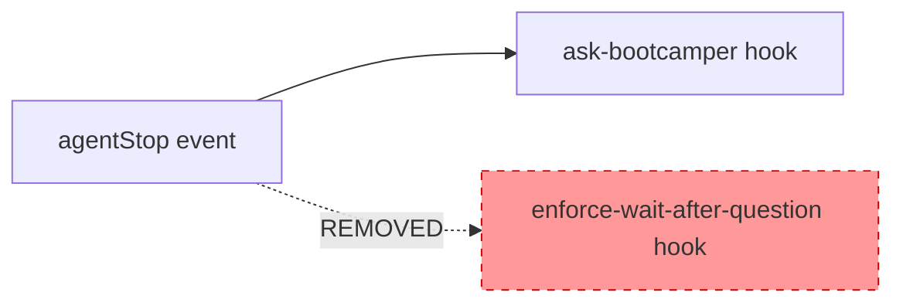

# Design Document

## Overview

This design covers the merge of two redundant `agentStop → askAgent` hooks into one. The `enforce-wait-after-question` hook's entire behavior — scanning for a pending 👉 question and suppressing output — is already implemented as the FIRST step of `ask-bootcamper`'s prompt. Running both hooks wastes a conversation-history scan with zero additional protection.

The merge is a **deletion + cleanup** operation, not a prompt rewrite. The `ask-bootcamper.kiro.hook` file is unchanged. The work consists of:

1. Deleting `enforce-wait-after-question.kiro.hook`
2. Removing its entry from `hook-categories.yaml`
3. Regenerating `hook-registry.md` via the existing sync script
4. Updating hardcoded hook counts in test files (19 → 18)
5. Verifying no steering files reference the deleted hook

### Redundancy Evidence

The `ask-bootcamper` prompt already contains all suppression logic from `enforce-wait-after-question`:

| Behavior | ask-bootcamper prompt | enforce-wait prompt |
|---|---|---|
| Scan conversation for 👉 | "scan the ENTIRE conversation history" | "Scan the full conversation history" |
| Suppress output when pending | "you MUST produce absolutely no output" | "produce no output at all — STOP immediately" |
| Block fabricated responses | "NEVER answer a 👉 question on the bootcamper's behalf" | "Do not answer the question for the bootcamper" |
| Detect any question (not just 👉) | "If the last assistant message asked ANY question (with or without 👉), produce no output" | Not covered |

The `ask-bootcamper` hook is actually **stricter** — it also suppresses output for non-👉 questions, which `enforce-wait-after-question` does not.

## Architecture

This is a file-level change with no architectural impact. The hook system's event dispatch is unchanged. The only structural change is reducing the `agentStop → askAgent` hook count from 2 to 1 (excluding `enforce-visualization-offers`, which is module-scoped).



### Affected Files

| File | Change | Reason |
|---|---|---|
| `senzing-bootcamp/hooks/enforce-wait-after-question.kiro.hook` | Delete | Redundant hook |
| `senzing-bootcamp/hooks/hook-categories.yaml` | Remove entry | Config references deleted hook |
| `senzing-bootcamp/steering/hook-registry.md` | Regenerate | Registry must reflect current hooks |
| `tests/test_hook_prompt_standards.py` | Update `EXPECTED_HOOK_COUNT` 19→18 | Hardcoded count |
| `senzing-bootcamp/tests/test_sync_hook_registry_unit.py` | Update count assertions 19→18 | Hardcoded counts |

### Files NOT Changed

| File | Reason |
|---|---|
| `senzing-bootcamp/hooks/ask-bootcamper.kiro.hook` | Already contains all suppression logic — no prompt changes needed |
| `senzing-bootcamp/steering/agent-instructions.md` | Does not reference `enforce-wait-after-question` by name (verified via grep) |
| `senzing-bootcamp/scripts/sync_hook_registry.py` | Script is generic — reads whatever hooks exist, no hardcoded hook names |
| `senzing-bootcamp/tests/test_silent_hook_processing.py` | Does not reference `enforce-wait-after-question` (verified via grep) |

## Components and Interfaces

No new components or interfaces are introduced. The existing components involved are:

### 1. Hook File System (`senzing-bootcamp/hooks/`)

The hooks directory contains `.kiro.hook` JSON files. After the merge, it will contain 18 files instead of 19. The `ask-bootcamper.kiro.hook` file is untouched.

### 2. Hook Categories Config (`hook-categories.yaml`)

The `critical` section currently lists 8 hook IDs including `enforce-wait-after-question`. After the merge, it will list 7 hook IDs. The `modules` section is unchanged.

**Before:**

```yaml
critical:
  - ask-bootcamper
  - capture-feedback
  - code-style-check
  - commonmark-validation
  - enforce-feedback-path
  - enforce-wait-after-question
  - enforce-working-directory
  - verify-senzing-facts
```

**After:**

```yaml
critical:
  - ask-bootcamper
  - capture-feedback
  - code-style-check
  - commonmark-validation
  - enforce-feedback-path
  - enforce-working-directory
  - verify-senzing-facts
```

### 3. Sync Script (`sync_hook_registry.py`)

The sync script discovers hooks dynamically via `glob("*.kiro.hook")` and reads categories from `hook-categories.yaml`. No code changes are needed — it will automatically pick up the reduced hook set when run with `--write`.

### 4. Test Suites

Two test files contain hardcoded hook counts that must be updated:

**`tests/test_hook_prompt_standards.py`:**
- `EXPECTED_HOOK_COUNT = 19` → `EXPECTED_HOOK_COUNT = 18`
- Several test docstrings reference "19" — update to "18"

**`senzing-bootcamp/tests/test_sync_hook_registry_unit.py`:**
- `test_all_18_hooks_parse_without_errors`: assertion `len(entries) == 19` → `len(entries) == 18`
- `test_load_real_categories`: assertion `len(mapping) == 19` → `len(mapping) == 18`

## Data Models

No data model changes. The `.kiro.hook` JSON schema, `hook-categories.yaml` structure, and `hook-registry.md` format are all unchanged. Only the number of entries decreases by one.

## Error Handling

No new error handling is needed. The existing error handling in `sync_hook_registry.py` (missing files, invalid JSON, missing categories) continues to work unchanged.

The primary risk is an incomplete update — forgetting to update a hardcoded count or leaving a stale reference. This is mitigated by:

1. **Sync script verify mode**: `sync_hook_registry.py --verify` exits non-zero if the on-disk registry doesn't match the generated output
2. **Test suite**: Tests assert exact hook counts, so any mismatch fails CI
3. **Grep verification**: A final grep for `enforce-wait-after-question` across the repo confirms no stale references remain

## Testing Strategy

### Why Property-Based Testing Does Not Apply

This feature is a **configuration cleanup** — deleting a file, editing a YAML config, regenerating a Markdown registry, and updating integer constants. There are no functions with varying inputs, no algorithmic logic, and no data transformations. The changes are deterministic and finite. PBT would add no value here.

### Test Approach: Example-Based Verification

The existing test infrastructure already covers the correctness of this merge comprehensively:

**1. Sync script verification (existing)**
- `sync_hook_registry.py --verify` confirms the on-disk registry matches what the script would generate from the current hook files and categories config
- This is the primary correctness check — if the registry is out of sync, CI fails

**2. Hook count assertions (updated)**
- `tests/test_hook_prompt_standards.py` — `EXPECTED_HOOK_COUNT` updated to 18
- `senzing-bootcamp/tests/test_sync_hook_registry_unit.py` — count assertions updated to 18
- These catch any accidental addition or incomplete deletion

**3. Registry sync tests (existing)**
- `TestRegistrySync` in `test_hook_prompt_standards.py` verifies every hook file has a registry entry and vice versa
- If the deleted hook's registry entry somehow persists, this test fails

**4. Category mapping tests (existing)**
- `TestCategoryMappingLoads` in `test_sync_hook_registry_unit.py` verifies the category config loads correctly and maps all hooks

**5. Manual verification step**
- Run `grep -r "enforce-wait-after-question"` across the repo (excluding `.kiro/specs/`) to confirm zero stale references

### Execution Order

1. Delete `enforce-wait-after-question.kiro.hook`
2. Remove entry from `hook-categories.yaml`
3. Run `sync_hook_registry.py --write` to regenerate `hook-registry.md`
4. Update `EXPECTED_HOOK_COUNT` in `tests/test_hook_prompt_standards.py` (19 → 18)
5. Update count assertions in `senzing-bootcamp/tests/test_sync_hook_registry_unit.py` (19 → 18)
6. Run `sync_hook_registry.py --verify` — expect exit code 0
7. Run `pytest tests/ senzing-bootcamp/tests/` — expect zero failures
8. Grep for stale references — expect none outside `.kiro/specs/`
