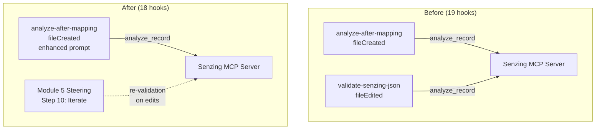

# Design Document: Merge Mapping Validation Hooks

## Overview

This feature merges two overlapping Module 5 hooks — `analyze-after-mapping` (fileCreated) and `validate-senzing-json` (fileEdited) — into a single enhanced hook. Both hooks target the same file patterns (`data/transformed/*.jsonl`, `data/transformed/*.json`) and both invoke the `analyze_record` MCP tool, but they trigger on different events. Since Kiro hooks support only one event type per hook, the strategy is:

1. **Keep** `analyze-after-mapping` (fileCreated) and enhance its prompt to also check Senzing Generic Entity Specification conformance
2. **Remove** `validate-senzing-json` (fileEdited) entirely
3. **Update** all references across the power: hook-categories.yaml, hook-registry.md, hooks README, install script, POWER.md, and test files

The fileEdited trigger becomes unnecessary because the Module 5 steering workflow already covers re-validation after edits in its iterate step (Step 10 of `module-05-phase2-data-mapping.md`). The net result is a reduction from 19 hooks to 18.

### Design Rationale

**Why keep `analyze-after-mapping` over `validate-senzing-json`?**

- `analyze-after-mapping` fires on fileCreated, which is the critical moment — when a new transformation output first appears. This is when validation matters most, before proceeding to Module 6 (loading).
- `validate-senzing-json` fires on fileEdited, which is a re-validation scenario already handled by the Module 5 steering workflow's iterate step.
- The fileCreated event is more targeted: it fires once per new file rather than on every edit, reducing noise.

**Why not combine both event types?**

Kiro hooks support only one `when.type` per hook definition. There is no way to specify both `fileCreated` and `fileEdited` in a single hook.

## Architecture

The change is a configuration-level refactoring with no new code components. The architecture remains unchanged — the hook system, MCP tool integration, and steering workflow all continue to function as before. The only structural change is the removal of one hook file and the enhancement of another hook's prompt.



### Affected Files

| File | Change Type | Reason |
|------|-------------|--------|
| `senzing-bootcamp/hooks/analyze-after-mapping.kiro.hook` | Modify prompt | Add Entity Spec conformance check |
| `senzing-bootcamp/hooks/validate-senzing-json.kiro.hook` | Delete | Redundant hook being removed |
| `senzing-bootcamp/hooks/hook-categories.yaml` | Remove entry | Config references deleted hook |
| `senzing-bootcamp/steering/hook-registry.md` | Regenerate | Registry must reflect current hooks |
| `senzing-bootcamp/hooks/README.md` | Update sections | Remove hook #4, renumber, update #8 description |
| `senzing-bootcamp/scripts/install_hooks.py` | Update HOOKS list | Remove entry, update description |
| `senzing-bootcamp/POWER.md` | Update hooks list | Remove `validate-senzing-json` from available hooks |
| `senzing-bootcamp/tests/test_silent_hook_processing.py` | Update `_NON_AFFECTED_HOOK_IDS` | Remove `validate-senzing-json` from list |
| `senzing-bootcamp/tests/test_sync_hook_registry_unit.py` | Update count assertions | 19 → 18 |
| `tests/test_hook_prompt_standards.py` | Update `EXPECTED_HOOK_COUNT` | 19 → 18 |

## Components and Interfaces

### Enhanced Hook Prompt

The `analyze-after-mapping.kiro.hook` prompt will be updated to combine both validation concerns:

**Current prompt:**
> "A new Senzing JSON file was created in data/transformed/. Before proceeding to loading (Module 6), use the analyze_record MCP tool to validate a sample of records from this file. Check feature distribution, attribute coverage, and data quality. Quality score should be >70% before loading."

**Enhanced prompt (adds Entity Spec conformance):**
> "A new Senzing JSON file was created in data/transformed/. Before proceeding to loading (Module 6), use the analyze_record MCP tool to validate a sample of records from this file. Check feature distribution, attribute coverage, and data quality. Quality score should be >70% before loading. Also verify that records conform to the Senzing Generic Entity Specification."

The enhanced prompt retains all existing instructions and appends the Entity Spec conformance check that was previously in `validate-senzing-json`.

### Hook File Structure (unchanged)

The hook JSON structure remains the same:

```json
{
  "name": "Analyze After Mapping",
  "version": "1.0.0",
  "description": "...",
  "when": {
    "type": "fileCreated",
    "patterns": ["data/transformed/*.jsonl", "data/transformed/*.json"]
  },
  "then": {
    "type": "askAgent",
    "prompt": "..."
  }
}
```

The `description` field will be updated to reflect the expanded scope: validation of both quality metrics and Entity Spec conformance.

### Hook Registry Update

The registry is generated by `sync_hook_registry.py` from the `.kiro.hook` files and `hook-categories.yaml`. After removing `validate-senzing-json` from both sources and updating `analyze-after-mapping`, running `sync_hook_registry.py --write` will regenerate a correct registry with 18 hooks.

### Hooks README Renumbering

The README currently numbers hooks 1–18. After removing hook #4 (`validate-senzing-json`), all subsequent hooks will be renumbered to maintain a sequential, gap-free list. Hook #8 (`analyze-after-mapping`) will get an updated description reflecting its enhanced scope.

### Install Script Update

The `HOOKS` list in `install_hooks.py` will have the `validate-senzing-json` tuple removed and the `analyze-after-mapping` tuple's description updated.

### Test File Updates

Three test files need count/reference updates:

1. **`tests/test_hook_prompt_standards.py`**: `EXPECTED_HOOK_COUNT = 19` → `18`
2. **`senzing-bootcamp/tests/test_sync_hook_registry_unit.py`**: Count assertion `19` → `18` in `test_all_18_hooks_parse_without_errors` and `test_load_real_categories`
3. **`senzing-bootcamp/tests/test_silent_hook_processing.py`**: Remove `"validate-senzing-json"` from `_NON_AFFECTED_HOOK_IDS` list

## Data Models

No new data models are introduced. The existing hook JSON schema, hook-categories YAML schema, and registry Markdown format are all unchanged. The only data change is the removal of one entry and the modification of another's prompt and description fields.

### Hook JSON Schema (existing, unchanged)

```json
{
  "name": "string",
  "version": "string",
  "description": "string",
  "when": {
    "type": "fileCreated | fileEdited | ...",
    "patterns": ["glob pattern"]
  },
  "then": {
    "type": "askAgent",
    "prompt": "string"
  }
}
```

### Hook Categories YAML Schema (existing, unchanged)

```yaml
critical:
  - hook-id
modules:
  5:
    - hook-id
  any:
    - hook-id
```

## Correctness Properties

*A property is a characteristic or behavior that should hold true across all valid executions of a system — essentially, a formal statement about what the system should do. Properties serve as the bridge between human-readable specifications and machine-verifiable correctness guarantees.*

### Property 1: Category preservation for non-removed hooks

*For any* hook ID that existed in `hook-categories.yaml` before the merge and is not `validate-senzing-json`, that hook ID SHALL still be present in the updated `hook-categories.yaml` with the same category (`critical` or `module`) and the same module number assignment.

**Validates: Requirements 3.3**

### Property 2: Registry entry preservation for non-removed hooks

*For any* hook ID that existed in `hook-registry.md` before the merge and is not `validate-senzing-json`, that hook's registry section (prompt text, id, name, description) SHALL be identical in the updated `hook-registry.md`.

**Validates: Requirements 4.3**

### Property 3: README hook numbering is sequential

*For any* pair of consecutive hook sections in the updated `hooks/README.md`, the section number SHALL increment by exactly 1, forming a contiguous sequence from 1 to N with no gaps.

**Validates: Requirements 5.4**

## Error Handling

This feature is a configuration-level refactoring with no runtime error paths. The primary risks are:

1. **Incomplete removal**: If `validate-senzing-json` references are left in any file, existing tests will catch the inconsistency:
   - `sync_hook_registry.py --verify` will fail if the registry doesn't match the hook files
   - `test_hook_prompt_standards.py` will fail if hook count doesn't match `EXPECTED_HOOK_COUNT`
   - `test_sync_hook_registry_unit.py` will fail on count mismatches

2. **Broken hook JSON**: If the enhanced `analyze-after-mapping.kiro.hook` has invalid JSON after editing, `test_hook_prompt_standards.py` will catch it in the JSON validation tests.

3. **Registry desync**: Running `sync_hook_registry.py --write` after all file changes ensures the registry is regenerated from the source-of-truth hook files. The `--verify` mode in CI catches any drift.

No new error handling code is needed. The existing test infrastructure provides comprehensive coverage for all failure modes.

## Testing Strategy

### Approach

This feature uses **example-based unit tests** for the majority of acceptance criteria (specific file content checks, absence checks, count updates) and **property-based tests** for the three preservation/consistency invariants identified in the Correctness Properties section.

### Property-Based Tests (Hypothesis)

Property-based testing applies to three invariants that hold across collections of hooks:

- **Property 1** (Category preservation): Generate random selections from the set of non-removed hook IDs and verify each retains its category assignment. Minimum 100 iterations.
- **Property 2** (Registry preservation): Generate random selections from the set of non-removed hook IDs and verify each retains its registry entry. Minimum 100 iterations.
- **Property 3** (Sequential numbering): Parse README section numbers and verify the contiguous sequence property. This is better tested as an example-based test since there's only one README, but the property formulation guides what to assert.

**Library**: Hypothesis (already used in the project)
**Configuration**: `@settings(max_examples=100)` per property test
**Tag format**: `Feature: merge-mapping-validation-hooks, Property {N}: {description}`

### Example-Based Unit Tests

| Test | Validates | What It Checks |
|------|-----------|----------------|
| Enhanced prompt contains analyze_record instruction | 1.1 | Prompt text |
| Enhanced prompt contains quality threshold >70% | 1.2 | Prompt text |
| Enhanced prompt contains Entity Spec conformance | 1.3 | Prompt text |
| Hook retains fileCreated event type and patterns | 1.4 | JSON structure |
| Hook retains askAgent action type | 1.5 | JSON structure |
| validate-senzing-json.kiro.hook does not exist | 2.1 | File absence |
| analyze-after-mapping.kiro.hook exists with enhanced prompt | 2.2 | File existence + content |
| hook-categories.yaml lists analyze-after-mapping under Module 5 | 3.1 | YAML content |
| hook-categories.yaml does not list validate-senzing-json | 3.2 | YAML content |
| hook-registry.md contains analyze-after-mapping with enhanced prompt | 4.1 | Registry content |
| hook-registry.md does not contain validate-senzing-json | 4.2 | Registry content |
| README has analyze-after-mapping section with enhanced description | 5.1 | Markdown content |
| README has no validate-senzing-json section | 5.2 | Markdown content |
| README Module 5 list includes analyze-after-mapping, excludes validate-senzing-json | 5.3 | Markdown content |
| install_hooks.py HOOKS list has analyze-after-mapping, no validate-senzing-json | 6.1, 6.2 | Python source |
| POWER.md hooks list includes analyze-after-mapping, excludes validate-senzing-json | 7.1, 7.2 | Markdown content |
| test_silent_hook_processing.py _NON_AFFECTED_HOOK_IDS updated | 8.1, 8.2 | Python source |
| EXPECTED_HOOK_COUNT updated to 18 | 8.3 | Python source |

### Integration Tests

| Test | Validates | What It Checks |
|------|-----------|----------------|
| `sync_hook_registry.py --verify` exits 0 | 4.4, 9.1 | Registry sync |
| `pytest` passes with no merge-related failures | 8.3, 9.2 | Full test suite |

### Execution Order

1. Make all file changes (enhance hook, delete hook, update configs, update docs, update tests)
2. Run `sync_hook_registry.py --write` to regenerate the registry
3. Run `sync_hook_registry.py --verify` to confirm registry matches
4. Run `pytest` to confirm all tests pass

