# Design: Merge Data Quality and Data Mapping Modules

## Overview

This design merges Module 4 (Data Quality Scoring) and Module 5 (Data Mapping) into a single "Data Quality & Mapping" module. The merged module becomes the new Module 4, and all subsequent modules (6–12) are renumbered down by one (becoming 5–11). The total module count drops from 13 (0–12) to 12 (0–11).

The merge eliminates the artificial boundary between quality assessment and data mapping. Module 4's quality scoring flows directly into Module 5's profiling/mapping workflow, with the quality gate (≥70%) preserved as an internal checkpoint rather than a module boundary.

### Key Design Decisions

1. **New Module 4 = Quality + Mapping combined**: The merged steering file covers quality assessment first, then transitions into the mapping workflow (profile → plan → map → generate) without a module break.
2. **Renumber 6→5, 7→6, 8→7, 9→8, 10→9, 11→10, 12→11**: All downstream modules shift down by one.
3. **Quality gate preserved inline**: The ≥70% threshold remains. If quality is below 70%, the user iterates on quality before proceeding to mapping steps within the same module. If ≥70%, the flow continues directly into mapping.
4. **Single steering file replaces two**: `module-04-data-quality.md` and `module-05-data-mapping.md` are replaced by a single `module-04-data-quality-mapping.md`.

## Architecture

The change is structural — it affects steering files, documentation, POWER.md, and cross-references. No runtime code, MCP tools, or scripts change behavior. The architecture remains the same progressive module system; only the module boundaries and numbering shift.

### Affected File Categories

```mermaid
graph TD
    A[Merge Module 4+5] --> B[Steering Files]
    A --> C[POWER.md]
    A --> D[Documentation]
    A --> E[Supporting Files]

    B --> B1[NEW: module-04-data-quality-mapping.md]
    B --> B2[DELETE: module-04-data-quality.md]
    B --> B3[DELETE: module-05-data-mapping.md]
    B --> B4[RENAME: module-06 through module-12]
    B --> B5[UPDATE: agent-instructions.md]
    B --> B6[UPDATE: module-prerequisites.md]
    B --> B7[UPDATE: module-transitions.md]
    B --> B8[UPDATE: onboarding-flow.md]
    B --> B9[UPDATE: session-resume.md]
    B --> B10[UPDATE: module-completion.md]
    B --> B11[UPDATE: steering-index.yaml]
    B --> B12[UPDATE: cloud-provider-setup.md]

    C --> C1[Module table 0-11]
    C --> C2[Steering file list]
    C --> C3[Quick Start paths]
    C --> C4[Bootcamp Modules table]
    C --> C5[Hook registry references]

    D --> D1[NEW: MODULE_4_DATA_QUALITY_AND_MAPPING.md]
    D --> D2[DELETE: MODULE_4_DATA_QUALITY_SCORING.md]
    D --> D3[DELETE: MODULE_5_DATA_MAPPING.md]
    D --> D4[RENAME: MODULE_6 through MODULE_12]
    D --> D5[UPDATE: diagrams/module-flow.md]
    D --> D6[UPDATE: diagrams/module-prerequisites.md]
    D --> D7[UPDATE: guides that reference module numbers]

    E --> E1[UPDATE: hooks referencing module numbers]
    E --> E2[UPDATE: scripts if they reference module numbers]
```

## Components and Interfaces

### 1. Merged Steering File: `module-04-data-quality-mapping.md`

This is the primary deliverable. It combines the workflows from both modules into a single continuous flow:

**Phase 1 — Quality Assessment** (from current Module 4):

- List agreed-upon data sources
- Request sample data
- Understand the Senzing Entity Specification
- Compare each data source with the Entity Specification
- Categorize each data source
- Assess data quality and apply thresholds
- Summarize findings and save evaluation report

**Quality Gate** (preserved, inline):

- ≥80%: proceed directly to mapping phase
- 70–79%: warn user, proceed if they accept
- <70%: strongly recommend fixing before mapping, iterate

**Phase 2 — Data Mapping** (from current Module 5):

- Start mapping workflow per data source
- Profile, plan, map, generate
- Build transformation program
- Test and validate
- Quality analysis post-mapping
- Save and document

The transition between phases is seamless — no banner, no journey map reset, no module boundary. The quality assessment results feed directly into the mapping decisions.

### 2. Steering File Renaming

| Current File | New File |
| --- | --- |
| `module-04-data-quality.md` | DELETED (merged into new file) |
| `module-05-data-mapping.md` | DELETED (merged into new file) |
| NEW | `module-04-data-quality-mapping.md` |
| `module-06-single-source.md` | `module-05-single-source.md` |
| `module-07-multi-source.md` | `module-06-multi-source.md` |
| `module-07-reference.md` | `module-06-reference.md` |
| `module-08-query-validation.md` | `module-07-query-validation.md` |
| `module-09-performance.md` | `module-08-performance.md` |
| `module-10-security.md` | `module-09-security.md` |
| `module-11-monitoring.md` | `module-10-monitoring.md` |
| `module-12-deployment.md` | `module-11-deployment.md` |

### 3. Documentation File Renaming

| Current File | New File |
| --- | --- |
| `MODULE_4_DATA_QUALITY_SCORING.md` | DELETED (merged into new file) |
| `MODULE_5_DATA_MAPPING.md` | DELETED (merged into new file) |
| NEW | `MODULE_4_DATA_QUALITY_AND_MAPPING.md` |
| `MODULE_6_SINGLE_SOURCE_LOADING.md` | `MODULE_5_SINGLE_SOURCE_LOADING.md` |
| `MODULE_7_MULTI_SOURCE_ORCHESTRATION.md` | `MODULE_6_MULTI_SOURCE_ORCHESTRATION.md` |
| `MODULE_8_QUERY_VALIDATION.md` | `MODULE_7_QUERY_VALIDATION.md` |
| `MODULE_9_PERFORMANCE_TESTING.md` | `MODULE_8_PERFORMANCE_TESTING.md` |
| `MODULE_10_SECURITY_HARDENING.md` | `MODULE_9_SECURITY_HARDENING.md` |
| `MODULE_11_MONITORING_OBSERVABILITY.md` | `MODULE_10_MONITORING_OBSERVABILITY.md` |
| `MODULE_12_DEPLOYMENT_PACKAGING.md` | `MODULE_11_DEPLOYMENT_PACKAGING.md` |

### 4. POWER.md Updates

The following sections in POWER.md require updates:

- **Overview**: "12-module curriculum (Modules 0-11)" instead of "13-module curriculum (Modules 0-12)"
- **Module table** (What This Bootcamp Does): Merge rows 4 and 5 into one row; renumber 6–12 → 5–11
- **Quick Start paths**: Update module numbers in all four paths (A, B, C, D)
- **Available Steering Files**: Update the module workflow list to reflect new filenames and numbers
- **Bootcamp Modules table**: Merge rows, renumber
- **Hook references**: Update module numbers in hook descriptions
- **All prose references**: Any mention of "Module 5", "Module 6", etc. shifts down by one for modules ≥5

### 5. Cross-Reference Updates

Files that contain module number references and need updating:

| File | What Changes |
| --- | --- |
| `steering/agent-instructions.md` | Module steering table (0→`module-00-sdk-setup.md` through 11→`module-11-deployment.md`), gate references |
| `steering/onboarding-flow.md` | Path definitions, validation gates table, hook registry module associations |
| `steering/session-resume.md` | References to Module 5 mapping checkpoints |
| `steering/module-prerequisites.md` | Prerequisites table, common blockers table |
| `steering/module-completion.md` | Path completion table (D completes after Module 11) |
| `steering/module-transitions.md` | No structural changes needed (uses generic "Module N") |
| `steering/steering-index.yaml` | Module number → filename mapping |
| `steering/cloud-provider-setup.md` | Gate reference (7→8 becomes 6→7) |
| `steering/visualization-guide.md` | Module 8 references become Module 7 |
| `docs/diagrams/module-flow.md` | All module boxes, paths, dependencies, outputs |
| `docs/diagrams/module-prerequisites.md` | Module dependency diagram |
| `docs/modules/README.md` | Module index |
| `docs/guides/QUICK_START.md` | Path module numbers |
| `docs/guides/PROGRESS_TRACKER.md` | Module tracking |
| `docs/guides/ONBOARDING_CHECKLIST.md` | Module references |
| `hooks/*.kiro.hook` | Hook descriptions referencing module numbers |
| `POWER.md` | Comprehensive updates as described above |

### 6. New Module Number Mapping

| Old Number | Old Name | New Number | New Name |
| --- | --- | --- | --- |
| 0 | SDK Setup | 0 | SDK Setup |
| 1 | Quick Demo | 1 | Quick Demo |
| 2 | Business Problem | 2 | Business Problem |
| 3 | Data Collection | 3 | Data Collection |
| 4 | Data Quality Scoring | 4 | Data Quality & Mapping |
| 5 | Data Mapping | *(merged into 4)* | — |
| 6 | Single Source Loading | 5 | Single Source Loading |
| 7 | Multi-Source Orchestration | 6 | Multi-Source Orchestration |
| 8 | Query, Visualize & Validate | 7 | Query, Visualize & Validate |
| 9 | Performance Testing | 8 | Performance Testing |
| 10 | Security Hardening | 9 | Security Hardening |
| 11 | Monitoring & Observability | 10 | Monitoring & Observability |
| 12 | Package & Deploy | 11 | Package & Deploy |

## Data Models

No data model changes. The `bootcamp_progress.json` schema remains the same — it stores module numbers, and existing bootcamp sessions will need their progress files updated if they are mid-bootcamp. The `mapping_state_[datasource].json` checkpoint format is unchanged.

**Migration consideration for in-progress bootcamps**: If a user has `bootcamp_progress.json` with completed modules using old numbering, the session-resume flow should handle this gracefully. The `validate_module.py` script may need awareness of the renumbering, but since it validates based on artifacts (not module numbers), it should work without changes.

## Error Handling

- **Backward compatibility**: If a user resumes a session with old module numbers in `bootcamp_progress.json`, the agent should recognize the old numbering and map it to the new scheme. This is handled by the session-resume steering file instructions, not by code.
- **Partial merge state**: If the implementation is done incrementally, ensure no state where Module 4 steering is deleted but the merged file doesn't exist yet. All file operations for the merge should be treated as atomic — create the new file before deleting the old ones.
- **Cross-reference consistency**: After all changes, run `python senzing-bootcamp/scripts/validate_power.py` to verify cross-reference integrity across the power.

## Testing Strategy

This feature is a documentation/configuration restructuring task. There are no pure functions, algorithms, or data transformations involved — the changes are to markdown files, YAML configuration, and cross-references. Property-based testing does not apply here.

**Appropriate testing approach:**

1. **Power validation script**: Run `python senzing-bootcamp/scripts/validate_power.py` after all changes to verify:
   - All steering files referenced in POWER.md exist
   - All steering files referenced in `steering-index.yaml` exist
   - All hook references are valid
   - No broken cross-references

2. **Manual review checklist**:
   - Verify the merged steering file contains all workflow steps from both Module 4 and Module 5
   - Verify the quality gate (≥70%) is preserved in the merged flow
   - Verify all module numbers in POWER.md are consistent (0–11)
   - Verify all four learning paths (A, B, C, D) reference correct new module numbers
   - Verify the prerequisites table forms a valid dependency chain
   - Verify the steering-index.yaml maps all 12 modules correctly
   - Grep for stale references to old module numbers ("Module 12", "module-12", "MODULE_12") — these should now be "Module 11", "module-11", "MODULE_11"
   - Grep for any remaining references to "Module 5" meaning "Data Mapping" (should now be part of Module 4) vs. "Module 5" meaning "Single Source Loading" (correct new usage)

3. **Smoke test**: Start a fresh bootcamp session and verify the onboarding flow presents the correct 12-module table and path definitions.
