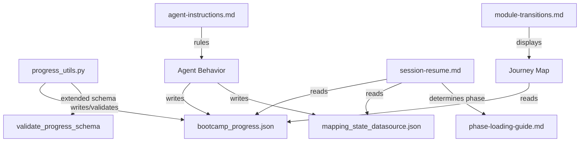

# Design Document: Mid-Module Session Persistence

## Overview

This feature extends the senzing-bootcamp progress tracking system to support sub-step granularity within modules. Currently, `current_step` in `config/bootcamp_progress.json` stores only an integer representing the last completed whole step. Long multi-part steps — particularly the mapping workflow in Module 5 — can span an entire session, and if a bootcamper stops mid-step, there is no record of their position within that step.

The design introduces three coordinated changes:

1. **Sub-step identifiers in `current_step`**: Extend `write_checkpoint` and `validate_progress_schema` in `progress_utils.py` to accept string sub-step identifiers (dotted notation like `"5.3"` or lettered notation like `"7a"`) alongside existing integer values.
2. **Mapping workflow checkpoints**: Formalize the pattern of writing `config/mapping_state_[datasource].json` after each mapping step (not just at workflow end), and integrate these checkpoints into session resume.
3. **Steering file updates**: Update `session-resume.md`, `agent-instructions.md`, `module-transitions.md`, and `phase-loading-guide.md` to detect, display, and resume from sub-step positions.

Backward compatibility is preserved: existing progress files with integer-only `current_step` values continue to work without modification.

## Architecture

The feature touches three layers of the system:



**Layer 1 — Data layer** (`progress_utils.py`): The `write_checkpoint` function signature changes from `step_number: int` to `step: int | str` to accept sub-step identifiers. The `validate_progress_schema` function is extended to accept string `current_step` and `last_completed_step` values that match recognized sub-step formats. Integer values continue to be written as integers (not coerced to strings).

**Layer 2 — Checkpoint layer** (mapping state files): The agent writes `config/mapping_state_[datasource].json` after each mapping step completion. This is an agent behavioral pattern documented in steering files, not a code change. The checkpoint schema is already defined in `module-05-phase3-test-load.md`.

**Layer 3 — Steering layer** (session-resume, agent-instructions, module-transitions, phase-loading-guide): These markdown files are updated to handle sub-step identifiers in display, resumption logic, and phase determination.

## Components and Interfaces

### 1. `progress_utils.py` — Extended Functions

#### `write_checkpoint(module_number: int, step: int | str, progress_path: str = "config/bootcamp_progress.json") -> None`

**Changes from current signature**: The `step_number: int` parameter is renamed to `step: int | str`.

- When `step` is an `int`, writes it as an integer in JSON (preserving current behavior).
- When `step` is a `str`, writes it as a string in JSON. The function does not validate the format — that is the validator's responsibility.
- Updates `step_history[str(module_number)]` with `last_completed_step` set to the `step` value (preserving its type) and `updated_at` set to the current ISO 8601 UTC timestamp.

**Design decision**: The function accepts any string without format validation. This keeps `write_checkpoint` simple and fast — validation is a separate concern handled by `validate_progress_schema`. Module steering files define which sub-step identifiers are valid for their context.

#### `validate_progress_schema(data: dict) -> list[str]`

**Changes from current implementation**: The validator currently rejects any non-integer, non-null `current_step`. The extended validator accepts strings that match recognized sub-step formats.

**Recognized sub-step formats**:
- Dotted notation: `<digits>.<digits>` (regex: `^\d+\.\d+$`) — e.g., `"5.3"`, `"12.1"`
- Lettered notation: `<digits><letter>` (regex: `^\d+[a-zA-Z]$`) — e.g., `"7a"`, `"3B"`

**Validation rules for `current_step`**:
- `None` → valid
- `int` → valid
- `str` matching dotted or lettered pattern → valid
- `str` not matching any pattern → error: descriptive message including the value and expected formats
- Any other type → error

**Validation rules for `step_history[key].last_completed_step`**:
- `int` → valid
- `str` matching dotted or lettered pattern → valid
- `str` not matching any pattern → error
- Any other type → error

#### `parse_parent_step(step: int | str | None) -> int | None`

**New helper function** that extracts the parent step number from a sub-step identifier:
- `None` → `None`
- `int` (e.g., `5`) → `5`
- Dotted string (e.g., `"5.3"`) → `5`
- Lettered string (e.g., `"7a"`) → `7`

This is used by steering file logic (phase-loading-guide) to determine which phase sub-file to load. It is a pure function with no side effects.

### 2. Mapping Checkpoint Schema

The mapping checkpoint file at `config/mapping_state_[datasource].json` uses the schema already defined in `module-05-phase3-test-load.md`:

```json
{
  "data_source": "CUSTOMERS",
  "source_file": "data/raw/customers.csv",
  "current_step": 3,
  "completed_steps": ["profile", "plan", "map"],
  "decisions": {
    "entity_type": "PERSON",
    "field_mappings": {"full_name": "NAME_FULL"}
  },
  "last_updated": "2026-04-14T10:30:00Z"
}
```

No code changes are needed for this schema — it is already in use. The design formalizes the behavioral rule that the agent writes this checkpoint after **every** mapping step, not only at workflow completion, and deletes it when the full mapping workflow completes.

### 3. Steering File Changes

#### `agent-instructions.md` — State & Progress Section

Add to the existing "State & Progress" section:
- Document that `current_step` accepts both integer values and string sub-step identifiers (dotted or lettered notation).
- Instruct the agent to write a sub-step checkpoint after completing each sub-step within a multi-part step.
- Instruct the agent to write a mapping checkpoint to `config/mapping_state_[datasource].json` after each `mapping_workflow` step, not only at workflow completion.

#### `session-resume.md` — Sub-Step Awareness

**Step 1**: Already scans for `config/mapping_state_*.json`. No change needed.

**Step 3 (summary display)**: When `current_step` is a sub-step identifier string, display it directly in the summary (e.g., "Step 5.3 of 26" or "Step 7a of 10"). When it is an integer, display the existing format.

**Step 4 (resume logic)**: When `current_step` is a sub-step identifier, instruct the agent to skip to the next sub-step after the recorded position (not the next whole step). If the sub-step is not found in the module steering file, log a warning and fall back to resuming at the parent step number.

**Mapping checkpoint handling**: When mapping checkpoints exist and the bootcamper chooses to continue, instruct the agent to restart `mapping_workflow` and fast-track through completed mapping steps before resuming from the first incomplete step. If a checkpoint file contains invalid JSON or missing required fields, log a warning, skip it, and inform the bootcamper.

#### `module-transitions.md` — Journey Map Display

Update the step-level detail rule: when `current_step` is a sub-step identifier, display it in the status column (e.g., `🔄 Current — Step 5.3/26`). When it is an integer, preserve the existing format (`🔄 Current — Step 5/26`).

#### `phase-loading-guide.md` — Sub-Step Phase Determination

When `current_step` is a sub-step identifier, use the parent step number (extracted via `parse_parent_step`) to determine which phase sub-file to load. The sub-step suffix does not affect phase selection — only the parent step number matters for `step_range` matching.

## Data Models

### Extended Progress File Schema

```json
{
  "modules_completed": [1, 2, 3, 4],
  "current_module": 5,
  "current_step": "5.3",
  "step_history": {
    "5": {
      "last_completed_step": "5.3",
      "updated_at": "2026-06-15T14:30:00+00:00"
    }
  },
  "data_sources": ["CUSTOMERS"],
  "database_type": "sqlite"
}
```

**Type rules for `current_step`**:
| Value | JSON Type | Example |
|-------|-----------|---------|
| Whole step | integer | `5` |
| Dotted sub-step | string | `"5.3"` |
| Lettered sub-step | string | `"7a"` |
| Module complete | null | `null` |
| Not yet tracked | absent | (key missing) |

**Type rules for `last_completed_step`**: Same as `current_step` except `null` and absent are not valid (a step_history entry always has a completed step).

### Sub-Step Identifier Format

```
Dotted:   <digits>.<digits>     e.g., "5.3", "12.1", "1.15"
Lettered: <digits><letter>      e.g., "7a", "3B", "11c"
Integer:  <digits>              e.g., 5, 12 (JSON integer type)
```

Regex patterns:
- Dotted: `^\d+\.\d+$`
- Lettered: `^\d+[a-zA-Z]$`

### Mapping Checkpoint Schema (unchanged)

```json
{
  "data_source": "<string>",
  "source_file": "<string>",
  "current_step": "<int>",
  "completed_steps": ["<string>", ...],
  "decisions": { ... },
  "last_updated": "<ISO 8601 string>"
}
```

## Correctness Properties

*A property is a characteristic or behavior that should hold true across all valid executions of a system — essentially, a formal statement about what the system should do. Properties serve as the bridge between human-readable specifications and machine-verifiable correctness guarantees.*

### Property 1: Checkpoint Round-Trip Preserves Type and Value

*For any* valid (module_number, step) pair where step is an integer, a dotted sub-step string, or a lettered sub-step string, calling `write_checkpoint` and then reading the progress file back SHALL produce a `current_step` value that is identical in both type and value to the written step, a `step_history[module].last_completed_step` that matches the written step, and a `step_history[module].updated_at` that is a valid ISO 8601 datetime string.

**Validates: Requirements 1.1, 1.2, 1.3, 1.4, 10.1, 10.2, 10.3, 10.4**

### Property 2: Valid Sub-Step Identifiers Pass Schema Validation

*For any* `current_step` value that is an integer, `None`, a string matching dotted notation (`<digits>.<digits>`), or a string matching lettered notation (`<digits><letter>`), `validate_progress_schema` SHALL return zero errors for a progress file containing that value. The same rule applies to `step_history[module].last_completed_step` values.

**Validates: Requirements 2.1, 2.2, 2.4, 9.1, 9.2**

### Property 3: Invalid Current-Step Values Fail Validation

*For any* `current_step` value that is a string not matching any recognized sub-step format (empty strings, strings with no leading digits, strings with special characters, multi-letter suffixes), `validate_progress_schema` SHALL return at least one error containing a descriptive message.

**Validates: Requirements 2.3, 9.3**

### Property 4: Backward Compatibility — Legacy Integer-Only Progress Files

*For any* progress file containing only integer `current_step` values (or null), integer `last_completed_step` values in `step_history`, and no sub-step identifier strings, `validate_progress_schema` SHALL return zero errors. Additionally, `write_checkpoint` called with an integer step SHALL produce a progress file that passes `validate_progress_schema` with zero errors.

**Validates: Requirements 2.5, 8.1, 8.3, 11.1, 11.2, 11.3**

## Error Handling

### Invalid Sub-Step Identifier in Progress File

When `validate_progress_schema` encounters a string `current_step` that does not match any recognized format, it returns a descriptive error message including the actual value and the expected formats. This allows tooling (e.g., `validate_module.py`) to report the issue clearly.

### Corrupted Mapping Checkpoint

When `session-resume.md` instructs the agent to read `config/mapping_state_*.json` files, any file containing invalid JSON or missing required fields (`data_source`, `current_step`, `completed_steps`) is skipped with a warning. The agent informs the bootcamper that the mapping for that data source will need to restart from the beginning.

### Sub-Step Not Found in Module Steering File

When `current_step` is a sub-step identifier that references a position not found in the module steering file (e.g., the module was restructured), the agent logs a warning and falls back to resuming at the parent step number extracted via `parse_parent_step`.

### Phase Loading with Sub-Step Identifiers

When `current_step` is a sub-step identifier, `phase-loading-guide.md` uses the parent step number for phase determination. If the parent step number does not fall within any phase's `step_range`, the root file is loaded (matching existing fallback behavior).

## Testing Strategy

### Property-Based Tests (Hypothesis)

Property-based testing is appropriate for this feature because the core changes involve pure functions (`write_checkpoint`, `validate_progress_schema`, `parse_parent_step`) with clear input/output behavior and a large input space (arbitrary sub-step identifier strings, module numbers, step values).

**Library**: Hypothesis (already used in the project)
**Configuration**: `@settings(max_examples=100)` per property test
**Tag format**: `Feature: mid-module-session-persistence, Property {N}: {title}`

**Test files**:

| File | Properties Covered |
|------|--------------------|
| `senzing-bootcamp/tests/test_sub_step_validation_properties.py` | Property 2 (valid identifiers pass), Property 3 (invalid identifiers fail) |
| `senzing-bootcamp/tests/test_sub_step_checkpoint_properties.py` | Property 1 (checkpoint round-trip) |
| `senzing-bootcamp/tests/test_sub_step_backward_compat_properties.py` | Property 4 (backward compatibility) |

**Hypothesis strategies**:

- `st_valid_sub_step()`: Generates valid sub-step identifiers — integers (1–30), dotted strings (`"<1-12>.<1-20>"`), and lettered strings (`"<1-12><a-z>"`)
- `st_invalid_current_step()`: Generates invalid `current_step` values — empty strings, strings with no digits, strings with special characters, negative numbers, nested objects, multi-letter suffixes
- `st_legacy_progress()`: Generates legacy progress dicts with integer-only `current_step` and `last_completed_step` values
- `st_module_step_pair()`: Generates `(module_number, step)` tuples where step is int, dotted string, or lettered string

### Unit Tests

Unit tests complement property tests by covering specific examples and integration points:

- `write_checkpoint` with each step type (int, dotted string, lettered string) — verify file contents
- `write_checkpoint` preserves existing progress file fields
- `validate_progress_schema` with specific valid and invalid examples
- `parse_parent_step` with each input type
- `clear_step` still works after sub-step checkpoint
- Steering file content verification (agent-instructions, session-resume, module-transitions, phase-loading-guide contain expected sub-step documentation)

### Integration Tests

- End-to-end: write sub-step checkpoint → validate → read back → verify
- Steering file cross-references: verify that all steering files referencing sub-step behavior are consistent with each other
