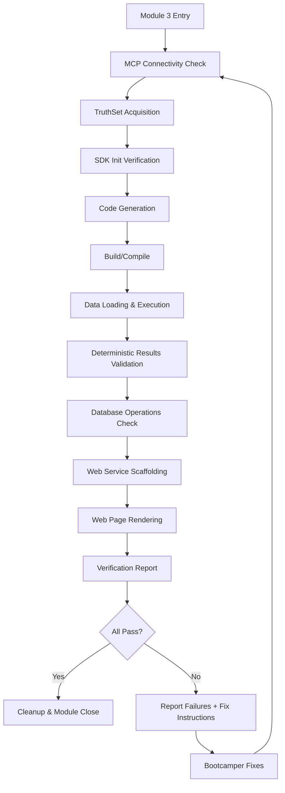

# Design Document: Module 03 — System Verification

## Overview

This feature redesigns Module 3 from "Quick Demo" to "System Verification." The module serves as a deterministic gate that confirms the bootcamper's entire development environment works end-to-end — SDK initialization, code generation, compilation, execution, data loading, entity resolution, web service scaffolding, and web page rendering — before proceeding to real work in subsequent modules.

The module always uses the Senzing TruthSet (a deterministic dataset with known-good expected outputs) so that verification checks can validate specific, predictable results rather than merely confirming "something happened."

### Design Rationale

The current Module 3 ("Quick Demo") lets the bootcamper choose a CORD dataset and focuses on an "aha moment." This creates two problems:

1. **Non-deterministic validation** — different datasets produce different results, making it impossible to check for specific expected outcomes.
2. **Missing verification coverage** — no compilation check, no web service test, no database operations validation.

By switching to TruthSet and adding structured verification steps, Module 3 becomes a reliable gate: if it passes, the bootcamper's system is confirmed ready for all subsequent modules.

## Architecture

The module is implemented as a single steering file that orchestrates MCP tool calls and script execution in a sequential pipeline. No new Python scripts or runtime code is shipped — all verification code is generated dynamically by the MCP server's `generate_scaffold` tool in the bootcamper's chosen language.



### File Layout

All verification artifacts are generated into a dedicated directory:

```text
src/system_verification/
├── verify_init.[ext]           # SDK initialization script
├── verify_pipeline.[ext]       # Full pipeline (load + resolve + query)
├── truthset_data.jsonl         # TruthSet data file
└── web_service/
    ├── server.[ext]            # Web service entry point
    ├── routes.[ext]            # HTTP endpoint handlers
    └── static/
        └── index.html          # Entity resolution results page
```

Where `[ext]` is the language-appropriate file extension (`.py`, `.java`, `.cs`, `.rs`, `.ts`).

## Components and Interfaces

### Component 1: Steering File — `module-03-system-verification.md`

**File:** `senzing-bootcamp/steering/module-03-system-verification.md`

**Replaces:** `senzing-bootcamp/steering/module-03-quick-demo.md`

**Structure:**

The steering file follows the established module pattern (YAML frontmatter, prerequisites, phases with checkpoints, error handling, success criteria, agent rules). It defines two phases:

- **Phase 1: Verification Pipeline** — Steps 1–9 execute the sequential verification checks
- **Phase 2: Report & Close** — Step 10 generates the report, Step 11 handles cleanup, Step 12 closes the module

Each step maps to one or more requirements:

| Step | Verification | Requirements | MCP Tools Used |
|------|-------------|--------------|----------------|
| 1 | MCP Connectivity | 12 | `search_docs` |
| 2 | TruthSet Acquisition | 1 | `get_sample_data` |
| 3 | SDK Initialization | 2 | `generate_scaffold(workflow='initialize')` |
| 4 | Code Generation | 3 | `generate_scaffold(workflow='full_pipeline')` |
| 5 | Build/Compile | 4 | — (shell commands) |
| 6 | Data Loading | 5 | — (execute generated script) |
| 7 | Results Validation | 6 | — (query via generated script) |
| 8 | Database Operations | 9 | — (query via generated script) |
| 9 | Web Service + Page | 7, 8 | `generate_scaffold(workflow='web_service')` |
| 10 | Report Generation | 10 | — |
| 11 | Cleanup | 13 | — |
| 12 | Module Close | 11 | — |

### Component 2: Module Documentation — `MODULE_3_SYSTEM_VERIFICATION.md`

**File:** `senzing-bootcamp/docs/modules/MODULE_3_SYSTEM_VERIFICATION.md`

**Replaces:** `senzing-bootcamp/docs/modules/MODULE_3_QUICK_DEMO.md` (if it exists)

User-facing companion documentation explaining what Module 3 does, why TruthSet is used, and what each verification step confirms.

### Component 3: Module Dependencies Update

**File:** `senzing-bootcamp/config/module-dependencies.yaml`

Update Module 3's entry:

```yaml
3:
  name: "System Verification"
  requires: [2]
  skip_if: "Already familiar with Senzing and system verified"
```

Update the gate condition:

```yaml
"3->4":
  requires:
    - "System verification passed or skipped"
```

### Component 4: Onboarding Flow References

**File:** `senzing-bootcamp/steering/onboarding-flow.md`

Update references from "Quick Demo" to "System Verification" in:
- Track definitions (Step 5)
- Gate conditions table
- Any mentions of Module 3 by name

### Component 5: Steering Index Update

**File:** `senzing-bootcamp/steering/steering-index.yaml`

Replace the `module-03-quick-demo.md` entry with `module-03-system-verification.md` and update the description and token budget.

## Data Models

### TruthSet Expected Results

The verification relies on known-good outcomes from the TruthSet. These are retrieved from the MCP server at runtime (not hardcoded) to stay current with TruthSet updates. The expected results include:

- **Expected record count** — total records in the TruthSet download
- **Expected entity count range** — min/max resolved entities (±5% tolerance)
- **Known match pairs** — at least 3 specific record pairs that must resolve to the same entity
- **Known entity attributes** — specific name/address values for search validation

### Verification Report Schema

The report is persisted to `config/bootcamp_progress.json` under a `module_3_verification` key:

```json
{
  "module_3_verification": {
    "timestamp": "2026-05-13T10:30:00Z",
    "status": "passed",
    "checks": {
      "mcp_connectivity": {"status": "passed", "duration_ms": 450},
      "truthset_acquisition": {"status": "passed", "records": 200},
      "sdk_initialization": {"status": "passed", "duration_ms": 1200},
      "code_generation": {"status": "passed", "file": "verify_pipeline.py"},
      "build_compilation": {"status": "passed", "duration_ms": 800},
      "data_loading": {"status": "passed", "records_loaded": 200},
      "results_validation": {"status": "passed", "entities": 145, "matches_verified": 3},
      "database_operations": {"status": "passed", "ops_tested": ["write", "read", "search"]},
      "web_service": {"status": "passed", "port": 8080},
      "web_page": {"status": "passed", "url": "http://localhost:8080/"}
    },
    "fix_instructions": []
  }
}
```

## Correctness Properties

### Property 1: TruthSet is always used — no dataset choice offered

*For any* execution of Module 3, the steering file SHALL NOT present a dataset selection prompt to the bootcamper. The TruthSet SHALL be the only dataset used.

**Validates: Requirements 1.1, 1.2**

### Property 2: All verification checks execute regardless of individual failures

*For any* execution of Module 3 where at least one verification check fails, all subsequent checks SHALL still execute (no short-circuit), and the Verification Report SHALL include the status of every check.

**Validates: Requirements 6.5, 10.1, 10.6**

### Property 3: Verification artifacts are isolated in `src/system_verification/`

*For any* file created by Module 3, the file path SHALL begin with `src/system_verification/` (relative to project root). No verification artifacts SHALL be written outside this directory.

**Validates: Requirements 13.1**

### Property 4: Database is clean after successful verification

*For any* successful completion of Module 3, the Senzing database SHALL contain zero TruthSet records after cleanup. The entity count from TruthSet data sources SHALL be zero.

**Validates: Requirements 13.5**

### Property 5: Build commands match chosen language

*For any* execution of Module 3, the Build_Step command used SHALL correspond to the bootcamper's Chosen_Language as defined in the language-to-build mapping. No cross-language build commands SHALL be executed.

**Validates: Requirements 4.1, 4.4**

## Error Handling

### Verification Step Failures

Each verification step follows the same error pattern:

1. Execute the check with a defined timeout (10s for connectivity, 30s for SDK init, 120s for build/load)
2. On success: record pass status, proceed to next step
3. On failure: record fail status with error details, call `explain_error_code` for SENZ codes, generate Fix_Instruction, continue to next step (no short-circuit)
4. On timeout: terminate the process, record fail with timeout message

### Re-run Capability

The module supports re-running from the beginning after fixes. The steering file checks for existing `src/system_verification/` artifacts and overwrites them on re-run. The database cleanup step (Requirement 13) ensures a clean slate.

### Graceful Degradation

If the web service fails to start (port conflict), the module reports the failure but does not block the remaining checks. The bootcamper can fix the port issue and re-run.

## Testing Strategy

### Property-Based Tests (Hypothesis)

**Test file:** `senzing-bootcamp/tests/test_system_verification_properties.py`

Property tests validate the steering file content and structural invariants:

| Property | What It Checks |
|----------|---------------|
| P1: No dataset choice | Steering file contains no dataset selection prompt or CORD/Las Vegas/London/Moscow choice |
| P2: All checks listed in report schema | Every check name in the steering file appears in the report schema |
| P3: Artifact paths isolated | All file paths in the steering file under `src/system_verification/` |
| P4: Timeouts defined | Every verification step has an explicit timeout value |
| P5: Build commands per language | Build command table covers all 5 supported languages |

### Unit Tests (Example-Based)

**Test file:** `senzing-bootcamp/tests/test_system_verification_unit.py`

| Test | Validates | What It Checks |
|------|-----------|----------------|
| `test_steering_file_uses_truthset_only` | 1.1 | No dataset choice in steering file |
| `test_steering_file_has_all_verification_steps` | 10.2 | All 8 check types present |
| `test_module_dependencies_updated` | 11.1 | Module 3 name is "System Verification" |
| `test_gate_condition_updated` | 11.2, 11.5 | Gate 3→4 references system verification |
| `test_steering_file_has_web_service_step` | 7.1 | Web service generation step exists |
| `test_steering_file_has_cleanup_step` | 13.4, 13.5 | Cleanup and purge instructions present |
| `test_steering_file_references_module_completion` | 11.4 | Module close references `module-completion.md` |
| `test_onboarding_flow_references_updated` | 11.1 | Onboarding flow uses "System Verification" name |
| `test_build_commands_for_all_languages` | 4.1, 4.4 | Build table has entries for Python, Java, C#, Rust, TypeScript |
| `test_verification_report_schema` | 10.5 | Report JSON schema matches expected structure |

### Integration Tests

Runtime behaviors (actual MCP calls, script execution, web service startup) cannot be tested from file content alone. These require manual testing during bootcamp execution:

- MCP connectivity check with real server
- TruthSet download and validation
- Generated code compilation in each language
- Web service port binding and HTTP response
- Database purge after completion

### Test Organization

```python
# senzing-bootcamp/tests/test_system_verification_properties.py

class TestSystemVerificationProperties:
    """Property-based tests for steering file structural invariants."""
    # P1: No dataset choice offered
    # P2: All checks in report schema
    # P3: Artifact paths isolated
    # P4: Timeouts defined
    # P5: Build commands per language

# senzing-bootcamp/tests/test_system_verification_unit.py

class TestSystemVerificationUnit:
    """Example-based tests for specific file requirements."""
    # Individual checks per acceptance criteria
```

## Migration Plan

The transition from "Quick Demo" to "System Verification" requires:

1. **Rename steering file**: `module-03-quick-demo.md` → `module-03-system-verification.md` (new content)
2. **Update module-dependencies.yaml**: Change name from "Quick Demo" to "System Verification"
3. **Update onboarding-flow.md**: Replace "Quick Demo" references with "System Verification"
4. **Update steering-index.yaml**: Replace entry
5. **Update docs/modules/**: Create `MODULE_3_SYSTEM_VERIFICATION.md`, remove or redirect `MODULE_3_QUICK_DEMO.md`
6. **Update visualization-protocol.md**: Update Module 3 checkpoint context from "demo results" to "verification results"
7. **Retain backward compatibility**: The `skip_if` condition changes from "Already familiar with Senzing" to "Already familiar with Senzing and system verified" — existing progress files with Module 3 marked complete remain valid.
