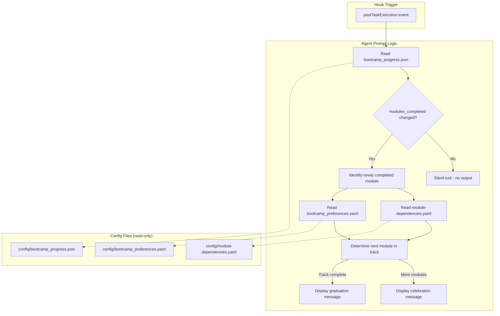

# Design Document: Module Completion Celebration

## Overview

This feature adds a `postTaskExecution` hook (`module-completion-celebration.kiro.hook`) that detects module completion boundaries and delivers a brief celebration message with next-step guidance. The hook reads progress state from `config/bootcamp_progress.json`, identifies newly completed modules, and instructs the agent to display a congratulatory banner, a one-sentence summary of accomplishments, and the next module in the bootcamper's track. It complements (but does not replace) the existing manual `module-completion.md` steering workflow.

The hook is registered in the `any` category of `hook-categories.yaml` since it applies to all modules regardless of track.

### Design Decisions

1. **Single hook file with prompt-driven logic** — All detection and message formatting is handled by the agent prompt, not by external scripts. This keeps the hook lightweight and avoids file-system writes.

2. **Silent exit on non-boundary tasks** — The prompt explicitly instructs the agent to produce no output when `modules_completed` hasn't changed, ensuring zero noise during normal step progression.

3. **Three-file read limit** — The prompt restricts the agent to reading at most `config/bootcamp_progress.json`, `config/module-dependencies.yaml`, and `config/bootcamp_preferences.yaml`. No file scanning or writing.

4. **Separation from full completion workflow** — The hook provides only a brief celebration and next-step offer. Journal entries, certificates, and reflection questions remain in `module-completion.md` (manual inclusion).

## Architecture



## Components and Interfaces

### Hook File: `senzing-bootcamp/hooks/module-completion-celebration.kiro.hook`

A JSON file conforming to the standard hook schema:

```json
{
  "name": "Module Completion Celebration",
  "version": "1.0.0",
  "description": "Detects module completion boundaries and displays a brief celebration with next-step guidance.",
  "when": {
    "type": "postTaskExecution"
  },
  "then": {
    "type": "askAgent",
    "prompt": "<celebration prompt text>"
  }
}
```

The prompt instructs the agent to:

1. Read `config/bootcamp_progress.json` and check `modules_completed`.
2. If no new module was added since the last check, produce no output (silent exit).
3. If a new module appears, read `config/module-dependencies.yaml` for the module name.
4. Read `config/bootcamp_preferences.yaml` for the bootcamper's track.
5. Display a celebration banner with module number and name.
6. Provide a one-sentence summary of what was built.
7. If more modules remain in the track, show the next module and offer to begin it.
8. If the track is complete, display a graduation acknowledgment.
9. Mention that the bootcamper can say "completion" or "journal" for the full workflow.

### Hook Categories Registration

Add `module-completion-celebration` to the `any` list in `senzing-bootcamp/hooks/hook-categories.yaml`:

```yaml
  any:
    - backup-project-on-request
    - git-commit-reminder
    - module-completion-celebration
```

## Data Models

### Progress File Structure (`config/bootcamp_progress.json`)

```python
@dataclass
class BootcampProgress:
    current_module: int | None       # Currently active module number
    current_step: int | None         # Current step within module (null at boundary)
    modules_completed: list[int]     # List of completed module numbers
    step_history: list[dict]         # History of completed steps
```

### Module Dependencies Structure (`config/module-dependencies.yaml`)

```python
@dataclass
class ModuleInfo:
    name: str                        # Human-readable module name
    requires: list[int]              # Prerequisite module numbers
    skip_if: str | None              # Skip condition description

@dataclass
class TrackInfo:
    name: str                        # Track display name
    description: str                 # Track description
    modules: list[int]               # Ordered list of module numbers in track
    recommendation: str              # "recommended", "neutral", "not_recommended"
```

### Bootcamp Preferences Structure (`config/bootcamp_preferences.yaml`)

```python
@dataclass
class BootcampPreferences:
    language: str                    # Chosen programming language
    track: str                       # Selected track key (e.g., "core_bootcamp")
    # ... other preference fields
```

### Hook File Schema

```python
@dataclass
class HookFile:
    name: str                        # "Module Completion Celebration"
    version: str                     # Semantic version "1.0.0"
    description: str                 # Hook purpose description
    when: WhenClause                 # Trigger configuration
    then: ThenClause                 # Action configuration

@dataclass
class WhenClause:
    type: str                        # "postTaskExecution"

@dataclass
class ThenClause:
    type: str                        # "askAgent"
    prompt: str                      # Agent instruction prompt
```

## Correctness Properties

*A property is a characteristic or behavior that should hold true across all valid executions of a system — essentially, a formal statement about what the system should do. Properties serve as the bridge between human-readable specifications and machine-verifiable correctness guarantees.*

### Property 1: Required fields validation

*For any* subset of the required hook fields (`name`, `version`, `description`, `when.type`, `then.type`, `then.prompt`) present in a hook dict, the structural validator SHALL report exactly the set of missing fields — no false positives and no false negatives.

**Validates: Requirements 1.2**

### Property 2: Semantic version format validation

*For any* randomly generated string, the version validator SHALL accept it if and only if it matches the pattern `<digits>.<digits>.<digits>` where each component is a non-negative integer without leading zeros (except the single digit `0`).

**Validates: Requirements 1.5**

### Property 3: Silent-processing detection

*For any* prompt string, the silent-processing detector SHALL return true if and only if the string contains at least one recognized silent-processing phrase (e.g., "produce no output", "do nothing", "silent exit").

**Validates: Requirements 5.1, 2.2**

### Property 4: Category uniqueness

*For any* hook identifier present in `hook-categories.yaml`, that identifier SHALL appear in exactly one category — never duplicated across multiple categories.

**Validates: Requirements 6.3**

## Error Handling

- **Missing progress file**: The prompt instructs the agent to produce no output if `config/bootcamp_progress.json` does not exist (silent exit — the bootcamper hasn't started yet).
- **Missing preferences file**: If `config/bootcamp_preferences.yaml` is absent, the prompt instructs the agent to skip track-specific next-module logic and simply acknowledge the completion without next-step guidance.
- **Invalid JSON in progress file**: The agent naturally handles parse errors by reporting them; the hook does not add custom error handling beyond the agent's default behavior.
- **Module not found in dependencies**: If the completed module number doesn't appear in `config/module-dependencies.yaml`, the prompt instructs the agent to use a generic "Module N" label rather than failing.

## Testing Strategy

### Unit Tests (Example-Based)

Example-based tests verify concrete content requirements of the hook file:

- **Hook file structure** (Req 1): Verify the file exists, parses as valid JSON, contains all required fields, uses correct `when.type` and `then.type` values.
- **Prompt content — boundary detection** (Req 2): Verify the prompt references `bootcamp_progress.json`, `modules_completed`, and contains silent-exit instructions.
- **Prompt content — celebration message** (Req 3): Verify the prompt contains banner instructions, summary instructions, and references `module-dependencies.yaml` for module names.
- **Prompt content — next module** (Req 4): Verify the prompt contains next-module display, offer-to-begin, graduation handling, and references both config files for track determination.
- **Prompt content — lightweight execution** (Req 5): Verify the prompt does NOT contain file-writing, script-running, or scanning instructions. Verify it references only the three allowed config files.
- **Categories registration** (Req 6): Verify `module-completion-celebration` appears in the `any` category and in exactly one category.
- **Coexistence** (Req 7): Verify the prompt does NOT reference `module-completion.md` for loading, does contain "completion" and "journal" trigger words, and does NOT contain journal/certificate/reflection instructions.

### Property-Based Tests (Hypothesis)

- **Library**: Hypothesis with `@settings(max_examples=100)`
- **Tag format**: `Feature: module-completion-celebration, Property {N}: {title}`

Property tests validate the correctness of validation functions used to verify hook structure:

1. **Required fields validation** (Property 1): Generate random subsets of required fields, build hook dicts, verify the validator reports exactly the missing fields.
2. **Semantic version format validation** (Property 2): Generate random strings (mix of valid semver and arbitrary text), verify the validator accepts valid semver and rejects everything else.
3. **Silent-processing detection** (Property 3): Generate random prompt strings with/without injected silent-processing phrases, verify the detector returns the correct boolean.
4. **Category uniqueness** (Property 4): Generate random category mappings with random hook identifiers, verify the uniqueness checker correctly identifies duplicates.

### Test Configuration

- Minimum 100 iterations per property test (`@settings(max_examples=100)`)
- Each property test references its design document property in a docstring
- Tests live in `tests/` at the repo root
- No external dependencies beyond pytest + Hypothesis
- Tests run via `pytest tests/test_module_completion_celebration.py`
