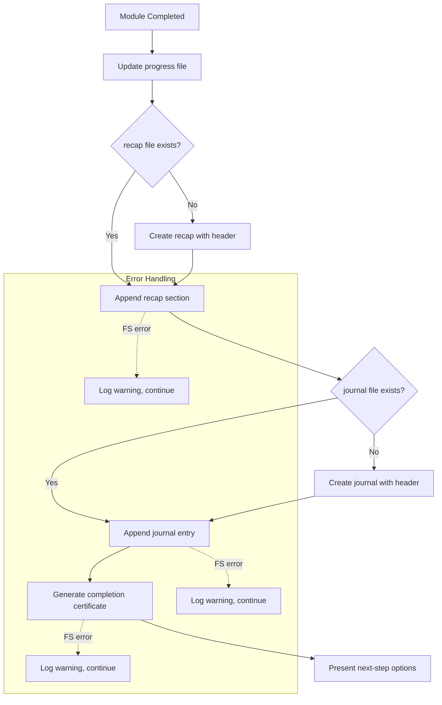
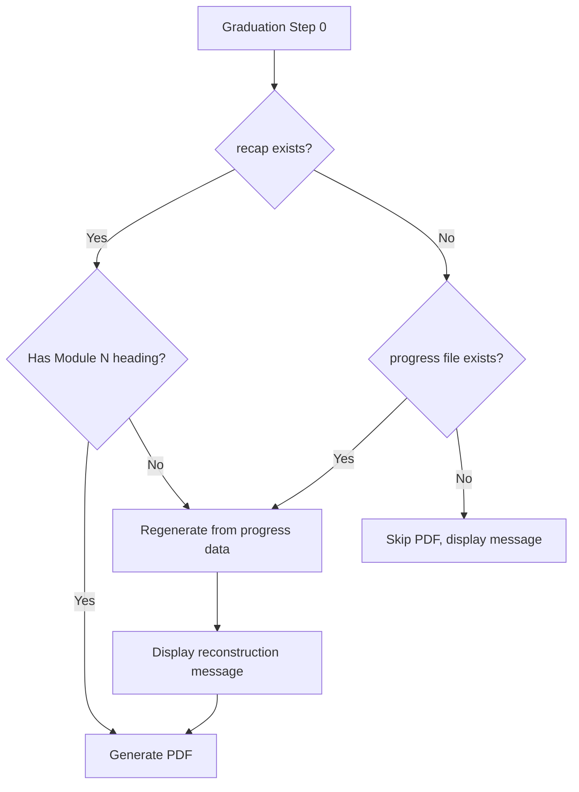

# Design Document: Module Completion Process

## Overview

This feature ensures that two cumulative artifacts — the bootcamp journal (`docs/bootcamp_journal.md`) and the bootcamp recap (`docs/bootcamp_recap.md`) — are reliably created and maintained from the very first module completion onward. It modifies the `module-completion.md` steering file to enforce a fixed completion checklist ordering, updates the `graduation.md` steering file to treat a missing recap as a recoverable error, and introduces a validation script to verify artifact integrity.

The design centers on three changes:

1. **Steering file updates** — Codify the exact step ordering (progress update → recap append → journal entry → certificate → next-step options) in `module-completion.md`, and add a recap-recovery preamble to `graduation.md` Step 0.
2. **Validation script** — A new `validate_completion_artifacts.py` script that checks journal and recap file structure, entry counts, and consistency with the progress file.
3. **Non-blocking error handling** — Each artifact-creation step catches file-system errors, logs a warning, and continues without blocking the bootcamper's flow.

## Architecture



### Graduation Recap Recovery



## Components and Interfaces

### 1. Module Completion Steering (`steering/module-completion.md`)

**Changes:**
- Add explicit step ordering section at the top of the workflow
- Document that recap append executes before journal entry (already partially present)
- Add journal file creation logic (create `docs/` directory and file with header on first completion)
- Add non-blocking error handling instructions for each step
- Add 30-second timeout guidance per step

**Interface with other components:**
- Reads: `config/bootcamp_progress.json`, `config/bootcamp_preferences.yaml`, `config/module-dependencies.yaml`
- Writes: `docs/bootcamp_journal.md`, `docs/bootcamp_recap.md` (via hook), `docs/progress/MODULE_N_COMPLETE.md`

### 2. Graduation Steering (`steering/graduation.md`)

**Changes to Step 0:**
- Replace "skip silently" behavior with error-recovery flow
- Add recap validation (check for `## Module N:` heading matching progress data)
- Add regeneration procedure from progress file and module artifacts
- Add bootcamper notification message
- Add guard: if progress file missing or `modules_completed` empty, skip PDF with message

### 3. Validation Script (`scripts/validate_completion_artifacts.py`)

**Purpose:** Verify structural integrity of journal and recap files against progress data. Used in CI and by the agent for self-checks.

**CLI Interface:**
```
python senzing-bootcamp/scripts/validate_completion_artifacts.py \
    --progress config/bootcamp_progress.json \
    --journal docs/bootcamp_journal.md \
    --recap docs/bootcamp_recap.md
```

**Functions:**
- `parse_journal(content: str) -> JournalDocument` — Parse journal markdown into structured data
- `parse_recap_header(content: str) -> RecapHeader` — Extract recap header fields
- `count_recap_sections(content: str) -> list[int]` — Extract module numbers from recap section headings
- `validate_journal_structure(journal: JournalDocument) -> list[str]` — Validate journal entry structure
- `validate_recap_consistency(recap_modules: list[int], progress_modules: list[int]) -> list[str]` — Check recap sections match progress
- `validate_journal_consistency(journal_modules: list[int], progress_modules: list[int]) -> list[str]` — Check journal entries match progress
- `format_journal_entry(module_number: int, module_name: str, date: str, summary: str, artifacts: list[str], why_it_matters: str, takeaway: str) -> str` — Format a journal entry as markdown
- `format_journal_header(bootcamper_name: str, start_date: str) -> str` — Format the journal file header

### 4. Module Recap Append Hook (`hooks/module-recap-append.kiro.hook`)

**Changes:** Minimal. The hook already handles recap creation and appending. The only change is to ensure the hook's prompt explicitly states it must create the `docs/` directory if absent (already implied but worth making explicit).

## Data Models

### Journal File Structure (`docs/bootcamp_journal.md`)

```markdown
# Bootcamp Journal

**Bootcamper:** {name}
**Started:** {YYYY-MM-DD}

---

## Module 1: Business Problem — Completed 2026-05-14T10:30:00-05:00

**What we did:** Defined the business problem and identified data sources
**What was produced:** docs/business_problem.md, config/data_sources.yaml
**Why it matters:** Establishes the foundation for all subsequent modules
**Bootcamper's takeaway:** N/A

---

## Module 2: SDK Setup — Completed 2026-05-15T14:00:00-05:00
...
```

### Journal Entry Dataclass

```python
@dataclass
class JournalEntry:
    module_number: int
    module_name: str
    completion_date: str  # ISO 8601 with timezone
    summary: str
    artifacts: list[str]
    why_it_matters: str
    takeaway: str

@dataclass
class JournalDocument:
    bootcamper_name: str
    start_date: str  # ISO 8601 date (YYYY-MM-DD)
    entries: list[JournalEntry]
```

### Recap File Structure (`docs/bootcamp_recap.md`)

Already defined by the existing `module-recap-append.kiro.hook`. Structure:

```markdown
# Senzing Bootcamp Recap

**Bootcamper:** {name}
**Started:** {ISO 8601 timestamp with timezone}
**Total Duration:** {cumulative duration}

---

## Module N: {Name} — {ISO 8601 timestamp with timezone}

### Information Shared
- ...

### Questions Asked
1. ...

### Answers Given
1. ...

### Actions Taken
- ...

### Duration
{elapsed time}

---
```

### Recap Header Dataclass

```python
@dataclass
class RecapHeader:
    bootcamper: str
    started: str  # ISO 8601 with timezone
    total_duration: str
```

### Completion Step Order (Enum-like)

```python
COMPLETION_STEPS: list[str] = [
    "progress_update",
    "recap_append",
    "journal_entry",
    "completion_certificate",
    "next_step_options",
]
```

## Correctness Properties

*A property is a characteristic or behavior that should hold true across all valid executions of a system — essentially, a formal statement about what the system should do. Properties serve as the bridge between human-readable specifications and machine-verifiable correctness guarantees.*

### Property 1: Journal entry round-trip

*For any* valid journal entry (with module number 1–11, non-empty module name, valid ISO 8601 date, non-empty summary, list of artifacts, non-empty why-it-matters, and takeaway), formatting the entry as markdown and then parsing it back should produce an equivalent JournalEntry.

**Validates: Requirements 2.1, 2.3**

### Property 2: Journal append preserves existing content

*For any* existing journal file content and any new valid journal entry, appending the entry to the file should result in a file whose prefix (all bytes before the new entry) is identical to the original content.

**Validates: Requirements 1.2**

### Property 3: Recap section count matches progress

*For any* set of completed modules (subset of 1–11), after simulating one recap append per module, the number of `## Module N:` headings in the recap file should equal the number of completed modules.

**Validates: Requirements 3.3, 4.5**

### Property 4: Journal header creation uses preferences

*For any* bootcamper name (non-empty string) and valid ISO 8601 date, creating a journal header should produce markdown containing both the name and the date in the expected format.

**Validates: Requirements 1.1**

### Property 5: Recap validation detects missing sections

*For any* progress file with N completed modules and a recap file with fewer than N module sections, the validation function should report at least one error identifying the missing module(s).

**Validates: Requirements 5.4**

### Property 6: Completion step ordering is invariant

*For any* sequence of module completions (1 to 11 modules in any order), the completion steps should always execute in the fixed order: progress_update → recap_append → journal_entry → completion_certificate → next_step_options.

**Validates: Requirements 7.1, 7.2, 7.3**

### Property 7: Default name fallback

*For any* preferences file that is missing or has no name field, the journal header and recap header should use "Bootcamper" as the default name.

**Validates: Requirements 3.2**

## Error Handling

### File System Errors During Module Completion

Each artifact-creation step (recap append, journal entry, certificate) is wrapped in error handling that:

1. Catches `OSError` and its subclasses (permission denied, disk full, path not found)
2. Logs a warning message visible to the bootcamper identifying which step failed and why
3. Continues to the next step in the defined order
4. Does not retry immediately — retry happens on the next module completion (Requirement 1.4)

### Timeout Handling

If any step exceeds 30 seconds (e.g., due to a hung file system), the agent skips that step and logs a warning. This is enforced by the steering file instructions rather than code, since the agent controls execution timing.

### Graduation Recovery

When the recap file is missing at graduation:

1. Check if `config/bootcamp_progress.json` exists and has a non-empty `modules_completed` array
2. If yes: regenerate recap from progress data and available module artifacts, display reconstruction message, proceed to PDF
3. If no: display message about insufficient data, skip PDF generation entirely

### Predecessor Step Failure

If a predecessor step fails (e.g., recap append fails), subsequent steps still execute using only data available from previously successful steps. The journal entry does not depend on the recap append's output, so it can proceed independently.

## Testing Strategy

### Property-Based Tests (Hypothesis)

**Library:** Hypothesis (already used throughout the project)
**Configuration:** `@settings(max_examples=100)` minimum per property test
**Location:** `senzing-bootcamp/tests/test_module_completion_process_properties.py`

Each property test references its design document property via a tag comment:
```python
# Feature: module-completion-process, Property 1: Journal entry round-trip
```

Properties to implement:
1. Journal entry format/parse round-trip
2. Journal append preserves existing bytes
3. Recap section count matches progress modules
4. Journal header contains name and date from preferences
5. Recap validation detects missing sections
6. Completion step ordering invariant
7. Default name fallback when preferences missing

### Unit Tests

**Location:** `senzing-bootcamp/tests/test_module_completion_process_unit.py`

Example-based tests for:
- Journal file creation when `docs/` directory doesn't exist
- Recap header creation with specific known values
- Graduation recovery when progress file is empty
- Graduation recovery when progress file has modules but recap is missing
- Error message formatting for skipped steps
- Module name derivation from `module-dependencies.yaml`

### Integration Tests

**Location:** `senzing-bootcamp/tests/test_module_completion_process_integration.py`

End-to-end scenarios:
- Complete Module 1 → verify both journal and recap created from scratch
- Complete Modules 1, 2, 3 sequentially → verify cumulative artifacts
- Simulate file system error during journal write → verify recap still written
- Run graduation with missing recap → verify regeneration flow
