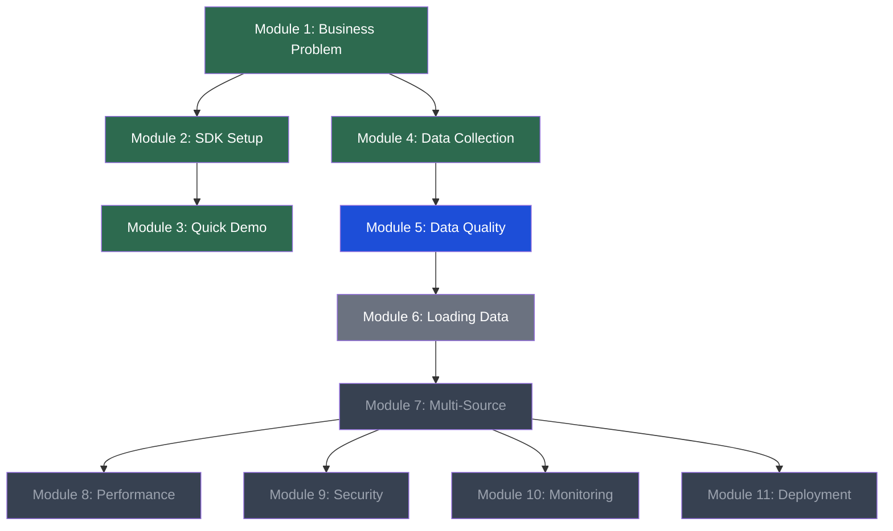

# Design: Module Dependency Visualization

## Overview

A new `visualize_dependencies.py` script generates text-based and Mermaid representations of the module dependency graph, showing the bootcamper's progress with emoji indicators. The agent offers this when bootcampers ask about their learning path.

## ASCII Output Format

```
$ python visualize_dependencies.py

Senzing Bootcamp — Module Dependency Graph
══════════════════════════════════════════════

  ✅ Module 1: Business Problem
  │
  ├──→ ✅ Module 2: SDK Setup
  │    └──→ ✅ Module 3: Quick Demo
  │
  ├──→ ✅ Module 4: Data Collection
  │    └──→ 📍 Module 5: Data Quality & Mapping
  │         └──→ 🔓 Module 6: Loading Data
  │              └──→ 🔒 Module 7: Multi-Source Queries
  │                   ├──→ 🔒 Module 8: Performance
  │                   ├──→ 🔒 Module 9: Security
  │                   ├──→ 🔒 Module 10: Monitoring
  │                   └──→ 🔒 Module 11: Deployment

Legend: ✅ Complete  📍 Current  🔓 Available  🔒 Locked

Track: Complete Beginner (C) — Modules 1→4→5→6→7
Progress: 3/5 modules complete (60%)
```

## Mermaid Output Format



## Module Status Determination

```python
def get_module_status(module_num, progress):
    """Determine display status for a module."""
    if module_num in progress.get("modules_completed", []):
        return "complete"  # ✅
    if module_num == progress.get("current_module"):
        return "current"   # 📍
    if all_prerequisites_met(module_num, progress):
        return "available" # 🔓
    return "locked"        # 🔒

def all_prerequisites_met(module_num, progress):
    """Check if all prerequisite modules are complete."""
    deps = load_dependencies()
    prereqs = deps.get(module_num, {}).get("requires", [])
    completed = progress.get("modules_completed", [])
    return all(p in completed for p in prereqs)
```

## Track Highlighting

When the bootcamper has selected a track, the visualization highlights which modules are part of their track:

```python
TRACKS = {
    "A": {"name": "Quick Demo", "modules": [1, 2, 3]},
    "B": {"name": "Fast Track", "modules": [5, 6, 7]},
    "C": {"name": "Complete Beginner", "modules": [1, 4, 5, 6, 7]},
    "D": {"name": "Full Production", "modules": [1, 2, 3, 4, 5, 6, 7, 8, 9, 10, 11]},
}
```

In ASCII mode, track modules get a `►` prefix. In Mermaid mode, track edges get a thicker stroke.

## CLI Interface

```
usage: visualize_dependencies.py [-h] [--format {text,mermaid}]

Options:
  --format {text,mermaid}  Output format (default: text)
```

Reads:
- `config/module-dependencies.yaml` (or `senzing-bootcamp/config/module-dependencies.yaml`)
- `config/bootcamp_progress.json` (optional — shows all locked if missing)
- `config/bootcamp_preferences.yaml` (optional — for track selection)

## Integration with status.py

`status.py` gains a `--graph` flag:
```
$ python status.py --graph
[... existing status output ...]

Module Dependency Graph:
[... ASCII graph ...]
```

## Keyword Routing

`steering-index.yaml` keywords:
```yaml
"learning path": inline-status.md
"module map": inline-status.md
"dependency graph": inline-status.md
"what's next": inline-status.md
```

When these keywords are detected, the agent offers to show the visualization.

## Files Created/Modified

- `senzing-bootcamp/scripts/visualize_dependencies.py` — new script
- `senzing-bootcamp/scripts/status.py` — add `--graph` flag
- `senzing-bootcamp/steering/steering-index.yaml` — add keyword entries

## Testing

- Unit test: script accepts --format flag with text and mermaid values
- Unit test: text output contains all 11 module names
- Unit test: mermaid output is valid Mermaid syntax (flowchart TD, node definitions, edges)
- Unit test: no progress file → all modules locked except Module 1
- Property test: module status is always one of {complete, current, available, locked}
- Property test: completed modules are never shown as locked
- Property test: current module is never shown as complete
