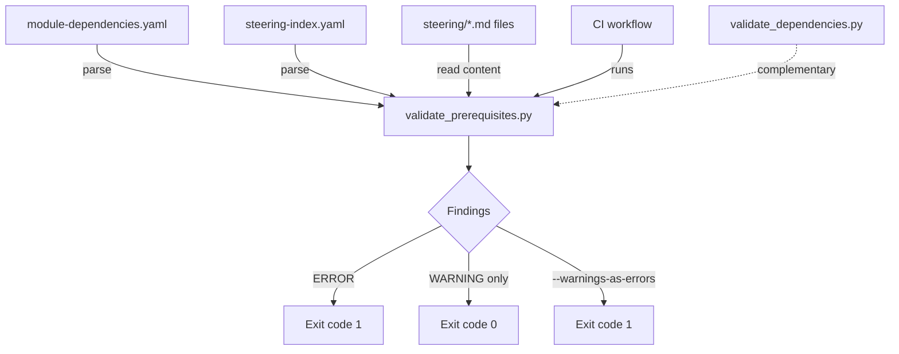

# Design Document: Module Prerequisites Validation

## Overview

This feature adds a CI validation script (`validate_prerequisites.py`) that cross-references `config/module-dependencies.yaml` gates against actual steering file content. It detects drift between the dependency configuration and steering files by verifying:

1. Every module number referenced in `requires` fields and gate keys has a corresponding entry in `steering-index.yaml`.
2. Gate requirement keywords appear in the source module's steering file content.
3. Source modules with outgoing gates contain checkpoint instructions and success criteria.

### Design Decisions

1. **Separate script from `validate_dependencies.py`**: The existing script handles graph-internal consistency (schema, cycles, dangling refs within the graph, topological order). The new script handles graph-to-steering-content alignment. This separation keeps each script focused and avoids bloating the existing one.
2. **Custom YAML parser (no PyYAML)**: Per project conventions, new scripts use stdlib only. A minimal YAML parser extracts the needed fields from `module-dependencies.yaml` and `steering-index.yaml`. The structure of both files is well-known and stable.
3. **Keyword matching via normalized tokens**: Gate requirements like "SDK installed, DB configured, test passes" are split on commas, lowercased, and trimmed. Each token is searched case-insensitively in the steering file content. This is intentionally fuzzy — it catches obvious drift without requiring exact phrase matching.
4. **WARNING vs ERROR severity**: Missing steering index entries and missing checkpoints are ERRORs (structural problems). Missing keywords and missing success criteria are WARNINGs (content drift that may be acceptable).

## Architecture



### Data Flow

1. **Parse phase**: Load `module-dependencies.yaml` → extract modules (with `requires` lists), gates (with `requires` lists), and tracks.
2. **Index phase**: Load `steering-index.yaml` → build a map of module number → list of steering file paths (including phase files for multi-phase modules).
3. **Cross-reference phase**: For each module reference and gate key, verify the module number exists in the steering index.
4. **Content validation phase**: For each gate, load the source module's steering files, extract keywords from gate requirements, search for keywords in content, count checkpoints, check for success criteria.
5. **Report phase**: Collect all findings, print formatted output, determine exit code.

## Components and Interfaces

### 1. Gate Key Parser

```python
def parse_gate_key(key: str) -> tuple[int, int] | None:
    """Parse a gate key like '1->2' into (source, destination).

    Args:
        key: Gate key string in format "N->M".

    Returns:
        Tuple of (source_module, dest_module) or None if invalid format.
    """
```

### 2. Keyword Extractor

```python
def extract_keywords(requirement: str) -> list[str]:
    """Extract normalized keywords from a gate requirement string.

    Splits on commas, strips whitespace, lowercases each token.
    Filters out empty strings.

    Args:
        requirement: A gate requirement string like "SDK installed, DB configured".

    Returns:
        List of lowercase keyword tokens, e.g. ["sdk installed", "db configured"].
    """
```

### 3. Steering Index Loader

```python
def load_steering_index(path: Path) -> dict[int, list[str]]:
    """Load steering-index.yaml and build module-to-files mapping.

    For simple entries (e.g., `2: module-02-sdk-setup.md`), returns a single file.
    For multi-phase entries, returns all phase files plus the root file.

    Args:
        path: Path to steering-index.yaml.

    Returns:
        Dict mapping module number to list of steering file paths (relative to steering dir).
    """
```

### 4. Steering Content Loader

```python
def load_steering_content(steering_dir: Path, files: list[str]) -> str:
    """Load and concatenate content from multiple steering files.

    Args:
        steering_dir: Path to the steering/ directory.
        files: List of filenames relative to steering_dir.

    Returns:
        Concatenated content of all files (lowercased for matching).
    """
```

### 5. Checkpoint Counter

```python
def count_checkpoints(content: str) -> int:
    """Count checkpoint instructions in steering content.

    Matches the pattern '**Checkpoint:**' (case-insensitive).

    Args:
        content: Raw steering file content (not lowercased).

    Returns:
        Number of checkpoint instructions found.
    """
```

### 6. Success Criteria Detector

```python
def has_success_criteria(content: str) -> bool:
    """Check if steering content contains success criteria.

    Looks for:
    - A heading containing 'Success Criteria' (any level)
    - Lines starting with '- ✅'

    Args:
        content: Raw steering file content.

    Returns:
        True if success criteria section or markers are found.
    """
```

### 7. Validation Orchestrator

```python
@dataclass
class Finding:
    """A single validation finding."""
    level: str  # "ERROR" or "WARNING"
    description: str

    def format(self) -> str:
        return f"{self.level}: {self.description}"


def validate_prerequisites(
    graph_path: Path,
    steering_index_path: Path,
    steering_dir: Path,
) -> list[Finding]:
    """Run all prerequisite validation checks.

    Args:
        graph_path: Path to module-dependencies.yaml.
        steering_index_path: Path to steering-index.yaml.
        steering_dir: Path to the steering/ directory.

    Returns:
        List of findings (errors and warnings).
    """
```

### 8. CLI Entry Point

```python
def main(argv: list[str] | None = None) -> None:
    """CLI entry point with argparse.

    Flags:
        --warnings-as-errors: Treat warnings as errors for exit code.
        --graph: Override path to module-dependencies.yaml.
        --steering-index: Override path to steering-index.yaml.
        --steering-dir: Override path to steering directory.
    """
```

## Data Models

### Dependency Graph (parsed structure)

| Field | Type | Source |
|-------|------|--------|
| `modules` | `dict[int, ModuleInfo]` | `modules` section |
| `gates` | `dict[str, GateInfo]` | `gates` section |

```python
@dataclass
class ModuleInfo:
    name: str
    requires: list[int]

@dataclass
class GateInfo:
    source: int
    destination: int
    requires: list[str]
```

### Steering Index (parsed structure)

| Field | Type | Description |
|-------|------|-------------|
| `module_files` | `dict[int, list[str]]` | Module number → list of steering file paths |

### Finding Output

| Field | Type | Description |
|-------|------|-------------|
| `level` | `str` | `"ERROR"` or `"WARNING"` |
| `description` | `str` | Human-readable description of the finding |

## Correctness Properties

*A property is a characteristic or behavior that should hold true across all valid executions of a system — essentially, a formal statement about what the system should do. Properties serve as the bridge between human-readable specifications and machine-verifiable correctness guarantees.*

### Property 1: Gate Parsing Correctness

*For any* valid gate key string matching the pattern `"N->M"` where N and M are positive integers, the gate key parser SHALL correctly extract both module numbers as integers, and for any valid dependency graph structure, the parser SHALL extract all gates with correct source, destination, and requires lists without raising exceptions.

**Validates: Requirements 1.4, 1.5, 7.1, 7.3**

### Property 2: Keyword Extraction Produces Normalized Tokens

*For any* non-empty gate requirement string containing comma-separated conditions, the keyword extraction function SHALL produce a non-empty list of lowercase tokens where each token has no leading or trailing whitespace.

**Validates: Requirements 3.2, 7.2**

### Property 3: Module Reference Cross-Validation

*For any* dependency graph and steering index, the validator SHALL report an ERROR for each module number referenced in `requires` lists or gate keys that does not exist in the steering index, and SHALL report zero errors when all referenced module numbers exist in the steering index.

**Validates: Requirements 2.1, 2.2, 2.3, 2.4**

### Property 4: Keyword Presence Detection

*For any* steering file content and set of keywords, the validator SHALL report a WARNING for each keyword not found (case-insensitively) in the content, and SHALL report zero warnings when all keywords are present in the content.

**Validates: Requirements 3.3, 3.4, 3.5**

### Property 5: Checkpoint and Success Criteria Detection

*For any* steering file content containing N `**Checkpoint:**` patterns, the checkpoint counter SHALL return exactly N. For content with zero checkpoints and an outgoing gate, the validator SHALL report an ERROR. For content lacking both a "Success Criteria" heading and `✅` markers, the validator SHALL report a WARNING.

**Validates: Requirements 4.1, 4.2, 4.3, 4.4**

### Property 6: Exit Code Correctness

*For any* set of findings, the exit code SHALL be 1 if at least one ERROR exists (or if `--warnings-as-errors` is set and at least one WARNING exists), and 0 otherwise.

**Validates: Requirements 5.4, 5.5, 5.6**

## Error Handling

### File Not Found

- If `module-dependencies.yaml` does not exist: print `"ERROR: Dependency graph not found: {path}"`, exit code 1.
- If `steering-index.yaml` does not exist: print `"ERROR: Steering index not found: {path}"`, exit code 1.
- If a referenced steering file does not exist: report as a WARNING (the file may be legitimately missing during development).

### Parse Errors

- If `module-dependencies.yaml` contains unparseable content: print `"ERROR: Cannot parse dependency graph: {details}"`, exit code 1.
- If `steering-index.yaml` contains unparseable content: print `"ERROR: Cannot parse steering index: {details}"`, exit code 1.

### Graceful Degradation

- If a gate key doesn't match the `"N->M"` pattern, it is skipped with a WARNING.
- If a steering file cannot be read (permissions, encoding), it is reported as a WARNING and the gate's keyword checks are skipped.

## Testing Strategy

### Property-Based Tests (Hypothesis)

**Library**: `hypothesis` with `@settings(max_examples=100)`

**Test file**: `senzing-bootcamp/tests/test_prerequisites_validation_properties.py`

Six property tests corresponding to the six correctness properties:

1. **Gate parsing correctness** — Generate random valid gate keys and dependency graphs, verify correct extraction.
2. **Keyword extraction** — Generate random requirement strings, verify normalized token output.
3. **Module reference cross-validation** — Generate random graphs and steering indices with varying overlap, verify error/no-error behavior.
4. **Keyword presence detection** — Generate random content and keywords, verify warning/no-warning behavior.
5. **Checkpoint and success criteria detection** — Generate random markdown with varying checkpoint counts and success criteria presence, verify counts and findings.
6. **Exit code correctness** — Generate random finding sets, verify exit code logic with and without `--warnings-as-errors`.

**Hypothesis strategies**:

- `st_gate_key()`: Generates valid `"N->M"` strings with positive integers.
- `st_gate_requirement()`: Generates comma-separated condition strings.
- `st_dependency_graph()`: Generates valid dependency graph dicts with modules and gates.
- `st_steering_index()`: Generates module-to-file mappings.
- `st_steering_content()`: Generates markdown content with configurable checkpoint count and success criteria presence.
- `st_finding_set()`: Generates lists of Finding objects with mixed levels.

Each test is tagged: `Feature: module-prerequisites-validation, Property {N}: {title}`

### Unit Tests

**Test file**: `senzing-bootcamp/tests/test_prerequisites_validation_unit.py`

- Specific examples for each error/warning message format
- File-not-found and parse-error edge cases
- `--warnings-as-errors` flag behavior
- Integration with real `module-dependencies.yaml` and `steering-index.yaml` (smoke test)
- Performance assertion (< 10 seconds for 11 modules)

### CI Integration

- New step in `.github/workflows/validate-power.yml` after `sync_hook_registry.py --verify` and before `pytest`
- Step name: `Validate module prerequisites`
- Command: `python senzing-bootcamp/scripts/validate_prerequisites.py`
