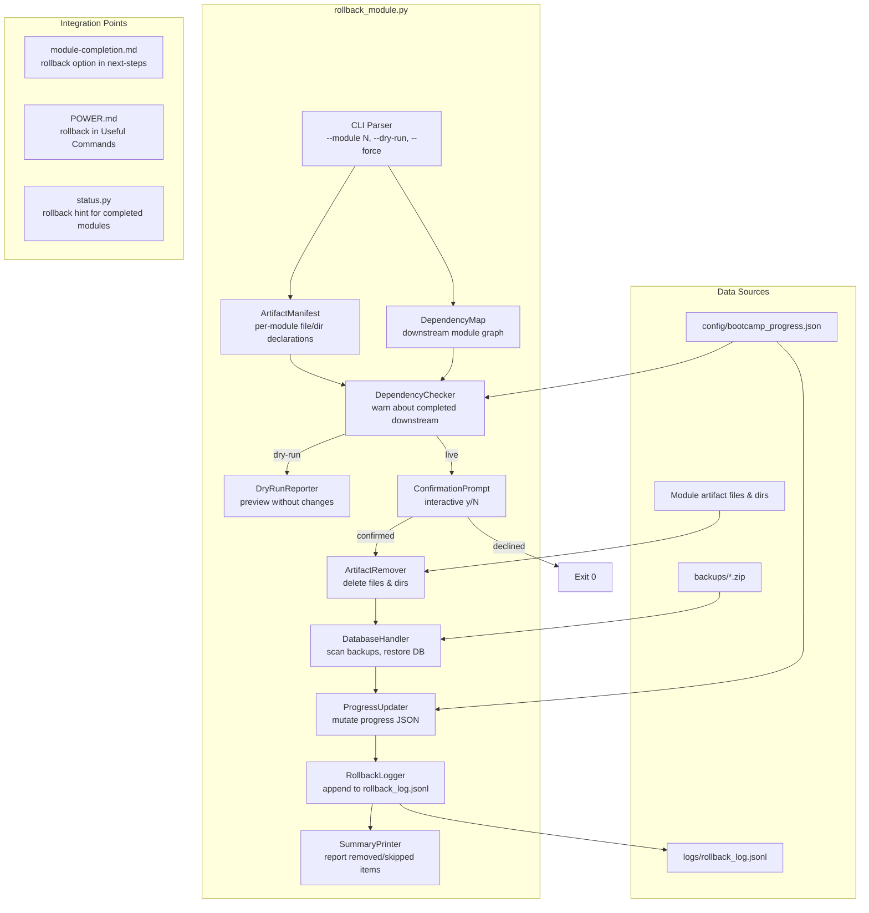

# Design Document: Module Rollback

## Overview

This feature adds `senzing-bootcamp/scripts/rollback_module.py` — a single Python script that reverts the artifacts produced by a specific bootcamp module. Given a `--module N` argument, the script consults a built-in per-module artifact manifest, removes the declared files and directories, updates `config/bootcamp_progress.json`, optionally restores the database from a pre-load backup (for Modules 6 and 7), warns about downstream dependencies, and logs the operation to `logs/rollback_log.jsonl`.

The design prioritizes:
- **Zero dependencies**: stdlib-only (no third-party packages), matching existing script conventions (`backup_project.py`, `restore_project.py`, `status.py`)
- **Safety**: dry-run preview, interactive confirmation, downstream dependency warnings
- **Testability**: pure-function logic for manifest lookup, dependency resolution, progress file mutation, and log entry construction — separated from filesystem I/O so each can be property-tested
- **Cross-platform**: Linux, macOS, Windows

## Architecture



The architecture separates concerns into:
1. **Manifest layer** — static per-module declarations of files, directories, and database flags
2. **Dependency layer** — graph of module prerequisites, checker for completed downstream modules
3. **Preview layer** — dry-run reporter that lists planned actions without side effects
4. **Execution layer** — artifact remover, database handler, progress updater
5. **Logging layer** — structured JSON Lines log entry construction and file append
6. **Presentation layer** — confirmation prompts, summary output, color support

## Components and Interfaces

### Module Artifact Manifest

A module-level constant dict mapping module numbers (1–12) to their artifact declarations:

```python
@dataclasses.dataclass
class ModuleArtifacts:
    files: list[str]           # individual file paths (relative to project root)
    directories: list[str]     # directory paths to remove recursively
    modifies_database: bool    # True for Modules 6 and 7

ARTIFACT_MANIFEST: dict[int, ModuleArtifacts] = {
    1:  ModuleArtifacts(files=["docs/business_problem.md"], directories=[], modifies_database=False),
    2:  ModuleArtifacts(files=["database/G2C.db", "config/bootcamp_preferences.yaml"], directories=[], modifies_database=False),
    3:  ModuleArtifacts(files=[], directories=["src/quickstart_demo"], modifies_database=False),
    4:  ModuleArtifacts(files=["docs/data_source_locations.md"], directories=["data/raw"], modifies_database=False),
    5:  ModuleArtifacts(files=["docs/data_source_evaluation.md", "docs/data_quality_report.md"], directories=["src/transform", "data/transformed"], modifies_database=False),
    6:  ModuleArtifacts(files=[], directories=["src/load"], modifies_database=True),
    7:  ModuleArtifacts(files=["docs/loading_strategy.md"], directories=[], modifies_database=True),
    8:  ModuleArtifacts(files=["docs/results_validation.md"], directories=["src/query"], modifies_database=False),
    9:  ModuleArtifacts(files=["docs/performance_requirements.md", "docs/performance_report.md"], directories=["tests/performance"], modifies_database=False),
    10: ModuleArtifacts(files=["docs/security_checklist.md"], directories=[], modifies_database=False),
    11: ModuleArtifacts(files=["docs/monitoring_setup.md"], directories=["monitoring"], modifies_database=False),
    12: ModuleArtifacts(files=["docs/deployment_plan.md"], directories=[], modifies_database=False),
}
```

### Dependency Map

A constant dict declaring which modules depend on which earlier modules, derived from the module-prerequisites diagram:

```python
# Maps module -> list of modules it depends on (prerequisites)
PREREQUISITES: dict[int, list[int]] = {
    3:  [2],
    4:  [1],
    5:  [4],
    6:  [2, 5],
    7:  [6],
    8:  [6, 7],
    9:  [8],
    10: [9],
    11: [10],
    12: [11],
}
```

```python
def get_downstream_modules(module: int) -> list[int]:
    """Return sorted list of modules that transitively depend on the given module."""

def get_completed_downstream(module: int, modules_completed: list[int]) -> list[int]:
    """Return sorted list of completed modules that depend on the given module."""
```

### DryRunReporter

```python
def format_dry_run_report(
    module: int,
    artifacts: ModuleArtifacts,
    existing_files: list[str],
    existing_dirs: list[str],
    missing_items: list[str],
    backup_path: str | None,
    downstream_completed: list[int],
    progress_changes: dict,
) -> str:
    """Return a formatted string previewing all planned rollback actions."""
```

Pure function — takes pre-computed data, returns a string. No I/O.

### ArtifactRemover

```python
@dataclasses.dataclass
class RemovalResult:
    removed_files: list[str]
    removed_dirs: list[str]
    skipped_missing: list[str]
    failed_items: list[tuple[str, str]]  # (path, error_message)

def remove_artifacts(
    artifacts: ModuleArtifacts,
    project_root: str,
) -> RemovalResult:
    """Remove files and directories listed in the manifest. Returns result summary."""
```

### DatabaseHandler

```python
def find_latest_backup(backups_dir: str) -> str | None:
    """Scan backups/ for the most recent ZIP file. Return path or None."""

def restore_database_from_backup(backup_path: str, project_root: str) -> bool:
    """Extract only the database/ directory from the backup ZIP, overwriting current files.
    Returns True on success, False on failure."""
```

### ProgressUpdater

```python
def compute_progress_update(
    progress_data: dict,
    module: int,
) -> dict:
    """Return a new progress dict with module N rolled back.
    Pure function — does not read or write files.
    
    - Removes N from modules_completed
    - Sets current_module to N if N was the current module
    - Removes step_history entry for module N
    - Removes current_step if associated with module N
    """

def read_progress_file(path: str) -> dict | None:
    """Read and parse progress JSON. Returns None if missing or invalid."""

def write_progress_file(path: str, data: dict) -> None:
    """Write progress dict with 2-space indent and trailing newline."""
```

### RollbackLogger

```python
@dataclasses.dataclass
class RollbackLogEntry:
    timestamp: str              # ISO 8601 UTC
    module: int                 # module number rolled back
    removed_files: list[str]    # files successfully removed
    removed_dirs: list[str]     # directories successfully removed
    skipped_missing: list[str]  # items that didn't exist
    failed_items: list[str]     # items that failed to remove
    database_restored: bool | None  # True/False for DB modules, None otherwise
    backup_used: str | None     # backup file path if DB restored
    warnings: list[str]         # any warnings generated

def build_log_entry(
    module: int,
    removal_result: RemovalResult,
    database_restored: bool | None,
    backup_used: str | None,
    warnings: list[str],
) -> RollbackLogEntry:
    """Construct a log entry from rollback results. Pure function."""

def serialize_log_entry(entry: RollbackLogEntry) -> str:
    """Serialize log entry to a single JSON line (no trailing newline)."""

def append_log_entry(log_path: str, entry_line: str) -> None:
    """Append a JSON line to the log file, creating logs/ dir if needed."""
```

### CLI Entry Point

```python
def main(argv: list[str] | None = None) -> int:
    """Parse args, execute rollback, return exit code.
    Returns 0 on success, 1 on error, 0 on dry-run or user cancellation."""
```

Arguments:
- `--module N` (required) — integer 1–12 identifying the module to roll back
- `--dry-run` — preview without making changes
- `--force` — skip confirmation prompts

## Data Models

### Progress File Schema

The progress file at `config/bootcamp_progress.json` follows the existing schema used by `progress_utils.py`, `status.py`, and `repair_progress.py`:

```json
{
  "modules_completed": [1, 2, 3, 4, 5],
  "current_module": 6,
  "current_step": 3,
  "step_history": {
    "1": {"last_completed_step": 10, "updated_at": "2026-05-12T09:15:00+00:00"},
    "5": {"last_completed_step": 12, "updated_at": "2026-05-13T14:30:00+00:00"}
  },
  "data_sources": ["customers", "vendors"],
  "database_type": "sqlite",
  "language": "python"
}
```

After rolling back module 5, the progress file becomes:

```json
{
  "modules_completed": [1, 2, 3, 4],
  "current_module": 5,
  "current_step": null,
  "step_history": {
    "1": {"last_completed_step": 10, "updated_at": "2026-05-12T09:15:00+00:00"}
  },
  "data_sources": ["customers", "vendors"],
  "database_type": "sqlite",
  "language": "python"
}
```

### Rollback Log Entry Schema

Each line in `logs/rollback_log.jsonl` is a single JSON object:

```json
{
  "timestamp": "2026-05-14T10:00:00+00:00",
  "module": 5,
  "removed_files": ["docs/data_source_evaluation.md", "docs/data_quality_report.md"],
  "removed_dirs": ["src/transform", "data/transformed"],
  "skipped_missing": [],
  "failed_items": [],
  "database_restored": null,
  "backup_used": null,
  "warnings": []
}
```

### Dependency Graph (Adjacency List)

Derived from the module-prerequisites Mermaid diagram:

| Module | Depends On | Depended On By |
|--------|-----------|----------------|
| 1 | — | 4 |
| 2 | — | 3, 6 |
| 3 | 2 | — |
| 4 | 1 | 5 |
| 5 | 4 | 6 |
| 6 | 2, 5 | 7, 8 |
| 7 | 6 | 8 |
| 8 | 6, 7 | 9 |
| 9 | 8 | 10 |
| 10 | 9 | 11 |
| 11 | 10 | 12 |
| 12 | 11 | — |

### Module Names (shared constant)

Reuses the same mapping as `status.py`:

```python
MODULE_NAMES: dict[int, str] = {
    1: "Business Problem", 2: "SDK Setup", 3: "Quick Demo",
    4: "Data Collection", 5: "Data Quality & Mapping",
    6: "Single Source Loading", 7: "Multi-Source Orchestration",
    8: "Query, Visualize & Validate", 9: "Performance Testing",
    10: "Security Hardening", 11: "Monitoring", 12: "Deployment",
}
```


## Correctness Properties

*A property is a characteristic or behavior that should hold true across all valid executions of a system — essentially, a formal statement about what the system should do. Properties serve as the bridge between human-readable specifications and machine-verifiable correctness guarantees.*

### Property 1: Module number validation partitions correctly

*For any* integer, the CLI argument parser SHALL accept it if and only if it is in the range 1–12. Integers outside this range SHALL produce an error message mentioning the valid range and a non-zero exit code.

**Validates: Requirements 1.2, 11.2**

### Property 2: Manifest completeness

*For any* module number in 1–12, the `ARTIFACT_MANIFEST` SHALL contain an entry with a `ModuleArtifacts` value whose `files` and `directories` are both lists (possibly empty) and whose `modifies_database` is a boolean. Modules 6 and 7 SHALL have `modifies_database=True`; all others SHALL have `modifies_database=False`.

**Validates: Requirements 2.1, 2.7, 2.8**

### Property 3: Rollback removes exactly manifest items

*For any* module and any filesystem state containing the module's manifest artifacts plus additional non-manifest files, executing the rollback SHALL remove all existing manifest files and directories, and SHALL NOT remove any file or directory not listed in the target module's manifest.

**Validates: Requirements 2.14, 2.15, 4.1, 4.4**

### Property 4: Removal resilience

*For any* module and any subset of its manifest artifacts that exist on disk (including the empty subset), the rollback SHALL succeed without error, correctly categorizing each item as removed, skipped (missing), or failed (permission error). The summary output SHALL contain every removed item and every skipped item.

**Validates: Requirements 4.2, 4.3, 11.4**

### Property 5: Dry-run safety

*For any* module and any filesystem state, running with `--dry-run` SHALL produce output listing all existing manifest artifacts and SHALL NOT modify, create, or delete any file. The exit code SHALL be 0.

**Validates: Requirements 3.1, 3.5**

### Property 6: Downstream dependency reporting

*For any* module and any progress state where downstream modules are in `modules_completed`, the rollback output (both dry-run and live) SHALL list each completed downstream module by number and name. The dry-run output SHALL also show the planned progress file changes.

**Validates: Requirements 3.3, 3.4, 7.2**

### Property 7: Progress file update correctness

*For any* valid progress state and any module N in `modules_completed`, `compute_progress_update` SHALL produce a new state where: (a) N is not in `modules_completed`, (b) `current_module` is set to N when N was the current module, (c) the `step_history` entry for module N is removed, (d) `current_step` is cleared (set to None) when the current module equals N, and (e) all other fields are preserved unchanged.

**Validates: Requirements 6.1, 6.2, 6.3, 6.4**

### Property 8: Progress file JSON formatting

*For any* valid progress dict, `write_progress_file` SHALL produce output that is valid JSON with 2-space indentation and a trailing newline character. Parsing the written content with `json.loads` SHALL produce a dict equal to the input.

**Validates: Requirements 6.6**

### Property 9: Confirmation input validation

*For any* string input to the confirmation prompt, the rollback SHALL proceed if and only if the input is exactly "y" or "Y". All other inputs SHALL result in cancellation with exit code 0.

**Validates: Requirements 8.2, 8.3**

### Property 10: Latest backup selection

*For any* set of ZIP files in the `backups/` directory with varying timestamps in their filenames, `find_latest_backup` SHALL return the path to the file with the most recent timestamp. When no ZIP files exist, it SHALL return None.

**Validates: Requirements 5.1**

### Property 11: Database restoration extracts only database directory

*For any* backup ZIP containing a `database/` directory alongside other directories, `restore_database_from_backup` SHALL extract only files under `database/`, leaving all other ZIP contents unextracted.

**Validates: Requirements 5.3**

### Property 12: Rollback log entry round-trip

*For any* `RollbackLogEntry` with arbitrary module number, file lists, directory lists, database restoration status, and warning messages, `serialize_log_entry` SHALL produce a single line (no embedded newlines) that, when parsed with `json.loads`, produces a valid Python dictionary containing all original fields with their original values.

**Validates: Requirements 12.3, 12.4**

### Property 13: Downstream artifacts untouched

*For any* module with downstream modules that have artifacts on disk, executing the rollback for the target module SHALL NOT remove any artifact belonging to a downstream module.

**Validates: Requirements 7.5**

## Error Handling

| Scenario | Behavior |
|---|---|
| `--module` argument missing | Print usage information, exit with code 1 |
| `--module` value outside 1–12 | Print error with valid range, exit with code 1 |
| Module not completed and no artifacts on disk | Print "nothing to roll back", exit with code 0 |
| Artifact file removal fails (permission error) | Print warning identifying the file, continue with remaining artifacts, report in summary |
| Artifact directory removal fails (permission error) | Print warning identifying the directory, continue with remaining artifacts, report in summary |
| `config/bootcamp_progress.json` missing | Print warning, skip progress update, continue rollback |
| `config/bootcamp_progress.json` contains invalid JSON | Print warning, skip progress update, suggest running `repair_progress.py` |
| `backups/` directory missing (DB module rollback) | Print warning that no backup is available, advise re-running Module 2 |
| No ZIP files in `backups/` (DB module rollback) | Same as above |
| Backup ZIP missing `database/` directory | Print warning, skip database restoration |
| User declines confirmation prompt | Print "Rollback cancelled.", exit with code 0 |
| User declines database restoration prompt | Print warning that records remain, suggest `backup_project.py` + manual reset |
| `logs/` directory missing | Create it before writing log entry |
| Log file write fails | Print warning, do not fail the overall rollback |

All error handling follows existing script conventions: human-readable messages to stdout/stderr, never crash with unhandled exceptions during normal operation.

## Testing Strategy

### Property-Based Tests (Hypothesis)

The project already uses Hypothesis for PBT (see `test_pbt_checkpointing.py`). The same pattern applies here.

**Library**: [Hypothesis](https://hypothesis.readthedocs.io/) (Python)
**Minimum iterations**: 100 per property
**Tag format**: `Feature: module-rollback, Property {N}: {title}`

Each of the 13 correctness properties maps to a single property-based test. Key strategies:

- **Module number generator**: `st.integers()` covering well below 1 and well above 12 for validation tests; `st.integers(min_value=1, max_value=12)` for valid module tests
- **Progress state generator**: `st.fixed_dictionaries` with `modules_completed` as sorted unique subset of 1–12, `current_module` as 1–12, optional `current_step`, optional `step_history` entries (reuse patterns from `test_pbt_checkpointing.py`)
- **RemovalResult generator**: random lists of file paths for removed, skipped, and failed categories
- **RollbackLogEntry generator**: random module 1–12, random file/dir path lists, optional boolean for database_restored, optional backup path string, random warning strings
- **Filesystem mocking**: use `tempfile.TemporaryDirectory` to create real temporary filesystems with manifest artifacts and extra files, then verify removal behavior
- **Backup ZIP generator**: create in-memory ZIPs with `database/` and other random directories using `zipfile.ZipFile` in `BytesIO`
- **Confirmation input generator**: `st.text()` for arbitrary strings to test that only "y"/"Y" proceeds

### Unit Tests (pytest)

Unit tests cover specific examples and edge cases not suited for PBT:

- Manifest content for each module matches requirements (Req 2.2–2.13) — 12 concrete assertions
- Dependency map matches module-prerequisites diagram (Req 7.1)
- Dry-run for DB module reports backup availability (Req 3.2)
- DB module prompts for restoration when backup exists (Req 5.2)
- User declines DB restoration → warning message (Req 5.4)
- No backup available → warning message (Req 5.5)
- `--force` with DB module restores without prompt (Req 5.6)
- Progress file missing → warning printed (Req 6.5)
- Invalid JSON in progress file → warning + repair suggestion (Req 11.5)
- Module not completed and no artifacts → "nothing to roll back" (Req 11.3)
- `--module` missing → usage info + exit 1 (Req 11.1)
- `--force` skips confirmation (Req 8.4)
- `logs/` directory created when missing (Req 12.2)

### Integration Points (manual verification)

- Module-completion steering file contains rollback option (Req 9.1, 9.2)
- POWER.md Useful Commands includes rollback command (Req 10.1)
- status.py displays rollback hint for completed modules (Req 10.2)

### Test File Location

`senzing-bootcamp/scripts/test_rollback_module.py` — follows existing convention alongside `test_pbt_checkpointing.py` and `test_progress_utils.py`.
