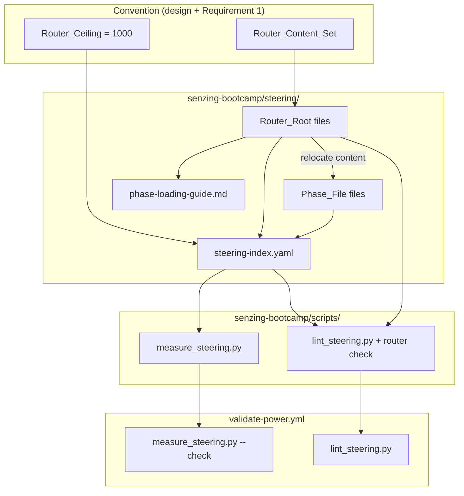
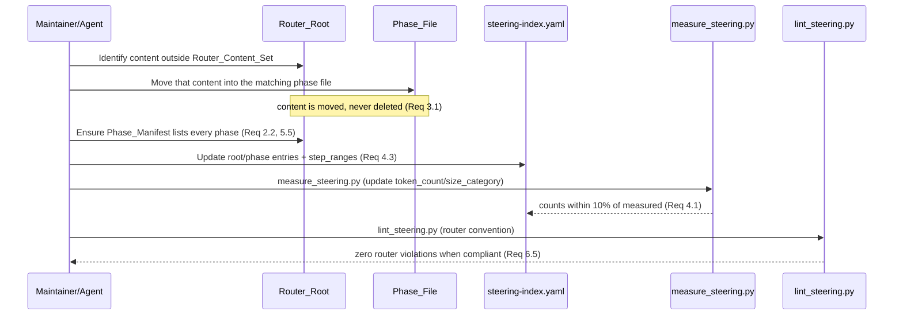
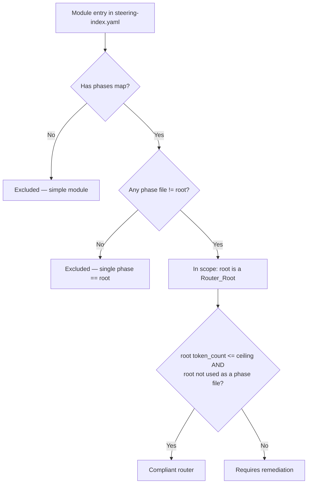

# Design Document

## Overview

This feature defines and enforces a single, precise convention for what a thin
**Router_Root** steering file must contain in the `senzing-bootcamp` Kiro Power. Today the
root files of phase-split modules sit in three inconsistent states:

1. **Compliant routers** — thin navigation entry points (Module 5 at 689 tokens, Module 9
   at 571, Module 10 at 568).
2. **Content roots** — roots that still carry substantive workflow content alongside their
   phase files (Module 6 at 1583, Module 3 at 1448, Module 8 at 1359).
3. **Root-doubles-as-phase roots** — roots that serve as both the router and the first
   phase (Module 1 at 5321, Module 7 at 3591, Module 11 at 3289).

The work is deliberately **low-risk and reversible**: it moves existing workflow content
from roots into phase files (never deletes it), updates two YAML/Markdown bookkeeping files
(`steering-index.yaml`, `phase-loading-guide.md`), and adds one automated enforcement check
to the existing `lint_steering.py` script so future roots cannot regress.

There is no runtime behavior change for the bootcamper: the agent still loads the root
first, resolves the current phase, and loads the matching phase file. The change makes the
**worst-case loaded footprint predictable** by guaranteeing every router root stays at or
below a measurable `Router_Ceiling` of 1000 tokens.

This design is grounded in the existing power conventions captured in the steering rules:
Python 3.11+ stdlib-only scripts (`tech.md`), `kebab-case.md` steering files with YAML
frontmatter (`structure.md`), no external URLs in steering files (`security.md`), and
custom minimal YAML parsing rather than PyYAML in steering scripts (`python-conventions.md`).

### Goals

- Define the `Router_Content_Set` and `Router_Ceiling` precisely (Requirement 1).
- Enumerate every in-scope module and its target end-state (Requirement 2).
- Preserve all workflow content and step coverage during relocation (Requirement 3).
- Keep `steering-index.yaml` accurate after relocation (Requirement 4).
- Keep `phase-loading-guide.md` correct and explicit about the router's role (Requirement 5).
- Add automated enforcement to `lint_steering.py` + CI (Requirement 6).
- Keep all standardized files within the power's distribution/formatting rules (Requirement 7).

### Non-Goals

- Changing the phase-resolution algorithm or `current_step` semantics.
- Re-splitting phase files or changing phase step boundaries (step ranges are preserved).
- Touching non-module phase-split entries (`onboarding`, `session-resume`) — see
  [Scope Decision](#scope-decision-onboarding-and-session-resume).

## Architecture

The feature touches four artifact layers. Only the steering content and the linter contain
logic; the index and loading guide are bookkeeping that must stay consistent.



### Remediation pipeline (per module)



### Router classification rule

A module is **in scope** and its root is a `Router_Root` when, in `steering-index.yaml`,
the module entry has both a `root` and a `phases` map, and at least one phase's `file`
differs from the `root`. A module whose `phases` map is absent, or whose only phase `file`
equals the `root`, is **excluded** (Requirement 2.2).



## Components and Interfaces

### 1. The Router convention (documentation)

The convention is recorded in this design document and summarized in `phase-loading-guide.md`.

**Router_Content_Set** — the only element types a `Router_Root` may contain (Requirement 1.1):

1. YAML frontmatter (`inclusion: manual`)
2. The module title heading (`# Module N: ...`)
3. The sequential-execution rule banner (`⚠️ Sequential Execution Rule ...`)
4. The module-start banner instruction (`🚀 First: Read config/bootcamp_progress.json ...`)
5. User-reference and companion-doc pointers (`> User reference: ...`)
6. The before/after framing (`Before/After: ...`)
7. The prerequisites statement (`Prerequisites: ...`)
8. The success indicator (`Success indicator: ...`)
9. The error-handling pointer block (the standard "When the bootcamper encounters an error" list)
10. The `Phase_Manifest` (the "Phase Sub-Files" list)

Anything else — numbered workflow steps, conditional workflow logic (opt-out gates,
deferred-question prompts, Phase-3-status branches), pre-load procedures, advanced-reading
instructions, multi-rule "Agent Rules" / "Success Criteria" blocks — is **substantive
content** and must live in a `Phase_File` (Requirements 1.3, 1.4).

**Router_Ceiling** = **1000 tokens**, recorded in the `budget` section of
`steering-index.yaml` as `router_ceiling: 1000` (Requirements 1.5, 1.6). This value
classifies the three known thin routers (689/571/568) as routers and the three known
content roots (1583/1448/1359) as requiring remediation.

### 2. `measure_steering.py` (token accuracy + ceiling config)

No logic change is required for measurement. The script already:

- Computes `Token_Count = round(len(content) / 4)` (`calculate_token_count`).
- Updates `file_metadata` and reconciles phase `token_count`/`size_category` within 10%
  (`update_index`, `rewrite_phase_counts`).
- Validates stored vs measured in `--check` mode, exiting non-zero on >10% drift
  (`check_counts`, `check_phase_counts`).

The only addition is preserving the new `router_ceiling` key in the `budget` block. The
current `update_index` rebuilds the `budget` block and explicitly preserves
`split_threshold_tokens`; it will be extended to preserve `router_ceiling` the same way
(read it from the existing content, re-emit it). This keeps all existing budget keys
(`total_tokens`, `reference_window`, `warn_threshold_pct`, `critical_threshold_pct`,
`split_threshold_tokens`) plus `router_ceiling` (Requirement 4.5).

### 3. `lint_steering.py` (router enforcement — the new logic)

A new rule function is added and wired into `run_all_checks`:

```python
def check_router_convention(
    index_data: dict,
    file_metadata: dict,
    router_ceiling: int,
) -> list[LintViolation]:
    """Rule: enforce the thin Router_Root convention.

    Identifies each Router_Root from the index (a module's `root` whose module
    also has a `phases` map with at least one phase `file` distinct from the root)
    and emits a violation when the root exceeds the Router_Ceiling or doubles as a
    phase file.
    """
```

Supporting helpers (all stdlib, minimal YAML parsing, consistent with the existing
`parse_steering_index`):

- `parse_module_phase_files(index_path) -> dict[int, ModuleRouterInfo]` — extends the
  existing module parsing to capture, per module, the `root` filename and the set of phase
  `file` values. (The current `parse_steering_index` deliberately discards phase files; the
  router rule needs them, so a focused parser is added rather than changing existing
  behavior.)
- `get_router_ceiling(index_data) -> int` — reads `budget.router_ceiling`, defaulting to
  1000 if absent.

**Enforcement logic** (Requirements 6.1–6.3):

| Condition | Level | Message includes |
|-----------|-------|------------------|
| In-scope `root` token_count > `router_ceiling` | ERROR | root name, token_count, ceiling |
| In-scope `root` filename is one of that module's phase files | ERROR | root name + "root-doubles-as-phase" |

A module is in scope only when it has a `phases` map with a phase file distinct from the
root (Requirements 6.1, 2.2), so excluded modules (2 and 4) never produce router violations.

**Environment guard** (Requirements 6.4, 6.6): at the start of `main()`, the script verifies
`sys.version_info >= (3, 11)` and that required stdlib modules import. On an unsupported
runtime it prints an environment error to stderr and exits non-zero rather than reporting
success. This guard is shared (a small `require_runtime()` helper) so both the linter and
any caller fail loudly on Python < 3.11.

**Success path** (Requirement 6.5): when no `Router_Root` violates the convention and the
runtime is valid, `check_router_convention` returns no violations and the script exits 0.

### 4. `validate-power.yml` (CI)

`lint_steering.py` already runs in CI ("Lint steering files" step). Because the router rule
is added inside `run_all_checks` and emits ERROR-level violations, a regressing root will
fail that existing step with a non-zero exit — no new CI step is strictly required
(Requirement 6.7). The CI already runs the matrix on Python 3.11/3.12/3.13, satisfying the
runtime expectation in 6.5.

### 5. `phase-loading-guide.md` (loading rules)

The guide is updated to (a) state explicitly that the `Router_Root` provides navigation and
overview content while substantive steps live in `Phase_Files` (Requirement 5.2), and (b)
reference the new dedicated router/phase names for Modules 1, 7, and 11 (Requirement 5.3).
The existing load-root-first then resolve-phase then load-matching-phase behavior and the
"load root only" fallback are preserved verbatim (Requirements 5.1, 5.4).

## Data Models

### `steering-index.yaml` module entry (target shape)

Every in-scope module has a `root` distinct from each phase `file` (Requirement 4.3). Example
for a remediated root-doubles-as-phase module (Module 1):

```yaml
modules:
  1:
    root: module-01-business-problem.md          # thin Router_Root (<= 1000 tokens)
    phases:
      phase1-discovery:
        file: module-01-phase1-discovery.md       # NEW phase file (former root content)
        token_count: <measured>
        size_category: <classified>
        step_range: [1, 9]
      phase2-document-confirm:
        file: module-01-phase2-document-confirm.md
        token_count: 1853
        size_category: medium
        step_range: [10, 18]
```

### `budget` block (target shape)

```yaml
budget:
  total_tokens: <sum of file_metadata>
  reference_window: 200000
  warn_threshold_pct: 60
  critical_threshold_pct: 80
  split_threshold_tokens: 5000
  router_ceiling: 1000        # NEW (Requirements 1.5, 1.6, 4.5)
```

### `ModuleRouterInfo` (in-memory, linter)

```python
@dataclass
class ModuleRouterInfo:
    """Router-relevant view of one module entry from steering-index.yaml."""
    module_num: int
    root: str                 # root filename
    phase_files: list[str]    # phase `file:` values (in document order)
    root_token_count: int | None   # from file_metadata[root]

    @property
    def in_scope(self) -> bool:
        # phases map exists and at least one phase file differs from root
        return any(pf != self.root for pf in self.phase_files)

    @property
    def doubles_as_phase(self) -> bool:
        return self.root in self.phase_files
```

### Per-module target end-state (Requirement 2.6)

Derived from the current `steering-index.yaml`. End-state for every in-scope module is
**compliant router**; the table records the starting state and the relocation action.

| Module | Root file | Root tokens | Current state | Action | New phase file(s) |
|--------|-----------|-------------|---------------|--------|-------------------|
| 1 | module-01-business-problem.md | 5321 | root-doubles-as-phase | Move phase-1 (steps 1–9) content to a new phase file; thin the root | module-01-phase1-discovery.md |
| 2 | module-02-sdk-setup.md | 4491 | single phase == root | **Excluded** (Req 2.2) | — |
| 3 | module-03-system-verification.md | 1448 | content root | Move Opt-Out Gate, Success Criteria, Agent Rules into phase 1 | (into module-03-phase1-verification.md) |
| 4 | module-04-data-collection.md | 3460 | single phase == root | **Excluded** (Req 2.2) | — |
| 5 | module-05-data-quality-mapping.md | 689 | compliant router | None | — |
| 6 | module-06-data-processing.md | 1583 | content root | Move Conditional Workflow, Pre-Load Freshness, Agent Workflow, Advanced Reading into phases A/D | (into module-06-phaseA-build-loading.md, module-06-phaseD-validation.md) |
| 7 | module-07-query-visualize-discover.md | 3591 | root-doubles-as-phase | Move phase-1 (steps 1–"3d") content to a new phase file; thin the root | module-07-phase1-query-visualize.md |
| 8 | module-08-performance.md | 1359 | content root | Move Deferred Deployment Question into phase A | (into module-08-phaseA-requirements.md) |
| 9 | module-09-security.md | 571 | compliant router | None | — |
| 10 | module-10-monitoring.md | 568 | compliant router | None | — |
| 11 | module-11-deployment.md | 3289 | root-doubles-as-phase | Move phase-1 packaging (steps 1–12) content to a new phase file; thin the root | module-11-phase1-packaging.md |

For content roots (3, 6, 8) the substantive sections move into the **existing** first phase
file (or the most relevant phase file), so no new file is created and step coverage is
unchanged. For root-doubles-as-phase modules (1, 7, 11) a **new** phase file is created and
the index `file:` for that phase is repointed from the root to the new file (Requirement 2.5).

### Scope Decision: onboarding and session-resume

The `onboarding` and `session-resume` entries also use a `root` + `phases` shape, and both
use the root-doubles-as-phase pattern (`onboarding-flow.md`, `session-resume.md`). However,
the requirements consistently scope the convention to **numbered bootcamp modules** ("under
that module's entry", Glossary; "modules 1–11"). The enforcement rule therefore reads the
`modules:` section only. `onboarding` and `session-resume` are **out of scope** for this
feature; they are flagged here as a deliberate decision so a future spec can extend the
convention to them if desired. This keeps the change focused and avoids destabilizing the
onboarding/resume flows.

## Correctness Properties

*A property is a characteristic or behavior that should hold true across all valid
executions of a system — essentially, a formal statement about what the system should do.
Properties serve as the bridge between human-readable specifications and machine-verifiable
correctness guarantees.*

The testable logic in this feature is the new enforcement code in `lint_steering.py` (router
identification, ceiling enforcement, doubles-as-phase detection), the step-range
coverage/contiguity checker, and the `router_ceiling` preservation in `measure_steering.py`.
Content relocation, documentation, formatting, and CI wiring are verified by review and by
existing validators (see Testing Strategy), not by property-based tests.

Each property is implemented by a single property-based test using **Hypothesis**, run with
a minimum of 100 iterations (`@settings(max_examples=...)` >= 100 for these properties),
consistent with `python-conventions.md`.

### Property 1: Router identification and scope

*For any* generated module entry, `check_router_convention` treats the module's `root` as an
in-scope `Router_Root` **if and only if** the module has a `phases` map containing at least
one phase `file` distinct from the `root`; a module with no `phases` map, or whose only
phase `file` equals the `root`, is excluded and never produces a router violation.

**Validates: Requirements 2.1, 2.2, 2.3, 6.1**

### Property 2: Router_Ceiling enforcement

*For any* in-scope `Router_Root` and any non-negative `router_ceiling`, the router rule emits
a ceiling violation **if and only if** the root's `token_count` is strictly greater than the
ceiling, and when emitted the violation message names the root filename, its token count, and
the ceiling.

**Validates: Requirements 1.3, 1.6, 2.3, 2.4, 6.2**

### Property 3: Root-doubles-as-phase enforcement

*For any* in-scope module, the router rule emits a root-doubles-as-phase violation **if and
only if** the module's `root` filename appears among that module's phase `file` values, and
the violation names the offending root.

**Validates: Requirements 2.5, 4.3, 6.3**

### Property 4: Compliant index produces no router violations

*For any* generated index in which every in-scope `Router_Root` has a `token_count` at or
below the `router_ceiling` and a filename distinct from all of its module's phase files,
`check_router_convention` returns no violations.

**Validates: Requirements 6.5**

### Property 5: Step-range contiguity and coverage

*For any* sequence of module steps (including lettered sub-steps) partitioned into ordered
phase `step_range`s, the step-range checker accepts the partition **if and only if** the
ranges are contiguous and non-overlapping under the sub-step-aware `(parent_integer, suffix)`
key ordering and together cover exactly the module's full step set; introducing a gap, an
overlap, or an uncovered step causes the checker to reject.

**Validates: Requirements 3.2, 3.3, 3.4, 5.4**

### Property 6: Budget Router_Ceiling preservation (round-trip)

*For any* existing `budget` block containing the standard keys and a `router_ceiling` value,
running `measure_steering.update_index` preserves every original budget key and the exact
`router_ceiling` value in the rewritten index.

**Validates: Requirements 4.5**

## Error Handling

| Condition | Component | Handling |
|-----------|-----------|----------|
| Python runtime < 3.11 or required stdlib module missing | `lint_steering.py` `require_runtime()` | Print an environment error to stderr; exit non-zero (never report success). (Req 6.4, 6.6) |
| `steering-index.yaml` missing or unparseable | `lint_steering.py` `run_all_checks` | Existing behavior: emit an ERROR violation and exit non-zero. |
| `budget.router_ceiling` absent from the index | `get_router_ceiling` | Default to 1000 so enforcement still runs; `measure_steering` re-emits the default on the next update. (Req 1.6) |
| Root listed in the index but `file_metadata` has no `token_count` for it | `check_router_convention` | Treat as a coverage gap: emit an ERROR violation indicating the root has no measured token count (cannot be classified). Mirrors `check_counts` MISSING handling. |
| A phase `file` in the index does not exist on disk | existing `check_module_numbering` / `check_phase_counts` | Existing ERROR/mismatch handling; the router rule relies on these to catch broken renames. |
| Orphaned `#[[file:]]` or backtick reference after a rename | existing `check_cross_references` / `check_internal_links` | Existing ERROR violation; ensures Req 7.4 is enforced. |
| External URL introduced into a steering file | `validate_links.py` + security write-gate hook | Existing MEDIUM security rule blocks the write / fails CI. (Req 7.3) |
| Stored token counts drift > 10% after relocation | `measure_steering.py --check` | Existing non-zero exit; run `measure_steering.py` (no `--check`) to reconcile. (Req 4.1, 4.4) |

All new error paths use the established `LintViolation(level, file, line, message)` shape and
exit-code conventions (0 success, 1 on ERROR), consistent with `python-conventions.md`.

## Testing Strategy

### Property-based tests (Hypothesis, >= 100 iterations)

New tests in `senzing-bootcamp/tests/test_router_convention.py` (and step-range/budget
helpers as appropriate), following the project test pattern (`sys.path` insertion of the
scripts dir, class-based organization, `st_`-prefixed strategies, requirement-tagged classes):

- **Property 1–4** exercise `check_router_convention` against generated `ModuleRouterInfo` /
  index fixtures (random module numbers, root names, phase-file sets, token counts, ceilings).
- **Property 5** exercises the step-range coverage/contiguity checker against generated
  ordered partitions of integer and lettered-sub-step sequences.
- **Property 6** exercises `measure_steering.update_index` round-trip preservation of the
  `budget` block including `router_ceiling`.

Each property test is tagged:
`# Feature: module-router-standardization, Property N: <property text>`.

Strategies generate adversarial inputs deliberately: roots exactly at the ceiling (boundary),
roots one token over, modules with zero phases, single phase equal to root, multiple phases
where one equals the root, and step partitions with injected gaps/overlaps.

### Example and edge-case unit tests

- **Ceiling boundary (Req 1.6):** the default ceiling resolves to 1000; the three known thin
  routers (689/571/568) classify as routers and the three content roots (1583/1448/1359) as
  requiring remediation.
- **Environment guard (Req 6.6):** patch `sys.version_info` to `(3, 10)` and assert the
  linter reports an environment error and exits non-zero (does not report success).
- **Phase manifest presence (Req 1.2, 3.5):** each in-scope router file contains a phase
  manifest referencing every phase file recorded for that module in the index.
- **Loading-guide content (Req 5.2, 5.3):** `phase-loading-guide.md` states the router role
  and references the new names for Modules 1, 7, 11.
- **Budget config (Req 1.5, 4.5):** `budget.router_ceiling` is present after `measure_steering`.

### End-state verification (post-remediation, asserted on the real repo files)

- **Compliant roots (Req 2.4):** every in-scope root's measured token count <= 1000.
- **Distinct roots (Req 2.5, 4.3):** every in-scope module's `root` differs from all its
  phase files.
- **Clean lint + check (Req 6.5, 4.4):** `lint_steering.py` emits no router violation and
  exits 0; `measure_steering.py --check` exits 0.
- **Index completeness (Req 4.2, 7.1, 7.5):** every steering `.md` on disk (including new
  files) has a `file_metadata` entry; new files are kebab-case under
  `senzing-bootcamp/steering/` with valid frontmatter.

### Integration / existing-validator coverage (not PBT)

- **CommonMark (Req 7.2):** `validate_commonmark.py` over all steering files (existing CI step).
- **No external URLs (Req 7.3):** `validate_links.py` + the security write-gate hook.
- **No orphaned references (Req 7.4):** existing `check_cross_references` /
  `check_internal_links` lint rules.
- **Token accuracy (Req 4.1, 4.4):** existing `measure_steering` `check_counts` /
  `check_phase_counts` tests; the standardized files participate without new property tests.
- **CI wiring (Req 6.7):** the existing "Lint steering files" job runs the router rule on the
  Python 3.11/3.12/3.13 matrix.

### Rationale for the PBT/non-PBT split

PBT is applied only to the pure decision logic (router classification, ceiling/doubles-as-
phase enforcement, step-range coverage, budget preservation) where behavior varies
meaningfully with input and 100+ iterations surface boundary cases. Content relocation,
Markdown formatting, documentation wording, file placement, and CI configuration are
one-shot or externally-validated concerns and are covered by example tests, existing
validators, and review rather than property-based tests.
