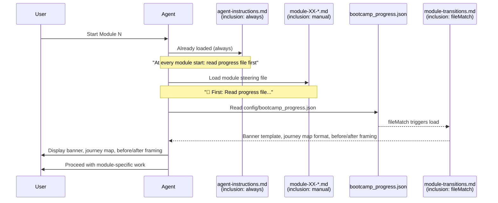

# Design Document

## Overview

This design documents the module transition enforcement mechanism that ensures the agent always displays the module start banner, journey map, and before/after framing when beginning any bootcamp module.

The root cause of the original problem was a gap between intent and mechanism: `module-transitions.md` uses `inclusion: fileMatch` on `config/bootcamp_progress.json`, meaning its instructions only load when the progress file is read. But no steering file explicitly told the agent to read the progress file at module start. The fix is a two-layer reinforcement strategy — a central instruction in `agent-instructions.md` plus per-module reminders in all 13 module steering files.

No code, APIs, or runtime logic are involved. The entire implementation consists of text edits to existing steering files.

## Architecture

The mechanism relies on the existing Kiro steering file inclusion system:

The architecture has two reinforcement layers:

1. **Central instruction** (agent-instructions.md, `inclusion: always`): A paragraph in the Module Steering section that explicitly directs the agent to read the progress file first at every module start. This is loaded on every session.

2. **Per-module reminder** (each module-XX steering file, `inclusion: manual`): A `🚀 First:` line placed immediately after the heading, before any module-specific content. This catches the agent even if it somehow skips the central instruction.

Both layers point to the same action: read `config/bootcamp_progress.json`, which triggers `module-transitions.md` via `fileMatch`, which contains the banner template, journey map format, and before/after framing instructions.

## Components and Interfaces

### Component 1: Central Instruction in agent-instructions.md

**Location:** `senzing-bootcamp/steering/agent-instructions.md`, within the "Module Steering" section.

**Content added:**

> **At every module start:** Read `config/bootcamp_progress.json` first (this triggers `module-transitions.md` loading), then display the module start banner, journey map, and before/after framing BEFORE doing any module-specific work. Never skip these — they orient the user.

**Placement:** After the paragraph listing which steering files to load for which modules, before the Module 12 platform files paragraph.

**Interface:** This is a natural-language instruction consumed by the agent. It has no programmatic interface.

### Component 2: Per-Module Reminder Line

**Location:** All 13 module steering files (`module-00-sdk-setup.md` through `module-12-deployment.md`).

**Content added (identical in each file):**

> **🚀 First:** Read `config/bootcamp_progress.json` and follow `module-transitions.md` — display the module start banner, journey map, and before/after framing before proceeding.

**Placement:** Immediately after the `# Module N: [Name]` heading, before the `> **User reference:**` line.

**Interface:** Natural-language instruction consumed by the agent. No programmatic interface.

### Component 3: module-transitions.md (existing, unchanged)

**Location:** `senzing-bootcamp/steering/module-transitions.md`

**Inclusion:** `fileMatch` on `config/bootcamp_progress.json`

**Role:** Contains the actual templates and formatting rules for the module start banner, journey map table, before/after framing, step-level progress, and module completion summary. This file is not modified by this feature — it is the target that the enforcement mechanism ensures gets loaded.

### Interaction Between Components

| Component | Role | Inclusion Type |
|---|---|---|
| agent-instructions.md | Central "read progress file first" directive | `always` |
| module-XX-*.md (×13) | Per-module `🚀 First:` reminder | `manual` |
| module-transitions.md | Banner/journey/framing templates | `fileMatch` on progress file |
| bootcamp_progress.json | Trigger file for fileMatch loading | Data file |

## Data Models

No data models are introduced or modified. The existing data files are:

- **config/bootcamp_progress.json**: Existing progress tracking file. Its structure is unchanged. Reading it is the trigger mechanism.
- **config/bootcamp_preferences.yaml**: Existing preferences file referenced by the journey map (for the user's selected module path). Unchanged.

## Error Handling

Since this feature consists entirely of steering file text, traditional error handling does not apply. The failure modes and mitigations are:

| Failure Mode | Mitigation |
|---|---|
| Agent ignores central instruction in agent-instructions.md | Per-module `🚀 First:` reminder provides redundant reinforcement |
| Agent ignores per-module `🚀 First:` reminder | Central instruction in always-loaded agent-instructions.md provides redundant reinforcement |
| Progress file does not exist yet (first-time user) | The agent-instructions.md session-start rule already handles this: "If not exists, load onboarding-flow.md" — module transitions only apply after onboarding |
| module-transitions.md fails to load via fileMatch | The agent still has the explicit instruction text telling it what to display, though it won't have the exact templates |

## Testing Strategy

Property-based testing does not apply to this feature. The implementation consists entirely of text additions to steering files — there are no functions, no inputs/outputs, no runtime logic, and no code to execute. PBT requires functions with meaningful input variation, which does not exist here.

### Appropriate Testing Approaches

**Manual verification (primary):**

- Start each of the 13 modules in a bootcamp session and confirm the agent displays the banner, journey map, and before/after framing before module-specific work.

**Text content verification (automated, example-based):**

- Verify `agent-instructions.md` contains the "At every module start" paragraph in the Module Steering section.
- Verify all 13 module steering files (`module-00` through `module-12`) contain the `🚀 First:` reminder line.
- Verify the `🚀 First:` line appears before the `User reference` line in each file.
- Verify `module-transitions.md` has `fileMatch` inclusion on `bootcamp_progress.json`.

These are simple grep/content checks — example-based tests with specific expected strings. A shell script or CI check can validate all four conditions.
