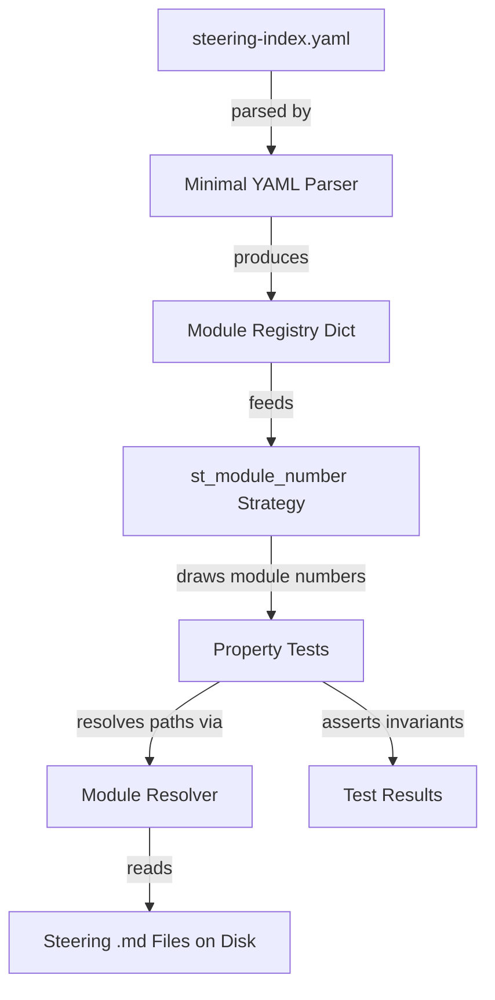

# Design Document: Module Transition Validation Tests

## Overview

This feature adds property-based tests that validate structural invariants across all module steering files in the senzing-bootcamp power. The tests use pytest and Hypothesis to draw module numbers from the steering index (`steering-index.yaml`) and verify that each module's steering files follow the transition pattern defined in `module-transitions.md`.

The test suite validates three core invariants:
1. Every root module file references `module-transitions.md`
2. Every root module file contains a `**Before/After**` section
3. Every module has a success indicator (`**Success` or ✅) in the appropriate file

A custom minimal YAML parser (no PyYAML dependency) reads the steering index, consistent with the project's test conventions.

## Architecture

The test suite is a single pytest file that reads the steering index at test-collection time and uses Hypothesis strategies to generate module numbers for property-based validation.



**Design decisions:**

- **Single file, no production code**: The test file is self-contained. The YAML parser, module resolver, and validation logic all live in the test file. There is no production code to ship — this is purely a CI validation tool.
- **Custom YAML parser**: The project convention forbids PyYAML in test files. The steering index uses a simple subset of YAML (scalar values, nested maps with known keys), so a line-based parser suffices.
- **Hypothesis over parametrize**: Using `@given` with a strategy that draws from the steering index means new modules are automatically covered without updating the test file. The `@settings(max_examples=100)` ensures thorough coverage even though the module set is finite — Hypothesis will exercise each module multiple times.

## Components and Interfaces

### 1. Minimal YAML Parser (`parse_steering_index`)

```python
def parse_steering_index(path: Path) -> dict:
    """Parse the steering-index.yaml modules section.

    Args:
        path: Path to steering-index.yaml.

    Returns:
        Dict mapping module numbers (int) to either a filename string
        (single-file module) or a dict with 'root' and 'phases' keys
        (multi-phase module).

    Raises:
        FileNotFoundError: If the steering index file does not exist.
        ValueError: If the YAML structure is malformed.
    """
```

Parses only the `modules:` top-level key. Handles two entry formats:
- Simple: `2: module-02-sdk-setup.md` → `{2: "module-02-sdk-setup.md"}`
- Complex: module with `root` and `phases` containing `file` and `step_range` → `{1: {"root": "module-01-business-problem.md", "phases": {...}}}`

### 2. Module Resolver (`resolve_module_files`)

```python
@dataclass
class ModuleFiles:
    """Resolved file paths for a single module."""
    module_number: int
    root_file: Path
    last_phase_file: Path
    all_phase_files: list[Path]

def resolve_module_files(
    module_number: int,
    entry: str | dict,
    steering_dir: Path,
) -> ModuleFiles:
    """Resolve a steering index entry to concrete file paths.

    Args:
        module_number: The module number from the steering index.
        entry: The steering index value — a filename string or a dict
               with 'root' and 'phases' keys.
        steering_dir: Path to the steering directory.

    Returns:
        ModuleFiles with resolved paths.

    Raises:
        FileNotFoundError: If any referenced file does not exist on disk.
    """
```

For single-file entries, `root_file` and `last_phase_file` are the same path. For multi-phase entries, `last_phase_file` is the phase whose `step_range` has the highest second element.

### 3. Hypothesis Strategy (`st_module_number`)

```python
def st_module_number() -> st.SearchStrategy[int]:
    """Hypothesis strategy that draws from the steering index module numbers."""
```

Uses `st.sampled_from()` over the set of module numbers parsed from the steering index. The index is parsed once at module level (not per-test).

### 4. Validation Functions

```python
def has_transition_reference(content: str) -> bool:
    """Check if file content contains a reference to module-transitions.md."""

def has_before_after_section(content: str) -> bool:
    """Check if file content contains a **Before/After** section."""

def has_success_indicator(content: str) -> bool:
    """Check if file content contains **Success or ✅ emoji."""
```

Pure functions that take file content as a string and return a boolean. These are the core assertions used by the property tests.

### 5. Test Class (`TestModuleTransitionProperties`)

Class-based test organization with one method per property. Each method uses `@given(module_num=st_module_number())` and `@settings(max_examples=100)`.

## Data Models

### Steering Index Structure (parsed subset)

```python
@dataclass
class PhaseInfo:
    """A single phase within a multi-phase module."""
    file: str
    step_range: tuple[int, int]

@dataclass
class ModuleEntry:
    """A module entry from the steering index."""
    module_number: int
    root_file: str
    phases: dict[str, PhaseInfo] | None  # None for single-file modules

@dataclass
class ModuleFiles:
    """Resolved file paths for a module."""
    module_number: int
    root_file: Path
    last_phase_file: Path
    all_phase_files: list[Path]
```

### Steering Index YAML Format

Two entry types in the `modules:` map:

**Single-file module:**
```yaml
2: module-02-sdk-setup.md
```

**Multi-phase module:**
```yaml
1:
  root: module-01-business-problem.md
  phases:
    phase1-discovery:
      file: module-01-business-problem.md
      step_range: [1, 9]
    phase2-document-confirm:
      file: module-01-phase2-document-confirm.md
      step_range: [10, 18]
```

## Correctness Properties

*A property is a characteristic or behavior that should hold true across all valid executions of a system — essentially, a formal statement about what the system should do. Properties serve as the bridge between human-readable specifications and machine-verifiable correctness guarantees.*

### Property 1: Transition Reference Invariant

*For any* module number drawn from the steering index, the root module file SHALL contain a line with the string `module-transitions.md`.

**Validates: Requirements 1.1, 1.3**

### Property 2: Before/After Section Invariant

*For any* module number drawn from the steering index, the root module file SHALL contain a line with the string `**Before/After**`.

**Validates: Requirements 2.1, 2.3**

### Property 3: Success Indicator Invariant

*For any* module number drawn from the steering index, the appropriate file (root file for single-file modules, last phase sub-file for multi-phase modules) SHALL contain a line with `**Success` or the ✅ emoji.

**Validates: Requirements 3.1, 3.2, 3.4**

### Property 4: File Resolution Completeness

*For any* module number drawn from the steering index, all files referenced by that module entry (root file and all phase sub-files) SHALL exist on disk.

**Validates: Requirements 4.2, 5.2, 5.3, 5.4**

## Error Handling

| Scenario | Behavior |
|---|---|
| Steering index file missing | `FileNotFoundError` raised with clear message identifying the expected path |
| Malformed YAML in steering index | `ValueError` raised identifying the problematic line |
| Module file referenced in index does not exist on disk | `FileNotFoundError` raised identifying the missing file path and module number |
| Steering index has no `modules:` key | `ValueError` raised indicating the key is missing |
| Phase entry missing `file` or `step_range` | `ValueError` raised identifying the incomplete phase entry |

All errors surface as test failures with descriptive messages — no silent skipping.

## Testing Strategy

### Property-Based Tests (Hypothesis)

The test suite uses Hypothesis with `@settings(max_examples=100)` for each property test. The `st_module_number` strategy draws from the actual steering index, so new modules are automatically covered.

**Property tests** (4 tests, one per correctness property):
- `test_transition_reference_in_root_files` — Property 1
- `test_before_after_section_in_root_files` — Property 2
- `test_success_indicator_in_appropriate_file` — Property 3
- `test_all_referenced_files_exist` — Property 4

Each test is tagged with: `Feature: module-transition-validation-tests, Property {N}: {title}`

**PBT library**: Hypothesis (already a project dependency for tests)
**Minimum iterations**: 100 per property test

### Unit Tests (Example-Based)

Not needed as separate tests. The property tests themselves exercise the real steering files on disk. Error reporting (Requirements 1.2, 2.2, 3.3) is validated implicitly — if a file lacks the required pattern, the property test fails with a descriptive assertion message that includes the module number and file path.

### Test File Structure

```
senzing-bootcamp/tests/test_module_transition_properties.py
├── parse_steering_index()          # Minimal YAML parser
├── resolve_module_files()          # Module number → file paths
├── has_transition_reference()      # Content checker
├── has_before_after_section()      # Content checker
├── has_success_indicator()         # Content checker
├── st_module_number()              # Hypothesis strategy
└── class TestModuleTransitionProperties
    ├── test_transition_reference_in_root_files()
    ├── test_before_after_section_in_root_files()
    ├── test_success_indicator_in_appropriate_file()
    └── test_all_referenced_files_exist()
```

### What Is NOT Tested with PBT

- YAML parser correctness against arbitrary YAML — the parser only needs to handle the known steering index format. A round-trip property would require a YAML serializer we don't have.
- Error message formatting — validated by assertion messages in the property tests themselves.
- Test file location and naming conventions (Requirement 6) — structural constraints verified by code review and CI.
