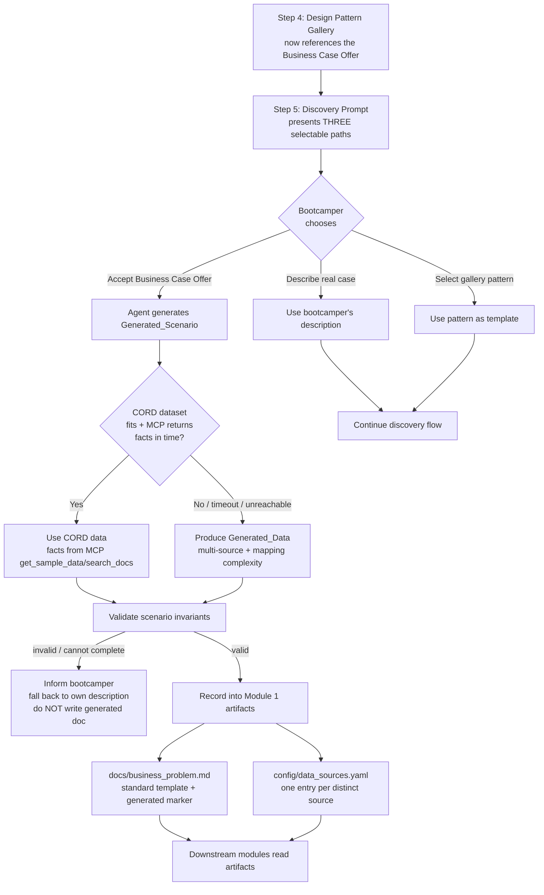

# Design Document

## Overview

This feature adds a **third path** — the `Business_Case_Offer` — to the Module 1 discovery
flow, alongside the two existing paths (describe a real case, or adopt a
`Design_Pattern_Gallery` entry). When the bootcamper accepts the offer, the Bootcamp generates
a complete `Generated_Scenario` (problem description, exactly one use-case category, a
definition of success) backed by realistic, multi-source, mapping-complexity-rich
`Scenario_Data`, and records it into the **same Module 1 artifacts a real case would produce** —
`docs/business_problem.md` and `config/data_sources.yaml` — so every downstream module operates
on the generated scenario without the bootcamper supplying or inventing real data.

The bootcamp is delivered as a Kiro Power whose behavior is driven by **Markdown steering files**
that instruct the Agent. Accordingly, this feature is realized through two surfaces:

1. **Steering edits** that surface the offer and define the generation/recording behavior — the
   primary deliverable, edited in `senzing-bootcamp/steering/module-01-phase1-discovery.md`
   (Steps 4 and 5) and `module-01-phase2-document-confirm.md` (Step 12 recording), plus a small
   reference in `design-patterns.md`.
2. **A pure-Python validation/recording helper** (`senzing-bootcamp/scripts/business_case_offer.py`)
   that models a `Generated_Scenario`, validates its invariants (multi-source, mapping
   complexity, recognized category, completeness), renders the `Business_Problem_Document` body,
   and records `Scenario_Data` sources into the `data_sources.yaml` registry. This module is the
   machine-verifiable surface and the target of property-based testing.

Consistent with the bootcamp's core constraint, **all Senzing-specific facts — including CORD
dataset names, contents, and availability — are retrieved from the Senzing MCP server at
runtime** (via `get_sample_data` / `search_docs` / `get_capabilities`), never from training data
or hardcoded figures. When the MCP server does not return CORD details within the timeout or
cannot be reached, the Agent omits the unavailable CORD facts and produces synthetic
`Generated_Data` that still satisfies the multi-source and mapping-complexity criteria.

### Research Notes

Findings from the existing power that inform this design:

- **Discovery flow shape** (`module-01-phase1-discovery.md`): Step 3 offers the gallery; Step 4
  presents `Design_Pattern_Gallery` entries and lets the bootcamper select one as a template;
  Step 5 is the open-ended `Discovery_Prompt` (with a variant for when a pattern was selected).
  Each interactive question ends with a 🛑 STOP marker so the Agent waits for real input — the
  offer must follow this same convention so it cannot self-accept (supports 1.6).
- **Artifact production** (`module-01-phase2-document-confirm.md`): Step 12 writes
  `docs/business_problem.md` from a fixed template (Problem Description, Use Case Category, Data
  Sources, Key Matching Criteria, Success Criteria, …). The `Generated_Scenario` reuses this
  exact template so downstream modules cannot distinguish it structurally (supports 4.1).
- **Recognized categories** (Step 6/11 + `design-patterns.md`): Customer 360, Fraud Detection,
  Data Migration, Compliance, Marketing, Healthcare, Supply Chain, KYC, Insurance, Vendor MDM.
  The validator pins this set (supports 2.2).
- **Data source registry** (`scripts/data_sources.py`): `config/data_sources.yaml` is a
  versioned registry with a custom stdlib YAML parser/serializer (`parse_registry_yaml`,
  `serialize_registry_yaml`, `Registry`, `RegistryEntry`). Recording scenario sources reuses this
  module so a downstream module reads them with the same code path (supports 4.2, 5.1, 5.2).
- **CORD via MCP** (`POWER.md`, `design-patterns.md`, `cord_metadata.py`): CORD has three
  ready-made datasets (Las Vegas, London, Moscow) downloaded with `get_sample_data`; steering
  already mandates `search_docs` for live facts and forbids hardcoded figures. This feature
  follows the established 30-second-timeout / 1-retry MCP fallback pattern used by Step 6d's
  license-guidance flow (supports 6.1–6.4).

## Architecture

The offer is a branch inside the existing Module 1 discovery flow. Nothing downstream changes
shape — the generated scenario simply populates the standard artifacts.



### Key architectural decisions

- **Steering-first, helper-validated.** Behavior lives in steering (how the Power works); the
  Python helper exists to make the artifact invariants deterministic and testable, and to be
  callable from CI. The helper does not call the MCP server or the Agent — it operates on data
  the Agent has already gathered, keeping it a pure, fast, property-testable unit.
- **Reuse the real-case artifacts.** The generated scenario is written through the same
  `business_problem.md` template and the same `data_sources.yaml` registry module as a real case,
  so `Downstream_Modules` need no awareness of the offer (4.1, 5.1, 5.2).
- **MCP is the only source of CORD facts.** The helper never embeds CORD names/counts; those flow
  from MCP at runtime. The helper only records what the Agent supplies and validates structure.
- **Acceptance gating in steering.** The offer follows the 🛑 STOP convention so the Agent cannot
  produce a `Generated_Scenario` without explicit acceptance (1.6).

## Components and Interfaces

### 1. Steering: `module-01-phase1-discovery.md`

- **Step 4 (Design Pattern Gallery):** add a sentence referencing the `Business_Case_Offer` as an
  available path the bootcamper may select (1.4).
- **Step 5 (Discovery Prompt):** restructure the single open-ended question into **three
  separately selectable paths** (1.1, 1.5):
  1. Describe a real business case.
  2. Adopt a `Design_Pattern_Gallery` entry.
  3. Accept the `Business_Case_Offer`.
  The offer text states it applies both when the bootcamper has *no* case and when they have one
  but *won't share* it (1.2), and that the Bootcamp will generate a realistic, multi-source
  scenario enabling completion of the full bootcamp without supplying or inventing a case (1.3).
  A 🛑 STOP marker ensures no scenario is produced before explicit acceptance (1.6).
- **Acceptance branch:** on acceptance, generate the scenario (Component 3), determine CORD vs.
  generated data via MCP (Component 4), validate, and on success record artifacts (Component 2);
  on decline, continue with the bootcamper's own description and write no generated document
  (2.4); on generation failure, inform and fall back without writing (2.5).

### 2. Steering: `module-01-phase2-document-confirm.md` (Step 12 recording)

When a `Generated_Scenario` is in effect, Step 12 writes the standard
`docs/business_problem.md` template **plus an observable bootcamp-generated marker** (4.3) and
records each distinct `Scenario_Data` source into `config/data_sources.yaml` (4.2). The document
contains the problem description, use-case category, data sources, and definition of success
(4.4) regardless of registry recording.

### 3. Validation/recording helper: `scripts/business_case_offer.py`

A new stdlib-only Python module following `python-conventions.md`. Public surface:

```python
RECOGNIZED_CATEGORIES: frozenset[str]   # the 10 Module 1 categories
GENERATED_MARKER: str                   # observable marker text for generated cases

@dataclass
class ScenarioDataSource:
    name: str                  # distinct, non-empty source identifier
    fields: list[str]          # attribute/field names contributed by this source
    records: list[dict]        # >= 1 record per source

@dataclass
class GeneratedScenario:
    problem_description: str
    use_case_category: str
    success_definition: str
    data_sources: list[ScenarioDataSource]
    provenance: str                       # "cord" | "generated"
    selected_pattern_category: str | None # set when a gallery pattern was selected first

def validate_scenario(s: GeneratedScenario) -> list[str]:
    """Return a list of invariant violations; empty list means valid."""

def detect_mapping_complexity(sources: list[ScenarioDataSource]) -> set[str]:
    """Return the transformation types present:
    {"differing_field_names", "combine_or_split", "inconsistent_formatting"}."""

def render_business_problem(s: GeneratedScenario) -> str:
    """Render the business_problem.md body (standard template + generated marker)."""

def record_data_sources(s: GeneratedScenario) -> str:
    """Serialize one registry entry per distinct source to data_sources.yaml text,
    reusing scripts/data_sources.py serialization."""

def main(argv: list[str] | None = None) -> int:
    """CLI: `validate` subcommand checks an existing business_problem.md +
    data_sources.yaml pair for the generated-scenario invariants."""
```

The module imports `data_sources.py` (registry serialize/parse) via the `sys.path` pattern so
recording and read-back share the downstream code path.

### 4. MCP integration (steering-described, runtime)

The Agent retrieves CORD facts during the active session (6.1, 6.2):

- `get_sample_data` / `search_docs(query='CORD datasets ...')` to learn CORD dataset names,
  contents, and availability — present exactly what is returned, never a static figure.
- Follow the existing 30-second timeout / single-retry pattern: if MCP does not return CORD
  details in time or cannot be reached after one retry, **omit** CORD facts, inform the
  bootcamper that CORD details are unavailable from the MCP server (6.4), and produce
  `Generated_Data` satisfying the multi-source and mapping-complexity criteria (6.3, 3.5).

### 5. CI integration

`business_case_offer.py validate` is runnable in CI (and locally) to confirm a recorded
generated scenario satisfies its invariants. New tests live in `senzing-bootcamp/tests/`.

## Data Models

### GeneratedScenario

| Field | Type | Constraints |
|---|---|---|
| `problem_description` | `str` | non-empty after trim (2.1) |
| `use_case_category` | `str` | exactly one value ∈ `RECOGNIZED_CATEGORIES` (2.1, 2.2) |
| `success_definition` | `str` | non-empty after trim (2.1) |
| `data_sources` | `list[ScenarioDataSource]` | ≥ 2 distinct names; each ≥ 1 record (3.1) |
| `provenance` | `str` | `"cord"` or `"generated"` (3.3) |
| `selected_pattern_category` | `str \| None` | if set, must equal `use_case_category` (2.3) |

### ScenarioDataSource

| Field | Type | Constraints |
|---|---|---|
| `name` | `str` | non-empty, unique across the scenario |
| `fields` | `list[str]` | attribute names; compared across sources for complexity (3.2) |
| `records` | `list[dict]` | length ≥ 1 (3.1) |

### Mapping complexity (3.2)

`detect_mapping_complexity` returns the subset of:

- `differing_field_names` — two sources use different field names for the same concept.
- `combine_or_split` — a field in one source maps to multiple Senzing fields (or vice versa).
- `inconsistent_formatting` — the same logical attribute is formatted differently across sources.

A valid scenario requires **at least one** of these present.

### Business_Problem_Document (`docs/business_problem.md`)

Reuses the existing Step 12 template sections (Problem Description, Use Case Category, Data
Sources, Key Matching Criteria, Success Criteria, …) and adds the `GENERATED_MARKER` (4.3). Must
contain problem description, use-case category, all data sources, and definition of success
(4.1, 4.4).

### Data_Sources_Config (`config/data_sources.yaml`)

Existing versioned registry (`scripts/data_sources.py`). One `RegistryEntry` per distinct
`ScenarioDataSource`; the number of recorded entries equals the number of distinct sources (4.2),
and read-back returns every recorded source (5.1, 5.2).

## Correctness Properties

*A property is a characteristic or behavior that should hold true across all valid executions of
a system — essentially, a formal statement about what the system should do. Properties serve as
the bridge between human-readable specifications and machine-verifiable correctness guarantees.*

These properties target the pure logic in `scripts/business_case_offer.py` (scenario validation,
mapping-complexity detection, document rendering, and registry recording/round-trip). Each is
implemented as a single property-based test using Hypothesis, run at the active profile's example
count (≥100 under the `thorough`/CI profile). Acceptance criteria that describe steering content,
agent decisions, or runtime MCP behavior are covered by example and integration tests in the
Testing Strategy section rather than by properties.

### Property 1: Generated scenario has a valid shape

*For any* `GeneratedScenario`, `validate_scenario` reports no violations **iff** the problem
description is non-empty (after trimming), the definition of success is non-empty (after
trimming), and the use-case category is exactly one value drawn from `RECOGNIZED_CATEGORIES`; any
scenario with an empty/whitespace description or success, or a category outside the recognized
set, is rejected.

**Validates: Requirements 2.1, 2.2**

### Property 2: Scenario category matches a selected pattern

*For any* `GeneratedScenario` whose `selected_pattern_category` is set, `validate_scenario`
reports no category-mismatch violation **iff** `selected_pattern_category` equals
`use_case_category`.

**Validates: Requirements 2.3**

### Property 3: Scenario data is multi-source with known provenance

*For any* valid `GeneratedScenario` (regardless of whether its provenance is `"cord"` or
`"generated"`), the `Scenario_Data` contains two or more distinctly named sources, each
contributing at least one record, and the provenance is one of `{"cord", "generated"}`.

**Validates: Requirements 3.1, 3.3, 3.5**

### Property 4: Scenario data exhibits mapping complexity

*For any* valid `GeneratedScenario` (CORD-sourced or generated), `detect_mapping_complexity`
returns a non-empty subset of `{differing_field_names, combine_or_split, inconsistent_formatting}`
— i.e., the data requires at least one transformation when mapped to the Senzing Entity
Specification.

**Validates: Requirements 3.2, 3.5**

### Property 5: Business problem document is complete and marked generated

*For any* valid `GeneratedScenario`, the output of `render_business_problem` contains the
scenario's problem description, its use-case category, every distinct data source, the definition
of success, and the observable bootcamp-generated marker (`GENERATED_MARKER`), arranged in the
standard Module 1 problem-statement structure.

**Validates: Requirements 4.1, 4.3, 4.4**

### Property 6: Data source recording round-trips

*For any* valid `GeneratedScenario`, recording its `Scenario_Data` via `record_data_sources` and
then reading the result back through the `data_sources.yaml` registry parser yields exactly the
set of distinct source names, with the number of recorded entries equal to the number of distinct
sources — so a downstream module obtains every recorded source.

**Validates: Requirements 4.2, 5.1, 5.2**

## Error Handling

| Condition | Requirement | Handling |
|---|---|---|
| Offer not explicitly accepted | 1.6 | 🛑 STOP marker in steering halts before generation; no `Generated_Scenario` is produced. |
| Bootcamper declines the offer | 2.4 | Continue the discovery flow with the bootcamper's own description; do not produce a scenario or write a generated `business_problem.md`. |
| Scenario generation cannot complete | 2.5 | Agent informs the bootcamper and falls back to their own description; no `Business_Problem_Document` is written from a scenario. `validate_scenario` returning violations is treated as "cannot complete". |
| No CORD dataset fits the scenario | 3.5 | Produce `Generated_Data` that still satisfies multi-source (3.1) and mapping-complexity (3.2) criteria; provenance recorded as `"generated"`. |
| MCP returns no CORD details within 30s, or unreachable after 1 retry | 6.3, 6.4 | Omit the unavailable CORD facts, inform the bootcamper that CORD details are unavailable from the MCP server, and fall back to `Generated_Data`. Mirrors the Step 6d license-flow timeout/retry pattern. |
| Writing `business_problem.md` or `data_sources.yaml` fails | 4.5 | Indicate the error (which artifact failed) and inform the bootcamper rather than proceeding silently. |
| Artifacts missing/unreadable when a downstream module requests them | 5.4 | Inform the bootcamper the `Generated_Scenario` data is unavailable and allow them to supply real data to proceed. The registry parser degrades gracefully (no exception) so a missing/garbled file is reported, not crashed on. |

The Python helper itself raises no exceptions for invalid input: `validate_scenario` returns a
list of human-readable violation strings (empty when valid), and registry read-back reuses the
existing tolerant parser in `data_sources.py`.

## Testing Strategy

### Dual approach

- **Property-based tests** (Hypothesis) verify the six universal properties across many generated
  scenarios — this is where the bulk of correctness coverage lives.
- **Example/unit tests** verify specific steering content and concrete edge cases.
- **Integration tests** verify the runtime MCP-sourcing behavior is *mandated by steering* (the
  live MCP call itself is exercised by the Agent at runtime, not in unit tests).

### Property-based tests

Located in `senzing-bootcamp/tests/test_business_case_offer_properties.py`, following
`python-conventions.md`: `from __future__ import annotations`, stdlib + pytest + Hypothesis only,
class-based organization, `st_`-prefixed strategies, `@given` decorators with example counts
supplied by the active Hypothesis profile (no inline `@settings(max_examples=...)` restating the
baseline; CI runs the `thorough` profile at 100). The script is imported via the `sys.path`
manipulation pattern. Each test is tagged with a comment of the form:

`# Feature: module1-business-case-offer, Property N: <property text>`

| Test | Property | Generators |
|---|---|---|
| `test_valid_scenario_shape` | 1 | `st_scenario()` plus deliberately-invalid variants (empty/whitespace description/success, off-list category) |
| `test_category_matches_selected_pattern` | 2 | scenarios with `selected_pattern_category` set to matching and mismatching values |
| `test_data_is_multi_source` | 3 | `st_scenario_data()` over both provenances; min 2 sources, ≥1 record each |
| `test_mapping_complexity_present` | 4 | data with at least one transformation trait injected |
| `test_business_problem_completeness` | 5 | `st_scenario()`; assert all content elements + marker present |
| `test_recording_round_trip` | 6 | `st_scenario()`; record then parse back, compare distinct source sets and counts |

### Unit / example tests

Located in `senzing-bootcamp/tests/test_business_case_offer_steering.py` (steering content) and
the same properties file for code edge cases:

- **Steering content (1.1, 1.2, 1.3, 1.4, 1.5, 1.6):** parse `module-01-phase1-discovery.md` and
  assert Step 5 presents the three selectable paths including the offer, the offer text covers
  both "no case" and "won't share", describes realistic multi-source generation, Step 4
  references the offer, and a 🛑 STOP marker precedes generation.
- **Steering branches (2.4, 2.5, 4.5, 5.4, 6.4):** assert the decline branch continues without
  writing a generated doc; the generation-failure and write-failure branches inform and fall
  back; the downstream-missing-artifact branch informs and allows real data; the CORD-unavailable
  message is present.
- **No hardcoded CORD facts (6.2):** assert `business_case_offer.py` contains no CORD dataset
  names or record counts (the only allowed source is MCP at runtime).
- **Recognized-category set:** assert `RECOGNIZED_CATEGORIES` equals the 10 Module 1 categories.

### Integration tests (MCP-sourcing — 3.4, 6.1, 6.3)

These verify the *contract* that CORD facts come from MCP and that the timeout/retry fallback is
specified, with 1–3 representative checks (not property-based, since behavior does not vary
meaningfully with input and the cost of repeated live calls is high):

- Assert `module-01-phase1-discovery.md` Step 5 / acceptance branch instructs the Agent to call
  `get_sample_data` / `search_docs` for CORD details and to present returned values verbatim.
- Assert the steering encodes the 30-second timeout and single-retry fallback to `Generated_Data`,
  consistent with the existing Step 6d pattern.

### CI

The new tests run in the existing pytest stage of `validate-power.yml`. The new steering edits
must keep `validate_commonmark.py` and `measure_steering.py --check` green (CommonMark validity
and steering token budgets), and `business_case_offer.py validate` is available as a CLI check for
a recorded generated scenario.

### Why these tests fit

Property-based testing applies here because the helper is pure logic over a large input space
(arbitrary scenarios and multi-source datasets) with clear universal invariants — round-trips
(Property 6), structural completeness (Property 5), and data invariants (Properties 1–4). The
steering-content, agent-decision, and live-MCP criteria are not pure functions over varied input,
so they are covered by example and integration tests instead.
