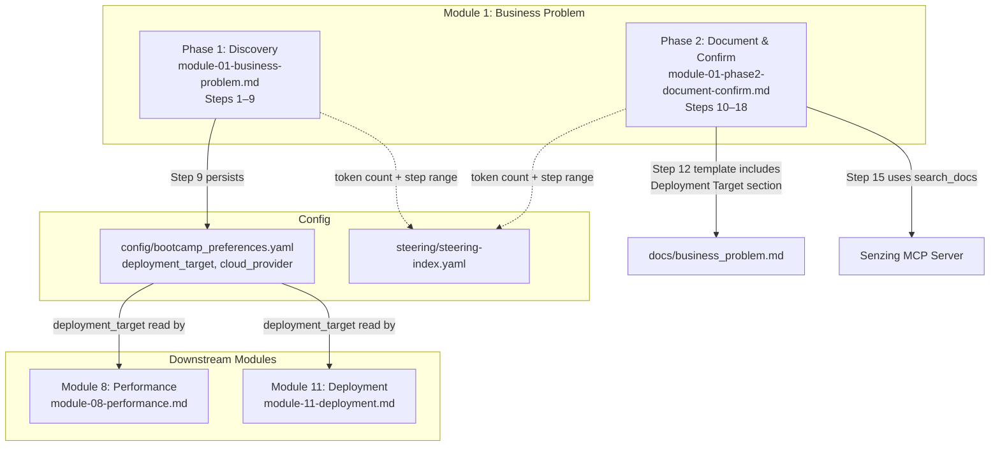

# Design Document

## Overview

This feature adds two new capabilities to Module 1 (Business Problem) of the Senzing Bootcamp:

1. **Deployment Target Discovery (Phase 1, new Step 9)** — A new step after the existing Step 8 (software integration question) that asks the bootcamper where they intend to deploy their entity resolution solution. Options are organized into categories: cloud hyperscalers (AWS, Azure, GCP), container platforms (Kubernetes, Docker Swarm), local/on-premises (current machine, other internal infrastructure), and "not sure yet." The step includes a reassurance that development proceeds locally first. The choice is persisted to `config/bootcamp_preferences.yaml` as `deployment_target`, and if a cloud hyperscaler is selected, also as `cloud_provider`.

2. **Senzing Value Restatement (Phase 2, new Step 15)** — A new step inserted after the solution approach step that contextually explains why Senzing entity resolution matters for the bootcamper's specific problem. The agent uses the Senzing MCP server's `search_docs` tool to retrieve current value proposition content and ties it to the bootcamper's use case, data sources, and goals.

These additions require downstream changes:
- **Phase 2 renumbering**: Steps shift from 9–16 to 10–18 (8 original steps + 1 new value restatement step).
- **Business problem template update**: A new "Deployment Target" section in the `docs/business_problem.md` template.
- **Module 11**: Step 1 updated to check for pre-existing `deployment_target` and confirm rather than re-ask.
- **Module 8**: Updated to read `deployment_target` alongside `cloud_provider` for performance target guidance.
- **Steering index**: Updated token counts and step ranges for modified files.

All changes are to steering files (markdown with YAML frontmatter). No Python scripts are created or modified. Tests validate structural properties of the modified steering files.

## Architecture

This feature modifies the steering file layer of the Senzing Bootcamp power. No new components are introduced — the changes extend existing steering files and the steering index.



### Data Flow

1. **Phase 1 Step 9** asks the deployment question → persists `deployment_target` (and optionally `cloud_provider`) to `config/bootcamp_preferences.yaml`.
2. **Phase 2 Step 12** (renumbered from 11) includes the deployment target in the `docs/business_problem.md` template.
3. **Phase 2 Step 15** (new) uses `search_docs` to retrieve Senzing value content and presents a contextual value restatement.
4. **Module 8** reads `deployment_target` from preferences to inform performance target guidance.
5. **Module 11 Step 1** checks for pre-existing `deployment_target` and confirms rather than re-asking.

### Design Decisions

1. **Step 9 placement after Step 8**: The deployment question follows naturally after the software integration question — the bootcamper has just described their integration targets, so asking about deployment infrastructure is a logical next question. This also means `cloud_provider` can be set early, potentially informing the Module 7→8 gate (though `cloud-provider-setup.md` still runs at that gate as a confirmation/override point).

2. **Dual persistence (`deployment_target` + `cloud_provider`)**: When a cloud hyperscaler is selected, we persist both fields. `cloud_provider` uses the same value format as `cloud-provider-setup.md` (`aws`, `azure`, `gcp`) for backward compatibility. `deployment_target` uses a more descriptive value that includes non-cloud options. This avoids breaking existing Module 8/11 logic that reads `cloud_provider`.

3. **Phase 2 renumbering to 10–18 (not 10–17)**: The requirements specify renumbering to accommodate both the new Phase 1 step (shifting Phase 2 start from 9 to 10) and the new value restatement step within Phase 2 (adding one more step). Original Phase 2 had 8 steps (9–16). After renumbering: 8 original steps become 10–17, plus the new value restatement step at 15 pushes the remaining steps to end at 18. Total Phase 2 steps: 9 (10–18).

4. **Value restatement uses MCP `search_docs`**: Rather than embedding static marketing content in the steering file, the agent retrieves current value proposition content from the Senzing MCP server. This keeps the content fresh and authoritative.

5. **"Not sure yet" maps to `undecided`**: This is a valid state that Module 11 treats as "not yet captured" — it re-asks the full question. This avoids forcing a premature decision while still recording that the question was asked.

## Components and Interfaces

### Modified Files

| File | Change Summary |
|------|---------------|
| `steering/module-01-business-problem.md` | Add Step 9 (deployment target), update Phase 2 reference to "Steps 10–18" |
| `steering/module-01-phase2-document-confirm.md` | Renumber steps 10–18, add Deployment Target to template, add value restatement step (Step 15) |
| `steering/module-11-deployment.md` | Update Step 1 to check `deployment_target` from preferences |
| `steering/module-08-performance.md` | Add `deployment_target` read alongside `cloud_provider` |
| `steering/steering-index.yaml` | Update token counts and step ranges for Module 1 phases |

### Phase 1 Step 9: Deployment Target Discovery

The new step follows the one-question-at-a-time pattern established by existing steps:

- Present deployment options organized by category
- Include reassurance about local development first
- Persist choice to `config/bootcamp_preferences.yaml`
- If cloud hyperscaler → also persist as `cloud_provider`
- If "not sure yet" → persist `deployment_target: undecided`
- Write checkpoint to `config/bootcamp_progress.json`

### Phase 2 Value Restatement Step (Step 15)

Inserted after the solution approach step (Step 14, renumbered from 13) and before the confirmation step (Step 16, renumbered from 14):

- Agent calls `search_docs(query='value proposition <use_case_category>', version='current')`
- Ties the value explanation to the bootcamper's specific problem, data sources, and desired outcomes
- Explains what entity resolution does in terms of the bootcamper's data and goals
- If integration targets were identified in Step 8, explains how Senzing fits alongside those systems
- Writes checkpoint to `config/bootcamp_progress.json`

### Phase 2 Step Renumbering Map

| Original Step | New Step | Content |
|--------------|----------|---------|
| 9 | 10 | Encourage visual explanations |
| 10 | 11 | Identify the scenario |
| 11 | 12 | Create problem statement document (+ Deployment Target section) |
| 12 | 13 | Update README.md |
| 13 | 14 | Propose solution approach |
| — | **15** | **Senzing value restatement (NEW)** |
| 14 | 16 | Get confirmation |
| 15 | 17 | Offer stakeholder summary |
| 16 | 18 | Transition to Module 4 |

### Module 11 Step 1 Update

Current behavior: checks `cloud_provider` in preferences, asks deployment target if not set.

New behavior:
1. Check `deployment_target` in `config/bootcamp_preferences.yaml`
2. If set and not `undecided` → confirm: "You indicated [deployment_target]. Still your target?"
3. If `undecided` or not set → ask the full deployment target question as today
4. Continue to check `cloud_provider` as before

### Module 8 Update

Current behavior: reads `cloud_provider` from preferences.

New behavior: reads both `deployment_target` and `cloud_provider`. When `deployment_target` is set but `cloud_provider` is not (e.g., container platform or local target), uses the deployment target to inform performance guidance.

## Data Models

### Preferences File (`config/bootcamp_preferences.yaml`)

New fields added:

```yaml
# Existing fields (unchanged)
language: python
track: standard
cloud_provider: aws  # Set by cloud-provider-setup.md at 7→8 gate, or by new Step 9

# New field
deployment_target: aws  # Set by Module 1 Phase 1 Step 9
```

**`deployment_target` values:**
- Cloud hyperscalers: `aws`, `azure`, `gcp`
- Container platforms: `kubernetes`, `docker_swarm`
- Local/on-premises: `local`, `on_premises`
- Undecided: `undecided`

**`cloud_provider` values** (unchanged format, set when deployment_target is a hyperscaler):
- `aws`, `azure`, `gcp`

### Business Problem Document Template Addition

New section added to the `docs/business_problem.md` template in Phase 2 Step 12:

```markdown
## Deployment Target
**Platform**: [Selected deployment target]
**Category**: [Cloud / Container Platform / Local / Undecided]
**Note**: Development will proceed locally first; deployment infrastructure will be configured in Module 11.
```

When the bootcamper selected "not sure yet":

```markdown
## Deployment Target
**Platform**: To be determined
**Category**: Undecided
**Note**: Development will proceed locally first; deployment target can be chosen later.
```

### Steering Index Updates

```yaml
# Module 1 Phase 1
phase1-discovery:
  file: module-01-business-problem.md
  token_count: <measured after edit>
  size_category: medium  # or large if >2000
  step_range: [1, 9]  # was [1, 8]

# Module 1 Phase 2
phase2-document-confirm:
  file: module-01-phase2-document-confirm.md
  token_count: <measured after edit>
  size_category: medium  # or large if >2000
  step_range: [10, 18]  # was [9, 16]
```


## Correctness Properties

*A property is a characteristic or behavior that should hold true across all valid executions of a system — essentially, a formal statement about what the system should do. Properties serve as the bridge between human-readable specifications and machine-verifiable correctness guarantees.*

The prework analysis identified 5 non-redundant properties from the 8 requirements. Most acceptance criteria are structural content checks (EXAMPLE classification) because this is a steering file feature — the "code" is markdown content that either contains the required text or doesn't. However, several criteria generalize across all steps in a file, making them suitable for property-based testing.

### Property 1: Phase 1 Step-Checkpoint Matching

*For any* step number found in the Phase 1 file (`module-01-business-problem.md`), there SHALL exist a corresponding checkpoint instruction that references that same step number, formatted as `Write step N to config/bootcamp_progress.json`.

**Validates: Requirements 1.7, 8.1**

### Property 2: Phase 2 Step Sequentiality

*For any* pair of consecutive top-level numbered steps in the Phase 2 file (`module-01-phase2-document-confirm.md`), the second step number SHALL equal the first step number plus one, and the full sequence SHALL start at 10 and end at 18 with no gaps or duplicates.

**Validates: Requirements 2.1, 2.2**

### Property 3: Phase 2 Step-Checkpoint Matching

*For any* step number found in the Phase 2 file (`module-01-phase2-document-confirm.md`), there SHALL exist a corresponding checkpoint instruction that references that same step number, formatted as `Write step N to config/bootcamp_progress.json`.

**Validates: Requirements 2.2, 4.5**

### Property 4: Phase 1 Steps 1–8 Content Preservation

*For any* step number in {1, 2, 3, 4, 5, 6, 7, 8}, the full text content of that step in the modified Phase 1 file SHALL be identical to the baseline (pre-modification) content of that same step.

**Validates: Requirements 8.1**

### Property 5: Phase 2 Original Step Instructional Text Preservation

*For any* original Phase 2 step (originally numbered 9–16, now 10–18 excluding the new Step 15), the instructional text of that step — excluding step number references and checkpoint number updates — SHALL be preserved in the renumbered version.

**Validates: Requirements 8.2**

## Error Handling

This feature modifies steering files (agent instructions), not runtime code. There are no runtime errors to handle in the traditional sense. However, the following error conditions apply to the agent's execution of these steering instructions:

| Condition | Handling |
|-----------|----------|
| `config/bootcamp_preferences.yaml` doesn't exist when Step 9 persists | Agent creates the file (existing pattern from other modules) |
| `config/bootcamp_preferences.yaml` already has `deployment_target` | Agent reads existing content and merges — never overwrites other fields (pattern from `cloud-provider-setup.md`) |
| Bootcamper gives ambiguous deployment answer | Step 9 presents categorized options; agent maps response to one of the defined values |
| `search_docs` MCP call fails in value restatement step | Agent falls back to explaining entity resolution value from general knowledge (consistent with `mcp-offline-fallback.md` pattern) |
| `deployment_target` is missing when Module 11 reads it | Module 11 Step 1 asks the full question (existing fallback behavior) |
| `deployment_target` is `undecided` when Module 8 reads it | Module 8 uses generic performance guidance (no platform-specific tailoring) |

## Testing Strategy

### Approach

Since this is a steering file feature, all changes are to markdown content. Tests validate structural properties of the modified files rather than runtime behavior. The test suite uses **pytest + Hypothesis** following the project's established patterns (see `test_git_question_preservation.py` and `test_steering_template_properties.py` for precedent).

### Test Types

**Property-based tests (Hypothesis):**
- Step-checkpoint matching across all steps in both Phase 1 and Phase 2 files (Properties 1, 3)
- Step sequentiality in Phase 2 (Property 2)
- Content preservation of Steps 1–8 in Phase 1 (Property 4)
- Instructional text preservation of original Phase 2 steps (Property 5)

Each property test runs a minimum of 100 iterations. Each test class documents which design property and requirements it validates using the tag format: **Feature: module1-deployment-and-value, Property {number}: {property_text}**

**Example-based tests (pytest):**
- Step 9 contains deployment categories (AWS, Azure, GCP, Kubernetes, Docker Swarm, local, "not sure yet")
- Step 9 contains local-development-first reassurance
- Step 9 contains `deployment_target` persistence instruction
- Step 9 contains `cloud_provider` conditional persistence for hyperscalers
- Step 9 contains `undecided` handling
- Phase 2 header says "Steps 10–18"
- Phase 1 Phase 2 reference says "Steps 10–18"
- Business problem template contains Deployment Target section with platform, category, and note fields
- Value restatement step (Step 15) contains `search_docs` instruction
- Value restatement step references bootcamper's specific problem context
- Value restatement step mentions entity resolution explanation
- Value restatement step contains integration target conditional
- Module 11 Step 1 checks `deployment_target` from preferences
- Module 11 Step 1 handles `undecided` case
- Module 11 Step 1 still checks `cloud_provider`
- Module 8 reads `deployment_target` from preferences
- Module 8 contains conditional logic for deployment_target without cloud_provider
- Steering index Phase 1 step_range is [1, 9]
- Steering index Phase 2 step_range is [10, 18]
- Both files retain `inclusion: manual` frontmatter

### Test File

Tests live in `senzing-bootcamp/tests/test_module1_deployment_and_value.py`, following the project naming convention.

### Property-Based Testing Library

- **Library**: Hypothesis (already a project dependency)
- **Configuration**: `@settings(max_examples=100, suppress_health_check=[HealthCheck.too_slow])`
- **Strategies**: `st.sampled_from()` for step number generation from known ranges
- **Pattern**: Class-based test organization with docstrings documenting the property and requirements validated
