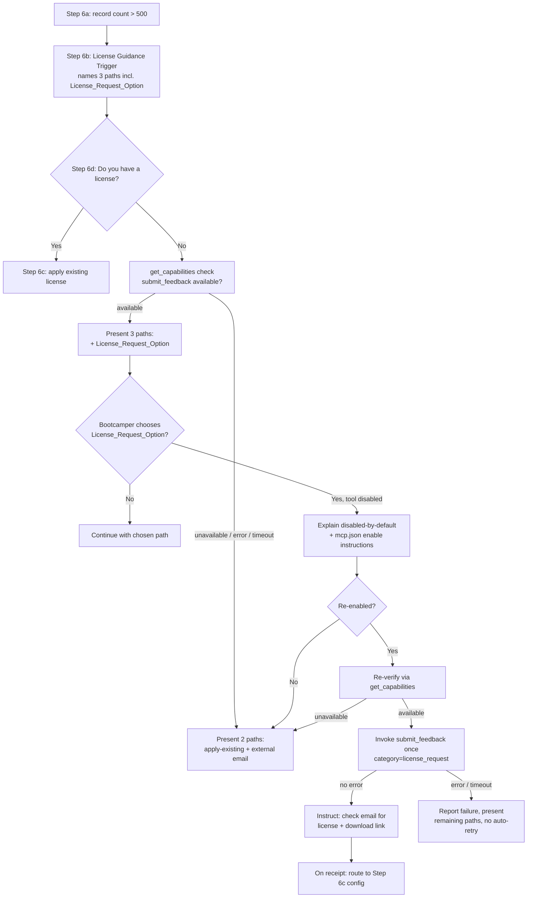

# Design Document

## Overview

This feature surfaces the Senzing MCP server's built-in license-request capability as an
explicit, in-flow licensing path inside Module 1's licensing branch and documents it in the
bootcamp's licensing reference. Today, when a bootcamper's dataset exceeds the built-in
500-record evaluation limit, the Module 1 "no license" branch (Step 6d in
`senzing-bootcamp/steering/module-01-business-problem.md`) offers only the external email
path and the apply-an-existing-license path. This feature adds a third path: requesting an
evaluation license directly through the `submit_feedback` MCP tool using the
`license_request` category.

The work is **content and behavior authoring**, not application code. The deliverables are:

1. **Edits to `senzing-bootcamp/steering/module-01-business-problem.md`** — the Step 6b
   trigger reference and the Step 6d branch gain the License_Request_Option, plus the
   capability-verification, tool-enablement, invocation, and MCP-sourced-facts behavior that
   governs when and how the agent offers and executes it.
2. **Edits to `senzing-bootcamp/licenses/README.md`** — a documented description of the
   License_Request_Option for bootcampers consulting the reference outside the conversation.
3. **A new content-validation test suite** in `senzing-bootcamp/tests/` that asserts the
   steering and reference content contain the required elements, following the existing
   `test_licensing_guidance.py` convention.

Because the agent's behavior is driven by steering instructions (interpreted at runtime by
the Kiro agent calling MCP tools) rather than by Python functions, correctness is enforced
through (a) precise, testable steering language and (b) example-based tests that verify that
language is present, correctly scoped, and internally consistent.

### Key Constraints Carried From Requirements

- **MCP-first for Senzing facts**: Validity period and record capacity must come from MCP
  tools at runtime, never hardcoded (Requirement 6, and the workspace `tech.md` rule "all
  Senzing facts come from MCP tools, never training data").
- **Tool disabled by default**: `submit_feedback` is listed in `disabledTools` in
  `senzing-bootcamp/mcp.json`. Guidance must account for unavailability, verify at runtime,
  and instruct re-enablement (Requirements 2 and 3).
- **No hardcoded MCP URLs in steering**: per `security.md`, `mcp.json` is the single source
  of truth for the server URL; steering references the capability generically.
- **Single source of truth for licensing branch logic**: edits localize to Step 6b/6d so the
  existing 6c (apply existing license) and 6e (deferral) flows remain intact.

## Architecture

This feature has no software runtime of its own. The "architecture" is the interaction
between three existing artifacts and the bootcamper, mediated by the Kiro agent.

### Decision Model (capability gate)

The runtime decision for whether to present the License_Request_Option is a small, explicit
decision table that the steering text must encode unambiguously:

| `get_capabilities` outcome for `submit_feedback` | License_Request_Option presented? | Paths offered |
|---|---|---|
| Reported available | Yes | apply-existing + external + License_Request_Option |
| Reported unavailable | No | apply-existing + external |
| No response within 30s | No | apply-existing + external |
| Error response | No | apply-existing + external |

The invocation outcome forms a second decision table:

| `submit_feedback` outcome | Guidance result |
|---|---|
| Response with no error | Instruct bootcamper to check email for license + download link; on receipt route to Step 6c |
| Error response | Report "did not complete"; present apply-existing + external; no automatic re-invoke |
| No response within 30s | Report "did not complete"; present apply-existing + external; no automatic re-invoke |

### Design Decisions and Rationale

- **Localize edits to Step 6b/6d.** The licensing branch already partitions cleanly into
  6b (trigger), 6c (has license), 6d (no license), 6e (defer). The new path belongs in the
  "no license" branch (6d) with a naming reference in the 6b trigger, mirroring the existing
  structure and keeping the 6c/6e flows untouched. This satisfies Requirements 1.3, 1.4, and
  4.3 (route to existing Step 6c) without restructuring.
- **Gate presentation on a live `get_capabilities` call.** Rather than reading
  `mcp.json`'s `disabledTools` to decide availability, the steering instructs a runtime
  `get_capabilities` check. `disabledTools` reflects the shipped default, but the bootcamper
  may have re-enabled the tool; the authoritative signal is what the server actually reports
  in-session (Requirement 2.1). `disabledTools` is used only to drive the disabled-by-default
  messaging (Requirement 3).
- **Re-verify after re-enablement.** A bootcamper editing `mcp.json` mid-session is a state
  change; the steering requires a fresh `get_capabilities` call before invocation rather than
  trusting the earlier check (Requirement 3.3).
- **No automatic retry on failure.** On invocation error/timeout the agent reports the
  failure and falls back, never silently re-invoking, to avoid duplicate license requests
  (Requirement 4.4).
- **MCP-sourced license facts with explicit "unavailable" fallback.** Where the steering
  would mention validity period or record capacity, it instructs retrieval from an MCP tool
  and an explicit "value unavailable from the MCP server" statement when retrieval fails —
  never a hardcoded figure (Requirement 6).
- **Generic capability reference, no hardcoded URL.** Per `security.md`, steering names the
  `submit_feedback` tool and `license_request` category but does not embed the MCP server
  URL; `mcp.json` remains the single source for the endpoint.

## Components and Interfaces

### Component 1: Module 1 Step 6b — License Guidance Trigger (edit)

**File:** `senzing-bootcamp/steering/module-01-business-problem.md`

**Change:** Add a sentence to the existing 6b trigger that names the License_Request_Option
as one of the available licensing paths, alongside the existing apply-existing and external
request references.

**Interface (content contract):** The 6b block must contain a reference that names the
in-flow MCP license-request path as one of the licensing options (Requirement 1.3).

### Component 2: Module 1 Step 6d — No-License Branch (edit)

**File:** `senzing-bootcamp/steering/module-01-business-problem.md`

**Change:** Extend the 6d branch to:

- Instruct the agent to call `get_capabilities` before presenting options, and branch on the
  decision table above (Requirements 2.1–2.4).
- When `submit_feedback` is available, present exactly three distinct, individually
  selectable paths: License_Request_Option, external request, apply-existing
  (Requirement 1.1).
- Describe the License_Request_Option as the MCP in-flow path that generates an evaluation
  license, delivered by email, with a download link in the email (Requirement 1.2).
- State that the option requires `submit_feedback` and that `submit_feedback` is disabled by
  default; provide enable instructions pointing at `senzing-bootcamp/mcp.json`, removing
  `submit_feedback` from `disabledTools`, and saving the file (Requirements 3.1, 3.2).
- Re-verify via `get_capabilities` after re-enablement; if the bootcamper declines, present
  only the remaining paths (Requirements 3.3, 3.4).
- On selection with confirmed availability, invoke `submit_feedback` exactly once with the
  `license_request` category; on success instruct the email check, then on receipt route to
  Step 6c; on error/timeout report failure and present remaining paths without auto-retry
  (Requirements 4.1–4.4).
- Where validity period or record capacity is presented, source it from an MCP tool and omit
  with an "unavailable" note if retrieval fails (Requirement 6).

**Interface (behavior contract):** The agent, when interpreting 6d, calls `get_capabilities`
within the same licensing interaction before presenting the option, and follows the two
decision tables.

### Component 3: Licensing Reference (edit)

**File:** `senzing-bootcamp/licenses/README.md`

**Change:** Add a section documenting the License_Request_Option that states: it obtains an
evaluation license through the MCP server; the license arrives by email with a download
link; it invokes the `submit_feedback` tool with the `license_request` category;
`submit_feedback` is disabled by default; and enabling it requires removing `submit_feedback`
from the `disabledTools` array in `senzing-bootcamp/mcp.json` (Requirements 5.1–5.5).

### Component 4: Content-Validation Test Suite (new)

**File:** `senzing-bootcamp/tests/test_license_request_option.py`

**Change:** A pytest module (stdlib + pytest only, matching `test_licensing_guidance.py`)
that reads the two edited files and asserts the required content is present, correctly
scoped to the 6b/6d region, and free of hardcoded MCP URLs or hardcoded license figures.

**Interface:** Class-based tests reading file content once at module level; each test
documents the requirement it validates.

## Data Models

This feature introduces no persisted data structures. The relevant conceptual entities are
the conversational state values the steering branches on. They are documented here to make
the steering contract precise.

### CapabilityCheckResult (conceptual)

Represents the outcome of the `get_capabilities` call as the steering must interpret it.

| Value | Meaning | Steering action |
|---|---|---|
| `available` | `submit_feedback` reported present | Offer License_Request_Option |
| `unavailable` | `submit_feedback` reported absent | Omit option; offer 2 paths |
| `no_response` | No reply within 30s | Omit option; offer 2 paths |
| `error` | Error response returned | Omit option; offer 2 paths |

### LicenseRequestOutcome (conceptual)

Represents the outcome of the single `submit_feedback` invocation.

| Value | Meaning | Steering action |
|---|---|---|
| `success` | Response returned with no error | Instruct email check; route to Step 6c on receipt |
| `error` | Error response returned | Report failure; remaining paths; no auto-retry |
| `no_response` | No reply within 30s | Report failure; remaining paths; no auto-retry |

### LicensingPath (conceptual enumeration)

The three mutually exclusive, individually selectable paths in the no-license branch:

- `license_request` — in-flow MCP path via `submit_feedback` (`license_request` category)
- `external_request` — existing email/support path
- `apply_existing` — existing Step 6c apply-an-existing-license path

## Error Handling

The feature's error handling is entirely about graceful degradation of the conversational
flow, and the steering must encode it explicitly:

- **Capability unavailable / error / timeout (Requirement 2.3, 2.4):** The agent omits the
  License_Request_Option and presents the two always-available paths (apply-existing,
  external). A 30-second bound governs the `get_capabilities` wait.
- **Tool disabled by default (Requirement 3.1, 3.2):** Treated as expected state, not an
  error. The agent explains the disabled-by-default condition and gives `mcp.json` enable
  instructions. If the bootcamper declines to re-enable (Requirement 3.4), the agent falls
  back to the remaining paths.
- **Invocation error / timeout (Requirement 4.4):** The agent informs the bootcamper the
  request did not complete, presents the remaining paths, and does **not** automatically
  re-invoke `submit_feedback`, preventing duplicate requests. A 30-second bound governs the
  invocation wait.
- **MCP fact retrieval failure (Requirement 6.3):** The agent omits the specific validity
  period or record-capacity figure, never substitutes a hardcoded/training-data value, and
  tells the bootcamper the current value is unavailable from the MCP server.

In every failure mode the bootcamper retains a working path forward (apply-existing and
external request are always available), so the licensing branch never dead-ends.

## Testing Strategy

### Why Property-Based Testing Does Not Apply

This feature delivers steering-instruction content, reference documentation, and
conversational agent behavior. It contains no pure functions, parsers, serializers, data
transformations, or algorithms over a large input space — the categories where property-based
testing earns its cost. The acceptance criteria are either (a) content-presence and scope
checks against Markdown files, or (b) deterministic conditional flow described by two small
decision tables. Running 100+ randomized iterations would not surface bugs that targeted
examples miss, because there is no generative input space to explore. This matches the
project's established approach for steering changes (see `test_licensing_guidance.py`, which
is example-based). Accordingly, this design omits a Correctness Properties section and
specifies example-based content-validation tests plus existing CI structural checks.

### Content-Validation Tests (example-based, new)

`senzing-bootcamp/tests/test_license_request_option.py`, following the conventions in
`test_licensing_guidance.py` (module-level file read, class-based organization, requirement
annotations, stdlib + pytest only):

- **Step 6b trigger references the option (R1.3):** The 6b block names the in-flow MCP
  license-request path as an available licensing option.
- **Step 6d presents three distinct paths (R1.1):** The 6d "no license" branch references
  all three paths — License_Request_Option, external request, apply-existing — as distinct
  selectable options.
- **Option description completeness (R1.2):** The 6d option text states it uses the MCP
  server, generates an evaluation license, is delivered by email, and the email includes a
  download link.
- **Capability verification present (R2.1–2.4):** The 6d branch instructs a
  `get_capabilities` check before presenting the option and encodes the available /
  unavailable / 30s-timeout / error branches.
- **Disabled-by-default messaging and enable steps (R3.1–3.4):** The 6d branch states
  `submit_feedback` is disabled by default, identifies `senzing-bootcamp/mcp.json`, instructs
  removing `submit_feedback` from `disabledTools` and saving, re-verifies after re-enablement,
  and falls back if declined.
- **Single-invocation and outcome handling (R4.1–4.4):** The branch instructs invoking
  `submit_feedback` exactly once with the `license_request` category, the email-check
  success message, routing to Step 6c on receipt, and the no-auto-retry failure fallback.
- **Reference documentation (R5.1–5.5):** `licenses/README.md` documents the option, email
  delivery with download link, the `submit_feedback`/`license_request` invocation, the
  disabled-by-default fact, and the `disabledTools` removal instruction.
- **MCP-sourced facts, no hardcoding (R6.1–6.3):** The 6d branch instructs sourcing validity
  period and record capacity from an MCP tool and omitting with an "unavailable" note on
  failure. A negative assertion verifies no hardcoded validity-period figures (e.g.,
  "30-90 days", "90 days") are introduced into the edited 6d region.
- **Security/scope guards:** No MCP server URL is hardcoded in the edited steering region
  (per `security.md`); edits stay within the licensing branch and do not introduce extra
  pointing questions (👉) or STOP markers that would break the sequential-step flow.

### Existing CI Structural Checks (reused)

The change is also covered by the existing pipeline (`.github/workflows/validate-power.yml`):

- `validate_power.py` and `validate_commonmark.py` — Markdown/structure validity of the
  edited files.
- `measure_steering.py --check` — confirms the Module 1 steering file stays within its token
  budget in `steering-index.yaml` after the edit; the design keeps additions concise to
  respect the budget.
- Full `pytest` run including the new content-validation suite.

### Manual / Behavioral Verification (out of automated scope)

The conversational behavior itself (the agent actually calling `get_capabilities` and
`submit_feedback` in a live session) is validated by reviewing the steering language for
unambiguous instruction and by the bootcamp's existing conversation-evaluation harness
(`tests/eval/`), not by unit tests, since it depends on a live MCP server and agent runtime.
