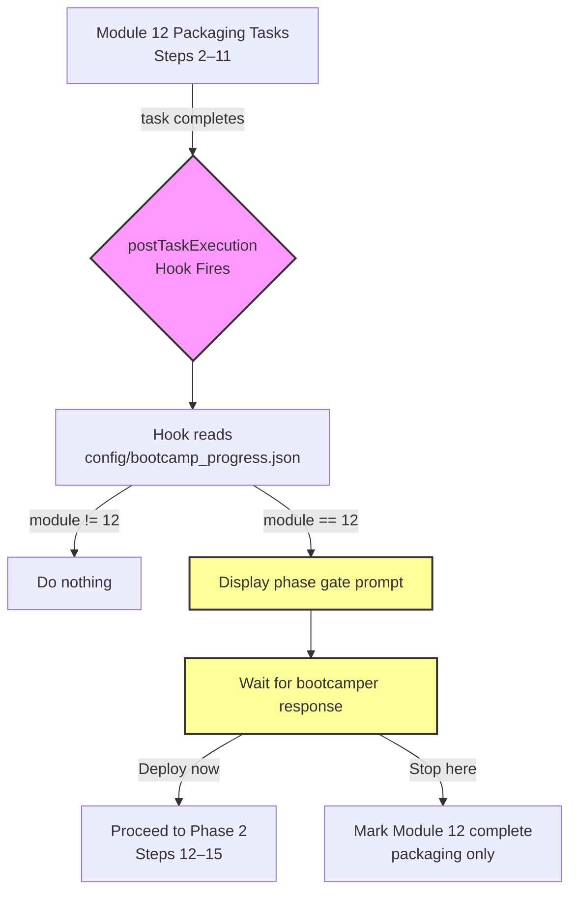

# Design: Module 12 Phase Gate

## Overview

This feature adds a deterministic enforcement mechanism for the packaging-to-deployment phase gate in Module 12 of the Senzing Bootcamp. The current steering file instructs the agent to pause after packaging (Steps 2–11) and ask the bootcamper whether to proceed to deployment (Steps 12–15), but the agent sometimes blends the phases together. This design introduces:

1. A `postTaskExecution` hook (`module12-phase-gate.kiro.hook`) that fires after packaging tasks and forces the agent to display a phase gate prompt.
2. Steering file improvements to `module-12-deployment.md` that make the phase boundary visually unmissable.
3. A README entry documenting the new hook.

All deliverables are JSON and Markdown — no executable code.

### Design Rationale

The hook acts as an external safety net. Even if the agent misses the steering file's WAIT instruction, the `postTaskExecution` hook fires independently and forces the phase gate conversation. The steering file improvements reduce the chance the agent skips the gate in the first place. Together, they provide defense-in-depth.

## Architecture

The feature consists of three static artifacts that work together:



### Component Interaction

1. The bootcamper works through Module 12 packaging steps (2–11) guided by the steering file.
2. The steering file now contains a prominent `PHASE GATE` section between Step 11 and Step 12 that instructs the agent to stop.
3. After any task execution completes, the `postTaskExecution` hook fires.
4. The hook prompt instructs the agent to check `config/bootcamp_progress.json` — if the current module is not 12, the hook does nothing.
5. If the module is 12, the hook displays a packaging-complete summary, reassures the bootcamper that nothing was deployed, and asks whether to proceed to deployment or stop.
6. The agent waits for the bootcamper's explicit response before proceeding.

### Why `postTaskExecution`?

The `postTaskExecution` trigger type fires after the agent completes a task from a spec/plan. In the bootcamp context, this means it fires after the agent finishes working on a packaging step. This is the right trigger because:

- It fires at natural task boundaries, not on every file edit or prompt.
- It gives the agent a chance to check context (current module) before acting.
- It doesn't interfere with the packaging work itself (unlike `preToolUse`).
- It complements the steering file's inline WAIT instruction with an external check.

## Components and Interfaces

### Component 1: Hook File (`module12-phase-gate.kiro.hook`)

**Location:** `senzing-bootcamp/hooks/module12-phase-gate.kiro.hook`

**Format:** JSON, following the same schema as all other hooks in `senzing-bootcamp/hooks/`.

**Structure:**

```json
{
  "name": "Module 12 Phase Gate",
  "version": "1.0.0",
  "description": "After packaging tasks complete in Module 12, displays a phase gate prompt asking the bootcamper whether to proceed to deployment or stop. Checks config/bootcamp_progress.json to confirm the current module is 12 before acting.",
  "when": {
    "type": "postTaskExecution"
  },
  "then": {
    "type": "askAgent",
    "prompt": "<prompt text — see below>"
  }
}
```

**Prompt text (the `then.prompt` value):**

> First, read `config/bootcamp_progress.json` and check the `current_module` field. If the current module is NOT 12, do nothing — let the conversation continue normally. If the current module IS 12, do the following:
>
> Display a clear packaging-complete summary:
>
> ```
> ━━━━━━━━━━━━━━━━━━━━━━━━━━━━━━━━━━━━━━━━━━━━━━━━━━━━━━━━
> 📦  PACKAGING PHASE COMPLETE — PHASE GATE
> ━━━━━━━━━━━━━━━━━━━━━━━━━━━━━━━━━━━━━━━━━━━━━━━━━━━━━━━━
>
> Everything from the packaging phase is done:
> ✅ Code containerized (Dockerfile + docker-compose.yml)
> ✅ Multi-environment config (dev/staging/prod)
> ✅ CI/CD pipeline configured
> ✅ Pre-deployment checklist verified
> ✅ Rollback plan documented
>
> ⚠️  Nothing has been deployed. No changes were made to any
>     target environment. Everything so far was local
>     preparation work. It is completely safe to stop here.
> ━━━━━━━━━━━━━━━━━━━━━━━━━━━━━━━━━━━━━━━━━━━━━━━━━━━━━━━━
> ```
>
> Then ask: "Would you like to actually deploy this now, or would you prefer to stop here and deploy later on your own?"
>
> WAIT for the bootcamper's response. Do NOT proceed to any deployment steps (Steps 12–15) until the bootcamper explicitly says they want to deploy.

**Key design decisions:**

- The hook checks `current_module` at runtime so it's safe to leave installed across all modules — it's a no-op outside Module 12.
- The prompt includes a visual banner (matching the bootcamp's existing banner style) to make the gate unmissable in the conversation.
- The reassurance about nothing being deployed addresses a common bootcamper concern.
- The explicit WAIT instruction prevents the agent from auto-proceeding.

### Component 2: Steering File Updates (`module-12-deployment.md`)

**Location:** `senzing-bootcamp/steering/module-12-deployment.md`

**Changes:** Insert a prominent PHASE GATE section between the existing Step 11 (Pre-Deployment Checklist) and Step 12 (Rollback Plan). The new section uses visual markers that are distinct from surrounding content.

**New section to insert (after Step 11's closing content, before Step 12):**

```markdown
---

## ⛔ PHASE GATE — PACKAGING COMPLETE, DEPLOYMENT DECISION REQUIRED

> **🛑 MANDATORY STOP — DO NOT SKIP THIS SECTION**
>
> The packaging phase (Steps 2–11) is now complete. **You MUST stop here and wait for the bootcamper's explicit decision** before proceeding to any deployment steps.

**Display this summary to the bootcamper:**

```text
━━━━━━━━━━━━━━━━━━━━━━━━━━━━━━━━━━━━━━━━━━━━━━━━━━━━━━━━
📦  PACKAGING PHASE COMPLETE
━━━━━━━━━━━━━━━━━━━━━━━━━━━━━━━━━━━━━━━━━━━━━━━━━━━━━━━━

Everything from the packaging phase is done:
✅ Code containerized (Dockerfile + docker-compose.yml)
✅ Multi-environment config (dev/staging/prod)
✅ CI/CD pipeline configured
✅ Pre-deployment checklist verified
✅ Rollback plan documented

⚠️  Nothing has been deployed. No changes were made to any
    target environment. Everything so far was local
    preparation work. It is completely safe to stop here.
━━━━━━━━━━━━━━━━━━━━━━━━━━━━━━━━━━━━━━━━━━━━━━━━━━━━━━━━
```

**Then ask:** "Would you like to actually deploy this now, or would you prefer to stop here and deploy later on your own?"

> **⚠️ WAIT — Do NOT proceed past this point until the bootcamper responds.**
>
> - If they want to **stop here**: Mark Module 12 as complete (packaging only). Do NOT proceed to Step 12.
> - If they want to **deploy now**: Proceed to Phase 2 (Steps 12–15).
> - If they are **unsure**: Reassure them that stopping is perfectly fine and they can deploy later on their own using the scripts and documentation created during packaging.

---
```

**Design decisions:**

- The `⛔` emoji and `🛑 MANDATORY STOP` language are deliberately strong — the current steering file's softer phrasing gets skipped.
- The section uses a horizontal rule (`---`) above and below to visually separate it from Steps 11 and 12.
- The block quote formatting with bold markers makes it structurally distinct from step content.
- The three-way decision tree (stop / deploy / unsure) covers all bootcamper responses.
- No functional content in Steps 2–11 or Steps 12–15 is changed.

### Component 3: Hooks README Update (`hooks/README.md`)

**Location:** `senzing-bootcamp/hooks/README.md`

**Change:** Add entry #16 to the numbered hook list, following the existing format.

**New entry:**

```markdown
### 16. Module 12 Phase Gate (`module12-phase-gate.kiro.hook`)

**Trigger:** After task execution completes (postTaskExecution)
**Action:** Checks if current module is 12, then displays packaging-complete summary and asks whether to proceed to deployment
**Use case:** Enforces the packaging-to-deployment phase gate — prevents the agent from blending packaging and deployment phases together
```

## Data Models

All deliverables are static files (JSON and Markdown). There are no runtime data models, databases, or APIs.

### Hook JSON Schema

The hook file follows the Kiro hook schema used by all hooks in the repository:

| Field | Type | Value |
|-------|------|-------|
| `name` | string | `"Module 12 Phase Gate"` |
| `version` | string | `"1.0.0"` |
| `description` | string | Description of the hook's purpose |
| `when.type` | string | `"postTaskExecution"` |
| `then.type` | string | `"askAgent"` |
| `then.prompt` | string | The full prompt text instructing the agent |

### Runtime Data Dependency

The hook prompt instructs the agent to read `config/bootcamp_progress.json` at runtime. The expected structure of that file (created by the bootcamp, not by this feature):

```json
{
  "current_module": 12,
  "completed_modules": [0, 1, 2, 3, 4, 5, 6, 7, 8, 9, 10, 11]
}
```

The hook only checks `current_module`. If the file doesn't exist or can't be read, the hook prompt instructs the agent to do nothing (fail-safe).


## Correctness Properties

*A property is a characteristic or behavior that should hold true across all valid executions of a system — essentially, a formal statement about what the system should do. Properties serve as the bridge between human-readable specifications and machine-verifiable correctness guarantees.*

### Applicability Assessment

This feature produces static JSON and Markdown files — no executable code. Most acceptance criteria are structural checks on specific file content (EXAMPLE or SMOKE classification). However, two criteria generalize across all hooks in the repository, making them suitable for property-based testing.

### Property 1: Hook JSON schema conformance

*For any* `.kiro.hook` file in `senzing-bootcamp/hooks/`, parsing it as JSON should succeed and the resulting object should contain all required fields: `name` (string), `version` (string), `description` (string), `when.type` (string), `then.type` (string), and `then.prompt` (string, when `then.type` is `"askAgent"`).

**Validates: Requirements 1.7**

### Property 2: README hook entry format conformance

*For any* numbered hook entry section in `senzing-bootcamp/hooks/README.md`, the entry should contain a **Trigger** line, an **Action** line, and a **Use case** line, each with non-empty content.

**Validates: Requirements 3.2**

## Error Handling

Since all deliverables are static files (JSON and Markdown), error handling is limited to the hook's runtime behavior as instructed in the prompt text:

| Scenario | Handling |
|----------|----------|
| `config/bootcamp_progress.json` doesn't exist | Hook prompt instructs agent to do nothing (fail-safe) |
| `current_module` field is missing or not a number | Hook prompt instructs agent to do nothing |
| `current_module` is not 12 | Hook does nothing — no phase gate displayed |
| Bootcamper gives ambiguous response | Hook prompt includes guidance for the "unsure" case — reassure and suggest stopping |
| Hook JSON is malformed | Kiro will fail to load the hook; validated by Property 1 |

## Testing Strategy

### Approach

Since all deliverables are JSON and Markdown (no executable code), testing focuses on structural validation and content verification. Property-based testing applies to the two cross-cutting schema conformance properties. Example-based tests cover the specific content requirements.

### Property-Based Tests

Use a property-based testing library (e.g., Hypothesis for Python, fast-check for TypeScript) to validate the two correctness properties:

- **Property 1 (Hook schema conformance):** Enumerate all `.kiro.hook` files in `senzing-bootcamp/hooks/`, parse each as JSON, and assert the required fields exist with correct types. Minimum 100 iterations (the generator produces random subsets of the hook directory to test robustness of the validation logic).
  - Tag: `Feature: module12-phase-gate, Property 1: Hook JSON schema conformance`

- **Property 2 (README entry format):** Parse all numbered hook entry sections from the README and assert each contains Trigger, Action, and Use case lines. Minimum 100 iterations.
  - Tag: `Feature: module12-phase-gate, Property 2: README hook entry format conformance`

### Example-Based Tests (Unit Tests)

These verify specific content requirements for the new deliverables:

| Test | Validates | What to check |
|------|-----------|---------------|
| Hook file exists at correct path | 1.1 | File exists at `senzing-bootcamp/hooks/module12-phase-gate.kiro.hook` |
| Hook trigger type is `postTaskExecution` | 1.1 | `when.type === "postTaskExecution"` |
| Prompt contains packaging summary items | 1.2 | Prompt mentions containerization, multi-environment config, CI/CD, checklist, documentation |
| Prompt contains no-deployment reassurance | 1.3 | Prompt contains "nothing has been deployed" or equivalent |
| Prompt contains deploy-or-stop question | 1.4 | Prompt contains the explicit choice question |
| Prompt contains WAIT instruction | 1.5 | Prompt contains "WAIT" and instruction not to proceed |
| Prompt references bootcamp_progress.json | 1.6 | Prompt mentions `config/bootcamp_progress.json` and module 12 check |
| Prompt handles non-module-12 case | 1.6 | Prompt instructs agent to do nothing if module is not 12 |
| Steering file has PHASE GATE section | 2.2 | Section with "PHASE GATE" heading exists between Step 11 and Step 12 |
| Steering file WAIT is emphasized | 2.3 | WAIT instruction uses bold/blockquote formatting |
| Steps 2–11 content unchanged | 2.4 | Diff of step content shows no functional changes |
| README contains new hook entry | 3.1 | README mentions `module12-phase-gate.kiro.hook` |
| README entry is numbered 16 | 3.3 | Entry appears as `### 16.` in the numbered list |
