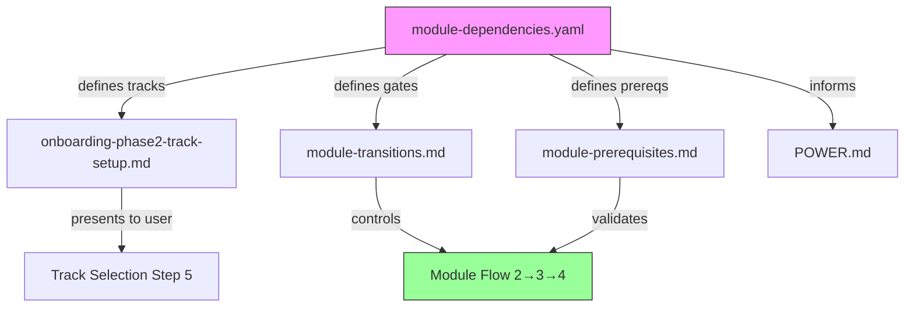

# Design: Module 3 System Verification Default-On

## Overview

This design changes Module 3 (System Verification) from an optional/opt-in module to a default-on (opt-out) module in the Senzing bootcamp flow. Module 3 validates the entire SDK setup end-to-end — SDK initialization, code generation, compilation, data loading, entity resolution, and database operations — before bootcampers invest time with their own data. Making it default-on ensures every bootcamper has a verified environment before proceeding.

The change affects steering files (markdown), configuration files (YAML), the POWER.md manifest, and existing tests. No Python scripts or runtime behavior changes — this is purely a documentation/configuration update that alters the agent's routing logic.

### Design Rationale

Module 3 was originally optional because it was a "Quick Demo" that some experienced users might skip. After renaming to "System Verification" (v0.11.0), its purpose shifted to validating the environment works correctly. An unverified environment causes hard-to-diagnose failures in later modules (5, 6, 7), wasting bootcamper time. Making verification default-on with an explicit opt-out is the safer default.

## Architecture

The bootcamp flow is controlled by three layers:

1. **Configuration layer** (`config/module-dependencies.yaml`) — defines module dependencies, track compositions, and gate conditions. This is the authoritative source.
2. **Steering layer** (markdown files in `steering/`) — provides agent instructions for each module and transition. References the configuration layer.
3. **Manifest layer** (`POWER.md`) — user-facing documentation describing the bootcamp structure.



The change propagates top-down: update the configuration layer first, then update steering and manifest to match.

### Current State vs Target State

| Aspect | Current | Target |
|--------|---------|--------|
| Core Bootcamp track | Modules 1, 2, 3, 4, 5, 6, 7 (3 listed but marked optional) | Modules 1, 2, 3, 4, 5, 6, 7 (3 is standard) |
| POWER.md module table | "System Verification (Optional)" | "System Verification" |
| POWER.md steering list | "Module 3: System Verification (Optional)" | "Module 3: System Verification" |
| Module 4 prerequisites | Module 1 only | Module 1 + Module 3 (soft prerequisite) |
| Gate 3→4 | "System verification passed or skipped" | "System verification passed or explicitly skipped" |
| Opt-out mechanism | Implicit (just skip it) | Explicit ("skip verification" / "I've already verified") |
| module-dependencies.yaml skip_if | "Already familiar with Senzing and system verified" | "Bootcamper explicitly requests skip ('skip verification' or 'I've already verified')" |

## Components and Interfaces

### Files Modified

| File | Change Type | Description |
|------|-------------|-------------|
| `config/module-dependencies.yaml` | Config update | Add Module 3 to Module 4's `requires` list (soft); update `skip_if` text; update gate 3→4 |
| `senzing-bootcamp/POWER.md` | Documentation | Remove "(Optional)" from module table and steering file list |
| `steering/onboarding-flow.md` | No change needed | Already lists Module 3 in Core Bootcamp path (Modules 1-7) |
| `steering/onboarding-phase2-track-setup.md` | No change needed | Already lists Core Bootcamp as Modules 1, 2, 3, 4, 5, 6, 7 |
| `steering/module-transitions.md` | Steering update | No structural change needed — already handles 2→3→4 as standard |
| `steering/module-prerequisites.md` | Steering update | Add Module 3 as soft prerequisite for Module 4; update skip conditions |
| `steering/module-03-system-verification.md` | Steering update | Add opt-out mechanism section at the top |
| `steering/steering-index.yaml` | No change needed | Module 3 already indexed correctly |
| `docs/modules/README.md` | Documentation | Remove "(Optional)" from Module 3 heading |
| `docs/README.md` | Documentation | Remove "(optional)" from Module 3 description |
| `docs/diagrams/module-flow.md` | Documentation | Remove "(Optional)" from Module 3 box |

### Opt-Out Mechanism Design

The opt-out is implemented as a pre-module gate check in the Module 3 steering file:

```markdown
## Opt-Out Gate

Before starting Module 3 steps, check if the bootcamper has explicitly requested to skip:

**Trigger phrases:** "skip verification", "I've already verified", "skip module 3"

**If triggered:**
1. Record skip in `config/bootcamp_progress.json`:
   ```json
   {"module_3_verification": {"status": "skipped", "reason": "bootcamper_opted_out"}}
   ```
2. Display warning:
   ```text
   ⚠️ Skipping system verification. If you encounter issues in later modules
   (data loading failures, SDK errors), Module 3 can help diagnose them.
   Say "run verification" at any time to come back.
   ```
3. Update gate 3→4 to "skipped" and proceed to Module 4.

**If NOT triggered:** Proceed with Module 3 normally (default path).
```

The opt-out is also recognized by the `review-bootcamper-input` hook, which detects skip phrases during the 2→3 transition.

### Soft Prerequisite Semantics

Module 3 becomes a "soft prerequisite" for Module 4, meaning:
- The agent recommends completing Module 3 before Module 4
- If Module 3 is not completed, the agent warns but does not block
- The warning explains that unverified environments may cause issues in Modules 5-7
- The bootcamper can proceed after acknowledging the warning

This differs from a hard prerequisite (like Module 2 for Module 3) where the agent blocks progress entirely.

## Data Models

### module-dependencies.yaml Changes

```yaml
modules:
  3:
    name: "System Verification"
    requires: [2]
    skip_if: "Bootcamper explicitly requests skip ('skip verification' or 'I've already verified')"
  4:
    name: "Data Collection"
    requires: [1]
    soft_requires: [3]
    skip_if: null

gates:
  "3->4":
    requires:
      - "System verification passed or explicitly skipped by bootcamper"
```

### Progress File Schema (unchanged)

The `bootcamp_progress.json` schema already supports the `"skipped"` status for Module 3. No schema changes needed.

## Correctness Properties

*A property is a characteristic or behavior that should hold true across all valid executions of a system — essentially, a formal statement about what the system should do. Properties serve as the bridge between human-readable specifications and machine-verifiable correctness guarantees.*

### Property 1: Module 3 is in every track that contains both Module 2 and Module 4

*For any* track definition in `module-dependencies.yaml` that contains both Module 2 and Module 4, Module 3 SHALL also be present in that track's module list, positioned after Module 2 and before Module 4.

**Validates: Requirements 1, 9**

### Property 2: No "(Optional)" qualifier on Module 3 in user-facing documentation

*For any* file in the power distribution (`senzing-bootcamp/`) that contains a reference to Module 3 or "System Verification", the text SHALL NOT contain "(Optional)" adjacent to that reference.

**Validates: Requirements 2, 3, 8**

### Property 3: Dependency graph reachability — Module 3 is on the path from Module 2 to Module 4

*For any* valid dependency graph parsed from `module-dependencies.yaml`, following the `requires` and `soft_requires` edges from Module 4 backward SHALL reach Module 3, and following edges from Module 3 backward SHALL reach Module 2.

**Validates: Requirements 5, 6, 9**

## Error Handling

| Scenario | Handling |
|----------|----------|
| Bootcamper skips Module 3 then hits SDK errors in Module 5/6 | Agent suggests returning to Module 3 for diagnosis |
| `module-dependencies.yaml` has inconsistent graph after edit | `validate_dependencies.py` catches on CI; agent refuses to proceed with broken config |
| Existing progress file has Module 3 as "not started" from before the change | No migration needed — the agent simply presents Module 3 as the next step after Module 2 |
| Bootcamper on an old power version upgrades | CHANGELOG documents the change; no breaking behavior since Module 3 was already in the track list |

## Testing Strategy

### Unit Tests (Example-Based)

These verify the concrete file content changes:

1. **POWER.md module table**: Assert Module 3 row does not contain "(Optional)"
2. **POWER.md steering file list**: Assert Module 3 entry does not contain "(Optional)"
3. **module-dependencies.yaml structure**: Assert Module 4 has `soft_requires: [3]`; assert gate 3→4 text references explicit skip
4. **module-prerequisites.md**: Assert Module 4 row mentions Module 3
5. **docs/modules/README.md**: Assert Module 3 heading does not contain "(Optional)"
6. **docs/diagrams/module-flow.md**: Assert Module 3 box does not contain "(Optional)"
7. **Opt-out mechanism**: Assert Module 3 steering file contains opt-out gate section with trigger phrases

### Property-Based Tests

**Library:** Hypothesis (Python)
**Minimum iterations:** 100

Property tests validate structural invariants of the dependency graph:

- **Feature: module3-default-on, Property 1**: For any track containing Modules 2 and 4, Module 3 is present between them
- **Feature: module3-default-on, Property 2**: For any file in the power distribution referencing Module 3, no "(Optional)" qualifier is adjacent
- **Feature: module3-default-on, Property 3**: For any valid dependency graph, Module 3 is reachable on the path from Module 2 to Module 4

### Existing Tests to Update

| Test File | Current Assertion | Required Change |
|-----------|-------------------|-----------------|
| `test_module_flow_integration.py` → `TestTrackSelectionContent.test_no_system_verification_bullet` | Asserts "System Verification" not in Step 5 | May need update if Module 3 is now explicitly named in track bullets |
| `test_module_dependency_visualization.py` → `test_parse_tracks_from_file` | Asserts `core_bootcamp` modules == [1,2,3,4,5,6,7] | No change needed (Module 3 already in list) |
| `test_system_verification_unit.py` → `test_module_dependencies_updated` | Asserts name == "System Verification" | No change needed |
| `test_system_verification_unit.py` → `test_gate_condition_updated` | Asserts gate 3→4 references verification | May need update for new gate text |

### CI Validation

The existing CI pipeline (`validate-power.yml`) runs:
- `validate_dependencies.py` — will catch any graph inconsistencies
- `validate_commonmark.py` — will catch markdown formatting issues
- `pytest` — will run all unit and property tests

No new CI steps are needed.
