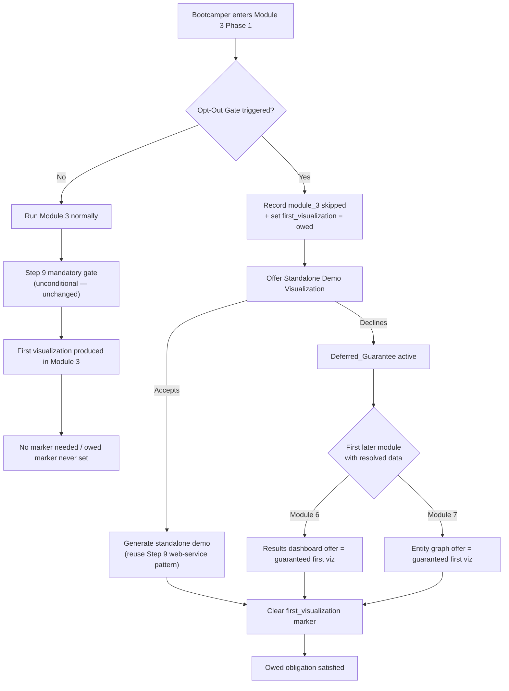
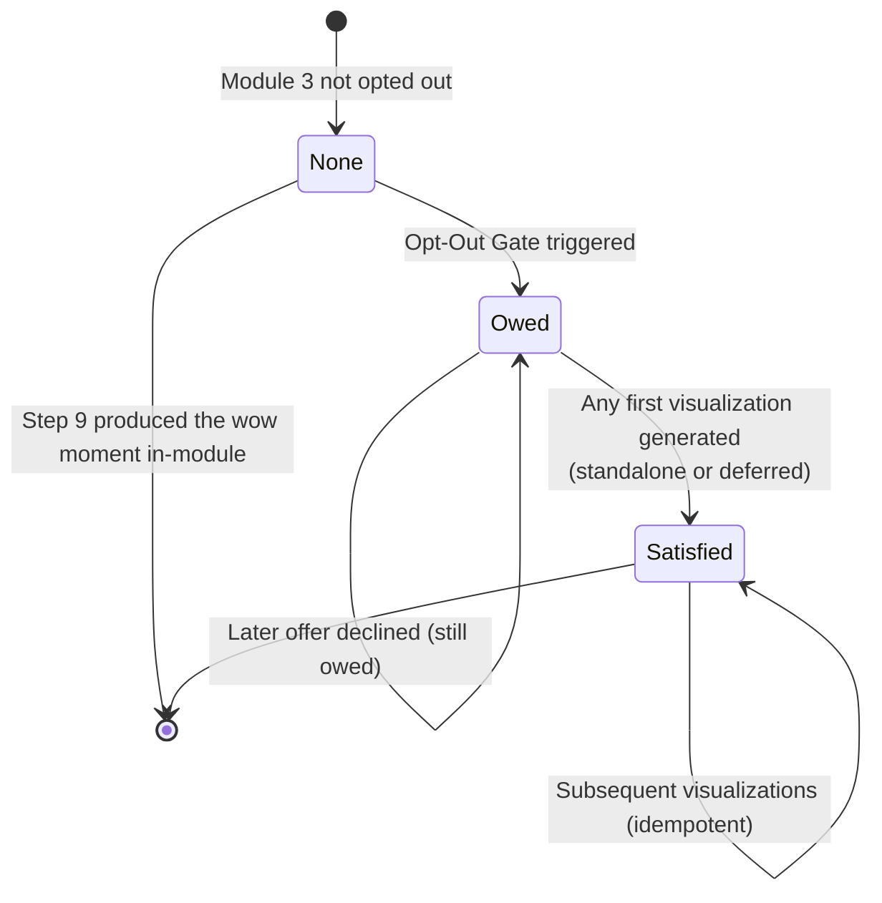
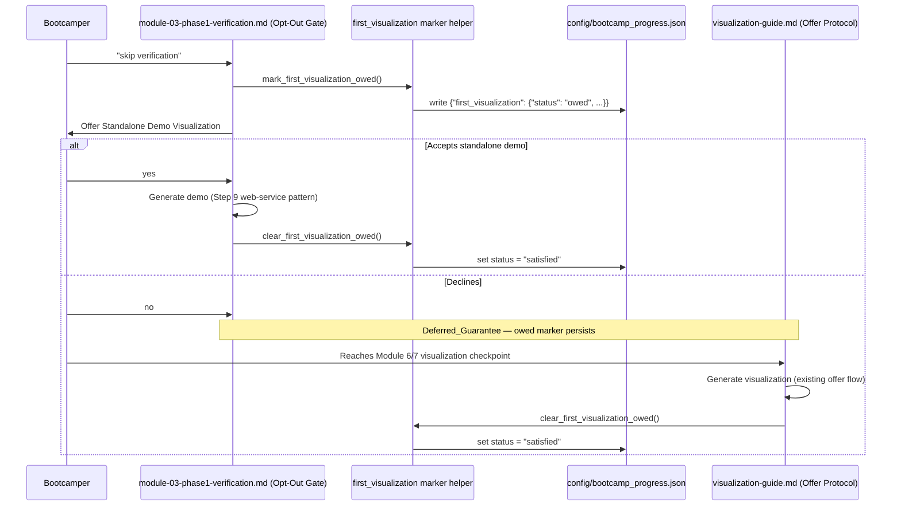

# Design Document

## Overview

This feature guarantees that every bootcamper sees at least one entity-resolution
visualization (the "first wow moment") even when they opt out of Module 3 at the Phase 1
Opt-Out Gate. Today the "wow moment" is produced only by Module 3 Step 9, whose gate is
unconditional *once Module 3 is running* (triple-guarded by `gate-module3-visualization`,
`enforce-mandatory-gate`, and `enforce-gate-on-stop`, plus `NON_SKIPPABLE_GATES = {"3.9"}`
in `validate_mandatory_gates.py`). The gap is upstream of that gate: the whole-module
Opt-Out Gate at the start of Phase 1 records Module 3 as skipped and sets gate 3→4 to
skipped, so Step 9 never executes.

The design closes the gap at the **journey level**, not inside the Step 9 gate. When the
bootcamper opts out of Module 3, the system records that a first visualization is still
*owed* via a marker in `config/bootcamp_progress.json`. The owed obligation is satisfied by
one of two paths:

1. **Standalone demo** — a minimal TruthSet-backed visualization offered at the opt-out
   point, reusing the Module 3 Step 9 web-service pattern.
2. **Deferred guarantee** — if the bootcamper declines the standalone demo, the first later
   module that has resolved data (Module 6 results dashboard, or Module 7 entity graph)
   treats its existing visualization offer as the guaranteed first visualization.

Either path clears the owed marker when a visualization is generated.

### Design Boundaries (what this feature does NOT change)

- **Step 9 gate is untouched.** When Module 3 is *not* opted out, Step 9 remains an
  unconditional mandatory gate exactly as today (Requirement 1.2).
- **Governing Rule 15 is untouched.** The canonical rule text and its pinned assertions in
  `config/governance-rules.yaml` (`rule-15-module3-visualization-gate`) and
  `validate_mandatory_gates.py` (`NON_SKIPPABLE_GATES = {"3.9"}`) are not modified
  (Requirement 1.3). This feature adds a *separate*, journey-level guarantee.
- **No parallel offer mechanism.** The standalone demo reuses the Step 9 web-service pattern
  and the deferred path reuses the existing Visualization Offer Protocol in
  `visualization-guide.md` (Requirements 3.1, 3.2).

### Key Research Findings

- **Opt-Out Gate location**: `steering/module-03-phase1-verification.md` → "## Opt-Out Gate".
  Trigger phrases are "skip verification", "I've already verified", "skip module 3". On
  trigger it writes `{"module_3_verification": {"status": "skipped", ...}}`, sets gate 3→4 to
  "skipped", and proceeds to Module 4. This is the single insertion point for recording the
  owed marker.
- **Progress marker mechanics**: `scripts/progress_utils.py` owns read/write/validate of
  `config/bootcamp_progress.json` (`write_checkpoint`, `clear_step`, `validate_progress_schema`,
  `ProgressSchema`). All fields are optional / backward-compatible, so adding a new
  `first_visualization` marker does not break legacy progress files. `_write_progress` already
  writes 2-space-indented JSON with a trailing newline.
- **Deferred checkpoints already exist**: `steering/visualization-guide.md` defines the
  Visualization Offer Protocol with a checkpoint map. Module 6 is not currently in that map
  (it lists modules 3, 5, 7, 8); Module 7 has `m7_exploratory_queries` and
  `m7_findings_documented`. The deferred guarantee reuses these existing checkpoints rather
  than adding new offer plumbing.
- **Web-service constraints (Step 9)**: `steering/module-03-phase2-visualization.md` pins the
  reusable pattern — Python stdlib HTTP server (`http.server.HTTPServer` +
  `BaseHTTPRequestHandler`), D3.js v7 from the d3js.org CDN, a single self-contained HTML file
  generated by a `write_html.py` Python generator script, all artifacts inside the working
  directory (`src/system_verification/web_service/`).
- **Governance conformance**: `config/governance-rules.yaml` is validated by
  `test_governance_rules_conformance.py` / `..._schema.py`. A new journey-level rule can be
  added as a separate entry; the existing `rule-15-module3-visualization-gate` entry stays
  byte-stable.

## Architecture

The feature is a thin coordination layer over three existing subsystems: the progress store,
the Opt-Out Gate steering, and the Visualization Offer Protocol. The only new *code* is a
small marker helper (pure functions over the progress dict); everything else is steering /
governance framing that reuses established machinery.



### Marker lifecycle (state machine)



### Component interaction



## Components and Interfaces

### 1. First-visualization marker helper (new code)

A small set of pure functions that read/write the `first_visualization` marker on a progress
dict. Placed in `scripts/progress_utils.py` (the existing home of progress read/write/validate)
to avoid a parallel progress-access path and to inherit `_read_progress` / `_write_progress`
(2-space indent + trailing newline, parent-dir creation, backward-compatible parsing).

Proposed interface (Python 3.11+, stdlib only, type-hinted per `python-conventions.md`):

```python
def mark_first_visualization_owed(
    reason: str = "module_3_opt_out",
    progress_path: str = "config/bootcamp_progress.json",
) -> None:
    """Record that a first entity-resolution visualization is still owed.

    Idempotent: if the marker is already "owed" or already "satisfied", the
    status is not regressed (a satisfied marker is never reverted to owed).
    """

def clear_first_visualization_owed(
    satisfied_by: str,
    progress_path: str = "config/bootcamp_progress.json",
) -> None:
    """Mark the owed first visualization as satisfied.

    ``satisfied_by`` records the source (e.g. "standalone_demo",
    "module_6_deferred", "module_7_deferred"). Idempotent: clearing an
    already-satisfied (or never-owed) marker is a no-op.
    """

def is_first_visualization_owed(progress: dict) -> bool:
    """Return True iff a first visualization is currently owed (not satisfied)."""
```

Design notes:
- **Never regress**: once `satisfied`, the marker is not reset to `owed` by a later opt-out
  (there is only one opt-out point, but this keeps the transition monotonic and safe).
- **Backward compatible**: absence of the marker means "not owed"; legacy files pass
  `validate_progress_schema` unchanged.
- **Schema**: `validate_progress_schema` is extended to accept an optional `first_visualization`
  object (see Data Models). Because all fields are optional, this remains backward compatible.

### 2. Opt-Out Gate steering update (`module-03-phase1-verification.md`)

The "## Opt-Out Gate" section gains two additions, framed explicitly as journey-level (not a
weakening of Step 9):

- On trigger, after recording the module-3 skip, also record the owed marker
  (`first_visualization: owed`).
- After the existing warning, present the Standalone Demo Visualization as an **offer** (not a
  forced step), using the visualization-guide offer template. Declining moves to the deferred
  guarantee.

The section keeps the explicit distinction (Requirement 3.3): "Step 9 is unconditional
whenever Module 3 runs; this journey-level guarantee covers the opt-out case only."

### 3. Standalone Demo Visualization (reuses Step 9 pattern)

A minimal, self-contained TruthSet-backed view. It reuses the Module 3 Step 9 constraints
from `module-03-phase2-visualization.md` (Requirement 3.1):

- Python stdlib HTTP server (`http.server.HTTPServer` + `BaseHTTPRequestHandler`).
- D3.js v7 from the d3js.org CDN; no other external JS.
- Single self-contained HTML file produced by a `write_html.py` generator script.
- All artifacts inside the working directory.

"Minimal" means a reduced scope relative to the full Step 9 four-tab dashboard (a single
graph or results view is sufficient) — but the *pattern* and constraints are identical, so no
new visualization mechanism is introduced. On successful generation it calls
`clear_first_visualization_owed(satisfied_by="standalone_demo")`.

### 4. Deferred guarantee wiring (`visualization-guide.md` + Module 6/7 steering)

When the standalone demo is declined, the owed marker persists. The first later module with
resolved data satisfies it through its **existing** offer:

- **Module 6** (results dashboard) or **Module 7** (`m7_exploratory_queries` entity graph),
  whichever the bootcamper reaches first with resolved data.
- The guide's Decline/Generate handling gains a single instruction: when a visualization is
  generated at these checkpoints *and* `first_visualization` is `owed`, also call
  `clear_first_visualization_owed(...)`. No new offer template, tracker, or checkpoint map is
  added — the existing `config/visualization_tracker.json` flow is reused (Requirement 3.2).

### 5. Governance framing (new rule, Rule 15 untouched)

A new, separate entry is added to `config/governance-rules.yaml` describing the journey-level
first-visualization guarantee, with assertions that pin (a) the owed marker is set at the
opt-out point and (b) the two satisfaction paths exist in steering. The existing
`rule-15-module3-visualization-gate` entry and its assertions are left byte-stable
(Requirement 1.3).

## Data Models

### `first_visualization` marker (in `config/bootcamp_progress.json`)

A new optional top-level object. Absence ≡ "not owed".

```json
{
  "first_visualization": {
    "status": "owed",
    "reason": "module_3_opt_out",
    "owed_at": "2025-07-15T10:30:00Z",
    "satisfied_by": null,
    "satisfied_at": null
  }
}
```

| Field | Type | Description |
|-------|------|-------------|
| `status` | string | `"owed"` or `"satisfied"` |
| `reason` | string | Why it became owed (e.g. `"module_3_opt_out"`) |
| `owed_at` | string (ISO 8601) | When the obligation was recorded |
| `satisfied_by` | string or null | Source that satisfied it: `"standalone_demo"`, `"module_6_deferred"`, `"module_7_deferred"`. Null while owed |
| `satisfied_at` | string or null | ISO 8601 timestamp when satisfied. Null while owed |

State transitions (monotonic):

- absent → `owed` (Opt-Out Gate triggered)
- `owed` → `satisfied` (any first visualization generated)
- `satisfied` → `satisfied` (idempotent; never regresses to `owed`)

### Validation rules (extension to `validate_progress_schema`)

- `first_visualization` is optional; when present it MUST be a dict.
- `status` (if present) MUST be one of `{"owed", "satisfied"}`.
- `owed_at` / `satisfied_at` (if present and non-null) MUST be valid ISO 8601.
- `satisfied_by` (if present and non-null) MUST be a non-empty string.
- When `status == "satisfied"`, `satisfied_by` and `satisfied_at` SHOULD be non-null.
- All other progress fields remain untouched and backward compatible.

### Reused models (unchanged)

- **Mandatory gate model** (`validate_mandatory_gates.py`): `MandatoryGate`, `NON_SKIPPABLE_GATES`,
  the Step 9 `_MODULE3_STEP9_CHECKPOINTS = ["web_service", "web_page"]`. Referenced by the
  preservation tests; not modified.
- **Visualization tracker** (`config/visualization_tracker.json`): the deferred path reuses its
  existing `offered → accepted → generated` transitions.
- **Graph Data Model schema** (`visualization-guide.md`): the standalone demo and deferred
  visualizations continue to emit this schema.

## Correctness Properties

*A property is a characteristic or behavior that should hold true across all valid executions
of a system — essentially, a formal statement about what the system should do. Properties
serve as the bridge between human-readable specifications and machine-verifiable correctness
guarantees.*

The testable core of this feature is the `first_visualization` marker lifecycle — pure
functions over the progress dict — plus the preservation of the existing Step 9 gate logic.
The steering/governance-content requirements (offer framing, pattern reuse, explicit
distinction) are verified by example/content tests, not property tests (see Testing Strategy).

### Property 1: Opting out records an owed first visualization

*For any* valid `bootcamp_progress` state (with or without a pre-existing `first_visualization`
marker), invoking the opt-out marker recording (`mark_first_visualization_owed`) results in a
`first_visualization` marker being present, and the first visualization being owed — unless it
was already `satisfied`, in which case the status is never regressed to `owed` (the lifecycle
is monotonic).

**Validates: Requirements 1.1**

### Property 2: The Step 9 in-module gate remains unconditional

*For any* `bootcamp_progress` state that has advanced past Module 3 Step 9 without both Step 9
checkpoints (`web_service`, `web_page`) marked `"passed"`, the mandatory-gate check reports a
violation — the `"3.9"` visualization gate is never satisfied by a `skipped_steps["3.9"]`
entry. (The journey-level owed marker has no effect on this in-module gate.)

**Validates: Requirements 1.2**

### Property 3: Any generated first visualization clears the owed marker (idempotently)

*For any* `bootcamp_progress` state, invoking `clear_first_visualization_owed(satisfied_by=...)`
— regardless of whether the visualization was standalone or deferred — results in
`is_first_visualization_owed` returning `False` and the marker status being `"satisfied"`.
Applying the clear a second time produces the same state (idempotence): clearing an already
`satisfied` (or never-owed) marker is a no-op.

**Validates: Requirements 2.2, 2.3**

## Error Handling

| Condition | Handling | Rationale |
|-----------|----------|-----------|
| Progress file missing / empty when recording owed marker | Treat as empty progress dict (`_read_progress` returns `{}`), create the marker, write the file (parent dir auto-created) | Matches existing `progress_utils` behavior; a fresh opt-out must still record the obligation |
| Progress file contains invalid JSON | Surface a clear error and do not partially write; the opt-out flow reports the problem rather than silently losing the marker | Prevents corrupting progress state; consistent with other progress consumers |
| Marker already `satisfied` when opt-out fires again | No-op (monotonic — never regress to `owed`) | Guarantees a satisfied "wow moment" is not un-satisfied |
| `clear_first_visualization_owed` called when no marker is owed | No-op (idempotent); does not fabricate an `owed→satisfied` history for a marker that was never owed | Deferred/standalone clearing must be safe to call unconditionally at a checkpoint |
| Legacy progress file lacking `first_visualization` | Absence is interpreted as "not owed"; `validate_progress_schema` passes | Backward compatibility (all progress fields optional) |
| Standalone demo generation fails (server/HTML) | Reuse Step 9 / `visualization-guide.md` web-service error handling (fallback to manual instructions); owed marker stays `owed` so the deferred guarantee still applies | The guarantee must not be marked satisfied when nothing was actually shown |
| Bootcamper declines the standalone demo | Not an error; owed marker persists and the deferred guarantee takes over | "Offer, not forced" (Requirement 2.1) |

## Testing Strategy

### Dual approach

- **Property tests (Hypothesis)** verify the universal marker-lifecycle invariants and the
  Step 9 gate preservation across a wide range of generated progress states.
- **Example / content tests (pytest)** verify the steering and governance requirements that
  are deterministic document-shape checks, plus the canonical Rule 15 pin.

All tests live in `senzing-bootcamp/tests/`, class-based, importing scripts via the `sys.path`
manipulation pattern (scripts are not packages), per `python-conventions.md`. Property tests
use the registered Hypothesis profiles (`fast`=5 local, `thorough`=100 CI) via the repo
`hypothesis_profiles.py` / `conftest.py`; do not hand-set `max_examples` to restate the
baseline. Each property test is tagged with its design property.

Tag format: **Feature: module3-first-visualization-guarantee, Property {number}: {property_text}**

### Property-based tests (min. 100 iterations under the `thorough` profile)

- **Property 1 — owed on opt-out (monotonic):** Strategy `st_progress()` generates varied
  valid progress dicts (marker absent / `owed` / `satisfied`, plus varied unrelated fields).
  Assert that after `mark_first_visualization_owed` the marker is present and owed, except when
  it was already `satisfied` (then unchanged). **Validates: Requirements 1.1.**
- **Property 2 — Step 9 gate unconditional (preservation):** Reuse
  `validate_mandatory_gates._check_gate` against the real Step 9 gate. Strategy generates
  progress past `3.9` with varied checkpoint/skip combinations; assert a violation is reported
  whenever both checkpoints are not `"passed"` (a `skipped_steps["3.9"]` entry never
  satisfies the gate). **Validates: Requirements 1.2.**
- **Property 3 — clearing clears + idempotent:** Strategy generates progress dicts in any
  marker state; assert `clear_first_visualization_owed` yields `not is_first_visualization_owed`
  and status `"satisfied"`, and that a second clear is a no-op. **Validates: Requirements 2.2,
  2.3.**

### Example / content tests

- **Rule 15 pin (Requirement 1.3):** Assert `governance-rules.yaml`
  `rule-15-module3-visualization-gate` retains its pinned assertions (the
  `NON_SKIPPABLE_GATES = {"3.9"}` regex assertion and the `CONDITION B` `substring_absent`
  assertion) and that `validate_mandatory_gates.NON_SKIPPABLE_GATES == {"3.9"}`.
- **Standalone offer framing (Requirements 2.1, 3.1):** Assert the Opt-Out Gate section offers
  the standalone demo as an offer (not forced) and references the Step 9 web-service
  constraints (stdlib HTTP server, D3.js v7 CDN, single HTML file, working-directory artifacts).
- **Deferred reuse (Requirements 2.2, 3.2):** Assert the deferred wiring references the
  existing `visualization-guide.md` Module 6/7 checkpoints and reuses `visualization_tracker.json`
  without introducing a new parallel offer template.
- **Explicit distinction (Requirement 3.3):** Assert steering/governance framing states both
  that Step 9 is unconditional when Module 3 runs and that the journey-level guarantee covers
  the opt-out case separately.
- **Schema extension:** Assert `validate_progress_schema` accepts a valid `first_visualization`
  marker and rejects malformed ones (bad `status`, non-ISO timestamps), and that legacy files
  without the marker still validate (backward compatibility).

### Coverage meta-requirements (Requirements 4.1, 4.2, 4.3)

These are satisfied by the tests above: 4.1 by Property 1 (owed set) and Property 3 (cleared on
generate); 4.2 by Property 2 (gate preservation) and the Rule 15 pin example; 4.3 by following
the pytest + Hypothesis, class-based, `sys.path`-import project pattern in
`senzing-bootcamp/tests/`.
