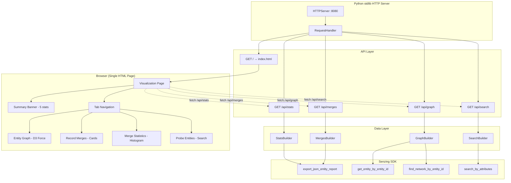

# Design Document: Module 3 Wow Visualization

## Overview

This design replaces Module 3's minimal smoke-test UI (a plain HTML form with JSON dump) with a rich interactive visualization that demonstrates Senzing's entity resolution value. The visualization is the bootcamper's first "wow moment" — seeing their own running Senzing engine process curated TruthSet data and produce meaningful entity resolution results.

The system consists of two deliverables:

1. **Web Service + Visualization Page**: A Python stdlib HTTP server (`http.server`) serving a single HTML page powered by D3.js (CDN) with four interactive tabs showing entity resolution results across the three TruthSet data sources (CUSTOMERS, REFERENCE, WATCHLIST).

2. **Steering File Update**: Modifications to `module-03-system-verification.md` Step 9 that codify the visualization requirements so the agent always builds this rich UI for every future bootcamper.

### Design Decisions

- **Python stdlib HTTP server** (`http.server.HTTPServer` + `BaseHTTPRequestHandler`): Chosen to maintain the bootcamp's zero-third-party-dependency constraint. No Flask/FastAPI.
- **D3.js from CDN**: The only external browser dependency. Provides force-directed graph layout, histogram rendering, and interactive SVG manipulation.
- **Single HTML file with embedded CSS/JS**: Simplifies deployment and aligns with the self-contained artifact pattern used elsewhere in the bootcamp.
- **Separate API endpoints** (`/api/stats`, `/api/graph`, `/api/merges`): Clean separation between data retrieval and presentation. Each endpoint maps to specific SDK calls, making the data flow transparent to the bootcamper.
- **Steering file split consideration**: Module 3 is already at 5452 tokens (above the 5000 split threshold). The visualization update will likely push it further, requiring Step 9 to be extracted into a separate phase file (`module-03-phase2-visualization.md`).

## Architecture



### File Layout

```
src/system_verification/web_service/
├── server.py          # stdlib HTTP server + request handler
├── stats_builder.py   # Statistics computation from SDK
├── graph_builder.py   # Graph node/edge construction from SDK
├── merges_builder.py  # Multi-record entity extraction from SDK
├── search_builder.py  # Search-by-attributes wrapper
└── index.html         # Single-page visualization (D3.js CDN, embedded CSS/JS)
```

### Steering File Changes

```
senzing-bootcamp/steering/
├── module-03-system-verification.md   # Updated: Step 9 references phase file
├── module-03-phase2-visualization.md  # NEW: Extracted visualization step
└── steering-index.yaml                # Updated: new token counts
```

## Components and Interfaces

### Server Component (`server.py`)

The HTTP server uses Python's `http.server` module with a custom `BaseHTTPRequestHandler` subclass.

```python
class VisualizationHandler(BaseHTTPRequestHandler):
    """Routes requests to appropriate builders or serves static HTML."""

    def do_GET(self) -> None:
        """Handle GET requests for all endpoints."""
        ...
```

**Routing Table:**

| Path | Handler | Response |
|------|---------|----------|
| `/` | Serve `index.html` | `text/html` |
| `/api/stats` | `StatsBuilder.build()` | `application/json` |
| `/api/graph` | `GraphBuilder.build()` | `application/json` |
| `/api/merges` | `MergesBuilder.build()` | `application/json` |
| `/api/search?name=&address=&phone=` | `SearchBuilder.search()` | `application/json` |
| Other | 404 response | `application/json` |

### StatsBuilder (`stats_builder.py`)

Computes aggregate statistics from `export_json_entity_report`.

```python
@dataclass
class Stats:
    records_total: int
    entities_total: int
    multi_record_entities: int
    cross_source_entities: int
    relationships_total: int
    histogram: dict[str, int]  # {"1": N, "2": N, "3": N, "4+": N}
```

**Interface:**
- `build() -> dict`: Returns the stats as a JSON-serializable dictionary.
- `compute_histogram(entities: list[dict]) -> dict[str, int]`: Buckets entities by record count into 1, 2, 3, 4+ categories.

### GraphBuilder (`graph_builder.py`)

Constructs graph nodes and edges from SDK entity/relationship data.

```python
@dataclass
class GraphNode:
    entity_id: int
    entity_name: str
    record_count: int
    data_sources: list[str]
    records: list[dict]  # [{data_source, record_id}]

@dataclass
class GraphEdge:
    source_entity_id: int
    target_entity_id: int
    match_key: str
    relationship_type: str
```

**Interface:**
- `build() -> dict`: Returns `{"nodes": [...], "edges": [...]}`.

### MergesBuilder (`merges_builder.py`)

Extracts multi-record entities with constituent records and match keys.

```python
@dataclass
class MergeEntity:
    entity_id: int
    entity_name: str
    match_key: str
    records: list[dict]  # [{data_source, record_id, name, address, phone, identifiers}]
```

**Interface:**
- `build() -> list[dict]`: Returns array of multi-record entity objects (only entities with 2+ records).

### SearchBuilder (`search_builder.py`)

Wraps `search_by_attributes` for the probe panel.

**Interface:**
- `search(name: str | None, address: str | None, phone: str | None) -> dict`: Returns `{"results": [...], "query": {...}}`.

### Visualization Page (`index.html`)

Single HTML file with:
- **D3.js v7** loaded from `https://d3js.org/d3.v7.min.js`
- **Embedded CSS**: Styling for banner, tabs, cards, graph, histogram
- **Embedded JavaScript**: Tab switching, API fetching, D3 rendering

**Tab Structure:**
1. Entity Graph — D3 force-directed layout
2. Record Merges — Card-based display
3. Merge Statistics — D3 histogram
4. Probe Entities — Button panel + search input

### Error Response Format

All API endpoints use a consistent error response:

```json
{
    "error": "Description of what went wrong"
}
```

Returned with HTTP 500 status code when SDK errors occur.

## Data Models

### Stats Response

```json
{
    "records_total": 510,
    "entities_total": 395,
    "multi_record_entities": 87,
    "cross_source_entities": 42,
    "relationships_total": 156,
    "histogram": {
        "1": 308,
        "2": 65,
        "3": 17,
        "4+": 5
    }
}
```

### Graph Response

```json
{
    "nodes": [
        {
            "entity_id": 1,
            "entity_name": "Robert Smith",
            "record_count": 3,
            "data_sources": ["CUSTOMERS", "REFERENCE"],
            "records": [
                {"data_source": "CUSTOMERS", "record_id": "1001"},
                {"data_source": "REFERENCE", "record_id": "2001"},
                {"data_source": "CUSTOMERS", "record_id": "1042"}
            ]
        }
    ],
    "edges": [
        {
            "source_entity_id": 1,
            "target_entity_id": 2,
            "match_key": "+NAME+ADDRESS",
            "relationship_type": "possible_match"
        }
    ]
}
```

### Merges Response

```json
[
    {
        "entity_id": 1,
        "entity_name": "Robert Smith",
        "match_key": "+NAME+ADDRESS",
        "records": [
            {
                "data_source": "CUSTOMERS",
                "record_id": "1001",
                "name": "Robert Smith",
                "address": "123 Main St",
                "phone": "555-0100",
                "identifiers": {"SSN": "123-45-6789"}
            },
            {
                "data_source": "REFERENCE",
                "record_id": "2001",
                "name": "Bob Smith",
                "address": "123 Main Street",
                "phone": null,
                "identifiers": {}
            }
        ]
    }
]
```

### Search Response

```json
{
    "results": [
        {
            "entity_id": 1,
            "entity_name": "Robert Smith",
            "record_count": 3,
            "data_sources": ["CUSTOMERS", "REFERENCE"],
            "match_score": 95
        }
    ],
    "query": {
        "name": "Bob Smith",
        "address": null,
        "phone": null
    }
}
```

### Color Mapping (Data Sources)

| Data Source | Color | Hex |
|-------------|-------|-----|
| CUSTOMERS | Blue | `#3b82f6` |
| REFERENCE | Green | `#22c55e` |
| WATCHLIST | Orange | `#f59e0b` |

### Node Sizing Formula

```
radius = BASE_RADIUS + (record_count * SCALE_FACTOR)
```

Where `BASE_RADIUS = 8` and `SCALE_FACTOR = 4`. Minimum radius 8px, maximum 40px.

## Correctness Properties

*A property is a characteristic or behavior that should hold true across all valid executions of a system — essentially, a formal statement about what the system should do. Properties serve as the bridge between human-readable specifications and machine-verifiable correctness guarantees.*

### Property 1: API Response Field Completeness

*For any* valid entity data (stats, graph nodes, graph edges, merge entities, or records), serializing it through the corresponding response builder SHALL produce a JSON object containing all required fields for that object type — specifically: stats responses include `records_total`, `entities_total`, `multi_record_entities`, `cross_source_entities`, `relationships_total`, and `histogram`; graph nodes include `entity_id`, `entity_name`, `record_count`, `data_sources`, and `records`; graph edges include `source_entity_id`, `target_entity_id`, `match_key`, and `relationship_type`; merge entities include `entity_id`, `entity_name`, `match_key`, and `records`; and each record includes `data_source`, `record_id`, and feature fields.

**Validates: Requirements 1.2, 2.2, 2.3, 3.2, 3.3**

### Property 2: Histogram Bucketing Correctness

*For any* list of entities with varying record counts, computing the histogram SHALL produce bucket counts that (a) sum to the total number of entities, (b) place each entity in exactly one bucket based on its record count (1, 2, 3, or 4+), and (c) never produce negative counts.

**Validates: Requirements 1.3**

### Property 3: Error Response Consistency

*For any* SDK error (regardless of which endpoint triggered it), the error handler SHALL produce an HTTP 500 response with a JSON body containing an `error` field whose value is a non-empty string describing the failure.

**Validates: Requirements 1.5, 2.5, 3.5**

### Property 4: Merge Filter Invariant

*For any* list of entities with varying record counts (including singletons), the merges builder SHALL return only entities with two or more constituent records — no single-record entity shall ever appear in the merges response.

**Validates: Requirements 3.4**

### Property 5: Data Source Color Mapping Determinism

*For any* data source name from the set {CUSTOMERS, REFERENCE, WATCHLIST}, the color mapping function SHALL always return the same distinct color, and no two different data sources SHALL map to the same color.

**Validates: Requirements 5.2**

### Property 6: Node Sizing Monotonicity

*For any* two entities where entity A has a strictly greater record count than entity B, the node sizing function SHALL produce a radius for A that is strictly greater than the radius for B.

**Validates: Requirements 5.3**

### Property 7: Summary Statement Format

*For any* valid stats tuple (records_total > 0, entities_total > 0, multi_record_entities >= 0), the summary formatter SHALL produce a string matching the pattern "[X] records collapsed into [Y] entities, including [Z] multi-record entities" where X, Y, Z are the corresponding integer values.

**Validates: Requirements 7.3**

### Property 8: Steering File Visualization Completeness

*For any* required visualization component (the three API endpoints `/api/stats`, `/api/graph`, `/api/merges`; the four tabs Entity Graph, Record Merges, Merge Statistics, Probe Entities; and the five component names Summary_Banner, Entity_Graph, Record_Merges, Merge_Statistics, Probe_Panel), the updated steering file SHALL contain a reference to that component.

**Validates: Requirements 11.1, 11.2**

### Property 9: Steering File Endpoint Verification Instructions

*For each* API endpoint (`/api/stats`, `/api/graph`, `/api/merges`), the steering file SHALL contain a verification instruction that includes an HTTP 200 check, a content validation criterion, and a timeout specification (10 seconds).

**Validates: Requirements 12.1, 12.2, 12.3, 12.4**

### Property 10: Visualization Artifact Path Isolation

*For any* file path referenced in the steering file's visualization step that points to generated server or HTML artifacts, that path SHALL be rooted under `src/system_verification/web_service/`.

**Validates: Requirements 10.3**

## Error Handling

### Server-Side Errors

| Error Condition | HTTP Status | Response | Recovery |
|-----------------|-------------|----------|----------|
| SDK not initialized | 503 | `{"error": "SDK not initialized"}` | Agent re-runs SDK init (Step 3) |
| SDK call fails | 500 | `{"error": "<SDK error description>"}` | Agent reports with Fix_Instruction |
| Invalid endpoint | 404 | `{"error": "Not found"}` | N/A |
| Invalid search params | 400 | `{"error": "At least one search parameter required"}` | User corrects input |
| Database not found | 503 | `{"error": "Database not found at database/G2C.db"}` | Agent checks Module 2 |

### Client-Side Errors (JavaScript)

| Error Condition | Handling | User Feedback |
|-----------------|----------|---------------|
| API fetch fails (network) | try/catch around fetch | "Could not connect to server. Is it running?" |
| API returns error JSON | Check response.ok | Display error message from response |
| D3.js CDN unreachable | Script onerror handler | "D3.js could not be loaded. Check internet connection." |
| Empty data (no entities) | Check array length | "No entities found. Verify data was loaded in Step 6." |
| Graph rendering error | try/catch around D3 init | "Graph rendering failed. Try refreshing the page." |

### Steering File Error Handling

The steering file instructs the agent to:
1. Verify each endpoint returns HTTP 200 within 10 seconds after server start
2. On failure: report the specific endpoint that failed, the HTTP status received, and provide a Fix_Instruction
3. Common failures and their Fix_Instructions:
   - Port 8080 in use → suggest alternative port or kill existing process
   - SDK error on endpoint → re-run SDK initialization
   - HTML file missing → regenerate web service artifacts
   - Timeout → check server process is running, check for import errors

## Testing Strategy

### Property-Based Tests (Hypothesis)

Property-based tests validate the universal correctness properties defined above. Each test uses Hypothesis with a minimum of 100 iterations.

**Library:** `hypothesis` (already in project test dependencies)
**Location:** `senzing-bootcamp/tests/test_module3_wow_visualization_properties.py`

Tests will exercise the pure data transformation functions (builders, formatters, validators) by generating random inputs and verifying invariants hold. SDK interactions are mocked — the property tests focus on OUR code's logic, not external service behavior.

**Test Classes:**
- `TestApiResponseFieldCompleteness` — Property 1
- `TestHistogramBucketingCorrectness` — Property 2
- `TestErrorResponseConsistency` — Property 3
- `TestMergeFilterInvariant` — Property 4
- `TestDataSourceColorMapping` — Property 5
- `TestNodeSizingMonotonicity` — Property 6
- `TestSummaryStatementFormat` — Property 7
- `TestSteeringVisualizationCompleteness` — Property 8
- `TestSteeringEndpointVerification` — Property 9
- `TestVisualizationArtifactPathIsolation` — Property 10

**Tag format:** Each test class docstring includes:
```
Feature: module3-wow-visualization, Property N: <property_text>
```

### Unit Tests (Example-Based)

**Location:** `senzing-bootcamp/tests/test_module3_wow_visualization_unit.py`

Unit tests cover specific examples, edge cases, and integration points:

- Stats endpoint returns correct JSON structure for known TruthSet data
- Graph endpoint handles entities with no relationships (isolated nodes)
- Merges endpoint returns empty array when no multi-record entities exist
- Search endpoint returns empty results for non-matching query
- HTML file contains exactly 4 tab elements
- HTML file loads D3.js from CDN (no other external scripts)
- Server binds to configured port and responds to health check
- Steering file references `visualization-guide.md` and `visualization-protocol.md`
- Steering file token count remains within acceptable bounds
- Tab navigation defaults to Entity Graph on load

### Integration Tests

Integration tests verify the full server lifecycle with mocked SDK:

- Start server → hit all endpoints → verify responses → stop server
- Verify endpoint verification sequence matches steering file instructions
- Verify the Web Service Delivery Sequence from `visualization-guide.md` is followed

### Test Configuration

```python
@settings(max_examples=100)
```

All property tests run 100+ iterations. Strategies generate:
- Random entity counts (1–1000)
- Random record counts per entity (1–20)
- Random data source names from {CUSTOMERS, REFERENCE, WATCHLIST}
- Random match keys from common patterns (+NAME+ADDRESS, +PHONE, +SSN, etc.)
- Random error messages (non-empty strings)
- Random stats tuples with valid ranges
