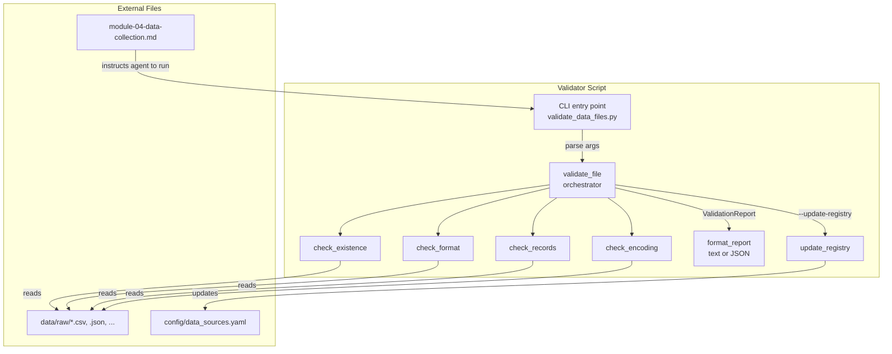

# Design Document: Module 4 Data Validation

## Overview

This feature adds an automated data file validation step to Module 4 of the Senzing bootcamp. Today, bootcampers collect data source files into `data/raw/` and proceed to Module 5 without any sanity checks. Corrupt files, encoding issues, or unrecognized formats are only discovered during data quality assessment — wasting time and creating confusion.

The validator (`senzing-bootcamp/scripts/validate_data_files.py`) runs immediately after each file is collected and checks four things:

1. **Existence and readability** — file exists, is readable, and is non-empty.
2. **Format recognition** — file extension maps to a supported format and content parses correctly.
3. **Record presence** — file contains at least one data record.
4. **Encoding validity** — text files decode as UTF-8 (or a detected fallback encoding).

Results are reported as a structured `ValidationReport` with pass/fail/warn indicators and remediation guidance. The CLI supports `--update-registry` to write results into `config/data_sources.yaml` and `--json` for machine-readable output.

Design priorities:

- **Zero dependencies**: stdlib-only Python, matching all existing scripts.
- **Testability**: pure-function validation logic separated from filesystem I/O. Each check is a standalone function returning a typed result.
- **Cross-platform**: Linux, macOS, Windows.
- **Composable**: the validator produces data structures that the agent, CLI, and registry updater consume independently.

## Architecture



### Key Design Decisions

1. **Individual check functions**: Each sanity check (`check_existence`, `check_format`, `check_records`, `check_encoding`) is a pure function that takes a file path (and optionally file content) and returns a `CheckResult`. This makes each check independently testable and composable.

2. **CheckResult dataclass**: Every check returns a `CheckResult(status, message, details)` where `status` is `"pass"`, `"fail"`, or `"warn"`. The `details` dict carries structured data (record count, encoding, etc.) for downstream consumers.

3. **ValidationReport as data**: The orchestrator `validate_file()` returns a `ValidationReport` dataclass — not a formatted string. Formatting is a separate concern handled by `format_report_text()` and `format_report_json()`.

4. **Registry update reuses existing YAML parser**: The `--update-registry` path imports `parse_registry_yaml` and `serialize_registry_yaml` from `data_sources.py` to read/write the registry. No duplicate YAML logic.

5. **Encoding detection via stdlib**: Read the first 8192 bytes and attempt `decode()` with UTF-8, then latin-1, utf-16, cp1252 in order. No chardet dependency.

6. **Format content validation is best-effort**: For CSV/TSV, attempt to parse with `csv.reader`. For JSON, use `json.loads`. For JSONL, parse first non-empty line. For XML, use `xml.etree.ElementTree`. Binary formats (xlsx, parquet) skip content validation since stdlib cannot parse them — extension match is sufficient.

## Components and Interfaces

### Check Result

```python
@dataclasses.dataclass
class CheckResult:
    """Result of a single sanity check."""
    name: str          # "existence", "format", "records", "encoding"
    status: str        # "pass", "fail", "warn"
    message: str       # human-readable description
    remediation: str   # empty string for pass/warn, guidance for fail
    details: dict      # structured data: {"record_count": 50000}, {"encoding": "utf-8"}, etc.
```

### Validation Report

```python
@dataclasses.dataclass
class ValidationReport:
    """Aggregated result of all checks for a single file."""
    file_path: str
    file_name: str
    format: str | None          # detected format or None
    record_count: int | None    # from records check or None
    encoding: str | None        # from encoding check or None
    checks: list[CheckResult]
    overall_status: str         # "pass" if all checks pass/warn, "fail" if any fail

    @property
    def failed_checks(self) -> list[CheckResult]:
        return [c for c in self.checks if c.status == "fail"]

    @property
    def failure_count(self) -> int:
        return len(self.failed_checks)
```

### Existence Check

```python
def check_existence(file_path: str) -> CheckResult:
    """Check that file exists, is readable, and is non-empty.
    Returns CheckResult with name='existence'.
    Checks in order: exists → readable → non-zero size.
    Fails on first failing condition with specific message and remediation."""
```

### Format Check

```python
RECOGNIZED_FORMATS: dict[str, str] = {
    ".csv": "csv", ".json": "json", ".jsonl": "jsonl",
    ".xml": "xml", ".xlsx": "xlsx", ".parquet": "parquet", ".tsv": "tsv",
}

def check_format(file_path: str) -> CheckResult:
    """Check that file extension is a recognized format and content parses correctly.
    Returns CheckResult with name='format'.
    Extension matching is case-insensitive.
    For text formats (csv, json, jsonl, xml, tsv), attempts to parse content.
    For binary formats (xlsx, parquet), extension match is sufficient.
    details includes {'detected_format': 'csv'} on success."""
```

### Records Check

```python
def check_records(file_path: str, detected_format: str) -> CheckResult:
    """Count data records in the file based on its format.
    Returns CheckResult with name='records'.
    CSV/TSV: rows minus header. JSON: array length or 1 for object.
    JSONL: non-empty lines. XML: direct children of root.
    Binary formats: skip with pass (cannot count without external libs).
    details includes {'record_count': N} on success."""
```

### Encoding Check

```python
FALLBACK_ENCODINGS: list[str] = ["latin-1", "utf-16", "cp1252"]

def check_encoding(file_path: str, detected_format: str) -> CheckResult:
    """Check file encoding for text-based formats.
    Returns CheckResult with name='encoding'.
    Skips binary formats (xlsx, parquet) with pass.
    Tries UTF-8 first, then fallback encodings on first 8192 bytes.
    details includes {'encoding': 'utf-8'} on success."""
```

### Orchestrator

```python
def validate_file(file_path: str) -> ValidationReport:
    """Run all sanity checks on a single file and return a ValidationReport.
    Checks run in order: existence → format → records → encoding.
    If existence fails, remaining checks are skipped.
    If format fails, records and encoding checks are skipped.
    Populates report fields from check details."""
```

### Report Formatting

```python
def format_report_text(report: ValidationReport) -> str:
    """Format a ValidationReport as human-readable text with emoji indicators.
    ✅ for pass, ❌ for fail, ⚠️ for warn.
    Includes summary line and per-check details."""

def format_report_json(reports: list[ValidationReport]) -> str:
    """Serialize a list of ValidationReports as a JSON array string."""
```

### Registry Update

```python
def update_registry(
    reports: list[ValidationReport],
    registry_path: str = "config/data_sources.yaml",
) -> None:
    """Update the data source registry with validation results.
    For each report, updates or creates a Registry_Entry with:
    validation_status, validation_checks, record_count, encoding, updated_at.
    Creates the registry file with version '1' if it does not exist.
    Imports parse/serialize from data_sources.py."""
```

### CLI Entry Point

```python
def main(argv: list[str] | None = None) -> int:
    """CLI entry point for validate_data_files.py.
    No args: scan all files in data/raw/ and validate each.
    Positional args: validate only specified files.
    --update-registry: update config/data_sources.yaml with results.
    --json: output as JSON array instead of text.
    Returns 0 if all files pass, 1 if any file fails."""
```

## Data Models

### CheckResult Status Values

| Status | Meaning |
|--------|---------|
| `pass` | Check succeeded |
| `fail` | Check failed — remediation guidance provided |
| `warn` | Check passed with a warning (e.g., non-UTF-8 encoding) |

### Remediation Messages

| Check Failure | Remediation |
|---------------|-------------|
| File not found | "Re-upload or re-download the file. Verify the file path is correct and the file was saved to data/raw/" |
| File not readable | "Check file permissions. On Linux/macOS run: chmod 644 {file_path}" |
| File empty (0 bytes) | "The file has no content. Re-download or re-export the data from the original source" |
| Unrecognized format | "Convert the file to one of the supported formats (CSV, JSON, JSONL, XML) before proceeding. See Module 4 steering for format conversion guidance" |
| Format mismatch | "The file content does not match the {extension} extension. Verify the file was exported correctly, or rename it with the correct extension" |
| No records | "The file structure is valid but contains no data rows. Re-export with data included, or check that the export query/filter returned results" |
| Encoding undetermined | "The file may be corrupted. Re-download from the original source, or try opening it in a text editor to check for garbled characters" |

### Registry Entry Additions

When `--update-registry` is used, the following fields are added/updated on each Registry_Entry:

```yaml
CUSTOMERS_CRM:
  # ... existing fields ...
  validation_status: passed        # or "failed"
  validation_checks:
    existence: pass
    format: pass
    records: pass
    encoding: pass
  record_count: 50000              # updated from validator
  encoding: utf-8                  # detected encoding
  updated_at: "2025-07-15T10:30:00Z"
```

### CLI Output Formats

**Text output** (default):

```text
✅ customer_crm.csv: All checks passed (50000 records, csv, utf-8)

❌ vendor_data.dat: 1 check(s) failed — see details below
  ❌ format: Unrecognized file format: .dat. Supported formats: csv, json, jsonl, xml, xlsx, parquet, tsv
    → Convert the file to one of the supported formats (CSV, JSON, JSONL, XML) before proceeding.
```

**JSON output** (`--json`):

```json
[
  {
    "file_path": "data/raw/customer_crm.csv",
    "file_name": "customer_crm.csv",
    "format": "csv",
    "record_count": 50000,
    "encoding": "utf-8",
    "overall_status": "pass",
    "checks": [
      {"name": "existence", "status": "pass", "message": "File exists and is readable (4.2 MB)"},
      {"name": "format", "status": "pass", "message": "Recognized format: csv"},
      {"name": "records", "status": "pass", "message": "Found 50000 data records"},
      {"name": "encoding", "status": "pass", "message": "Encoding: utf-8"}
    ]
  }
]
```

## Correctness Properties

### Property 1: Valid CSV content produces correct record count

*For any* valid CSV content generated with a header row and one or more data rows, WHEN the validator checks the file, the record-presence check SHALL return `pass` and the `record_count` in the details SHALL equal the number of generated data rows (excluding the header).

**Validates: Requirements 3.1, 3.2, 10.2**

### Property 2: Valid JSON arrays produce correct record count

*For any* valid JSON array containing one or more objects generated by Hypothesis, WHEN the validator checks the file, the record-presence check SHALL return `pass` and the `record_count` in the details SHALL equal the length of the array.

**Validates: Requirements 3.3, 10.3**

### Property 3: Valid UTF-8 content passes encoding check

*For any* valid UTF-8 string generated by Hypothesis, WHEN written to a file and checked by the validator, the encoding check SHALL return `pass` with encoding reported as `"utf-8"`.

**Validates: Requirements 4.1, 4.2, 10.4**

### Property 4: Invalid encoding fails encoding check

*For any* byte sequence generated by Hypothesis that is not valid UTF-8 and not decodable by any fallback encoding (latin-1, utf-16, cp1252), WHEN written to a file and checked by the validator, the encoding check SHALL return `fail`.

**Validates: Requirements 4.5, 10.5**

### Property 5: Overall status is pass if and only if all checks pass or warn

*For any* `ValidationReport` produced by the validator, the `overall_status` SHALL be `"pass"` if and only if every `CheckResult` in the report has status `"pass"` or `"warn"`. If any check has status `"fail"`, the `overall_status` SHALL be `"fail"`.

**Validates: Requirements 5.1, 10.6**

### Property 6: Every failed check has non-empty remediation guidance

*For any* `ValidationReport` produced by the validator that contains at least one failed `CheckResult`, every failed check SHALL have a non-empty `remediation` string.

**Validates: Requirements 5.3, 6.1–6.7, 10.7**

### Property 7: Format detection is case-insensitive

*For any* recognized file extension in any case combination (e.g., `.CSV`, `.Json`, `.JSONL`), WHEN the validator checks format, it SHALL recognize the extension and return the correct normalized format name.

**Validates: Requirements 2.1, 2.2**

## Error Handling

| Scenario | Behavior |
|----------|----------|
| File does not exist | `check_existence` returns fail with "File not found" message |
| File not readable (permissions) | `check_existence` returns fail with "cannot be opened" message |
| File is 0 bytes | `check_existence` returns fail with "File is empty" message |
| Unrecognized extension | `check_format` returns fail listing supported formats |
| Extension recognized but content unparseable | `check_format` returns fail with "content does not match" message |
| File has valid structure but no records | `check_records` returns fail with "no data records" message |
| Binary format (xlsx/parquet) record count | `check_records` returns pass, skips counting (no stdlib parser) |
| UTF-8 decode fails, fallback succeeds | `check_encoding` returns warn with conversion guidance |
| All encoding attempts fail | `check_encoding` returns fail with "corrupted" message |
| Binary format encoding check | `check_encoding` returns pass, skips (not applicable) |
| `data/raw/` directory missing (no args) | Print message "No data/raw/ directory found", exit 1 |
| `data/raw/` empty (no args) | Print message "No files found in data/raw/", exit 0 |
| Registry file missing with `--update-registry` | Create file with `version: "1"` and empty `sources` |
| Existence check fails | Skip format, records, and encoding checks |
| Format check fails | Skip records and encoding checks |

All error messages go to stderr. Normal output goes to stdout. The script never crashes with unhandled exceptions during normal operation.

## Testing Strategy

### Property-Based Testing (Hypothesis)

The validation logic is well-suited for PBT because:
- Record counting has clear mathematical properties over generated content
- Encoding detection has universal properties over byte sequences
- Report structure has invariants that must hold for all inputs
- Format detection has case-insensitivity properties

**Library**: Hypothesis (Python)
**Test file**: `senzing-bootcamp/tests/test_data_validation_properties.py`
**Minimum iterations**: 100 per property test

Key generator strategies:
- CSV content generator: header row (1+ columns) + N data rows with matching column count
- JSON array generator: list of 1+ dicts with string keys/values
- UTF-8 string generator: `st.text()` producing valid Unicode strings
- Invalid encoding generator: `st.binary()` filtered to reject valid UTF-8 and fallback encodings
- File extension generator: `st.sampled_from()` over recognized extensions with `st.functions()` for case transforms
- ValidationReport generator: compose from CheckResult generators with varying statuses

### Unit Tests (pytest)

Unit tests cover specific examples and edge cases:
- Each remediation message matches the exact text from requirements
- CLI argument parsing: no args, file paths, `--update-registry`, `--json`
- Exit codes: 0 for all pass, 1 for any fail
- Registry creation when file doesn't exist
- Registry update preserves existing entries
- Binary format handling (xlsx/parquet skip content and encoding checks)
- XML record counting (direct children of root)
- JSONL record counting (non-empty lines)
- JSON single object counts as 1 record
- Empty `data/raw/` directory handling

### Test File Location

`senzing-bootcamp/tests/test_data_validation_properties.py` — follows existing convention in the tests directory.
