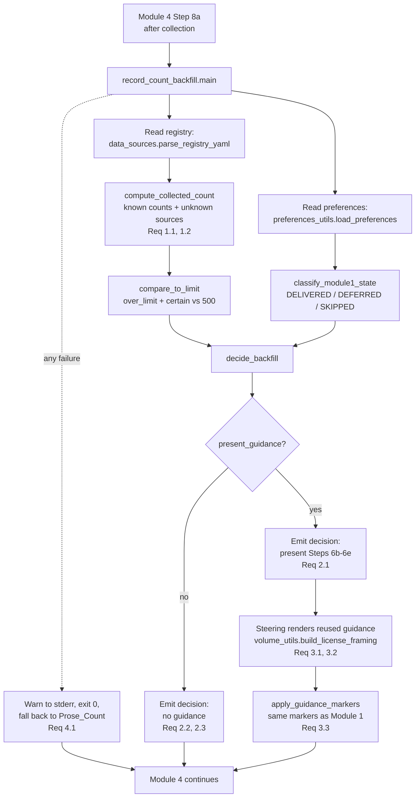

# Design Document

## Overview

Module 1 Step 6a (`module-01-phase1-discovery.md`) computes a total record count from what the
bootcamper *states in prose* and, when that total exceeds the built-in 500-record evaluation limit,
triggers license guidance (Steps 6b–6e), recording `license_guidance_deferred: true` in
`config/bootcamp_preferences.yaml` when the bootcamper defers. Because the trigger relies on prose,
a bootcamper who under-states (or never states) counts sails past Step 6a with the license branch
silently skipped — and only discovers the ceiling much later when a real load exceeds 500 records.

By Module 4 the bootcamper has collected the actual files and recorded per-source metadata in
`config/data_sources.yaml` (see `data_sources.py`: each `RegistryEntry` carries a `record_count`
that is an `int` or `null`). This feature adds a **Record_Count_Backfill** — a stdlib-only helper,
`senzing-bootcamp/scripts/record_count_backfill.py`, that Module 4 runs *after* collection. It
reads the registry, computes the **Collected_Count** from real per-source metadata (treating a
missing count as *unknown*, never silently zero, and optionally row-counting a collected file),
compares it against the **Evaluation_Limit** (500), reads the Module-1 license state from
`config/bootcamp_preferences.yaml`, and emits a **Backfill_Decision** the Module 4 steering renders.

When the Collected_Count exceeds the limit *and* Module 1 guidance was skipped or carries the
`license_guidance_deferred` flag, the Module 4 steering surfaces the **existing** Steps 6b–6e
license guidance (reused, never duplicated) and updates the **same** preference/progress markers the
Module 1 flow uses. When guidance was already delivered, or the count is at/below the limit, no
guidance is re-presented. The helper is **pure and non-blocking**: on any unreadable or malformed
input it warns and returns, and Module 4 falls back to the existing Prose_Count behavior. Only
counts and source names ever leave the helper — no row content or PII.

### Design Goals

- Judge the license need from the bootcamper's **real collected data**, not just Prose_Count
  (Requirements 1.1, 1.2).
- Reuse the **existing** license plumbing: the Steps 6b–6e content is rendered through
  `volume_utils.build_license_framing`, and the same `license` / `license_guidance_deferred`
  markers the Module 1 flow uses are read and updated — no parallel flow (Requirements 3.1–3.3).
- Keep the framing consistent with `license-capacity-framing` (default capacity + expansion path)
  across Modules 1 and 4 by delegating to the one canonical framing builder (Requirement 3.2).
- Never block Module 4: warn-and-continue on any failure, falling back to Prose_Count behavior
  (Requirement 4.1).
- Ship no PII: read only `record_count` and `name` from the registry; the decision and markers carry
  only counts and source names (Requirement 4.2).

### Non-Goals

- Changing the `data_sources.yaml` schema, the preferences schema, or the Module 1 Steps 6b–6e
  wording (the wording is reused, not re-authored).
- Inventing a new license-request path or a new deferral marker (Requirement 3.1).
- Re-presenting guidance the bootcamper already acted on in Module 1 (Requirement 2.2).
- Fetching Senzing facts (capacity/validity figures) directly — those remain the agent's job via the
  Senzing MCP server at render time, exactly as Module 1 does; the helper only decides *whether* to
  render and delegates the *wording* to the existing framing builder.
- Persisting or row-counting anything containing PII (only line/record tallies are computed).

## Architecture

`record_count_backfill.py` follows the standard script pattern (shebang,
`from __future__ import annotations`, stdlib only, dataclasses, `argparse`, `main(argv=None)`,
exit 0/1). Module 4 invokes it once after collection (new Step 8a, below). It reads two configs,
computes a decision, and prints it as machine-readable JSON on stdout; the steering renders guidance
from that decision, reusing the Module 1 Steps 6b–6e content.



### Data Flow

1. **Read the registry.** Parse `config/data_sources.yaml` with the existing
   `data_sources.parse_registry_yaml` + `apply_migrations` + `_dict_to_registry`, yielding a
   `Registry` of `RegistryEntry` objects (each with `name`, `file_path`, `format`, `record_count`).
2. **Compute Collected_Count.** Sum the non-null `record_count` values into `known_total`; collect
   every source whose `record_count` is `null` into `unknown_sources` (never counted as zero —
   Requirement 1.2). When `--row-count` is enabled and a collected file exists, resolve an unknown
   source by counting its rows (`count_file_rows`) instead of leaving it unknown.
3. **Classify Module-1 state.** Read `license` and `license_guidance_deferred` from
   `config/bootcamp_preferences.yaml` (via `preferences_utils.load_preferences`) and classify into
   `DELIVERED`, `DEFERRED`, or `SKIPPED`.
4. **Compare to the limit.** `compare_to_limit` returns `over_limit` (`known_total > 500`) and
   `certain` (false only when `known_total ≤ 500` but unknown sources remain — an indeterminate
   case the steering may resolve by row-counting).
5. **Decide.** `decide_backfill` combines the comparison and the Module-1 state into a
   `Backfill_Decision`: present guidance **iff** the count certainly exceeds the limit **and**
   Module 1 guidance was `SKIPPED` or `DEFERRED` (Requirement 2.1); never when `DELIVERED`
   (Requirement 2.2); never when at/below the limit (Requirement 2.3).
6. **Render + update markers.** When the decision says present, the steering renders the reused
   Steps 6b–6e content via `volume_utils.build_license_framing` and calls `apply_guidance_markers`
   to update the same `license` / `license_guidance_deferred` markers Module 1 uses (Requirement 3.3).
7. **Fallback.** Any unreadable/malformed input → `computable=False`, warn to stderr, exit 0, and
   Module 4 continues on Prose_Count behavior (Requirement 4.1).

### Ordering & Invocation

- The helper runs **after** collection and validation, as a new **Step 8a** in
  `module-04-data-collection.md`, immediately before the Module 5 transition (Step 9). It reuses the
  canonical evaluation-license framing already stated at the top of Module 4 and defers all
  tool-availability checks and capacity figures to the Module 1 Phase 1 flow (Steps 6a–6e) and the
  Senzing MCP server — it does **not** duplicate that logic.
- Invocation is via the steering flow only (a `python senzing-bootcamp/scripts/record_count_backfill.py`
  call), never a hook and never per file write.

## Components and Interfaces

### New script: `scripts/record_count_backfill.py`

Stdlib only; imports `data_sources`, `preferences_utils`, and `volume_utils` via `sys.path` (scripts
are not a package), consistent with the repo convention.

```python
EVALUATION_LIMIT: int = 500  # built-in evaluation-license limit; mirrors
                             # volume_utils.TIER_BOUNDARIES[TIER_DEMO] upper bound


class Module1GuidanceState(str, Enum):
    """How Module 1 left the license question, read from preferences."""
    DELIVERED = "delivered"   # a license was applied (Step 6c) -> already guided
    DEFERRED = "deferred"     # license_guidance_deferred: true (Step 6e)
    SKIPPED = "skipped"       # Steps 6b-6e never ran (prose count <= limit)


@dataclass(frozen=True)
class SourceCount:
    """One source's contribution to the Collected_Count."""
    name: str                    # DATA_SOURCE name only (never row content)
    count: int | None            # resolved record count, or None when unknown
    counted_from: str            # "metadata" | "row_count" | "unknown"


@dataclass(frozen=True)
class CollectedCount:
    """The record total inferred from collected files (Req 1.1, 1.2)."""
    known_total: int             # sum of resolved counts only
    sources: list[SourceCount]   # per-source breakdown, source names + counts only
    unknown_sources: list[str]   # names of sources with no resolvable count

    @property
    def is_complete(self) -> bool:
        """True when every source has a resolved count (no unknowns)."""
        return not self.unknown_sources


@dataclass(frozen=True)
class LimitComparison:
    """Result of comparing a Collected_Count against the Evaluation_Limit."""
    over_limit: bool             # known_total > limit
    certain: bool                # False only when <= limit but unknowns remain


@dataclass(frozen=True)
class BackfillDecision:
    """The decision the Module 4 steering renders."""
    collected: CollectedCount
    module1_state: Module1GuidanceState
    over_limit: bool
    certain: bool
    already_guided: bool         # module1_state is DELIVERED (Req 2.2)
    present_guidance: bool       # surface Steps 6b-6e now? (Req 2.1, 2.3)
    computable: bool             # False -> warn + fall back to Prose_Count (Req 4.1)
    reason: str                  # human-readable explanation (counts + names only)
```

Key functions:

- `count_file_rows(file_path: str, fmt: str) -> int | None` — count records in a collected file
  without loading PII into memory beyond a line tally: line-count for `csv` (minus a header line)
  and `jsonl`; returns `None` for formats it cannot cheaply count or on any `OSError`/decode error.
  Never raises.
- `compute_collected_count(registry: Registry, *, row_count: bool = False,
  workspace_root: str | None = None) -> CollectedCount` — build the per-source breakdown. A source
  with a non-null `record_count` is counted `from="metadata"`; a null source is `"unknown"` unless
  `row_count` is set and `count_file_rows(entry.file_path, entry.format)` resolves it
  (`from="row_count"`). `known_total` sums only resolved counts; unknowns are listed, never zeroed
  (Requirement 1.2). Reads only `name`, `record_count`, `file_path`, `format` (Requirement 4.2).
- `classify_module1_state(preferences: dict) -> Module1GuidanceState` — `DELIVERED` when `license`
  is set (Step 6c applied a license); else `DEFERRED` when `license_guidance_deferred` is truthy
  (Step 6e); else `SKIPPED`. `DELIVERED` takes precedence over `DEFERRED`.
- `compare_to_limit(collected: CollectedCount, limit: int = EVALUATION_LIMIT) -> LimitComparison` —
  `over_limit = known_total > limit`; `certain = over_limit or collected.is_complete`.
- `decide_backfill(collected: CollectedCount, module1_state: Module1GuidanceState,
  limit: int = EVALUATION_LIMIT, *, computable: bool = True) -> BackfillDecision` — the core rule:
  `present_guidance` is `True` **iff** `computable and over_limit and certain and module1_state in
  {SKIPPED, DEFERRED}`. `already_guided = (module1_state is DELIVERED)`.
- `render_backfill_guidance(decision: BackfillDecision, ctx: LicenseFramingContext) -> str | None` —
  returns `volume_utils.build_license_framing(**ctx-fields)` when `decision.present_guidance`, else
  `None`. The wording is **entirely** the reused canonical framing (Requirements 3.1, 3.2); this
  helper adds no new license text.
- `apply_guidance_markers(decision: BackfillDecision, *, preferences_path: str, progress_path: str,
  step_number: int) -> None` — when guidance was presented and acted on, update the **same** markers
  Module 1 uses through the existing `preferences_utils` writer (clear/keep
  `license_guidance_deferred`, record `license` when applied) and write the Step 8a checkpoint to
  `bootcamp_progress.json`. Idempotent (Requirement 3.3).
- `main(argv=None) -> int` — orchestrate read → compute → decide → emit JSON on stdout. Wrapped in a
  broad guard that logs a warning to stderr, prints a `computable=false` decision, and returns 0 on
  any failure (Requirement 4.1). CLI: `--registry`, `--preferences`, `--progress`, `--row-count`,
  `--step`.

### Reused interfaces (no modification)

- `data_sources.parse_registry_yaml`, `apply_migrations`, `validate_registry`, `_dict_to_registry`,
  and the `Registry` / `RegistryEntry` dataclasses — the registry reader. `Registry.total_records()`
  already sums non-null counts; `compute_collected_count` extends that with unknown-tracking and
  optional row-counting.
- `preferences_utils.load_preferences` (and its `parse_yaml`) — the preferences reader, returning the
  `license` and `license_guidance_deferred` fields; and the existing preference-write helper for
  `apply_guidance_markers` (no new writer).
- `volume_utils.build_license_framing` / `LicenseFramingContext` / `build_expansion_paths` — the
  single canonical source of the "default license + expansion paths" wording reused verbatim
  (Requirements 3.1, 3.2). `volume_utils.TIER_BOUNDARIES[TIER_DEMO]` is the origin of the 500 limit.

### Steering wiring: `module-04-data-collection.md` Step 8a

A new **Step 8a** is inserted after Step 8 (Update data source tracking) and before Step 9
(Transition to Module 5):

> **8a. Record-count license back-fill** (after all sources are collected): Run
> `python senzing-bootcamp/scripts/record_count_backfill.py` to infer the real record total from
> `config/data_sources.yaml`. If the decision reports `present_guidance: true` (the collected total
> exceeds the built-in evaluation limit and Module 1 license guidance was skipped or deferred),
> surface the **existing** Module 1 Steps 6b–6e license guidance now — using the canonical framing at
> the top of this module and the Senzing MCP server for any capacity/validity figure — then update the
> same `license` / `license_guidance_deferred` markers Module 1 uses. If `present_guidance: false`
> (already delivered, or at/below the limit), do not re-present guidance. If `computable: false`,
> note the warning and continue on the Module 1 Prose_Count behavior. This step is non-blocking.
>
> **Checkpoint:** Write step 8a to `config/bootcamp_progress.json`.

## Data Models

### `config/data_sources.yaml` (input, existing schema — unchanged)

The restricted-YAML registry parsed by `data_sources.parse_registry_yaml`. Relevant per-source
fields for this feature:

| Field | Type | Use here |
|---|---|---|
| `name` | string | Source name in the decision/markers (safe to surface) |
| `file_path` | string | Optional row-count target when `record_count` is null |
| `format` | enum (`csv`, `json`, `jsonl`, …) | Selects the row-count strategy |
| `record_count` | int \| `null` | Primary count source; `null` ⇒ **unknown**, never zero |

Example:

```yaml
version: "2"
sources:
  CUSTOMER_CRM:
    name: Customer CRM
    file_path: data/raw/customer_crm.csv
    format: csv
    record_count: 812
    # ...other fields...
  VENDOR_API:
    name: Vendor API
    file_path: data/raw/vendor_api_sample.json
    format: json
    record_count: null   # unknown -> contributes to unknown_sources, not 0
```

### `config/bootcamp_preferences.yaml` (input/output markers — existing schema)

Read and updated through `preferences_utils`; no new fields are introduced (Requirement 3.1).

| Marker | Type | Meaning for the back-fill |
|---|---|---|
| `license` | string \| absent | Set (e.g. `custom`) ⇒ guidance **DELIVERED** in Module 1 (Step 6c) |
| `license_guidance_deferred` | bool \| absent | `true` ⇒ guidance **DEFERRED** in Module 1 (Step 6e) |

State classification (precedence top-down):

| Condition | `Module1GuidanceState` | Back-fill behavior |
|---|---|---|
| `license` set | `DELIVERED` | Never re-present (Req 2.2) |
| `license_guidance_deferred` truthy | `DEFERRED` | Present if over limit (Req 2.1) |
| neither | `SKIPPED` | Present if over limit (Req 2.1) |

### The Evaluation_Limit

`EVALUATION_LIMIT = 500`, mirroring `volume_utils.TIER_BOUNDARIES[TIER_DEMO]` (whose upper bound is
the exclusive 500). "Exceeds" means strictly greater than 500, so exactly 500 records is *not*
over the limit (Requirement 2.3).

### Collected_Count semantics (unknown ≠ zero)

- `known_total` = Σ resolved counts (metadata, or row-count when `--row-count` resolves an unknown).
- `unknown_sources` = names of sources with no resolvable count; these are **reported**, never added
  as zero (Requirement 1.2).
- `over_limit` = `known_total > 500`. `certain` is `False` only when `known_total ≤ 500` **and**
  unknowns remain (the true total could still exceed the limit) — an *indeterminate* result the
  steering surfaces (and may resolve by re-running with `--row-count`). A `known_total` already over
  the limit is `certain` regardless of unknowns, since unknowns can only add records.

### Privacy & distribution safety

- The helper reads only `name`, `record_count`, `file_path`, and `format`; row-counting tallies lines
  without retaining field values. The `BackfillDecision`, its JSON emission, and the preference/
  progress markers contain only counts and source names (Requirement 4.2).
- Test fixtures are synthetic only — no real PII, credentials, or connection strings (Requirement 4.2
  and the power-distribution safety rule).

## Correctness Properties

*A property is a characteristic or behavior that should hold true across all valid executions of a
system — essentially, a formal statement about what the system should do. Properties serve as the
bridge between human-readable specifications and machine-verifiable correctness guarantees.*

The back-fill's core logic — counting, unknown-tracking, threshold comparison, the present/suppress
decision, marker idempotence, delegation to the reused framing, and non-blocking fallback — is pure
and has universal properties over a large input space of registries and preference states, so
property-based testing applies. Each property below is universally quantified and implemented as a
single Hypothesis property test whose example count comes from the active Hypothesis profile
(`fast` locally, `thorough`=100 in CI) — no hand-set `max_examples`.

The prework consolidated the acceptance criteria into six non-redundant properties: the counting
criteria (1.1, 1.2) fold into one comprehensive counting property; the decision criteria
(2.1, 2.2, 2.3) fold into one comprehensive decision property whose generator exercises the exact-500
boundary and the `DELIVERED` short-circuit; the reuse criteria (3.1, 3.2) share one render-equivalence
property.

### Property 1: Collected_Count sums known counts and tracks unknowns without zeroing

*For any* registry of collected sources — each with a `record_count` that is a non-negative integer
or `null` — `compute_collected_count` returns a `known_total` equal to the sum of exactly the
non-null counts, and an `unknown_sources` list equal to exactly the names of the sources whose count
is `null`; no unknown source contributes zero (or anything) to `known_total`, and enabling row-count
resolution only ever moves a source from unknown to counted (never changes an already-known count).

**Validates: Requirements 1.1, 1.2**

### Property 2: The present/suppress decision matches the exact truth table

*For any* `CollectedCount` and *any* `Module1GuidanceState`, `decide_backfill` sets
`present_guidance` to `True` **if and only if** the count certainly exceeds the Evaluation_Limit
(`known_total > 500`, or over-limit-certain) **and** the Module-1 state is `SKIPPED` or `DEFERRED`;
it is `False` whenever the state is `DELIVERED` (no redundant re-presentation) and whenever the
certain count is at or below 500 (no false trigger, including exactly 500).

**Validates: Requirements 2.1, 2.2, 2.3**

### Property 3: Rendered guidance is exactly the reused canonical framing

*For any* `LicenseFramingContext` and a decision with `present_guidance` true,
`render_backfill_guidance` returns a string identical to `volume_utils.build_license_framing`
called with the same context, and returns `None` when `present_guidance` is false — so the Module 4
guidance text is the existing Steps 6b–6e framing verbatim, never a parallel re-authored flow.

**Validates: Requirements 3.1, 3.2**

### Property 4: Marker updates are idempotent and use the Module 1 markers

*For any* starting `bootcamp_preferences.yaml` state and a present-guidance decision, running
`apply_guidance_markers` twice leaves the preferences and progress files byte-identical to their
state after the first run, and the resulting state sets only the same `license` /
`license_guidance_deferred` markers the Module 1 flow uses (introducing no new marker key), so
downstream modules observe a consistent state.

**Validates: Requirements 3.3**

### Property 5: Uncomputable or malformed input warns and continues (non-blocking)

*For any* missing, unreadable, or malformed registry or preferences input (absent files, invalid
YAML, schema-invalid registries), `record_count_backfill.main` never raises, returns exit code 0,
and emits a decision with `computable` false — so Module 4 falls back to the existing Prose_Count
behavior rather than blocking.

**Validates: Requirements 4.1**

### Property 6: Only counts and source names leave the helper (no PII)

*For any* registry whose entries embed arbitrary sentinel values in fields the helper does not read
(row content or non-count/non-name fields), the emitted `BackfillDecision` JSON and the
preference/progress markers contain only source names, counts, and fixed guidance text — never any
sentinel value — confirming that no PII is surfaced or persisted.

**Validates: Requirements 4.2**

## Error Handling

The back-fill is **non-blocking by contract** — Module 4 never stalls on it (Requirement 4.1).

| Failure mode | Handling |
|---|---|
| `data_sources.yaml` missing | Treat as no collected sources → `computable=False`, warn to stderr, exit 0; Module 4 continues on Prose_Count behavior. |
| `data_sources.yaml` malformed / schema-invalid | `parse_registry_yaml` / `validate_registry` failure is caught → `computable=False`, warn, exit 0. |
| A source lacks `record_count` | Not an error — the source is listed in `unknown_sources`, never zeroed (Req 1.2); `certain` reflects the resulting indeterminacy. |
| `--row-count` target file missing/unreadable/undecodable | `count_file_rows` returns `None` (never raises); the source stays unknown. |
| `bootcamp_preferences.yaml` missing / malformed | `load_preferences` returns an error result → default to `SKIPPED` if the registry is still computable, else `computable=False`; never raises. |
| Marker write failure | The existing `preferences_utils` writer catches `OSError` and warns; `apply_guidance_markers` does not raise, so the step stays non-blocking. |
| Any unexpected exception in `main` | Caught by a top-level guard that warns to stderr, emits a `computable=false` decision, and returns 0 (Req 4.1). |

`main` returns 0 on a clean run, a clean no-op, and every internally handled error path; the Module 4
steering treats Step 8a as non-blocking regardless and always proceeds to Step 9.

## Testing Strategy

Tests live in `senzing-bootcamp/tests/` (e.g. `test_record_count_backfill.py`), follow the project
pattern (pytest + Hypothesis, class-based, `sys.path` import of scripts), and property tests draw
their example count from the active Hypothesis profile — no inline `@settings(max_examples=...)`
restating the baseline. Fixtures are synthetic only: no real PII, credentials, or connection strings
(Requirement 4.2 and the power-distribution safety rule).

### Property-based tests (Hypothesis)

Property-based testing IS appropriate: the counting, comparison, decision, delegation, idempotence,
and fallback logic are pure with universal properties over a large input space. One property test per
correctness property above (Properties 1–6), each tagged:

`# Feature: module4-record-count-license-backfill, Property {number}: {property_text}`

Custom strategies (prefixed `st_`) generate the inputs:

- `st_registry()` — registries with a varying set of `DATA_SOURCE` keys, each with a non-negative
  integer or `null` `record_count`, valid formats, and synthetic names, rendered to the restricted
  registry YAML so `parse_registry_yaml` round-trips them. A variant seeds sentinel values into
  fields the helper must not read (for Property 6).
- `st_collected_count()` — `CollectedCount` values with a chosen `known_total` (spanning below,
  exactly at, and above 500) and an optional non-empty `unknown_sources` list (for Property 2).
- `st_module1_state()` — one of `DELIVERED` / `DEFERRED` / `SKIPPED`, plus the corresponding
  preferences dict (for Properties 2 and 4).
- `st_framing_context()` — `LicenseFramingContext` values with optional capacity/validity and the
  in-flow/existing-license flags (for Property 3).
- `st_malformed_input()` — absent files, invalid YAML, and schema-invalid registries (for Property 5).

Property 2 is the headline decision test and explicitly includes the exact-500 boundary and the
`DELIVERED` short-circuit among its generated cases.

### Unit / example tests

Complement the properties with the focused scenarios Requirement 5.1 names explicitly:

- **Over-limit + Module 1 skipped** → `present_guidance: true`; guidance rendered from the reused
  framing.
- **Under-limit** (including exactly 500) → `present_guidance: false`; no guidance.
- **Guidance already delivered in Module 1** → `present_guidance: false`; `already_guided: true`
  (may confirm the earlier guidance still applies).
- **Missing / unreadable metadata** → warn-and-continue: `computable: false`, exit 0, Prose_Count
  fallback.
- **Row-count resolution** of an unknown source from a small synthetic `csv`/`jsonl` fixture.
- **Structural guardrails (Req 3.1, 3.3)**: assert the helper introduces no new preference key and
  reuses `volume_utils.build_license_framing`, and that `module-04-data-collection.md` Step 8a
  invokes `record_count_backfill.py` after collection and before the Module 5 transition.

### Integration test

One end-to-end test wiring the real registry parser, real `preferences_utils`, real
`volume_utils.build_license_framing`, and the real back-fill script against a temp workspace: seed a
`data_sources.yaml` whose collected counts exceed 500 plus a deferred-state preferences file, run
`main`, and assert the emitted decision presents guidance and that `apply_guidance_markers` updates
the same Module 1 markers — with no PII from the fixtures appearing in any output.
