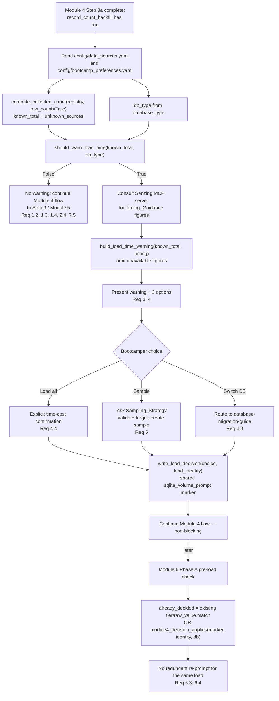

# Design Document

## Overview

Module 4 (Data Collection) collects each identified data source into `data/raw/`, records it in the
Data_Sources_Registry (`config/data_sources.yaml`), and — at the end of collection — runs
`record_count_backfill.py` to infer the real record total. Today the only SQLite-volume heads-up
fires much later, in Module 6 Phase A, and it is driven by the *stated production tier*
(Medium/Large) captured in `production_volume`, not by the *actual collected dataset*. A bootcamper
who collects a large dataset (e.g. all five London CORD sources at ~123,911 records) and carries it
forward on SQLite gets no warning at collection time that the Module 6 load will be slow.

This feature adds the **Load_Time_Warning**: an earlier, time/performance-based heads-up presented in
Module 4, immediately before the transition to Module 5. It fires only for the risky combination —
**Collected_Record_Total > 75,000 records AND the active database is SQLite** — and it is derived
purely from the collected data and the active engine, **independent of the Module 6 production
tier** and **independent of the Effective_License_Limit**. When it fires, it states that the Module 6
SQLite load will be slow, sources the specific SQLite timing figures from the Senzing MCP server at
request time (omitting any figure the server does not return), and offers three choices: load all
(with an explicit time-cost confirmation), sample down to a target count, or switch to PostgreSQL
(routing to the existing `database-migration-guide`).

Consistent with the existing Module 6 `module6-sqlite-volume-hard-prompt`, the Load_Time_Warning is
**non-blocking** — a heads-up, never a mandatory gate — and the bootcamper may always proceed on
SQLite with the full dataset. The bootcamper's response is recorded through the **existing shared
`sqlite_volume_prompt` decision-marker mechanism** (via `preferences_utils`), scoped by a **load
identity**, so the Module 6 Phase A heads-up does not redundantly re-ask about the same load.

The design cleanly separates two layers:

- **Deterministic, testable helper functions** (pure logic in `scripts/`): the trigger predicate,
  the record-total computation, the warning-text builder, the sampling helpers (target validation
  and selection strategies), the load-identity signature, and the decision-marker read/write and
  scoping checks. These are covered by pytest + Hypothesis.
- **Agent-guided steering flow** (`senzing-bootcamp/steering/module-04-data-collection.md`) that
  invokes those helpers, consults the Senzing MCP server for timing figures, presents the warning
  and options, asks the sampling sub-choice, and records the decision.

### Design Goals

- Surface the collected-dataset-on-SQLite slowdown as a real heads-up at collection time, driven by
  the actual collected total rather than a stated production tier.
- Keep every decision a pure, side-effect-free helper so the trigger truth table, MCP omission,
  sampling validation, marker round-trip, and Module 6 scoping are unit/property testable.
- Reuse the existing record-count computation (`record_count_backfill` / `data_sources`), volume
  helpers (`volume_utils`), preferences machinery (`preferences_utils`), and the
  `database-migration-guide` — no parallel logic, no duplicated migration steps.
- Never block: any failure or indeterminate input continues the Module 4 flow.
- Keep the time/performance concern distinct from the existing license-capacity sampling framing
  (`license-aware-sampling` / `license-capacity-framing`) — it fires even when the license has no
  record cap.
- Add no third-party dependency and no new hook — the flow is steering-driven, stdlib only.

### Non-Goals

- Changing tier boundaries or `classify_tier` (owned by `record-volume-guidance`), or the Module 6
  tier-based `should_prompt` trigger (owned by `module6-sqlite-volume-hard-prompt`).
- Duplicating or rewriting the SQLite→PostgreSQL migration procedure (owned by
  `database-migration-guide`).
- Changing the license-capacity sampling framing (owned by `license-aware-sampling` /
  `license-capacity-framing`); the Load_Time_Warning is deliberately independent of it.
- Auto-migrating the database or changing `database_type` on the bootcamper's behalf.
- Making the warning a mandatory gate (⛔) or otherwise blocking the flow.

## Architecture

The feature adds pure helpers across two script locations and one steering block:

- **`scripts/volume_utils.py`** — the pure trigger predicate and the pure warning-text builder are
  added alongside the existing `should_prompt` / `build_hard_prompt` (Module 6) helpers, since they
  are the same *kind* of thing (a SQLite volume decision + wording).
- **`scripts/load_time_warning.py`** (new) — a Module 4 orchestration helper (mirroring the shape of
  `record_count_backfill.py`) that owns the load-identity signature, the sampling helpers, and the
  decision-marker read/write and Module 6 scoping check. It imports its siblings (`volume_utils`,
  `preferences_utils`, `record_count_backfill`, `data_sources`) via the repo's `sys.path` convention
  and adds no parallel logic.
- **`steering/module-04-data-collection.md`** — a new agent-instruction block, "SQLite Load-Time
  Warning (collection-time heads-up)", placed after Step 8a (record-count back-fill) and before the
  Step 9 transition to Module 5.
- **`steering/module-06-phaseA-build-loading.md`** — a small additive change to the existing "SQLite
  Volume Hard_Prompt" `already_decided` computation so it also honors a Module 4 decision via the
  shared marker and load identity.



### Trigger point and ordering

- The Load_Time_Warning is evaluated **once**, after Step 8a (record-count back-fill has already
  inferred the collected total) and before the Step 9 transition, so it uses the final collected
  registry. This mirrors how the record-count back-fill is a single steering-flow invocation at the
  end of collection.
- The flow is **steering-driven only** — no `preToolUse`/`postToolUse` hook and no per-write process
  is added, matching the module's existing "agent instruction" checks.

### Reuse (no parallel logic — Requirement 7.4)

| Concern | Reused component |
|---|---|
| Collected_Record_Total computation | `record_count_backfill.compute_collected_count`, `count_file_rows`, `compare_to_limit` (called with the warning threshold instead of the 500 evaluation limit) |
| Registry parsing / model | `data_sources.parse_registry_yaml` → `apply_migrations` → `validate_registry` → `_dict_to_registry` (the `Registry` / `RegistryEntry` model) |
| Tier vocabulary (only to assert independence) | `volume_utils` tier constants — the trigger never consults them |
| Decision marker read/write | `preferences_utils.write_preference`, `load_preferences` / `parse_yaml`, and the shared `sqlite_volume_prompt` key |
| Migration destination | `database-migration-guide` (`docs/guides/DATABASE_MIGRATION.md`) |
| SQLite timing facts | Senzing MCP server at request time (never hardcoded) |

## Components and Interfaces

### Pure additions to `scripts/volume_utils.py`

Both are pure, stdlib-only, never perform I/O and never raise on in-range inputs — matching the
existing `should_prompt` / `build_hard_prompt` contract.

#### `should_warn_load_time` — the trigger predicate

```python
LOAD_WARNING_THRESHOLD = 75_000

def should_warn_load_time(
    collected_total: int | None,
    db_type: str | None,
) -> bool:
    """Decide whether the Module 4 SQLite Load_Time_Warning should fire.

    Pure, side-effect free, and deliberately independent of the production tier
    (no tier parameter) and of any license limit (no license parameter) — the
    decision is derived from the collected total and the active engine only.

    Args:
        collected_total: The determinate Collected_Record_Total (the resolved
            known_total from compute_collected_count), or None when the total
            cannot be computed.
        db_type: The active database engine (database_type), or None/unknown
            when indeterminate.

    Returns:
        True iff collected_total is a real int (not bool) strictly greater than
        LOAD_WARNING_THRESHOLD AND the normalized db_type == "sqlite". Any
        indeterminate input (None total, None/empty/unrecognized db_type) or a
        total at or below the threshold yields False. Never raises, never
        performs I/O.
    """
```

Behavior contract:

- Normalizes `db_type` case-insensitively with surrounding whitespace stripped (`"SQLite"`,
  `" sqlite "` → `"sqlite"`).
- Returns `True` **iff** `collected_total` is an `int` (rejecting `bool`) with `collected_total >
  LOAD_WARNING_THRESHOLD` **and** normalized `db_type == "sqlite"`.
- Returns `False` at exactly the threshold and below (Requirement 1.2 — "at or below").
- Returns `False` for any non-SQLite engine, e.g. `"postgresql"` (Requirement 1.3).
- Returns `False` when `collected_total` is `None` or `db_type` is `None`/empty/unrecognized — the
  indeterminate fallback (Requirements 1.4, 2.4).
- Takes no tier and no license argument, so the trigger is independent of `production_volume` and of
  `Effective_License_Limit` (Requirements 2.5, 7.1, 7.2).

Because the steering feeds `collected_total = compute_collected_count(...).known_total` — a
**determinate lower bound** that sums only resolved counts — the predicate correctly fires when the
resolved total already exceeds the threshold even if some sources remain unknown (unknown sources
can only increase the true total), and does not fire when the resolved total is at/below the
threshold with unknowns remaining (Requirements 2.2, 2.3).

#### `build_load_time_warning` — the warning wording

```python
@dataclass(frozen=True)
class TimingGuidance:
    """SQLite load-timing figures retrieved from the Senzing MCP server.

    Every field is a display string the agent obtained from the MCP server at
    request time, or None when the server did not return it or was unreachable.
    The builder never hardcodes or substitutes a figure — None means "omit and
    say currently unavailable".

    Attributes:
        expected_throughput: Expected initial load throughput, or None.
        throughput_degradation: Magnitude of throughput degradation, or None.
        expected_load_duration: Expected initial-load duration, or None.
        redo_phase_duration: Expected entity-resolution redo-phase duration, or None.
    """

    expected_throughput: str | None = None
    throughput_degradation: str | None = None
    expected_load_duration: str | None = None
    redo_phase_duration: str | None = None


def build_load_time_warning(
    collected_total: int,
    timing: TimingGuidance,
    *,
    migration_guide_path: str = "docs/guides/DATABASE_MIGRATION.md",
) -> str:
    """Build the Load_Time_Warning text for a large collected dataset on SQLite.

    Pure text builder. Always states that loading collected_total records on
    SQLite in Module 6 is expected to be slow and names collected_total; always
    states that throughput degrades as the database grows, that the
    entity-resolution redo phase needs additional time, and that a slow,
    mostly-idle load is expected progress rather than a stall. For each
    Timing_Guidance figure it includes the figure when present and, when the
    figure is None, states the value is currently unavailable from the MCP
    server (never a substituted number). Always offers the three options —
    load all, sample, and switch database (naming database-migration-guide) —
    and never emits the Mandatory_Gate marker (⛔).

    Args:
        collected_total: The Collected_Record_Total driving the warning.
        timing: The MCP-sourced Timing_Guidance figures (any subset may be None).
        migration_guide_path: Repo-relative path to the migration guide.

    Returns:
        The warning text. Never raises, never performs I/O.
    """
```

Behavior contract: always names `collected_total` and the "expected to be slow" framing (Req 3.1);
per-figure inclusion/omission with an explicit "currently unavailable from the MCP server" for
`None` (Req 3.3, 3.4); the three fixed qualitative statements — degradation (Req 3.5), redo phase
needs time (Req 3.6), slow-but-progressing (Req 3.7); the three options load/sample/switch naming the
migration guide (Req 4.1, 4.2, 4.3); no ⛔ marker (Req 4.5). Mirrors the existing
`build_license_framing` omission style and refers to the migration guide by repo-relative path and
the MCP server by name only (no URLs).

### New helper module `scripts/load_time_warning.py`

A Module 4 orchestration helper following the project script pattern (shebang, `from __future__
import annotations`, stdlib only, dataclasses, `argparse` + `main(argv=None)`, exit 0/1). It inserts
`scripts/` on `sys.path` and imports `volume_utils`, `preferences_utils`, `record_count_backfill`,
and `data_sources` — reusing them rather than re-implementing.

#### Load identity

```python
def compute_load_identity(registry: data_sources.Registry) -> str:
    """Compute a stable, order-independent identity for the collected load.

    Builds a signature from each source's (data_source, record_count) pair —
    record_count rendered as its integer or the literal "unknown" — sorted by
    data_source, then hashed with hashlib.sha256. Only source names and counts
    ever enter the signature (no row content, no PII).

    Args:
        registry: The parsed data source registry.

    Returns:
        A "sha256:<hexdigest>" identity string. Deterministic and independent of
        source ordering; two registries with different source/count sets produce
        different identities (modulo hash collisions). Never raises, never I/O.
    """
```

The identity scopes the decision to "this load": both Module 4 (at collection) and Module 6 (at
load) compute it from `config/data_sources.yaml`. A genuinely different dataset yields a different
identity (Requirement 6.4).

#### Sampling helpers

```python
STRATEGY_FIRST_N = "first_n"
STRATEGY_RANDOM_N = "random_n"
STRATEGY_ER_DEMONSTRATING = "er_demonstrating"
STRATEGY_DESCRIBED = "described"
VALID_SAMPLING_STRATEGIES = (
    STRATEGY_FIRST_N, STRATEGY_RANDOM_N, STRATEGY_ER_DEMONSTRATING, STRATEGY_DESCRIBED,
)


@dataclass(frozen=True)
class SampleTargetValidation:
    """Result of validating a requested sampling target."""

    valid: bool
    reason: str


def validate_sample_target(
    target: int | None,
    collected_total: int | None,
) -> SampleTargetValidation:
    """Validate a requested sampling target record count.

    Valid iff target is a real int (not bool), target > 0, collected_total is a
    real int, and target < collected_total. Any other case is invalid with a
    human-readable, PII-free reason so the steering can re-ask (Requirement 5.6).

    Returns:
        SampleTargetValidation(valid, reason). Never raises, never performs I/O.
    """


def select_first_n(total: int, target: int) -> list[int]:
    """Select the first N record indices: range(min(target, total)). Pure."""


def select_random_n(total: int, target: int, seed: int) -> list[int]:
    """Select N distinct random indices in [0, total) deterministically.

    Uses random.Random(seed).sample so the selection is reproducible given the
    seed. Returns min(target, total) distinct in-range indices. Pure (no global
    RNG state), never raises for target >= 0.
    """


def select_er_demonstrating(
    clusters: list[list[int]],
    singletons: list[int],
    target: int,
    seed: int,
) -> list[int]:
    """Select records that preserve known match clusters (ER-demonstrating).

    Adds whole match clusters (each cluster is a set of record indices that
    resolve together across sources) until adding the next whole cluster would
    exceed target, then fills remaining budget from singletons. A cluster is
    always included in full or excluded in full — never partially — so
    cross-source overlaps and known match clusters are preserved (Req 5.7).
    Deterministic given seed. Pure, never raises.
    """
```

The actual sample-file writing is an I/O step:

```python
def write_sample(
    source_path: str,
    dest_path: str,
    fmt: str,
    keep_indices: list[int],
) -> "SampleWriteResult":
    """Write the selected records to dest_path (under data/samples/).

    Streams the source file (countable formats: csv keeps the header + selected
    data rows; jsonl keeps selected lines) and writes only the kept records —
    never loading full field values into memory beyond the current line. Returns
    a result object rather than raising; unreadable/unwritable files or
    non-countable formats yield success=False with a reason so the flow stays
    non-blocking.
    """


def write_sample_manifest(
    dest_dir: str,
    strategy: str,
    target: int,
    kept: int,
) -> "SampleWriteResult":
    """Document the sample under data/samples/ (strategy + target + kept count).

    Writes a small sidecar recording the chosen Sampling_Strategy and target
    record count (Requirement 5.4). Counts and strategy only — no row content.
    """
```

#### Decision marker read/write and Module 6 scoping

```python
LOAD_MARKER_SOURCE = "module4_load_time"  # value of sqlite_volume_prompt.source


def write_load_decision(
    choice: str,             # "proceed" | "sample" | "switch_db"
    load_identity: str,
    preferences_path: str = "config/bootcamp_preferences.yaml",
) -> preferences_utils.WriteResult:
    """Record the Load_Decision_Marker via the shared sqlite_volume_prompt key.

    Writes {decided: true, choice, source: LOAD_MARKER_SOURCE, load_identity}
    to the existing sqlite_volume_prompt marker through
    preferences_utils.write_preference — the same shared mechanism the Module 6
    Hard_Prompt uses, not a parallel store (Requirements 6.1, 6.2). Returns the
    writer's WriteResult (never raises) so a write failure is non-blocking.
    """


def read_load_decision(
    preferences_path: str = "config/bootcamp_preferences.yaml",
) -> dict | None:
    """Read the sqlite_volume_prompt marker, or None when absent/unreadable.

    Reuses preferences_utils.load_preferences / parse_yaml. Never raises.
    """


def module4_decision_applies(
    marker: dict | None,
    current_identity: str,
    db_type: str | None,
) -> bool:
    """Whether a Module 4 Load_Decision applies to the current Module 6 load.

    Pure. Returns True iff marker is a decided Module 4 marker
    (source == LOAD_MARKER_SOURCE, decided is True) whose load_identity equals
    current_identity AND db_type normalizes to "sqlite". A different identity
    (a genuinely different load) yields False so Module 6 evaluates its own
    condition fresh (Requirements 6.3, 6.4). Never raises, never performs I/O.
    """
```

### Steering wiring

#### `module-04-data-collection.md` — "SQLite Load-Time Warning (collection-time heads-up)"

A new agent-instruction block after Step 8a and before the Step 9 transition:

1. Read `config/data_sources.yaml` (via the `data_sources` reader chain) and
   `config/bootcamp_preferences.yaml` (`database_type`). Compute the collected total via
   `record_count_backfill.compute_collected_count(registry, row_count=True).known_total`. If the
   registry cannot be read/parsed, treat the total as indeterminate (`None`).
2. Call `volume_utils.should_warn_load_time(known_total, db_type)`.
   - **False** → say nothing about load time; continue to Step 9 (Requirements 1.2, 1.3, 1.4, 2.4,
     7.5).
   - **True** → consult the **Senzing MCP server** at request time for the four Timing_Guidance
     figures, build a `TimingGuidance` (any figure the server does not return or that errors stays
     `None`), then present `volume_utils.build_load_time_warning(known_total, timing)` and **🛑
     STOP** for the bootcamper's choice.
3. Act on the choice:
   - **Load all** → obtain an explicit confirmation that the bootcamper accepts the expected load
     time before continuing (Requirement 4.4); then record the decision.
   - **Sample** → ask which `Sampling_Strategy` (offer first-N, random-N, ER-demonstrating; accept a
     bootcamper-described strategy — Requirements 5.1, 5.2, 5.3); validate the target with
     `validate_sample_target` and re-ask on invalid (Requirements 5.5, 5.6); create the sample with
     the chosen selection helper, `write_sample` it under `data/samples/`, and `write_sample_manifest`
     to document the strategy and target (Requirement 5.4); then record the decision.
   - **Switch DB** → route to the existing `database-migration-guide`
     (`docs/guides/DATABASE_MIGRATION.md`) without inlining migration steps (Requirement 4.3); then
     record the decision.
4. Record the decision via `write_load_decision(choice, compute_load_identity(registry))`
   (Requirements 6.1, 6.2). Every step is non-blocking: any failure or indeterminate input continues
   the Module 4 flow (Requirement 7.5).

The block is explicitly labeled **not** a Mandatory_Gate (no ⛔); it always allows proceed-on-SQLite
with the full dataset (Requirement 4.5), presents the concern as distinct from the license-capacity
sampling framing already in the module (Requirement 7.3), and refers to the migration guide by
repo-relative path and the MCP server by name only.

#### `module-06-phaseA-build-loading.md` — honor the Module 4 decision

The existing "SQLite Volume Hard_Prompt" `already_decided` computation is extended additively:

```
already_decided =
    (marker.decided AND marker.tier == production_volume.tier
        AND marker.raw_value == production_volume.raw_value)          # existing Module 6 rule
    OR module4_decision_applies(marker, compute_load_identity(registry), db_type)   # NEW
```

When a Module 4 Load_Decision was recorded for the current load and the database is still SQLite,
Module 6 treats the SQLite volume concern as already decided and continues without re-presenting its
heads-up (Requirement 6.3). If the load identity differs (a different collected dataset), the Module
4 branch is `False` and Module 6 evaluates its own condition as before (Requirement 6.4).

### Reused interfaces (no modification of behavior)

- `record_count_backfill.compute_collected_count`, `count_file_rows`, `compare_to_limit`,
  `CollectedCount`.
- `data_sources.parse_registry_yaml` / `apply_migrations` / `validate_registry` / `_dict_to_registry`,
  `Registry`, `RegistryEntry`.
- `preferences_utils.write_preference`, `load_preferences`, `parse_yaml`, `WriteResult`.
- `database-migration-guide` (`docs/guides/DATABASE_MIGRATION.md`).

### Additive schema extension in `preferences_utils.py`

The shared `sqlite_volume_prompt` marker is extended so it can also carry a Module 4 decision, kept
backward compatible with the Module 6 shape:

- `SQLITE_VOLUME_PROMPT_KEYS` gains `"source"` and `"load_identity"`.
- `VALID_SQLITE_VOLUME_CHOICE` gains `"sample"` and `"switch_db"` (now `("proceed", "migrate",
  "sample", "switch_db")`).
- `_SQLITE_VOLUME_PROMPT_TYPES` gains `"source": str`, `"load_identity": str`.
- A new `source` enum `("module4_load_time", "module6_volume")`.
- `tier` and `raw_value` remain optional (present for the Module 6 shape, absent for the Module 4
  shape), so both marker shapes validate.

## Data Models

### Data_Sources_Registry fields used (`config/data_sources.yaml`)

The record-total computation and load identity read only these fields from each `RegistryEntry`
(never row content or PII — Requirement 7.4 reuse of the existing PII-safe computation):

| Field | Type | Use |
|---|---|---|
| `name` / `data_source` (key) | str | Source identity for per-source breakdown and load-identity signature |
| `record_count` | int \| null | Primary source of the Collected_Record_Total; `null` → row-count fallback or unknown |
| `file_path` | str | Row-count fallback target (countable formats) and sample source |
| `format` | str | Determines countability (`csv`/`jsonl` countable; others → unknown) |

### Collected_Record_Total (reused `CollectedCount`)

Produced by `record_count_backfill.compute_collected_count(registry, row_count=True)`:

- `known_total` — sum of resolved counts only (metadata, or row-count for countable formats). This
  is the determinate lower bound fed to `should_warn_load_time`.
- `unknown_sources` — names of sources with no resolvable count; treated as **unknown, never zero**
  (Requirement 2.2).

`compare_to_limit(collected, LOAD_WARNING_THRESHOLD)` yields `over_limit = known_total > 75_000` and
`certain = over_limit or is_complete` — the same certain/over-limit semantics already used for the
license back-fill, now with the warning threshold.

### Warning_Threshold and SQLite_Active

- `LOAD_WARNING_THRESHOLD = 75_000`. Strictly exceeded arms the warning; exactly 75,000 does not
  (Requirement 1.2).
- `SQLite_Active` ⇔ normalized `database_type == "sqlite"` (case-insensitive, whitespace-trimmed).
  Any other recognized engine (e.g. `"postgresql"`) → no warning (Requirement 1.3); `None`/empty/
  unrecognized → indeterminate → no warning (Requirement 1.4).

### Trigger truth table (`Collected_Record_Total × database`)

Given a determinate total and `db_type`:

| Collected_Record_Total | SQLite | non-SQLite (e.g. postgresql) |
|---|---|---|
| Above 75,000 | **Yes (warn)** | No |
| Exactly 75,000 | No | No |
| Below 75,000 | No | No |

Collapsing to **No warning** regardless of the above:

| Condition | Result | Requirement |
|---|---|---|
| `collected_total` is `None` (uncomputable) | No | 1.4, 2.4 |
| `db_type` is `None` / empty / unrecognized | No | 1.4 |

The predicate takes no tier and no license argument, so the verdict is independent of
`production_volume` and `Effective_License_Limit` (Requirements 2.5, 7.1, 7.2).

### Timing_Guidance (`TimingGuidance`)

Four `str | None` figures sourced from the Senzing MCP server at request time:
`expected_throughput`, `throughput_degradation`, `expected_load_duration`, `redo_phase_duration`.
`None` means the server did not return the figure or was unreachable — the builder omits it and
states it is currently unavailable from the MCP server, never substituting a value (Requirements
3.3, 3.4).

### Sampling_Strategy

`VALID_SAMPLING_STRATEGIES = ("first_n", "random_n", "er_demonstrating", "described")`. The sampling
target must be a positive integer strictly less than the Collected_Record_Total (Requirement 5.5);
otherwise the steering re-asks (Requirement 5.6). Samples are written under `data/samples/` with a
manifest documenting the strategy and target (Requirement 5.4).

### Load_Decision_Marker (shared `sqlite_volume_prompt`)

Recorded through the existing shared decision-marker mechanism (Requirements 6.1, 6.2). The Module 4
shape:

```yaml
sqlite_volume_prompt:
  decided: true                        # a choice has been recorded
  choice: proceed                      # "proceed" | "sample" | "switch_db"
  source: module4_load_time            # which check recorded it
  load_identity: "sha256:<hexdigest>"  # identity of the load the decision applies to
```

The existing Module 6 shape is unchanged and coexists:

```yaml
sqlite_volume_prompt:
  decided: true
  choice: proceed                      # "proceed" | "migrate"
  source: module6_volume
  tier: medium
  raw_value: 123911
```

`module4_decision_applies(marker, current_identity, db_type)` returns `True` only for a decided
Module 4 marker whose `load_identity` matches the current load and whose `db_type` normalizes to
`sqlite`; a different identity yields `False` (Requirements 6.3, 6.4). Module 6 ORs this with its
existing tier/raw_value match to compute `already_decided`.

## Correctness Properties

*A property is a characteristic or behavior that should hold true across all valid executions of a
system — essentially, a formal statement about what the system should do. Properties serve as the
bridge between human-readable specifications and machine-verifiable correctness guarantees.*

Property-based testing IS appropriate for this feature: the trigger predicate, the warning-text
builder, the sampling helpers, the load-identity signature, and the decision-marker read/write and
scoping checks are pure, stdlib-only functions whose behavior varies meaningfully across a large
input space (every record total, every database string, arbitrary timing-figure subsets, arbitrary
targets, arbitrary cluster sets, arbitrary choices and identities). The steering flow, MCP retrieval,
and interactive confirmations are agent-behavior and are covered by example/structural tests instead.

Each property below is universally quantified and implemented as a single Hypothesis property test.
Example counts come from the active Hypothesis profile (`fast`=5 locally, `thorough`=100 in CI) — no
inline `@settings(max_examples=...)` override is set. The prework analysis was consolidated to remove
redundancy (the many predicate criteria collapse into one truth-table property, the many
warning-text criteria into one content property, and so on).

### Property 1: Trigger fires exactly on (total > threshold) AND SQLite

*For any* `collected_total` drawn from integers (including the 75,000 boundary and negatives),
booleans, and `None`, and *any* `db_type` drawn from `sqlite` in mixed case and with surrounding
whitespace, `postgresql`, `""`, `None`, and junk strings, `should_warn_load_time(collected_total,
db_type)` returns `True` **iff** `collected_total` is a real `int` (not `bool`) strictly greater than
`LOAD_WARNING_THRESHOLD` (75,000) **and** the normalized `db_type == "sqlite"`; in every other case
(at/below threshold, non-SQLite engine, `None`/indeterminate total or db_type) it returns `False`,
and it never raises. The function takes no tier and no license argument, so the verdict is
independent of the production tier and of the Effective_License_Limit.

**Validates: Requirements 1.1, 1.2, 1.3, 1.4, 2.5, 7.1, 7.2**

### Property 2: Collected total sums only resolved counts and is a sound lower bound

*For any* generated Data_Sources_Registry with a mix of sources that have `record_count` metadata,
sources missing a count in countable formats (`csv`/`jsonl`), and sources missing a count in
uncountable formats, `compute_collected_count(registry, row_count=True)` produces a `known_total`
equal to the sum of only the resolved counts, lists every unresolved source in `unknown_sources`
(never counting it as zero into the total), and — because unknown sources can only increase the true
total — whenever `known_total` strictly exceeds `LOAD_WARNING_THRESHOLD`,
`should_warn_load_time(known_total, "sqlite")` is `True` even while unknown sources remain.

**Validates: Requirements 2.1, 2.2, 2.3**

### Property 3: Warning names the total, states all fixed concerns, omits only unavailable figures, and offers all options without gating

*For any* non-negative `collected_total` and *any* `TimingGuidance` in which each of the four figures
is independently either a display string or `None`, `build_load_time_warning(collected_total,
timing)` returns text that: names `collected_total` and states the SQLite load is expected to be
slow; always states that throughput degrades as the database grows, that the entity-resolution redo
phase needs additional time, and that a slow, mostly-idle load is expected progress rather than a
stall; includes each timing figure exactly when it is present and, for each `None` figure, states the
value is currently unavailable from the MCP server without substituting any number; always offers the
load-all, sample, and switch-database options with the switch option naming the
`database-migration-guide` / `DATABASE_MIGRATION.md`; and never contains the Mandatory_Gate marker
(⛔). It never raises.

**Validates: Requirements 3.1, 3.3, 3.4, 3.5, 3.6, 3.7, 4.1, 4.2, 4.3, 4.5**

### Property 4: Sampling target is valid exactly when it is a positive integer below the total

*For any* `target` drawn from integers, booleans, and `None`, and *any* `collected_total` drawn from
integers and `None`, `validate_sample_target(target, collected_total)` reports `valid` **iff**
`target` is a real `int` (not `bool`) with `target > 0`, `collected_total` is a real `int`, and
`target < collected_total`; every other case is reported invalid with a non-empty, PII-free reason.
It never raises.

**Validates: Requirements 5.5, 5.6**

### Property 5: Count-based selection returns exactly target distinct in-range indices

*For any* `total > 0`, *any* `target` with `0 < target < total`, and *any* `seed`, both
`select_first_n(total, target)` and `select_random_n(total, target, seed)` return exactly `target`
distinct indices, all within `[0, total)`; `select_random_n` is deterministic for a fixed `seed`.
Neither raises.

**Validates: Requirements 5.2, 5.4**

### Property 6: ER-demonstrating selection never splits a match cluster

*For any* set of match `clusters` (each a list of record indices), *any* `singletons`, *any* `target`,
and *any* `seed`, the index set returned by `select_er_demonstrating(clusters, singletons, target,
seed)` contains, for every cluster, either all of that cluster's members or none of them — never a
strict subset — so cross-source overlaps and known match clusters are preserved. It never raises.

**Validates: Requirements 5.7**

### Property 7: Decision-marker round-trips choice and load identity through the shared marker

*For any* `choice` drawn from `{"proceed", "sample", "switch_db"}` and *any* `load_identity` string,
writing the decision with `write_load_decision(choice, load_identity, preferences_path)` and then
reading it back with `read_load_decision(preferences_path)` yields a marker under the shared
`sqlite_volume_prompt` key whose `decided` is `True`, whose `choice` equals the written `choice`,
whose `source` is `"module4_load_time"`, and whose `load_identity` equals the written
`load_identity`.

**Validates: Requirements 6.1, 6.2**

### Property 8: Module 6 honors a Module 4 decision only for the same load on SQLite

*For any* two registries and their identities `id_a = compute_load_identity(reg_a)` and
`id_b = compute_load_identity(reg_b)`: `compute_load_identity` is deterministic and independent of
source ordering (recomputing on a reordering of the same sources yields the same identity), and
differing source/count sets yield differing identities; and for a decided Module 4 marker recorded
with `load_identity = id_a`, `module4_decision_applies(marker, current_identity, db_type)` returns
`True` **iff** `current_identity == id_a` **and** the normalized `db_type == "sqlite"`, and returns
`False` whenever the identity differs (`current_identity == id_b != id_a`) or the marker is not a
decided Module 4 marker. It never raises.

**Validates: Requirements 6.3, 6.4**

## Error Handling

The feature is **non-blocking by contract** — the Module 4 flow never stalls on the warning logic,
and any failure or indeterminate input resolves to "continue" (Requirements 1.4, 2.4, 7.5). Pure
functions never raise on in-range inputs; I/O helpers catch errors and return result objects (never
raise), mirroring `record_count_backfill`'s non-blocking style.

| Failure mode | Handling |
|---|---|
| `config/data_sources.yaml` missing / unreadable / malformed | The registry cannot be parsed → the collected total is treated as `None` → `should_warn_load_time` returns `False`; continue the Module 4 flow (Req 2.4, 7.5). |
| Some sources lack `record_count` and are uncountable | Those sources are listed in `unknown_sources` and never counted as zero; the trigger still fires if `known_total` alone exceeds the threshold (Req 2.2, 2.3). |
| `database_type` missing / empty / unrecognized | Normalized value is not `"sqlite"` → `should_warn_load_time` returns `False`; continue (Req 1.4). |
| `database_type` casing / whitespace (`"SQLite"`, `" sqlite "`) | Normalized case-insensitively and trimmed → treated as SQLite. |
| Collected total at or below 75,000 (incl. exactly 75,000) | Predicate returns `False`; no warning (Req 1.2). |
| MCP server returns no figure / unreachable / errors for a figure | That `TimingGuidance` field stays `None`; `build_load_time_warning` omits it and states it is currently unavailable from the MCP server — never a substituted number (Req 3.3, 3.4). The MCP timeout/omission handling follows the same pattern the module already uses for capacity/validity figures. |
| Invalid sampling target (non-int, ≤ 0, or ≥ total) | `validate_sample_target` returns `valid=False` with a reason; the steering re-asks for a valid target before creating the sample (Req 5.5, 5.6). |
| Sample source file unreadable / uncountable format / destination unwritable | `write_sample` returns `success=False` with a reason (no raise); the steering surfaces it and continues without blocking (Req 7.5). |
| Preferences file unreadable / unwritable when recording the decision | `write_load_decision` returns the writer's `WriteResult` with `success=False`; the flow continues (Req 6.1 best-effort, non-blocking). |
| Decision marker absent or from a different load (identity mismatch) | `module4_decision_applies` returns `False` → Module 6 evaluates its own condition as before (Req 6.4). A matching marker on SQLite suppresses the Module 6 re-prompt (Req 6.3). |
| Bootcamper chooses Switch DB | Steering routes to the existing `database-migration-guide`; no migration steps are duplicated (Req 4.3). |
| Bootcamper chooses Load all | Steering obtains an explicit confirmation of the accepted load time before continuing with the full dataset (Req 4.4); the warning was never a gate (Req 4.5). |

Because the warning is a heads-up and never a gate, an indeterminate or error state always resolves
to "continue the Module 4 flow" — the bootcamper is never stuck (Req 7.5).

## Testing Strategy

Tests live in `senzing-bootcamp/tests/` (e.g. `test_load_time_warning.py`) and follow the project
pattern: pytest + Hypothesis, class-based (e.g. `TestLoadTimeWarningTrigger`,
`TestLoadTimeWarningContent`, `TestSampling`, `TestDecisionMarker`), `sys.path` import of `scripts/`,
and each property test class documents the requirements it validates (Requirement 8.4). Property
tests draw their example count from the active Hypothesis profile (`fast`=5 local, `thorough`=100 CI)
— no inline `@settings(max_examples=...)` override, per the project convention. Test fixtures use
only synthetic values (no PII, credentials, connection strings, or real data — power-distribution
safety); registry/sample fixtures are built in `tmp_path`.

### Dual testing approach

- **Property tests** verify the universal properties above across generated inputs.
- **Unit / example tests** verify specific corner cases, edge conditions, agent-flow structure, and
  reuse guardrails that are not universal properties.

### Property-based tests (Hypothesis)

One property test per correctness property, each tagged:

`# Feature: module4-sqlite-load-time-warning, Property {number}: {property_text}`

Custom strategies (prefixed `st_`):

- `st_total()` — integers (including 75,000, values just above/below, negatives), booleans, and
  `None` (indeterminate).
- `st_db_type()` — `"sqlite"` in mixed case / with whitespace, `"postgresql"`, `""`, `None`, and junk
  strings.
- `st_registry()` — registries mixing sources with metadata counts, missing counts in countable
  formats (`csv`/`jsonl`) backed by fixture files, and missing counts in uncountable formats.
- `st_timing()` — `TimingGuidance` values with each of the four figures independently a string or
  `None`.
- `st_target()` / `st_clusters()` / `st_seed()` — sampling targets, cluster/singleton sets, and seeds.
- `st_choice()` — `{"proceed", "sample", "switch_db"}`; `st_identity()` — identity strings.

Mapping: Property 1 → `st_total()` × `st_db_type()`; Property 2 → `st_registry()`; Property 3 →
non-negative totals × `st_timing()`; Property 4 → `st_target()` × totals; Property 5 →
`st.sampled_from([select_first_n, select_random_n])` over valid `(total, target)` × `st_seed()`;
Property 6 → `st_clusters()` × `st_seed()` × `st_target()`; Property 7 → `st_choice()` ×
`st_identity()` writing/reading a `tmp_path` preferences file; Property 8 → two `st_registry()` values
plus a decided Module 4 marker.

### Unit / example and structural tests

Complement the properties with focused checks:

- **Trigger boundary cells** — `should_warn_load_time(75_001, "sqlite") → True`,
  `should_warn_load_time(75_000, "sqlite") → False`, `should_warn_load_time(100_000, "postgresql") →
  False`, `should_warn_load_time(None, "sqlite") → False`, `should_warn_load_time(100_000, None) →
  False`.
- **MCP-unavailable example** — a `TimingGuidance` with all figures `None` yields a warning that
  states each value is currently unavailable and contains no fabricated numbers (Req 3.4, 8.2).
- **Sample I/O** — `write_sample` keeps a CSV header plus selected rows / selected JSONL lines under
  `data/samples/`, and `write_sample_manifest` records the strategy and target (Req 5.4); unreadable
  source / uncountable format returns `success=False` without raising (Req 7.5).
- **Sampling vocabulary** — `VALID_SAMPLING_STRATEGIES` includes first-N, random-N, ER-demonstrating,
  and described (Req 5.2, 5.3).
- **Decision-marker mechanism** — the round-trip lands under the shared `sqlite_volume_prompt` key,
  and `preferences_utils.validate_preferences_schema` accepts both the Module 4 marker shape
  (`source: module4_load_time`, `choice ∈ {proceed, sample, switch_db}`, `load_identity`) and the
  unchanged Module 6 shape (Req 6.2).
- **Module 6 no-reprompt** — `module4_decision_applies` returns `True` for a matching identity on
  SQLite and `False` for a mismatched identity or non-SQLite db (Req 6.3, 6.4); a steering-structure
  test asserts the Module 6 Phase A block ORs `module4_decision_applies` into its `already_decided`
  computation.
- **Agent-flow / steering-structure** (Req 4.4, 5.1, 5.3, 7.3, 7.4) — assert the Module 4 block:
  runs after Step 8a and before the Step 9 transition; asks the sampling sub-choice before creating a
  sample; obtains an explicit confirmation on the load-all path; presents the time/performance
  concern distinctly from the license-capacity framing while still listing sampling as one option;
  and reuses the sibling helpers (`load_time_warning` imports `volume_utils`, `preferences_utils`,
  `record_count_backfill`, `data_sources`) rather than adding parallel record-count or tier logic.
- **Non-blocking fallback** — an uncomputable registry drives the collected total to `None` so the
  trigger is `False` and the flow continues (Req 7.5, 8.3).

### Coverage note

Requirement 8.1 (trigger truth table) is met by Property 1 plus the boundary example cells.
Requirement 8.2 (MCP omission) is met by Property 3 plus the all-`None` timing example. Requirement
8.3 (options, sampling sub-choice, marker persistence, Module 6 no-reprompt, non-blocking fallback)
is met by Properties 3–8 plus the agent-flow/structural and non-blocking example tests. Requirement
8.4 (project test pattern) is met by authoring the tests in `senzing-bootcamp/tests/` with the
documented pytest + Hypothesis, class-based, `sys.path` structure.
