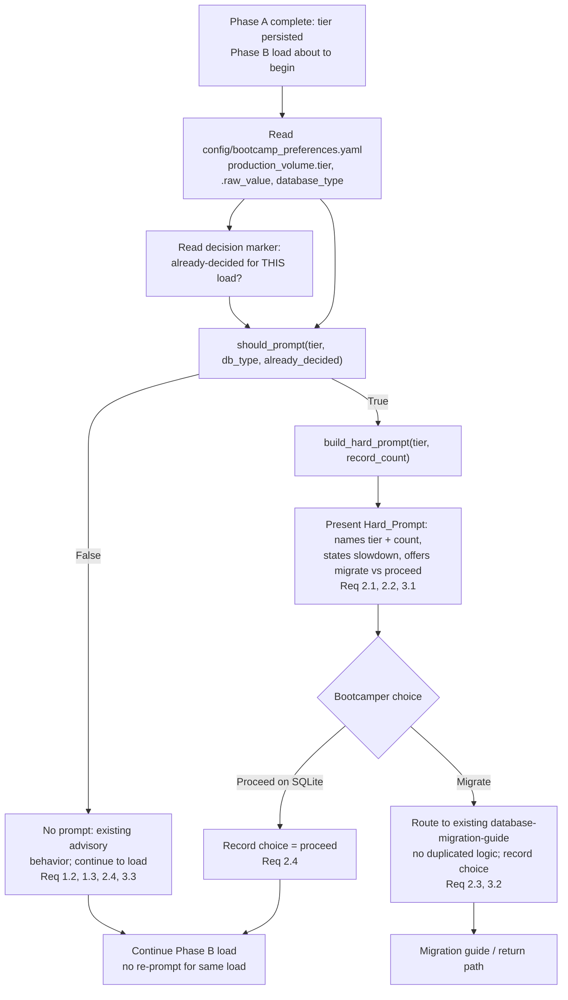

# Design Document

## Overview

Module 6 (Data Processing) classifies the production data volume into a tier — Demo / Small /
Medium / Large — in Phase A step 1, using `scripts/volume_utils.py` (`classify_tier`, the
`TIER_MEDIUM` / `TIER_LARGE` constants, and the `TIER_BOUNDARIES` map) and persists the result to
`config/bootcamp_preferences.yaml` under `production_volume` (`raw_value`, `tier`). The active
database engine is persisted separately under `database_type` (`sqlite` / `postgresql`). The long
load itself begins later, in Phase B ("Load First Source").

Today, the SQLite slowdown advice for medium/large volumes is **advisory prose** repeated across
`volume_utils.get_database_guidance`, `get_performance_guidance`, and the module steering — nothing
stops a bootcamper on SQLite with a medium/large dataset from starting a load that stalls for a long
time. The SQLite→PostgreSQL migration (`database-migration-guide` / `docs/guides/DATABASE_MIGRATION.md`)
is only an optional pointer from Module 8, after the pain.

This feature adds a **Hard_Prompt** — a stop-and-confirm presented **before** the Phase B load
begins, but only for the risky combination: `Volume_Tier ∈ {Medium, Large}` **and** `SQLite_Active`.
The decision of whether to prompt is a single **pure predicate**, `should_prompt(tier, db_type,
already_decided)`, added to `volume_utils.py` so the entire trigger truth table
(`{Demo, Small, Medium, Large} × {SQLite, non-SQLite}`, plus indeterminate inputs and the
already-decided case) is unit- and property-testable without any I/O. A companion pure text builder,
`build_hard_prompt(tier, record_count)`, produces the prompt wording (naming the tier and record
count, stating the expected slowdown, and offering the Migration_Alternative vs. proceed-on-SQLite).
The Module 6 Phase A steering calls the predicate before the load and presents the builder's output
when it fires.

The Hard_Prompt is deliberately **not** a Mandatory_Gate (⛔): it always offers a proceed-on-SQLite
choice, never re-prompts for the same load once a choice is recorded, routes the migration choice to
the *existing* `database-migration-guide` (no duplicated migration logic), and falls back to the
existing advisory behavior whenever the tier or database type is indeterminate.

### Design Goals

- Surface the medium/large-on-SQLite slowdown as a real stop-and-confirm before the load, not
  passive prose.
- Keep the trigger decision a pure, side-effect-free predicate in `volume_utils.py` so the full
  truth table is unit/property testable.
- Reuse the existing `volume_utils` tier classification and constants and the existing
  `database-migration-guide` content — no parallel volume logic, no duplicated migration steps.
- Never permanently block: always allow proceed-on-SQLite, and fall back to existing advisory
  behavior when inputs are indeterminate.
- Add no third-party dependency and no new hook — the prompt is steering-driven, stdlib only.

### Non-Goals

- Changing the tier boundaries or the `classify_tier` logic (owned by `record-volume-guidance`).
- Duplicating or rewriting the SQLite→PostgreSQL migration procedure (owned by
  `database-migration-guide`).
- Making the prompt a Mandatory_Gate (⛔) or otherwise blocking the load — the bootcamper may always
  proceed on SQLite.
- Auto-migrating the database, or changing `database_type` on the bootcamper's behalf.
- Prompting for demo/small volumes or for any non-SQLite engine.

## Architecture

The feature has two pure functions in `volume_utils.py` (decision + wording) and a steering
pre-load check in `module-06-phaseA-build-loading.md` that reads already-persisted preferences,
calls the predicate, and — only when it fires — presents the prompt and records the choice.



### Trigger point and ordering

- The predicate is evaluated **once**, immediately before the Phase B load starts (the first load
  in Module 6), after Phase A step 1 has classified and persisted the tier. This mirrors how other
  pre-load checks (CORD freshness, anti-pattern lookup) run before loading.
- The prompt is **steering-driven only** — no `preToolUse`/`postToolUse` hook and no per-write
  process is added. This matches the module's existing "agent instruction" pre-load checks.

### Reuse

- **Tier classification** comes entirely from `volume_utils` (`TIER_DEMO`, `TIER_SMALL`,
  `TIER_MEDIUM`, `TIER_LARGE`, `VALID_TIERS`, `classify_tier`, `TIER_BOUNDARIES`). The predicate
  references those constants; it does not re-derive tiers from record counts (Requirement 3.2).
- **Migration** is delegated to `database-migration-guide` (`docs/guides/DATABASE_MIGRATION.md`).
  The prompt names it and the steering routes to it; no migration steps are copied (Requirements
  2.3, 3.2).
- **Persistence** reuses the existing preferences reader/writer in `preferences_utils.py`
  (`load_preferences` / `parse_yaml` for reads, `write_preference` for the decision marker) and the
  already-persisted `production_volume` and `database_type` keys — no new config file.

## Components and Interfaces

### New pure functions in `scripts/volume_utils.py`

Both are added to the existing `volume_utils.py` (stdlib only, module already present), so the
feature introduces no new script and no new dependency.

#### `should_prompt` — the trigger predicate

```python
def should_prompt(
    tier: str | None,
    db_type: str | None,
    already_decided: bool = False,
) -> bool:
    """Decide whether the Module 6 SQLite volume Hard_Prompt should fire.

    Pure, side-effect free. Returns True only for the risky combination:
    the volume tier is Medium or Large AND the active database normalizes to
    SQLite AND no choice has already been recorded for this load.

    Args:
        tier: Persisted volume tier (production_volume.tier), or None/unknown
            when indeterminate.
        db_type: Persisted database engine (database_type), or None/unknown
            when indeterminate.
        already_decided: True when a proceed/migrate choice was already recorded
            for the current load (suppresses re-prompting).

    Returns:
        True iff tier in {TIER_MEDIUM, TIER_LARGE} AND db_type normalizes to
        "sqlite" AND not already_decided. Any indeterminate/unrecognized tier or
        db_type yields False (fall back to existing advisory behavior).
    """
```

Behavior contract:

- Normalizes `db_type` case-insensitively with surrounding whitespace stripped
  (`"SQLite"`, `" sqlite "` → `"sqlite"`).
- Returns `True` **iff** `tier in (TIER_MEDIUM, TIER_LARGE)` **and** the normalized `db_type ==
  "sqlite"` **and** `already_decided is False`.
- Returns `False` for `tier in (TIER_DEMO, TIER_SMALL)` (Requirement 1.2).
- Returns `False` for any non-SQLite engine, e.g. `"postgresql"` (Requirement 1.3).
- Returns `False` when `tier` is `None` or not in `VALID_TIERS`, or when `db_type` is `None`/empty
  or unrecognized — the indeterminate fallback (Requirement 3.3).
- Returns `False` when `already_decided` is `True`, regardless of tier/db (Requirement 2.4).
- Never raises and never performs I/O.

#### `build_hard_prompt` — the prompt wording

```python
def build_hard_prompt(tier: str, record_count: int | None = None) -> str:
    """Build the SQLite volume Hard_Prompt text for a Medium/Large tier.

    Pure text builder. States that a Medium/Large load on SQLite is expected to
    be slow, names the tier and the driving record count (when known), and
    offers two explicit choices: the Migration_Alternative (switch to PostgreSQL
    per the database-migration-guide) and proceed-on-SQLite. Never emits a
    Mandatory_Gate marker.

    Args:
        tier: The volume tier driving the warning (TIER_MEDIUM or TIER_LARGE).
        record_count: The persisted record count (production_volume.raw_value),
            or None when unavailable.

    Returns:
        The prompt text. Always contains the tier name, a slowdown statement, a
        migration option that names the database-migration-guide, and a
        proceed-on-SQLite option.
    """
```

Behavior contract:

- Always includes the human tier label (e.g. "medium", "large") and a statement that the load is
  expected to be slow on SQLite (Requirement 2.1).
- Includes the record count when `record_count is not None`; omits the figure gracefully when it is
  `None`, without failing (Requirement 2.1 + indeterminate tolerance).
- Always offers **both** the Migration_Alternative (naming `database-migration-guide` /
  `DATABASE_MIGRATION.md`) and a proceed-on-SQLite option (Requirements 2.2, 3.1).
- Never contains the Mandatory_Gate marker (⛔) — the prompt is stop-and-confirm, not a block
  (Requirement 3.1).
- Does not embed the migration procedure text — it points to the existing guide (Requirement 3.2).

### Steering wiring: `module-06-phaseA-build-loading.md`

A new **"SQLite Volume Hard_Prompt (pre-load check)"** agent-instruction block is added at the end
of Phase A (after step 1 has persisted the tier), positioned before the Phase B load. It:

1. Reads `config/bootcamp_preferences.yaml` (via `preferences_utils.load_preferences` /
   `parse_yaml`): `production_volume.tier`, `production_volume.raw_value`, and `database_type`.
2. Reads the **decision marker** for the current load (see Data Models → Decision marker) to
   compute `already_decided`.
3. Calls `volume_utils.should_prompt(tier, db_type, already_decided)`.
   - **False** → say nothing new; continue with existing advisory behavior and proceed to the load
     (Requirements 1.2, 1.3, 2.4, 3.3).
   - **True** → present `volume_utils.build_hard_prompt(tier, raw_value)` verbatim and
     **🛑 STOP** for the bootcamper's choice.
4. On the bootcamper's response:
   - **Migrate** → record the choice in the decision marker, then route to the existing
     `database-migration-guide` (`docs/guides/DATABASE_MIGRATION.md`) — do not inline migration
     steps (Requirements 2.3, 3.2).
   - **Proceed on SQLite** → record the choice in the decision marker and continue the load; do not
     re-present the prompt for this load (Requirement 2.4).

The block is explicitly labeled as **not** a Mandatory_Gate (no ⛔) and always allows proceed
(Requirement 3.1). It refers to the migration guide by repo-relative path and the Senzing MCP server
by name only — no external URLs (security steering).

### Reused interfaces (no modification)

- `volume_utils.TIER_DEMO/SMALL/MEDIUM/LARGE`, `VALID_TIERS` — tier vocabulary for the predicate.
- `preferences_utils.load_preferences` / `parse_yaml` — read `production_volume` and `database_type`.
- `preferences_utils.write_preference` — persist the decision marker.
- `database-migration-guide` (`docs/guides/DATABASE_MIGRATION.md`) — the migration destination.

## Data Models

### Tier values (from `volume_utils`)

| Constant | Value | Prompt fires on SQLite? |
|---|---|---|
| `TIER_DEMO` | `"demo"` | No |
| `TIER_SMALL` | `"small"` | No |
| `TIER_MEDIUM` | `"medium"` | **Yes** |
| `TIER_LARGE` | `"large"` | **Yes** |

`VALID_TIERS = ("demo", "small", "medium", "large")`. Any value outside this set (including `None`)
is **indeterminate** → no prompt (Requirement 3.3).

### Database type (from `database_type` in `bootcamp_preferences.yaml`)

- Persisted values: `"sqlite"` (default) or `"postgresql"`.
- Normalized case-insensitively and whitespace-trimmed before comparison.
- `SQLite_Active` ⇔ normalized `db_type == "sqlite"`. Any other recognized engine (e.g.
  `"postgresql"`) → no prompt (Requirement 1.3). `None`/empty/unrecognized → indeterminate → no
  prompt (Requirement 3.3).

### Trigger truth table (`{Demo, Small, Medium, Large} × {SQLite, non-SQLite}`)

Assuming `already_decided = False` and determinate inputs:

| Volume_Tier | SQLite | non-SQLite (e.g. postgresql) |
|---|---|---|
| Demo | No | No |
| Small | No | No |
| **Medium** | **Yes (Hard_Prompt)** | No |
| **Large** | **Yes (Hard_Prompt)** | No |

Additional dimensions collapsing to **No prompt**:

| Condition | Result | Requirement |
|---|---|---|
| `already_decided = True` (choice recorded for this load) | No | 2.4 |
| `tier` is `None` / not in `VALID_TIERS` | No (fallback) | 3.3 |
| `db_type` is `None` / empty / unrecognized | No (fallback) | 3.3 |

So the full predicate is:

```
should_prompt = (tier ∈ {medium, large})
                AND (normalize(db_type) == "sqlite")
                AND (not already_decided)
```

### Decision marker (no-reprompt state)

To satisfy "SHALL NOT re-prompt for the same load" (Requirement 2.4) across a resumed session, the
steering records the bootcamper's choice using the existing preferences writer. Proposed shape under
a single key in `config/bootcamp_preferences.yaml`:

```yaml
sqlite_volume_prompt:
  decided: true            # a choice has been recorded
  choice: proceed          # "proceed" | "migrate"
  tier: medium             # the load identity this decision applies to
  raw_value: 1200000       # driving record count for that load
```

`already_decided` is computed by the steering as: the marker exists with `decided: true` **and** its
`tier`/`raw_value` match the current `production_volume`. If the bootcamper later reclassifies to a
different volume (a genuinely different load), the identity no longer matches, so `already_decided`
is `False` and the prompt may fire again — the suppression is scoped to *the same load*, not
forever. The predicate itself stays pure by taking `already_decided` as a boolean argument; the
marker read/compare lives in steering.

## Correctness Properties

*A property is a characteristic or behavior that should hold true across all valid executions of a
system — essentially, a formal statement about what the system should do. Properties serve as the
bridge between human-readable specifications and machine-verifiable correctness guarantees.*

The trigger decision (`should_prompt`) and the prompt wording (`build_hard_prompt`) are pure,
stdlib-only functions with behavior that varies meaningfully across a large input space (every tier,
every database engine, indeterminate values, arbitrary record counts). That makes them a good fit
for property-based testing. Each property below is universally quantified and implemented as a
single Hypothesis property test; example counts come from the active Hypothesis profile
(`fast`=5 locally, `thorough`=100 in CI) — no inline `max_examples` override is set.

### Property 1: Trigger fires exactly on Medium/Large-on-SQLite (comprehensive truth table)

*For any* volume tier drawn from `VALID_TIERS` together with `None` and unrecognized junk strings,
*any* database type drawn from `{sqlite (in mixed case and with surrounding whitespace), postgresql,
"", None, junk}`, and *any* boolean `already_decided`, `should_prompt(tier, db_type,
already_decided)` returns `True` **iff** `tier ∈ {TIER_MEDIUM, TIER_LARGE}` **and** the normalized
`db_type == "sqlite"` **and** `already_decided is False`; in every other case (Demo/Small,
non-SQLite, indeterminate tier or db_type, or a choice already recorded) it returns `False`, and it
never raises.

**Validates: Requirements 1.1, 1.2, 1.3, 2.4, 3.3**

### Property 2: Prompt names the tier, record count, and expected slowdown

*For any* tier in `{TIER_MEDIUM, TIER_LARGE}` and *any* record count that is either a non-negative
integer or `None`, `build_hard_prompt(tier, record_count)` returns text that contains the tier label
and a statement that the load is expected to be slow on SQLite, includes the record count when it is
provided, omits the figure gracefully when it is `None`, and never raises.

**Validates: Requirements 2.1**

### Property 3: Prompt always offers migration and proceed, and is never a mandatory gate

*For any* tier in `{TIER_MEDIUM, TIER_LARGE}` and *any* record count, `build_hard_prompt` output
always contains a Migration_Alternative option that names the existing migration guide
(`database-migration-guide` / `DATABASE_MIGRATION.md`) **and** a proceed-on-SQLite option, and never
contains the Mandatory_Gate marker (⛔).

**Validates: Requirements 2.2, 3.1**

## Error Handling

The feature is **non-blocking by contract** — the load never stalls on the prompt logic
(Requirements 3.1, 3.3).

| Failure mode | Handling |
|---|---|
| `production_volume.tier` missing / unrecognized | `should_prompt` receives `None`/junk → returns `False`; steering falls back to existing advisory behavior and proceeds (Req 3.3). |
| `database_type` missing / empty / unrecognized | Normalized value is not `"sqlite"` → `should_prompt` returns `False`; advisory fallback, proceed (Req 3.3). |
| `database_type` casing / whitespace (`"SQLite"`, `" sqlite "`) | Normalized case-insensitively and trimmed before comparison — treated as SQLite. |
| `record_count` unavailable (`None`) when prompt fires | `build_hard_prompt` omits the figure but still names the tier and states the slowdown (Req 2.1). |
| Preferences file unreadable / malformed | Steering treats it as indeterminate inputs → `should_prompt` returns `False`; advisory fallback, proceed (Req 3.3). |
| Decision marker missing or from a different load (tier/raw_value mismatch) | `already_decided` computes to `False` → prompt may fire for the new load; a matching marker suppresses re-prompting (Req 2.4). |
| Bootcamper chooses Migrate | Steering routes to the existing `database-migration-guide`; no migration logic is duplicated (Req 2.3, 3.2). |

Neither pure function performs I/O or raises on any in-range input; the steering block is explicitly
advisory (never a ⛔ gate) so an indeterminate or error state always resolves to "continue the load".

## Testing Strategy

Tests live in `senzing-bootcamp/tests/` (e.g. `test_sqlite_volume_hard_prompt.py`), follow the
project pattern (pytest + Hypothesis, class-based `TestSqliteVolumeHardPrompt`, `sys.path` import of
`scripts/`), and each property test class documents the requirements it validates. Property tests
draw their example count from the active Hypothesis profile (`fast`=5 local, `thorough`=100 CI) — no
inline `@settings(max_examples=...)` override, per the project convention. Test fixtures use only
synthetic values (no PII, credentials, or connection strings).

### Property-based tests (Hypothesis)

PBT IS appropriate here: `should_prompt` and `build_hard_prompt` are pure functions with universal
behavior over a large input space. One property test per correctness property above, each tagged:

`# Feature: module6-sqlite-volume-hard-prompt, Property {number}: {property_text}`

Custom strategies (prefixed `st_`):

- `st_tier()` — draws from `VALID_TIERS` plus `None` and junk strings (indeterminate inputs).
- `st_db_type()` — draws from `"sqlite"` in mixed case / with whitespace, `"postgresql"`, `""`,
  `None`, and junk strings.
- `st_record_count()` — non-negative integers plus `None`.

Mapping:

- **Property 1** — `st_tier()` × `st_db_type()` × `st.booleans()` asserts the exact boolean formula
  (the full `{Demo, Small, Medium, Large} × {SQLite, non-SQLite}` truth table, plus indeterminate
  inputs and the `already_decided` suppression). This is the headline trigger property required by
  Requirement 4.1.
- **Property 2** — `st.sampled_from([TIER_MEDIUM, TIER_LARGE])` × `st_record_count()` asserts the
  wording names the tier, states the slowdown, and includes the count when present.
- **Property 3** — same generators as Property 2; asserts both the migration and proceed options are
  present and no ⛔ marker appears.

### Unit / example tests

Complement the properties with focused examples and guardrails:

- **Explicit truth-table cells** — the four "fires" / "does not fire" corner cases:
  `(medium, sqlite) → True`, `(large, sqlite) → True`, `(small, sqlite) → False`,
  `(medium, postgresql) → False`.
- **Indeterminate fallback** — `should_prompt(None, "sqlite")` and `should_prompt("medium", None)`
  both return `False` (Req 3.3).
- **No re-prompt** — `should_prompt("medium", "sqlite", already_decided=True)` returns `False`
  (Req 2.4).
- **Migration routing / reuse guardrails (Req 2.3, 3.2)** — assert `build_hard_prompt` names the
  `database-migration-guide` / `DATABASE_MIGRATION.md`, and a steering-structure test asserting the
  Module 6 Phase A block calls `should_prompt` before the Phase B load, routes the migrate choice to
  the existing guide, and inlines no migration steps.
- **Reuse guardrail** — assert the predicate is defined in `volume_utils.py` and relies on the
  existing tier constants rather than re-deriving tiers from record counts (Req 3.2).

### Coverage note

Requirement 4.1 (truth-table + proceed/migrate/fallback coverage) is met by Property 1 (the full
truth table incl. `already_decided` and indeterminate inputs) plus the example tests for the migrate
route and the indeterminate fallback. Requirement 4.2 (project test pattern) is met by authoring the
tests in `senzing-bootcamp/tests/` with the documented pytest + Hypothesis, class-based, `sys.path`
structure.
