# Design: Module 8 Visualization Enforcement

## Overview

Module 8 (Query, Visualize & Validate Results) requires the agent to offer two visualizations: an interactive entity graph (after exploratory queries, step 3) and a results dashboard (after documenting findings, step 7). The agent sometimes skips these offers. The existing `offer-visualization.kiro.hook` only triggers on `fileCreated` in `src/query/`, which doesn't catch the case where the agent skips the offer entirely.

This design introduces three changes:

1. Steering file updates to `module-08-query-validation.md` that make both visualization offers mandatory WAIT steps with prominent formatting the agent cannot skip.
2. A new `agentStop` hook (`enforce-visualization-offers.kiro.hook`) that checks whether Module 8 visualization offers were made before the module closes.
3. Hooks README updates documenting the new hook and noting the relationship between the existing `offer-visualization.kiro.hook` and the new enforcement hook.

All deliverables are JSON and Markdown — no executable code.

### Design Rationale

Defense-in-depth: the steering file's prominent WAIT steps are the primary enforcement mechanism. The `agentStop` hook is a safety net — if the agent somehow skips a WAIT step, the hook fires when the agent tries to stop and prompts it to offer the missed visualization(s). The existing `offer-visualization.kiro.hook` (fileCreated trigger) remains as a third layer that catches query program creation specifically. All three mechanisms coexist without interference.

## Architecture

The feature consists of three static artifacts that reinforce each other:

```mermaid
flowchart TD
    subgraph "Primary: Steering File"
        A[Step 3: Exploratory Queries] --> B["⛔ MANDATORY WAIT<br/>Offer Entity Graph"]
        B -->|user responds| C[Steps 4–6: UAT & Validation]
        C --> D[Step 7: Document Findings]
        D --> E["⛔ MANDATORY WAIT<br/>Offer Results Dashboard"]
        E -->|user responds| F[Decision Gate & Summary]
    end

    subgraph "Safety Net: agentStop Hook"
        G[Agent tries to stop] --> H[Hook fires]
        H --> I[Read bootcamp_progress.json]
        I -->|module != 8| J[Do nothing]
        I -->|module == 8| K[Check conversation for<br/>visualization offers]
        K -->|both offered| L[Do nothing]
        K -->|missing offers| M[Prompt agent to offer<br/>missed visualization]
    end

    subgraph "Existing: fileCreated Hook"
        N[File created in src/query/] --> O[Offer entity graph<br/>if not already offered]
    end

    style B fill:#ff9,stroke:#333,stroke-width:2px
    style E fill:#ff9,stroke:#333,stroke-width:2px
    style M fill:#f9f,stroke:#333,stroke-width:2px
```



### Hook Coexistence

Three hooks may fire during Module 8. They are independent and complementary:

| Hook | Trigger | When it fires | Purpose |
| ---- | ------- | ------------- | ------- |
| `offer-visualization.kiro.hook` | `fileCreated` in `src/query/*` | When a query program is created | Proactive: reminds agent to offer entity graph |
| `enforce-visualization-offers.kiro.hook` | `agentStop` | When the agent finishes working | Safety net: catches missed visualization offers |
| `summarize-on-stop.kiro.hook` | `agentStop` | When the agent finishes working | Summarizes what was accomplished |

Both `agentStop` hooks fire independently. The enforcement hook checks for visualization offers; the summarize hook produces a progress summary. They don't conflict because they address different concerns and their prompts don't contradict each other.

### Why `agentStop`?

The `agentStop` trigger is the right choice for the enforcement hook because:

- It fires at the natural boundary where the agent is about to leave the conversation — the last chance to catch missed offers.
- It complements the steering file's inline WAIT instructions with an external check.
- It doesn't interfere with the agent's work during the module (unlike `preToolUse` or `postToolUse`).
- It coexists cleanly with the existing `summarize-on-stop.kiro.hook` — both fire on `agentStop` but serve different purposes.

## Components and Interfaces

### Component 1: Steering File Updates (`module-08-query-validation.md`)

**Location:** `senzing-bootcamp/steering/module-08-query-validation.md`

**Changes:** Two insertions — one after step 3's exploratory queries section, one after step 7's documentation section. No existing functional content is changed.

**Change 1 — Entity Graph Visualization WAIT (after step 3 "Run exploratory queries"):**

Replace the current soft offer paragraph in step 3:

```text
**Offer entity graph visualization:** After running exploratory queries, offer: "👉 Would you like me to help you build an interactive entity graph? ..."
```

With a mandatory WAIT block:

```markdown
---

> **⛔ MANDATORY VISUALIZATION OFFER — ENTITY GRAPH**
>
> **🛑 DO NOT SKIP THIS STEP. You MUST offer the entity graph visualization and WAIT for the user's response before proceeding.**

👉 **Ask the bootcamper:** "Would you like me to help you build an interactive entity graph? It shows resolved entities as a force-directed network graph with clustering by data source or match strength, search/filter, and detail panels. I can create a self-contained HTML file you can open in any browser."

> **⚠️ WAIT — Do NOT proceed to step 4 until the bootcamper responds.**
>
> - If they say **yes**: Load `visualization-guide.md` and follow its workflow.
> - If they say **no** or **not now**: Acknowledge and proceed to step 4.
> - If they are **unsure**: Briefly explain the value, then wait for their decision.

---
```

**Change 2 — Results Dashboard Visualization WAIT (after step 7 "Document findings"):**

Replace the current soft offer paragraph in step 7:

```text
**Offer visualization:** "Would you like me to create a web page showing the query results and validation metrics? ..."
```

With a mandatory WAIT block:

```markdown
---

> **⛔ MANDATORY VISUALIZATION OFFER — RESULTS DASHBOARD**
>
> **🛑 DO NOT SKIP THIS STEP. You MUST offer the results dashboard visualization and WAIT for the user's response before proceeding.**

👉 **Ask the bootcamper:** "Would you like me to create a web page showing the query results and validation metrics? It'll have entity tables, match explanations, and UAT results — saved as `docs/results_dashboard.html`."

> **⚠️ WAIT — Do NOT proceed to the Decision Gate until the bootcamper responds.**
>
> - If they say **yes**: Generate the HTML dashboard and save to `docs/results_dashboard.html`.
> - If they say **no** or **not now**: Acknowledge and proceed to the Decision Gate.
> - If they are **unsure**: Briefly explain the value, then wait for their decision.

---
```

**Design decisions:**

- The `⛔` and `🛑` emojis match the formatting pattern established in the Module 12 phase gate design, providing consistency across the bootcamp.
- Horizontal rules (`---`) above and below visually separate the WAIT blocks from surrounding step content.
- Block quote formatting with bold markers makes the blocks structurally distinct from regular step instructions.
- The three-way decision tree (yes / no / unsure) covers all bootcamper responses.
- The word "MANDATORY" and "DO NOT SKIP" are deliberately strong — the current steering file's softer phrasing gets skipped.
- No functional content in any other steps is changed.

### Component 2: Hook File (`enforce-visualization-offers.kiro.hook`)

**Location:** `senzing-bootcamp/hooks/enforce-visualization-offers.kiro.hook`

**Format:** JSON, following the same schema as all other hooks in `senzing-bootcamp/hooks/`.

**Structure:**

```json
{
  "name": "Enforce Module 8 Visualization Offers",
  "version": "1.0.0",
  "description": "When the agent stops during Module 8, checks whether both visualization offers (entity graph and results dashboard) were made. If either was missed, prompts the agent to offer it before closing.",
  "when": {
    "type": "agentStop"
  },
  "then": {
    "type": "askAgent",
    "prompt": "<prompt text — see below>"
  }
}
```

**Prompt text (the `then.prompt` value):**

> First, read `config/bootcamp_progress.json` and check the `current_module` field. If the current module is NOT 8, do nothing — let the conversation end normally.
>
> If the current module IS 8, review the conversation history and check whether you offered BOTH of these visualizations during this interaction:
>
> 1. **Entity graph visualization** — an interactive force-directed network graph of resolved entities (offered after exploratory queries in step 3)
> 2. **Results dashboard** — an HTML page showing query results and validation metrics (offered after documenting findings in step 7)
>
> If BOTH were offered (regardless of whether the bootcamper accepted or declined), do nothing — the requirement is satisfied.
>
> If EITHER visualization was NOT offered, display this message:
>
> ```
> ━━━━━━━━━━━━━━━━━━━━━━━━━━━━━━━━━━━━━━━━━━━━━━━━━━━━━━━━
> 📊  MODULE 8 VISUALIZATION CHECK
> ━━━━━━━━━━━━━━━━━━━━━━━━━━━━━━━━━━━━━━━━━━━━━━━━━━━━━━━━
> ```
>
> Then, for each visualization that was NOT offered, ask the bootcamper:
>
> - If the entity graph was not offered: "Before we wrap up — would you like me to help you build an interactive entity graph? It shows resolved entities as a force-directed network with clustering, search, and detail panels."
> - If the results dashboard was not offered: "Before we wrap up — would you like me to create a web page showing your query results and validation metrics?"
>
> WAIT for the bootcamper's response before finishing. They may accept or decline — both are fine.

**Key design decisions:**

- The hook checks `current_module` at runtime so it's safe to leave installed across all modules — it's a no-op outside Module 8.
- The prompt instructs the agent to review conversation history, which is the only way to determine if offers were already made (there's no persistent state tracking offers).
- The banner uses the `📊` emoji to distinguish it from the `📦` packaging banner in Module 12.
- The hook fires independently of `summarize-on-stop.kiro.hook` — both are `agentStop` hooks but serve different purposes.
- Declining a visualization satisfies the requirement — the goal is to ensure the offer is made, not to force acceptance.

### Component 3: Hooks README Updates (`hooks/README.md`)

**Location:** `senzing-bootcamp/hooks/README.md`

**Change 1 — Update existing entry 14** to note the relationship with the new enforcement hook:

```markdown
### 14. Offer Entity Graph Visualization (`offer-visualization.kiro.hook`)

**Trigger:** When new files are created in `src/query/`
**Action:** Prompts the agent to offer generating an interactive entity graph visualization
**Use case:** Ensures bootcampers are offered the visualization feature during Module 8
**Note:** Works in conjunction with the Enforce Module 8 Visualization Offers hook (#16) — this hook catches query program creation proactively, while the agentStop hook catches the case where the agent skips the offer entirely
```

**Change 2 — Add new entry 16** (after the existing entry 15):

```markdown
### 16. Enforce Module 8 Visualization Offers (`enforce-visualization-offers.kiro.hook`) ⭐

**Trigger:** When the agent finishes working (agentStop)
**Action:** Checks if current module is 8, then verifies both visualization offers (entity graph and results dashboard) were made during the interaction
**Use case:** Safety net for Module 8 — catches missed visualization offers before the agent closes the conversation
**Recommended:** Install for Module 8
```

## Data Models

All deliverables are static files (JSON and Markdown). There are no runtime data models, databases, or APIs.

### Hook JSON Schema

The hook file follows the Kiro hook schema used by all hooks in the repository:

| Field | Type | Value |
| ----- | ---- | ----- |
| `name` | string | `"Enforce Module 8 Visualization Offers"` |
| `version` | string | `"1.0.0"` |
| `description` | string | Description of the hook's purpose |
| `when.type` | string | `"agentStop"` |
| `then.type` | string | `"askAgent"` |
| `then.prompt` | string | The full prompt text instructing the agent |

### Runtime Data Dependency

The hook prompt instructs the agent to read `config/bootcamp_progress.json` at runtime. The expected structure (created by the bootcamp, not by this feature):

```json
{
  "current_module": 8,
  "completed_modules": [0, 1, 2, 3, 4, 5, 6, 7]
}
```

The hook only checks `current_module`. If the file doesn't exist or can't be read, the hook prompt instructs the agent to do nothing (fail-safe).


## Correctness Properties

*A property is a characteristic or behavior that should hold true across all valid executions of a system — essentially, a formal statement about what the system should do. Properties serve as the bridge between human-readable specifications and machine-verifiable correctness guarantees.*

### Applicability Assessment

This feature produces static JSON and Markdown files — no executable code. Most acceptance criteria are structural checks on specific file content (EXAMPLE classification). However, four criteria generalize across all instances of their kind (all WAIT blocks, all hooks, all README entries), making them suitable for property-based testing.

### Property 1: Mandatory WAIT block formatting consistency

*For any* mandatory WAIT block in `senzing-bootcamp/steering/module-08-query-validation.md`, the block should use the same visual formatting pattern: a `⛔` emoji in the heading, a `🛑` bold stop instruction, block quote formatting, and horizontal rules (`---`) above and below.

**Validates: Requirements 1.2, 1.4**

### Property 2: Mandatory WAIT block behavioral completeness

*For any* mandatory WAIT block in `senzing-bootcamp/steering/module-08-query-validation.md`, the block should contain (a) an explicit "WAIT" instruction telling the agent not to proceed, and (b) a decline/no path that allows the bootcamper to skip the visualization and continue.

**Validates: Requirements 1.5, 1.7**

### Property 3: Hook JSON schema conformance

*For any* `.kiro.hook` file in `senzing-bootcamp/hooks/`, parsing it as JSON should succeed and the resulting object should contain all required fields: `name` (string), `version` (string), `description` (string), `when.type` (string), `then.type` (string), and `then.prompt` (string, when `then.type` is `"askAgent"`).

**Validates: Requirements 2.5**

### Property 4: README hook entry format conformance

*For any* numbered hook entry section in `senzing-bootcamp/hooks/README.md`, the entry should contain a **Trigger** line, an **Action** line, and a **Use case** line, each with non-empty content.

**Validates: Requirements 3.2**

## Error Handling

Since all deliverables are static files (JSON and Markdown), error handling is limited to the hook's runtime behavior as instructed in the prompt text:

| Scenario | Handling |
| -------- | -------- |
| `config/bootcamp_progress.json` doesn't exist | Hook prompt instructs agent to do nothing (fail-safe) |
| `current_module` field is missing or not a number | Hook prompt instructs agent to do nothing |
| `current_module` is not 8 | Hook does nothing — no visualization check |
| Both visualizations already offered | Hook does nothing — requirement satisfied |
| Only one visualization offered | Hook prompts for the missing one only |
| Bootcamper declines a visualization | Valid response — agent proceeds normally |
| Hook JSON is malformed | Kiro will fail to load the hook; validated by Property 3 |
| Multiple `agentStop` hooks fire simultaneously | Kiro handles multiple hooks on the same event independently — no conflict |

## Testing Strategy

### Approach

Since all deliverables are JSON and Markdown (no executable code), testing focuses on structural validation and content verification. Property-based testing applies to the four cross-cutting conformance properties. Example-based tests cover the specific content requirements.

### Property-Based Tests

Use a property-based testing library (e.g., Hypothesis for Python, fast-check for TypeScript) to validate the four correctness properties:

- **Property 1 (WAIT block formatting):** Extract all mandatory WAIT blocks from the steering file (identified by `⛔ MANDATORY` pattern), verify each uses the same formatting elements. Minimum 100 iterations (generator produces random subsets and orderings of formatting checks).
  - Tag: `Feature: module8-visualization-enforcement, Property 1: Mandatory WAIT block formatting consistency`

- **Property 2 (WAIT block completeness):** Extract all mandatory WAIT blocks, verify each contains WAIT instruction and decline path. Minimum 100 iterations.
  - Tag: `Feature: module8-visualization-enforcement, Property 2: Mandatory WAIT block behavioral completeness`

- **Property 3 (Hook schema conformance):** Enumerate all `.kiro.hook` files in `senzing-bootcamp/hooks/`, parse each as JSON, assert required fields exist with correct types. Minimum 100 iterations.
  - Tag: `Feature: module8-visualization-enforcement, Property 3: Hook JSON schema conformance`

- **Property 4 (README entry format):** Parse all numbered hook entry sections from the README, assert each contains Trigger, Action, and Use case lines. Minimum 100 iterations.
  - Tag: `Feature: module8-visualization-enforcement, Property 4: README hook entry format conformance`

### Example-Based Tests (Unit Tests)

These verify specific content requirements for the new deliverables:

| Test | Validates | What to check |
| ---- | --------- | ------------- |
| Steering file has entity graph WAIT block after step 3 | 1.1 | Section with "MANDATORY VISUALIZATION OFFER — ENTITY GRAPH" exists |
| Steering file has results dashboard WAIT block after step 7 | 1.3 | Section with "MANDATORY VISUALIZATION OFFER — RESULTS DASHBOARD" exists |
| Entity graph WAIT block mentions visualization-guide.md | 1.1 | WAIT block references loading the visualization guide |
| Results dashboard WAIT block mentions results_dashboard.html | 1.3 | WAIT block references the output file path |
| No functional changes to other steps | 1.6 | Steps 1, 2, 4, 5, 6 content unchanged from original |
| Hook file exists at correct path | 2.1 | File exists at `senzing-bootcamp/hooks/enforce-visualization-offers.kiro.hook` |
| Hook trigger type is `agentStop` | 2.1 | `when.type === "agentStop"` |
| Hook prompt references bootcamp_progress.json | 2.2 | Prompt mentions `config/bootcamp_progress.json` and module 8 check |
| Hook prompt handles non-module-8 case | 2.2 | Prompt instructs agent to do nothing if module is not 8 |
| Hook prompt checks for entity graph offer | 2.3 | Prompt mentions entity graph visualization check |
| Hook prompt checks for results dashboard offer | 2.4 | Prompt mentions results dashboard visualization check |
| Existing offer-visualization.kiro.hook unchanged | 2.6 | File content identical to original |
| Both agentStop hooks have distinct names | 2.7 | `enforce-visualization-offers` and `summarize-on-stop` have different `name` fields |
| README contains new hook entry | 3.1 | README mentions `enforce-visualization-offers.kiro.hook` |
| New entry is numbered 16 | 3.3 | Entry appears as `### 16.` in the numbered list |
| Entry 14 updated with conjunction note | 3.4 | Entry 14 mentions the enforcement hook relationship |
