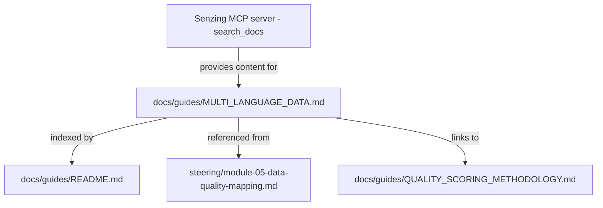

# Design Document

## Overview

This feature adds a new user-facing guide at `senzing-bootcamp/docs/guides/MULTI_LANGUAGE_DATA.md` that covers multi-language entity resolution with Senzing. The guide is a static Markdown document — no scripts, no data models, no runtime logic. It follows the same structure and conventions as existing guides in the `docs/guides/` directory (e.g., `DATA_UPDATES_AND_DELETIONS.md`, `QUALITY_SCORING_METHODOLOGY.md`).

The feature involves three deliverables:

1. **The guide itself** — a Markdown file covering non-Latin character support, UTF-8 encoding requirements, transliteration and cross-script name matching, and multi-language data quality best practices. Technical content about Senzing's globalization capabilities is retrieved using `search_docs` from the Senzing MCP server during authoring, not from training data.
2. **A cross-reference in Module 5 steering** — an optional supplementary reading callout in the Module 5 parent steering file (`module-05-data-quality-mapping.md`) pointing bootcampers to the guide when working with international datasets.
3. **A Guides README entry** — an entry in `docs/guides/README.md` listing the new guide in the Reference Documentation section and the Documentation Structure tree.

There is no application code, no data transformation, no API, and no runtime behavior. The entire feature is documentation content authored with MCP-sourced Senzing facts.

## Architecture

This feature is purely documentation. There is no software architecture — no services, no APIs, no data stores, no runtime components.

### File Relationships



### Authoring Workflow

During task execution, the agent uses MCP tools to retrieve authoritative Senzing content:

1. **`search_docs`** — queries for globalization capabilities, supported scripts, transliteration behavior, cross-script matching algorithms, UTF-8 requirements, and entity specification attribute names
2. **`analyze_record`** — optionally used to verify that example records with non-Latin characters are valid Senzing Entity Specification format

The retrieved content is synthesized into the guide's prose and examples. The guide itself includes a "Further Reading" section directing bootcampers to use `search_docs` with relevant queries for the latest information.

## Components and Interfaces

### Component 1: Multi-Language Guide (`MULTI_LANGUAGE_DATA.md`)

**Location:** `senzing-bootcamp/docs/guides/MULTI_LANGUAGE_DATA.md`

**Structure:**

```markdown
# Multi-Language Entity Resolution

[Introduction — why multi-language data is challenging for ER]

## Non-Latin Character Support
[Senzing's native handling of non-Latin scripts]
[Supported script families — from search_docs]
[How names are stored/indexed in original script + transliterated forms]
[Example: SGES record with NAME_FULL in Chinese or Arabic]

## UTF-8 Encoding Requirements
[Senzing requires UTF-8 for all input data]
[Common encoding problems: Latin-1, Shift-JIS, GB2312, BOM, mojibake]
[Encoding verification and conversion checklist with CLI examples]
[Senzing behavior on invalid UTF-8 — from search_docs]

## Transliteration and Cross-Script Name Matching
[How Senzing's name matching handles phonetic equivalence across scripts]
[Example 1: Latin/Chinese pair]
[Example 2: Latin/Cyrillic pair]
[Example 3: Latin/Arabic pair]
[Limitations — when automatic matching may not succeed]

## Multi-Language Data Quality Best Practices
[Preserve original-script names — don't pre-transliterate]
[Using multiple NAME_FULL attributes for original + transliterated forms]
[Data quality issues: inconsistent romanization, mixed-script fields, honorifics]
[How Module 5 quality scoring applies to multi-language data]

## Further Reading
[search_docs queries for latest Senzing globalization docs]
```

**Conventions followed:**
- Level-1 heading with guide title, followed by introductory paragraph (matches `DATA_UPDATES_AND_DELETIONS.md`, `QUALITY_SCORING_METHODOLOGY.md`)
- Agent instruction blocks using `> **Agent instruction:**` format for MCP tool calls during authoring
- JSON code blocks for Senzing Entity Specification examples
- No YAML frontmatter (guides don't use it — only steering files do)

### Component 2: Module 5 Cross-Reference

**Location:** `senzing-bootcamp/steering/module-05-data-quality-mapping.md`

**Change:** Add a callout block in the existing reference section at the top of the file, alongside the existing references to `QUALITY_SCORING_METHODOLOGY.md`. The reference is presented as optional supplementary reading, not a required step.

**Format:**
```markdown
> **Multi-language data:** If your data contains non-Latin characters (Chinese, Arabic, Cyrillic, etc.), see `docs/guides/MULTI_LANGUAGE_DATA.md` for guidance on UTF-8 encoding, non-Latin character support, cross-script name matching, and multi-language data quality best practices.
```

**Placement rationale:** The Module 5 parent steering file already has a reference block pointing to `QUALITY_SCORING_METHODOLOGY.md`. The multi-language guide reference goes in the same block, keeping all supplementary reading references together. It is not added to Phase 1 or Phase 2 sub-files to avoid cluttering the step-by-step workflow.

### Component 3: Guides README Entry

**Location:** `senzing-bootcamp/docs/guides/README.md`

**Changes:**

1. **Reference Documentation section** — add an entry for `MULTI_LANGUAGE_DATA.md` following the same format as existing entries (filename as Markdown link, bold title, 2-3 line description):

```markdown
**[MULTI_LANGUAGE_DATA.md](MULTI_LANGUAGE_DATA.md)**

- Non-Latin character support and how Senzing handles names in Chinese, Arabic, Cyrillic, and other scripts
- UTF-8 encoding requirements, common encoding problems, and verification checklist
- Cross-script name matching, transliteration, and multi-language data quality best practices
```

2. **Documentation Structure tree** — add `MULTI_LANGUAGE_DATA.md` to the `guides/` listing in alphabetical position.

## Data Models

No data models. This feature creates and modifies Markdown files only. There are no databases, configuration files, JSON schemas, or structured data formats introduced.

The only structured content within the guide is example Senzing Entity Specification (SGES) JSON records, which follow the existing SGES format documented elsewhere in the bootcamp. These are illustrative examples, not a new data model.

Example SGES record with non-Latin characters (illustrative):

```json
{
  "DATA_SOURCE": "CUSTOMERS_APAC",
  "RECORD_ID": "CN-10042",
  "NAME_FULL": "李明",
  "ADDR_FULL": "北京市朝阳区建国路88号",
  "PHONE_NUMBER": "+86-10-5555-0123"
}
```


## Error Handling

This feature creates and modifies Markdown files. There is no runtime error handling because there is no runtime code.

### Authoring-Time Error Handling

The following errors may occur during task execution (authoring) and should be handled by the agent:

1. **MCP `search_docs` returns no results for a query** — Retry with alternative query terms (e.g., "globalization" → "international", "multi-language" → "unicode"). If no authoritative content is found after multiple attempts, note the gap in the guide and direct the reader to `search_docs` for the latest information rather than fabricating content.

2. **MCP `search_docs` returns content that contradicts existing guide content** — Prefer the MCP-sourced content as authoritative. Update the guide to reflect current Senzing behavior and note any changes from previously documented behavior.

3. **MCP `analyze_record` rejects an example SGES record** — Fix the example record to conform to the current Senzing Entity Specification. Do not include example records that fail validation.

4. **Module 5 steering file structure has changed** — If `module-05-data-quality-mapping.md` no longer has the expected reference block format, adapt the cross-reference to fit the current structure while maintaining the "optional supplementary reading" framing.

5. **Guides README structure has changed** — If `README.md` no longer has a "Reference Documentation" section or "Documentation Structure" tree, adapt the entry placement to the current structure while maintaining discoverability.

### Content Validation

Before finalizing the guide, the agent should verify:
- All JSON code blocks are valid JSON
- All Markdown links resolve to existing files (or are clearly marked as MCP tool calls)
- The file is valid UTF-8 (practicing what the guide preaches)
- The guide passes CommonMark validation (`validate_commonmark.py`)

## Testing Strategy

### Why Property-Based Testing Does Not Apply

This feature is pure documentation — Markdown files with no code, no functions, no parsers, no serializers, no algorithms, and no runtime behavior. There are no pure functions with input/output behavior, no universal properties that hold across a wide input space, and no computable properties to verify. Every acceptance criterion is either a content presence check, a structural format check, or an authoring process constraint.

Property-based testing is not appropriate here. The testing strategy uses example-based tests and CI validation instead.

### Testing Approach

**1. CI Pipeline Validation (Existing)**

The existing CI pipeline (`validate-power.yml`) already runs:
- `validate_commonmark.py` — validates all Markdown files for CommonMark compliance. The new guide and modified README will be covered automatically.
- `measure_steering.py --check` — validates steering files against token budgets. The modified Module 5 steering file will be checked automatically.

No new CI configuration is needed.

**2. Example-Based Content Tests**

Write a pytest test module (`senzing-bootcamp/tests/test_multi_language_guide.py`) with example-based tests that verify the acceptance criteria:

- **File existence**: `MULTI_LANGUAGE_DATA.md` exists at the expected path
- **Structure**: File starts with a level-1 heading, has expected sections (Non-Latin Character Support, UTF-8 Encoding Requirements, Transliteration and Cross-Script Name Matching, Multi-Language Data Quality Best Practices, Further Reading)
- **Content presence**: Each required topic is covered (non-Latin characters, UTF-8, encoding problems, checklist, cross-script examples, limitations, best practices, Module 5 quality scoring connection)
- **SGES examples**: At least one JSON code block contains non-ASCII characters and SGES attribute names (`DATA_SOURCE`, `RECORD_ID`, `NAME_FULL`)
- **Cross-script examples**: At least three cross-script matching examples with different script pairs
- **Further Reading**: Section contains `search_docs` references with example queries
- **Module 5 cross-reference**: `module-05-data-quality-mapping.md` references `MULTI_LANGUAGE_DATA.md` as optional supplementary reading
- **README entry**: `README.md` contains `MULTI_LANGUAGE_DATA.md` in the Reference Documentation section and Documentation Structure tree
- **JSON validity**: All JSON code blocks in the guide are valid JSON
- **UTF-8 validity**: The guide file is valid UTF-8

These are straightforward file-reading and string-matching tests. Each test maps to one or more acceptance criteria from the requirements document.

**3. Manual Review**

Some acceptance criteria cannot be verified programmatically:
- Whether the content accurately reflects Senzing's current globalization capabilities (Req 6.1, 6.2)
- Whether the cross-script matching examples are realistic and correct
- Whether the prose is clear and helpful for bootcampers
- Whether the guide's tone and depth are consistent with other guides in the directory

These require human review during the PR process.
