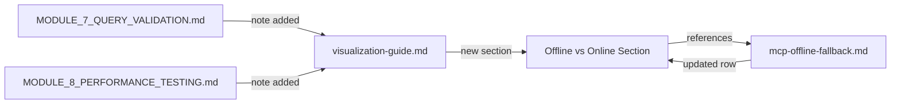

# Design Document: Offline Visualization Docs

## Overview

The Senzing Bootcamp visualization feature offers two delivery modes — static HTML (offline) and web service (online) — but the tradeoffs between them are implicit. Bootcampers must discover limitations through trial and error. This design adds explicit documentation: an "Offline vs Online" section in `visualization-guide.md` with a decision matrix, updates to Module 7 and Module 8 documentation, cross-references with `mcp-offline-fallback.md`, and clear listings of limitations and prerequisites for each mode.

### Key Design Decisions

1. **Documentation-only feature** — this spec modifies only markdown files (steering files and module docs). No code changes, no scripts, no new tooling. The deliverables are structured documentation sections.
2. **Decision matrix as a table** — a markdown table with scenario/mode/rationale columns gives bootcampers a quick lookup without reading prose. The 6 scenarios cover the most common decision points.
3. **Cross-reference consistency** — the offline visualization docs reference `mcp-offline-fallback.md` and vice versa, creating bidirectional links so bootcampers find the right guidance regardless of entry point.
4. **500-entity threshold** — the existing warning threshold in `visualization-guide.md` is reused as the recommended maximum for static HTML mode, maintaining consistency.

## Architecture

This feature modifies 4 existing files. No new files are created.

### Files Modified

| File | Change |
|------|--------|
| `senzing-bootcamp/steering/visualization-guide.md` | Add "Offline vs Online" section with decision matrix, capabilities, limitations, prerequisites, and MCP fallback guidance |
| `senzing-bootcamp/steering/mcp-offline-fallback.md` | Add row to "Continuable Operations" noting static HTML visualizations work without MCP |
| `senzing-bootcamp/docs/modules/MODULE_7_QUERY_VALIDATION.md` | Add note about offline vs online visualization tradeoff with cross-reference |
| `senzing-bootcamp/docs/modules/MODULE_8_PERFORMANCE_TESTING.md` | Add note about static HTML dashboard limitations |

## Components and Interfaces

### 1. Offline vs Online Section (in visualization-guide.md)

**Placement:** Immediately after "Agent Workflow" section, before "Graph Data Model Schema" section.

**Subsections:**

1. **Decision Matrix** — 6-row table mapping scenarios to recommended modes
2. **Static HTML Capabilities** — bullet list of what works offline
3. **Web Service Capabilities** — bullet list of what requires live SDK
4. **Static HTML Limitations** — bullet list of what doesn't work offline
5. **Web Service Prerequisites** — numbered list of environment requirements
6. **MCP Offline Fallback** — cross-reference and agent guidance for MCP unavailability

### 2. Decision Matrix Structure

| Scenario | Recommended Mode | Rationale |
|----------|-----------------|-----------|
| Sharing results with stakeholders lacking SDK access | Static HTML | Self-contained file, no server needed |
| Interactive exploration with live SDK queries | Web Service | Real-time entity detail and search |
| Working without persistent network access | Static HTML | No server or database required |
| Real-time entity search by attributes | Web Service | Requires live SDK queries |
| Quick snapshot for documentation | Static HTML | Single file, easy to embed or attach |
| Iterating on data quality with frequent reloads | Web Service | `/refresh` endpoint avoids re-extraction |

### 3. Static HTML Capabilities List

- Force-directed graph layout with interactive pan/zoom
- Cluster highlighting and color coding
- Local search and filter (within inline data)
- Detail panel (from inline JSON data)
- Statistics display (entity count, relationship count)
- Export as image (screenshot of rendered graph)

### 4. Static HTML Limitations List

- No live entity detail fetching
- No real-time search by attributes
- No data refresh without re-running extraction
- Data size limited by browser memory for inline JSON
- Recommended maximum: 500 entities

### 5. Web Service Prerequisites List

1. Senzing SDK installed and configured (Module 2 complete)
2. Database populated with data (Module 6 complete)
3. Available port on localhost (default 8080)
4. Server process must remain running for duration of session

## Data Models

No data models — this is a documentation-only feature.

## Error Handling

No error handling — this is a documentation-only feature. The agent workflow section includes guidance for when MCP is unavailable (recommend Static HTML mode and explain why Web Service mode is unavailable).

## Testing Strategy

**PBT is not applicable** for this feature. All requirements are documentation content and structure checks — there are no pure functions, no input/output transformations, and no code logic to test with property-based testing.

### Example-Based Verification

| Check | What it verifies |
|-------|-----------------|
| "Offline vs Online" section exists in visualization-guide.md after "Agent Workflow" | Req 1.1 |
| Decision matrix table has 3 columns (scenario, mode, rationale) and 6 rows | Req 1.2, 2.1–2.6 |
| Static HTML capabilities list includes force layout, cluster highlighting, local search, detail panel, statistics | Req 1.3, 5.3 |
| Web Service capabilities list includes live entity detail, real-time search, data refresh | Req 1.4 |
| Staleness statement present for Static HTML | Req 1.5 |
| `/refresh` endpoint mentioned for Web Service | Req 1.6 |
| Module 7 docs contain offline/online note with cross-reference | Req 3.1, 3.2 |
| Module 8 docs contain static HTML dashboard limitation note | Req 3.3 |
| MCP offline fallback file references visualization | Req 4.1, 4.2 |
| Agent workflow includes MCP unavailability guidance | Req 4.3 |
| Limitations list includes all 4 items | Req 5.1 |
| 500-entity threshold mentioned | Req 5.2 |
| Prerequisites list includes SDK, database, port | Req 6.1 |
| Running server requirement mentioned | Req 6.2 |
| Lifecycle Management section referenced | Req 6.3 |
| Fallback recommendation for missing prerequisites | Req 6.4 |

### Manual Review

Since this is documentation, the primary validation is human review of the rendered markdown for clarity, accuracy, and consistency with existing content.
