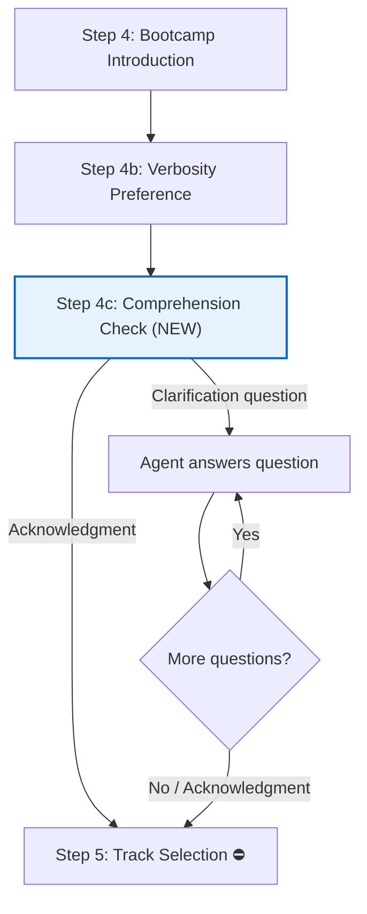

# Design Document: Onboarding Comprehension Check

## Overview

This feature adds a comprehension check sub-step (Step 4c) to the Senzing Bootcamp onboarding flow. The step sits between the verbosity preference (Step 4b) and track selection (Step 5), giving the bootcamper a natural pause to absorb the overview, ask clarifying questions, or signal readiness to proceed.

The implementation is a steering file edit — no new files, no Python scripts, no new hooks. The existing `ask-bootcamper` hook already handles closing questions on `agentStop`, so Step 4c follows the standard pattern: present content and stop. The hook fires and generates the contextual 👉 closing question.

**Key design decisions:**

- Step 4c is NOT a mandatory gate (⛔). The bootcamper can skip it or acknowledge quickly.
- The prompt uses warm, conversational tone — it's an invitation, not a quiz.
- The prompt references the upcoming track selection to give context for why pausing is useful.
- If the bootcamper asks questions, the agent answers them, then checks for more questions before proceeding to Step 5.
- If the bootcamper acknowledges (e.g., "looks good," "ready," "no questions"), the agent proceeds directly to Step 5.
- The step does NOT include inline closing questions or WAIT instructions, consistent with the onboarding flow note about `ask-bootcamper` hook ownership.

**Files modified:**

| File                                             | Change                                           |
|--------------------------------------------------|--------------------------------------------------|
| `senzing-bootcamp/steering/onboarding-flow.md`   | Add Step 4c section between 4b and 5             |
| `senzing-bootcamp/steering/steering-index.yaml`  | Update `onboarding-flow.md` token count          |

## Architecture

This feature operates entirely within the steering layer. No runtime code, no new components, no data flow changes.



**Interaction model:**

1. Agent completes Step 4b (verbosity preference confirmed or defaulted).
2. Agent presents Step 4c comprehension check prompt and stops.
3. `ask-bootcamper` hook fires, generates contextual 👉 closing question.
4. Bootcamper responds:
   - **Acknowledgment** → Agent proceeds to Step 5.
   - **Clarification question** → Agent answers, then checks for more questions. Repeat until bootcamper acknowledges or has no more questions.

## Components and Interfaces

### Modified Component: `onboarding-flow.md`

The steering file gains a new `### 4c. Comprehension Check` section inserted between the existing `### 4b. Verbosity Preference` section and the `## 5. Track Selection` section.

**Section structure:**

```markdown
### 4c. Comprehension Check

[Prompt text — warm, conversational, references upcoming track selection]

[Acknowledgment handling instructions]

[Clarification handling instructions]

[Note: not a mandatory gate, hook handles closing question]
```

**Behavioral contract:**

- The agent presents the comprehension check prompt and stops (standard pattern).
- On acknowledgment response → proceed to Step 5.
- On clarification response → answer the question, then check for more questions before proceeding.
- The agent applies the bootcamper's current verbosity settings when answering clarification questions.
- No inline 👉 closing questions or WAIT instructions in the section text.

### Modified Component: `steering-index.yaml`

The `file_metadata.onboarding-flow.md.token_count` value is updated to reflect the added content. The `budget.total_tokens` value is recalculated accordingly. The `size_category` remains `large` (the file was already above the 2000-token threshold and will stay there).

**Update method:** Run `python3 senzing-bootcamp/scripts/measure_steering.py` after editing `onboarding-flow.md`. This recalculates all token counts and updates the index automatically.

## Data Models

No new data models are introduced. This feature modifies steering file content only.

**Existing data touched:**

- `onboarding-flow.md`: Markdown steering file with YAML frontmatter. The step numbering scheme (0, 1, 1b, 2, 3, 4, 4b, 4c, 5, ...) follows the existing sub-step convention established by Step 4b.
- `steering-index.yaml`: YAML file with `file_metadata` section containing `token_count` and `size_category` per steering file, plus a `budget` section with `total_tokens`. Token counts are calculated by `measure_steering.py`.

## Correctness Properties

*A property is a characteristic or behavior that should hold true across all valid executions of a system — essentially, a formal statement about what the system should do. Properties serve as the bridge between human-readable specifications and machine-verifiable correctness guarantees.*

### Property 1: Non-gate step contract

*For any* non-gate onboarding step (including the new Step 4c), the section content SHALL contain no mandatory gate markers (⛔, "MUST stop", "mandatory gate", "MUST NOT proceed") AND no inline 👉 closing questions or WAIT instructions.

**Validates: Requirements 1.3, 2.4**

## Error Handling

This feature has minimal error surface since it modifies steering file content only.

**Potential issues and mitigations:**

| Scenario | Mitigation |
|----------|------------|
| Step 4c section accidentally includes ⛔ gate marker | Property test catches this — non-gate steps must not contain gate keywords |
| Step 4c section includes inline 👉 closing question | Property test catches this — non-gate steps must not contain inline questions or WAIT instructions |
| Token count in `steering-index.yaml` not updated after edit | CI pipeline runs `measure_steering.py --check` which fails if counts are stale |
| Step 4c section placed in wrong position (not between 4b and 5) | Unit test verifies heading sequence includes 4c between 4b and 5 |
| Bootcamper response not recognized as acknowledgment or clarification | The agent uses natural language understanding — the steering file provides example phrases but the agent interprets intent. No code-level error handling needed. |

## Testing Strategy

**Dual testing approach:**

- **Unit tests (example-based):** Verify specific structural and content properties of the modified steering file.
- **Property tests (Hypothesis):** Verify universal properties across all non-gate steps, including the new Step 4c.

### Unit Tests

| Test | What it verifies | Requirement |
|------|-----------------|-------------|
| Step heading sequence | 4c appears in the heading list between 4b and 5 | 1.1, 1.2, 5.1 |
| Step 4c content markers — prompt | Section contains comprehension check prompt with "makes sense" / "questions" phrasing | 2.1 |
| Step 4c content markers — track reference | Section references upcoming track selection | 2.3 |
| Step 4c content markers — acknowledgment handling | Section contains acknowledgment handling instructions with example phrases | 3.1, 3.2, 3.3, 5.2 |
| Step 4c content markers — clarification handling | Section contains clarification handling instructions with check-for-more-questions logic | 4.1, 4.2, 4.3, 5.2 |
| Step 4c content markers — verbosity reference | Section references verbosity settings for answering clarifications | 4.4 |
| Step 4c content markers — non-gate note | Section contains note about not being a mandatory gate and hook handling closing questions | 5.3 |
| Token count consistency | `steering-index.yaml` token count for `onboarding-flow.md` reflects actual file content | 5.4 |
| Existing step preservation | Steps 0, 1, 1b, 2, 3, 4, 4b, 5 and subsequent sections retain their key content | Regression |

### Property Tests (Hypothesis)

| Property | Strategy | Min iterations | Requirement |
|----------|----------|---------------|-------------|
| Property 1: Non-gate step contract | Sample from non-gate step IDs (0, 1, 1b, 4, 4c); assert no gate keywords AND no inline 👉 questions or WAIT instructions | 100 | 1.3, 2.4 |

**PBT library:** Hypothesis (already used throughout `senzing-bootcamp/tests/`)

**Tag format:** `Feature: onboarding-comprehension-check, Property 1: Non-gate step contract`

**Test file location:** `senzing-bootcamp/tests/test_comprehension_check.py`

**Why PBT applies here:** The non-gate contract is a universal property that must hold across *all* non-gate steps, not just Step 4c. By sampling step IDs with Hypothesis, we verify the invariant holds for the entire set and catch regressions if any non-gate step accidentally gains gate markers or inline questions. This follows the established pattern in `test_track_selection_gate_preservation.py`.

**What PBT does NOT cover:** Content quality (warm tone, conversational phrasing), agent runtime behavior (how the agent interprets acknowledgment vs. clarification responses), and token count accuracy (handled by `measure_steering.py --check` in CI). These are covered by unit tests and manual review.
