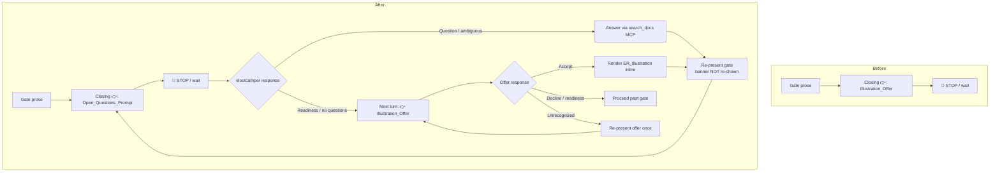

# Design Document: Onboarding ER Questions Prompt

## Overview

This feature reorders the two closing calls-to-action of the mandatory
**Exploration_Gate** in `senzing-bootcamp/steering/entity-resolution-intro.md`
(the "Explore Further" section). Today the gate turn ends with a single 👉 that
offers the two-record match / non-match illustration (the **Illustration_Offer**).
This change makes the closing 👉 an open, optional invitation — the
**Open_Questions_Prompt**: "Do you have any questions about Entity Resolution?" —
and defers the **Illustration_Offer** to a subsequent turn, presented only after
the open prompt has been handled (questions answered via the Senzing MCP server,
or the bootcamper signals readiness / has no questions).

The implementation surface is **steering-file prose plus HTML-comment AGENT
INSTRUCTION blocks** — not application code. The gate already carries directive
blocks (`ILLUSTRATION_OFFER`, `ER_ILLUSTRATION`) that encode the offer and
illustration semantics; this change edits the rendered closing 👉 and reworks
those directives so the open prompt fires first and the offer fires second.

The design preserves everything the gate already establishes:

- **Wait/stop semantics** — the agent halts at the 🛑 STOP and waits for real input.
- **MCP-first answering** — follow-up ER questions are answered only from
  `search_docs` (Senzing MCP), then the gate is re-presented.
- **Once-only `ER_Concepts_Banner`** — shown once per Preface run, never on
  re-presentation.
- **Illustration_Offer properties** — optional, non-compound, ask-once,
  verbosity-aware.
- **ER_Illustration** — conceptual-only teaser that points forward to the Module 3
  hands-on visualization; it does not duplicate or pre-empt Module 3.

This builds directly on the `er-intro-interactive-illustration` spec and reuses
its terminology (`Illustration_Offer`, `ER_Illustration`, `Exploration_Gate`,
`ER_Concepts_Banner`). It does not change the illustration content or the Module 3
visualization.

### Requirements addressed

Requirements 1 (present open prompt first), 2 (preserve wait/answer semantics),
3 (offer illustration after the open prompt is handled), and 4 (keep the
illustration a conceptual preview) from
`.kiro/specs/onboarding-er-questions-prompt/requirements.md`.

## Architecture

There is no runtime code path. The "system" is the steering markdown file that the
agent loads via `#[[file:senzing-bootcamp/steering/entity-resolution-intro.md]]`
from `onboarding-phase1b-intro-language.md` (Step 3) and follows during a live
onboarding session. Behavior is expressed as:

1. **Rendered prose** the bootcamper sees (the gate text and the closing 👉).
2. **AGENT INSTRUCTION HTML comments** (`<!-- ... -->`) that are *not* shown to the
   bootcamper but govern agent behavior at the gate.

The reordering is therefore a two-part edit within the "Explore Further" section:
the rendered closing 👉 changes from the Illustration_Offer to the
Open_Questions_Prompt, and the directive blocks are re-sequenced so the
Illustration_Offer is only presented on a later turn.

### Turn flow (before vs. after)



The new element is the two-phase closing sequence: **Phase A** (open prompt) must
resolve before **Phase B** (illustration offer) is presented. Everything inside the
answer/re-present loop and the offer/accept/decline/clarify sub-flow is preserved
from the existing gate and the `er-intro-interactive-illustration` design.

## Components and Interfaces

The "components" are named regions of the steering file. Each is edited or
preserved as noted.

| Component | Location in file | Change |
|---|---|---|
| `ER_Concepts_Banner` directive + banner | top of file | Preserved (once-only rule unchanged) |
| Gate prose ("⛔ MANDATORY GATE", example questions) | "Explore Further" | Preserved |
| Gate answer/wait directive | "Explore Further" comment | Preserved (MCP-first, re-present, ambiguous, failure handling) |
| `OPEN_QUESTIONS_PROMPT` directive | new comment in "Explore Further" | **New** — governs Phase A open prompt |
| Rendered closing 👉 | end of gate turn | **Changed** — now the Open_Questions_Prompt |
| `ILLUSTRATION_OFFER` directive | "Explore Further" comment | **Reworked** — fires as Phase B, only after Phase A handled |
| `ER_ILLUSTRATION` directive | "Explore Further" comment | Preserved (conceptual-only, Module 3 forward reference) |
| 🛑 STOP marker | after closing 👉 | Preserved (still terminates the gate turn) |

### Rendered closing 👉 (Phase A)

The single rendered call-to-action becomes the Open_Questions_Prompt, e.g.:

```text
👉 **Do you have any questions about Entity Resolution?**
```

It is the only rendered 👉 in the gate turn (One_Question_Rule: exactly one 👉,
non-compound, one `?`). The 🛑 STOP line follows it unchanged.

### OPEN_QUESTIONS_PROMPT directive (new)

An AGENT INSTRUCTION comment (not shown to the bootcamper) that:

- Marks the Open_Questions_Prompt as the **single closing 👉** of the gate turn,
  non-compound and verbosity-aware (Req 1.1, 1.3, 1.4).
- States the Illustration_Offer is **not** presented in the same turn (Req 1.2).
- Defers to the existing gate answer/wait semantics for follow-up questions,
  ambiguity, and MCP failures (Req 2.1–2.6).
- Specifies that, once the open prompt is handled — the bootcamper signals
  readiness / no questions — the agent presents the **Illustration_Offer next
  turn** (Req 1.5); and that any asked question is **answered before** the offer is
  presented (Req 1.6).

### ILLUSTRATION_OFFER directive (reworked)

The existing directive is retained but re-sequenced to **Phase B**:

- Presented as the **single 👉** of its own later turn, only after the
  Open_Questions_Prompt has been handled (Req 3.1).
- One_Question_Rule + verbosity-aware (Req 3.2); optional (Req 3.3); on decline or
  readiness, proceed past the gate (Req 3.4); ask-once — never re-offered once
  answered (Req 3.5); on accept, render `ER_Illustration` inline then re-present the
  gate (Req 3.6); on an unrecognized response, re-present the offer once expecting
  accept-or-decline and do not proceed (Req 3.7).

### ER_ILLUSTRATION directive (preserved)

Unchanged from `er-intro-interactive-illustration`: conceptual, ≤25 lines, no
interactive graph, no web service/background process, MCP-first sourcing with a
clearly-labeled generic fallback, and an explicit forward reference to the Module 3
hands-on visualization on the bootcamper's own data (Req 4.1–4.4).

## Data Models

There is no runtime data model. The relevant "state" is conversational turn state
the agent tracks while at the gate. It is modeled implicitly by the directives:

| State | Meaning | Set by | Consumed by |
|---|---|---|---|
| `open_prompt_handled` | Bootcamper signaled readiness / no questions, or all asked questions have been answered | Phase A resolution | Gate on Phase B (offer only presented when true) |
| `offer_answered` | Illustration_Offer has received a recognized accept/decline/readiness | Phase B resolution | Ask-once guard (never re-offer) |
| `banner_shown` | ER_Concepts_Banner already displayed this Preface run | First gate render | Re-present logic (never re-display) |

These flags are not persisted to disk; they exist only within the live onboarding
conversation and are expressed as directive rules, not stored fields.

## Correctness Properties

*A property is a characteristic or behavior that should hold true across all valid
executions of a system — essentially, a formal statement about what the system
should do. Properties serve as the bridge between human-readable specifications and
machine-verifiable correctness guarantees.*

**Applicability note.** The implementation surface is a **single fixed steering
markdown file**. There is effectively one input, so there is no input space to
randomize over, and Hypothesis-style property-based testing would add noise
without coverage. This matches the rationale already documented in the peer suites
`test_er_intro_illustration.py` and `test_entity_resolution_intro_structure.py`.
The properties below are therefore stated as **universal structural invariants over
the steering file** and are validated with **example-based steering-content
assertions** (each checked once against the fixed file), following the established
repo convention. Runtime agent behaviors (verbosity rendering, live MCP calls,
turn sequencing) are not executable here; they are validated by asserting the
presence and correctness of the governing AGENT INSTRUCTION directives.

### Property 1: Closing call-to-action is the Open_Questions_Prompt only

*For any* rendering of the Exploration_Gate turn, the file SHALL contain exactly
one rendered 👉 leading-question line, that line SHALL be the Open_Questions_Prompt
("Do you have any questions about Entity Resolution?"), it SHALL be non-compound
(exactly one `?`), and the Illustration_Offer SHALL NOT appear as a rendered 👉 in
that turn.

**Validates: Requirements 1.1, 1.2, 1.3**

### Property 2: Open prompt precedes and gates the illustration offer

*For any* traversal of the "Explore Further" directives, the Open_Questions_Prompt
SHALL be ordered before the Illustration_Offer, and the Illustration_Offer SHALL be
gated on the open prompt being handled — presented only after the bootcamper
signals readiness / no questions, and only after any asked question has been
answered.

**Validates: Requirements 1.5, 1.6, 3.1**

### Property 3: Gate wait semantics are preserved

*For any* rendering of the Exploration_Gate turn, a 🛑 STOP marker SHALL follow the
Open_Questions_Prompt 👉, and the governing directive SHALL forbid fabricating,
simulating, or assuming a bootcamper response and forbid proceeding past the gate
before real input is received.

**Validates: Requirements 2.1, 2.2**

### Property 4: MCP-first answering and re-presentation are preserved

*For any* follow-up question, ambiguous response, or `search_docs` failure at the
gate, the governing directive SHALL require answering only from `search_docs`
(Senzing MCP) — or, on no results / failure, stating no documentation was found and
suggesting a rephrase — and SHALL re-present the Exploration_Gate without proceeding
past it.

**Validates: Requirements 2.3, 2.4, 2.5**

### Property 5: The concepts banner is shown once per Preface run

*For any* re-presentation of the Exploration_Gate (after answering a question or
after rendering the illustration), the ER_Concepts_Banner SHALL NOT be
re-displayed; the once-only directive SHALL be preserved.

**Validates: Requirements 2.6, 3.6**

### Property 6: Illustration_Offer regression invariants hold

*For any* presentation of the Illustration_Offer, it SHALL be the single
non-compound 👉 of its turn and verbosity-aware, SHALL be optional (decline or a
readiness signal proceeds past the gate), SHALL be ask-once (never re-offered once
answered), and an unrecognized response SHALL cause it to be re-presented once
expecting accept-or-decline without proceeding past the gate.

**Validates: Requirements 3.2, 3.3, 3.4, 3.5, 3.7**

### Property 7: The illustration remains a conceptual preview

*For any* rendering of the ER_Illustration, it SHALL be static, text-based
conceptual content of no more than 25 lines with no interactive graph and no web
service / background process, SHALL include an explicit forward reference to the
Module 3 hands-on visualization on the bootcamper's own data, and SHALL decline any
request to render the full graph while directing the bootcamper to Module 3.

**Validates: Requirements 4.1, 4.2, 4.3, 4.4**

## Error Handling

Because there is no runtime code, "errors" are conversational edge cases handled by
directive rules:

- **Ambiguous response at the open prompt** — treated as a follow-up question,
  answered via `search_docs`, then the gate is re-presented (Req 2.4).
- **`search_docs` returns nothing or fails** — the agent states no documentation
  was found, suggests a rephrase, and re-presents the gate without proceeding
  (Req 2.5).
- **Unrecognized response to the Illustration_Offer** — the offer is re-presented
  once as the single 👉 with an indication that an accept-or-decline response is
  expected; the agent does not proceed until a recognized response arrives
  (Req 3.7).
- **Request for the full graph during the illustration** — declined; the conceptual
  preview is left unchanged and the bootcamper is directed to Module 3 (Req 4.4).

### Repository / CI constraints

The edit must keep the file valid within the repo's tooling:

- **CommonMark validity** — the file must pass `validate_commonmark.py`
  (CI-enforced). New prose and directive comments must be well-formed markdown.
- **Steering token budget** — editing the file changes its token count. The
  `entity-resolution-intro.md` entry in `steering-index.yaml`
  (`file_metadata.entity-resolution-intro.md.token_count`, currently `1977`) must be
  re-measured and updated so `measure_steering.py --check` passes. This is a
  low-risk, additive edit (a new short prompt line plus a directive block), expected
  to keep the file well under the `split_threshold_tokens` (5000) budget.
- **Power validation** — `validate_power.py` must continue to pass (frontmatter,
  file placement, kebab-case naming — all unchanged).
- **MCP-first sourcing** — the only external endpoint referenced remains the Senzing
  MCP server (`search_docs` / `find_examples`); no external URLs are introduced.

## Testing Strategy

**PBT applicability.** Property-based testing is **not** the right tool for this
feature: the surface is a single fixed steering file with no input space to
generate over, and the peer suites for this same file are deliberately
example-based. Accordingly, the Correctness Properties above are validated as
**example-based steering-content assertions**, not Hypothesis property tests. No
new Hypothesis strategies are introduced.

### Where behavior is validated

The existing suite `senzing-bootcamp/tests/test_er_intro_illustration.py` already
asserts the gate/illustration invariants against
`senzing-bootcamp/steering/entity-resolution-intro.md`. Two of its assertions
encode the *current* single-👉 illustration ordering and will need updating for the
reordering:

- `TestIllustrationOffer.test_exactly_one_leading_question` — still expects exactly
  one rendered 👉, but that 👉 is now the Open_Questions_Prompt, not the offer.
- `TestIllustrationOffer.test_offer_is_about_two_record_match_and_non_match` and
  `TestGatePreservation.test_stop_marker_follows_the_offer` — currently key off the
  offer being the rendered closing 👉; these must be re-pointed at the
  Open_Questions_Prompt as the rendered closing line, with the Illustration_Offer
  assertions moved to the `ILLUSTRATION_OFFER` directive block.

Also relevant: `test_entity_resolution_intro_structure.py` (STOP marker / gate
structure) and `test_onboarding_flow_restructuring.py::TestERIntroContentIntegrity`
(⛔ / STOP presence) — both must continue to pass.

### New / updated tests

Add a focused test module (e.g.
`senzing-bootcamp/tests/test_onboarding_er_questions_prompt.py`) that validates the
seven properties as structural assertions against the fixed file. Follow repo
conventions: class-based organization (`class TestFeatureName:`), reuse the
canonical `count_leading_questions` rule via the `scripts/` `sys.path` shim, and
document which requirements each class validates. Suggested coverage:

- **P1** — exactly one rendered 👉; it is the Open_Questions_Prompt; non-compound
  (one `?`); Illustration_Offer text not a rendered 👉 (Req 1.1–1.3).
- **P2** — the `OPEN_QUESTIONS_PROMPT` directive precedes the `ILLUSTRATION_OFFER`
  directive and gates the offer on the open prompt being handled / questions
  answered (Req 1.5, 1.6, 3.1).
- **P3** — a 🛑 STOP line follows the Open_Questions_Prompt; wait/no-fabricate
  directive preserved (Req 2.1, 2.2).
- **P4** — gate directive names `search_docs`, ambiguity handling, failure handling,
  and "re-present" (Req 2.3–2.5).
- **P5** — once-only `ER_Concepts_Banner` directive preserved; re-present never
  re-displays it (Req 2.6, 3.6).
- **P6** — `ILLUSTRATION_OFFER` directive marks the offer single/non-compound/
  verbosity-aware, optional, ask-once, with the clarify-once path (Req 3.2–3.5, 3.7).
- **P7** — `ER_ILLUSTRATION` directive preserves conceptual-only / ≤25 lines /
  no-graph / no-server / Module 3 forward reference / decline-and-redirect
  (Req 4.1–4.4). Largely a regression guard over the peer spec's invariants.

### Unit vs. integration

- **Unit (steering-content) tests** — the assertions above; fast, deterministic,
  single fixed input.
- **CI checks** — `validate_power.py`, `measure_steering.py --check` (after the
  `steering-index.yaml` token_count is updated), and `validate_commonmark.py` serve
  as the integration-level guard that the edited file remains valid and within
  budget.

No property-based (Hypothesis) tests are added for this feature, consistent with the
single-fixed-input rationale above.
