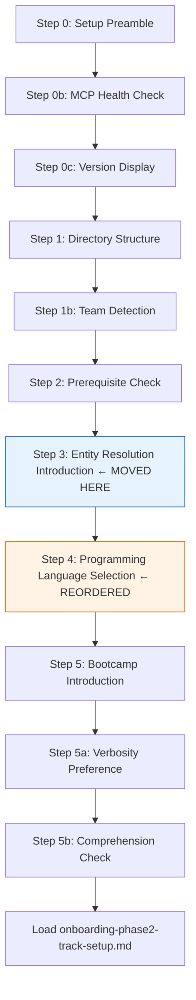
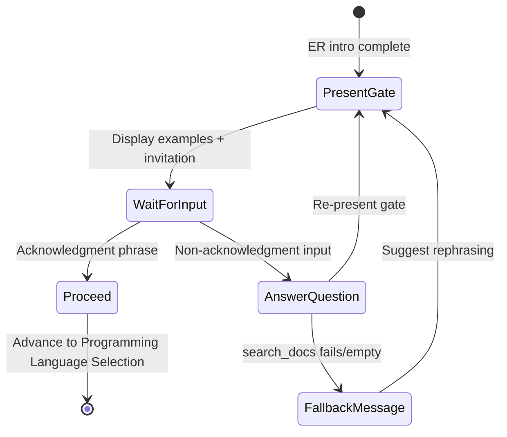

# Design Document: Onboarding Flow Restructuring

## Overview

This design restructures the `onboarding-flow.md` steering file to improve the bootcamper learning sequence. The key changes are:

1. **Move Entity Resolution Introduction** from Step 4a (sub-step of Bootcamp Introduction) to a new top-level step between the Prerequisite Check and Programming Language Selection.
2. **Add a Comprehension Check/Discussion Gate** after the ER introduction (already exists in `entity-resolution-intro.md` — the gate travels with the content).
3. **Add a Production Reuse Hint** to the Programming Language Selection step.
4. **Add accessibility guidance** to the git initialization prompt in `module-01-business-problem.md`.

The restructuring is purely content/configuration — no code changes, no new files created, no dependencies added. The `entity-resolution-intro.md` file remains unchanged; only its inclusion point moves.

### Design Rationale

The current flow asks bootcampers to choose a programming language (Step 2) before they understand what entity resolution is (Step 4a). This is pedagogically backwards — understanding the domain should precede tooling decisions. Moving the ER introduction earlier gives bootcampers context that informs their language choice, especially when paired with the Production Reuse Hint that encourages choosing a language aligned with their production stack.

## Architecture



### Current vs. New Step Order

| Current Step | Current Content | New Step | New Content |
|---|---|---|---|
| 0, 0b, 0c | Setup, MCP, Version | 0, 0b, 0c | *(unchanged)* |
| 1, 1b | Directory, Team Detection | 1, 1b | *(unchanged)* |
| 2 | Programming Language Selection | 2 | Prerequisite Check *(was 3)* |
| 3, 3a–3d | Prerequisite Check | 2a–2d | Windows sub-steps *(was 3a–3d)* |
| 4 | Bootcamp Introduction | 3 | Entity Resolution Introduction *(was 4a)* |
| 4a | Entity Resolution Intro | 4 | Programming Language Selection *(was 2)* |
| 4b | Verbosity Preference | 5 | Bootcamp Introduction *(was 4)* |
| 4c | Comprehension Check | 5a | Verbosity Preference *(was 4b)* |
| — | — | 5b | Comprehension Check *(was 4c)* |

## Components and Interfaces

### Component 1: `onboarding-flow.md` (Primary Change)

The main steering file undergoes structural reorganization:

**Modifications:**
- Prerequisite Check moves from Step 3 to Step 2 (with sub-steps 2a–2d)
- Entity Resolution Introduction becomes Step 3 (top-level, using `#[[file:entity-resolution-intro.md]]`)
- Programming Language Selection moves from Step 2 to Step 4 (with Production Reuse Hint added)
- Bootcamp Introduction moves from Step 4 to Step 5 (with sub-steps 5a Verbosity, 5b Comprehension)
- The `#[[file:]]` directive for `entity-resolution-intro.md` moves from being a sub-step (4a) to a top-level step (3)
- All step number references in prose and cross-references are updated

**Production Reuse Hint insertion point** (within the new Step 4):
```
[Language list presentation via MCP]
[Platform warnings if applicable]

> Tip: If you plan to use these bootcamp artifacts in production, consider
> choosing the language your team already uses — the code we generate here
> is designed to be your starting point for real-world use.

⛔ MANDATORY GATE — [existing gate content]
```

### Component 2: `entity-resolution-intro.md` (No Change)

This file is NOT modified. It already contains:
- The full ER educational content
- Agent instructions to call `search_docs` for dynamic Senzing facts
- The "Explore Further" mandatory gate with example questions
- Handling rules for follow-up questions vs. acknowledgment phrases
- Fallback behavior (implicit — agent uses standard error handling)

The comprehension gate requirements (2.1–2.6) are already satisfied by the existing content in this file. The only change is *where* it gets included in the flow.

**Requirement 2.6 gap**: The existing `entity-resolution-intro.md` does not explicitly instruct the agent on what to do when `search_docs` returns no results or fails. The handling rules say "answer it using search_docs" but don't specify fallback behavior. To satisfy Requirement 2.6, the agent instructions in the "Explore Further" section need an additional handling rule:

```markdown
- If search_docs returns no relevant results or the tool call fails: inform
  the bootcamper that no documentation was found for their specific question,
  suggest they rephrase or ask a different question, then re-present this gate.
```

This is a minor addition to the agent instruction comment block — it does not change the educational content or file structure.

### Component 3: `module-01-business-problem.md` (Git Prompt Update)

The git initialization prompt in Step 1 receives the accessibility guidance phrase:

**Current text:**
```
👉 "This is optional, but would you like me to initialize a git repository
for version control? You can skip this without affecting the bootcamp."
```

**New text:**
```
👉 "If you don't know what 'git' is, just skip this. This is optional, but
would you like me to initialize a git repository for version control? You can
skip this without affecting the bootcamp."
```

The 👉 marker, 🛑 STOP instruction, and response-handling logic remain unchanged.

### Component 4: `entity-resolution-intro.md` Internal Comment Update

The file's internal comment currently says "Loaded via `#[[file:]]` from `onboarding-flow.md` during Step 4a." This comment should be updated to reference the new step number (Step 3) for accuracy, though this is a non-functional documentation change.

### Component 5: `steering-index.yaml` (Token Count Update)

The `onboarding-flow.md` token count may change slightly due to the added Production Reuse Hint text. The `module-01-business-problem.md` token count increases by ~15 tokens for the accessibility phrase. Both entries should be re-measured after changes using `measure_steering.py`.

## Data Models

This feature does not introduce new data models. The steering files are Markdown with YAML frontmatter — their "schema" is the heading hierarchy and the conventions documented in the onboarding flow itself.

### Steering File Structure Invariants

The following structural invariants must hold after restructuring:

1. **Step numbering**: All top-level `## N.` headings use sequential integers starting from 0, with no gaps or duplicates.
2. **Sub-step labeling**: Sub-steps use the pattern `### Na.`, `### Nb.`, etc., scoped to their parent step.
3. **Mandatory gate pattern**: Each mandatory gate contains `⛔` marker, descriptive text, and `🛑 STOP` instruction.
4. **`#[[file:]]` directive**: The inclusion directive for `entity-resolution-intro.md` appears exactly once in `onboarding-flow.md`.
5. **Cross-reference consistency**: Any prose referencing "Step N" uses the correct post-restructuring number.

### Comprehension Gate Behavior Model

The ER introduction's "Explore Further" gate operates as a state machine:



**Acknowledgment phrases** (minimum set): "ready", "let's go", "continue", "next", "no questions", "makes sense", plus semantically equivalent phrases.

## Correctness Properties

*A property is a characteristic or behavior that should hold true across all valid executions of a system — essentially, a formal statement about what the system should do. Properties serve as the bridge between human-readable specifications and machine-verifiable correctness guarantees.*

### Property 1: Entity Resolution Introduction precedes Programming Language Selection

*For any* valid `onboarding-flow.md` produced by this feature, the step containing the `#[[file:senzing-bootcamp/steering/entity-resolution-intro.md]]` directive SHALL have a lower step number than the step containing the Programming Language Selection mandatory gate, and both SHALL have a higher step number than the Prerequisite Check step.

**Validates: Requirements 1.1**

### Property 2: Step numbers form a contiguous sequence

*For any* valid `onboarding-flow.md` produced by this feature, the set of top-level step numbers (extracted from `## N.` headings) SHALL form a contiguous integer sequence starting from 0 with no duplicates and no gaps.

**Validates: Requirements 1.4**

### Property 3: Verbosity Preference and Comprehension Check are sub-steps of Bootcamp Introduction

*For any* valid `onboarding-flow.md` produced by this feature, the headings "Verbosity Preference" and "Comprehension Check" SHALL appear as `###` sub-step headings under the `##` heading for "Bootcamp Introduction", not under the Entity Resolution Introduction or Programming Language Selection sections.

**Validates: Requirements 1.5**

### Property 4: Production Reuse Hint is correctly placed in Programming Language Selection

*For any* valid `onboarding-flow.md` produced by this feature, the Programming Language Selection section SHALL contain the verbatim text "Tip: If you plan to use these bootcamp artifacts in production, consider choosing the language your team already uses — the code we generate here is designed to be your starting point for real-world use." positioned after the language list presentation instruction and before the `⛔` mandatory gate marker.

**Validates: Requirements 3.1, 3.2**

### Property 5: Git accessibility phrase precedes the existing explanation sentence

*For any* valid `module-01-business-problem.md` produced by this feature, the phrase "If you don't know what 'git' is, just skip this." SHALL appear in the same prompt block as, and immediately before, the sentence "This is optional, but would you like me to initialize a git repository for version control? You can skip this without affecting the bootcamp."

**Validates: Requirements 4.1, 4.2, 4.3**

## Error Handling

This feature modifies steering files (static Markdown content), so traditional runtime error handling does not apply. However, the following failure modes exist:

### Steering File Parse Errors

If the restructured `onboarding-flow.md` contains malformed Markdown or broken `#[[file:]]` directives:
- **Detection**: The CI pipeline runs `validate_commonmark.py` which checks Markdown validity.
- **Mitigation**: The `#[[file:]]` directive path must be verified to point to an existing file.

### Step Number Inconsistency

If step numbers are updated incorrectly (gaps, duplicates, or wrong references in prose):
- **Detection**: Property-based tests (Property 2) catch numbering invariant violations.
- **Mitigation**: A test parses all `## N.` headings and verifies the contiguous sequence property.

### Cross-Reference Staleness

Other steering files or documentation may reference "Step 2" (old Programming Language Selection) or "Step 4a" (old ER intro location):
- **Detection**: Grep for step number references across all steering files.
- **Mitigation**: Update `onboarding-phase2-track-setup.md`, `session-resume.md`, and any other files that reference onboarding step numbers.
- **Note**: The `entity-resolution-intro.md` internal comment referencing "Step 4a" should be updated to the new step number.

### Token Budget Impact

Adding the Production Reuse Hint increases `onboarding-flow.md` token count. The current count is 5,266 tokens (size_category: large). The hint adds ~50 tokens, keeping it well within the large category and below the split threshold.
- **Detection**: `measure_steering.py --check` in CI validates token budgets.
- **Mitigation**: Re-run `measure_steering.py` after changes and update `steering-index.yaml`.

## Testing Strategy

### Property-Based Tests (Hypothesis)

The project already uses pytest + Hypothesis. Property-based tests validate structural invariants of the produced steering files.

**Library**: Hypothesis (already in use in `senzing-bootcamp/tests/`)
**Minimum iterations**: 100 per property test
**Tag format**: `Feature: onboarding-flow-restructuring, Property N: {property_text}`

Each correctness property maps to a single property-based test that:
1. Parses the steering file(s) into a structured representation (headings, content blocks, markers)
2. Asserts the structural invariant holds

For this feature, the properties validate structural correctness of the produced files. The "generation" aspect uses Hypothesis strategies to generate variations of content between structural markers (e.g., varying amounts of prose between headings) to ensure the parsing and validation logic is robust, while the core assertions verify the actual file structure.

**Test file**: `senzing-bootcamp/tests/test_onboarding_flow_restructuring.py`

### Unit Tests (Example-Based)

Example-based tests cover specific content presence checks:

| Test | Validates |
|---|---|
| ER intro file content unchanged (hash comparison) | Req 1.2 |
| Mandatory gate pattern exists in ER intro | Req 1.3 |
| Discussion offer has ≥2 example questions | Req 2.1 |
| Acknowledgment phrases listed in gate instructions | Req 2.4 |
| search_docs instruction present in gate handling rules | Req 2.2, 2.5 |
| Fallback instruction present for failed search | Req 2.6 |
| No STOP between hint and mandatory gate | Req 3.3 |
| Hint is unconditional (not wrapped in IF/condition) | Req 3.4 |
| Existing explanation sentence preserved verbatim | Req 4.2 |
| STOP instruction preserved after git prompt | Req 4.4 |

### Integration Tests

Manual verification that the agent correctly follows the restructured flow:
- Agent presents ER intro after prerequisite check
- Agent waits at the comprehension gate
- Agent answers follow-up questions using search_docs
- Agent advances on acknowledgment phrases
- Agent presents Production Reuse Hint with language list
- Agent presents accessibility guidance in git prompt

### CI Validation

Existing CI checks that validate the changes:
- `validate_commonmark.py` — Markdown structure validity
- `measure_steering.py --check` — Token budget compliance
- `pytest` — All property and unit tests pass
