# Design Document: Onboarding Session UX

## Overview

This feature delivers two UX improvements to the Senzing Bootcamp Kiro Power's steering layer:

1. **Setup Preamble announcement** — Add a user-visible message at the very start of onboarding that explains the administrative setup phase and identifies the WELCOME banner as the official bootcamp start point. The existing `## 0. Setup Preamble` section in `onboarding-flow.md` already contains this text; the design validates its placement and ensures the WELCOME banner section in `onboarding-phase1b-intro-language.md` includes a completion statement.

2. **Bold question convention preservation** — Codify the `👉 **question**` bold formatting rule directly in `session-resume.md` Step 2b so that it survives context compaction. Today the convention exists only in `conversation-protocol.md` (which is `inclusion: always` but may not survive compaction summaries) and implicitly in the write-policy-gate's bold-stripping logic.

Both changes are purely steering-layer edits — no hooks, scripts, or MCP server changes are required.

## Architecture

```mermaid
flowchart TD
    subgraph Onboarding
        A[onboarding-flow.md § 0 Setup Preamble] --> B[§ 0b MCP Health Check]
        B --> C[§ 1 Directory Structure / Hooks]
        C --> D[§ 2 Prerequisite Check]
        D --> E[onboarding-phase1b-intro-language.md]
        E --> F[WELCOME Banner + completion statement]
    end

    subgraph Session Resume
        G[session-resume.md § Step 2b] --> H[Core Rules 1-5]
        H --> I[Rule 6: Bold Question Convention]
        I --> J[Protocol Confirmation]
    end

    subgraph Validation
        K[write-policy-gate.json CHECK 2] --> L[Strip bold markers]
        L --> M[Single-question validation]
    end
```

The changes touch three files in the steering layer:

| File | Change |
|------|--------|
| `steering/onboarding-flow.md` | No change needed — § 0 already contains the preamble text |
| `steering/onboarding-phase1b-intro-language.md` | Add a setup-complete statement to the WELCOME banner section |
| `steering/session-resume.md` | Add Rule 6 (bold question convention) to the Core Rules in Step 2b |

The `write-policy-gate.json` hook already strips bold markers in CHECK 2 and requires no modification.

## Components and Interfaces

### Component 1: Setup Preamble (onboarding-flow.md)

**Current state:** Section `## 0. Setup Preamble` already contains the required preamble text:

> "I'm going to do some quick administrative setup — creating your project directory, installing hooks, and checking your environment. You'll see me working for a moment. When I'm done, you'll see a big **WELCOME TO THE SENZING BOOTCAMP** banner — that's when the bootcamp officially starts and I'll begin asking you questions."

**Validation:** This text satisfies Requirements 2.1, 2.2, and 2.3:
- States setup will run before the bootcamp starts (2.1)
- Identifies the three activities: directory creation, hooks, environment checks (2.2)
- States the WELCOME banner marks the official start (2.3)

**Ordering:** Section 0 precedes Section 1 (Directory Structure), Section 2 (Prerequisite Check), and the phase1b load. This satisfies Requirements 1.1, 1.2, and 1.3.

**No edit required** for this component.

### Component 2: WELCOME Banner Completion Statement (onboarding-phase1b-intro-language.md)

**Interface:** The WELCOME banner section in `onboarding-phase1b-intro-language.md` must include a statement that administrative setup is complete and the bootcamp is starting (Requirement 2.4).

**Edit:** Add an instruction line immediately before or after the banner display directing the agent to state setup completion.

### Component 3: Session Resume Bold Rule (session-resume.md)

**Interface:** Step 2b "Behavioral Rules Reload" contains a numbered list of "Core Rules" (currently 5 rules). A sixth rule must be added.

**New Rule 6:**

> 6. **Bold question text** — Every 👉 leading question's text is wrapped in CommonMark bold (`**...**`). The 👉 pointer is outside the bold span. Explanatory context before the question stays plain. Numbered option lines stay plain. Enforcement: if a 👉 question's text lacks bold emphasis, wrap it before sending.

**Design rationale:** The rule is stated inline (self-contained) rather than as a reference to `conversation-protocol.md`. This ensures the convention persists when only the compacted session summary carries forward — the compacted summary will include the rule text directly.

### Component 4: Write-Policy-Gate Bold Stripping (write-policy-gate.json)

**Current state:** CHECK 2 in the hook already contains:

> "STRIP BOLD MARKERS (do this before evaluating any rule below): remove ALL '**' bold-emphasis markers from the question content, and perform every count and detection in the rules below — the question-mark count in rule 1 and the joining-conjunction detection in rule 2 — on that marker-stripped wording only."

**No edit required.** The existing logic satisfies Requirements 5.1, 5.2, and 5.3.

### Component 5: Steering Index Update (steering-index.yaml)

After editing `session-resume.md` and `onboarding-phase1b-intro-language.md`, their token counts in `steering-index.yaml` must be updated. The changes are small (one rule addition ~40 tokens, one sentence addition ~15 tokens) so neither file will approach the 5000-token split threshold:

- `session-resume.md`: currently 3386 tokens → ~3426 tokens (well under 5000)
- `onboarding-phase1b-intro-language.md`: currently 2125 tokens → ~2140 tokens (well under 5000)

## Data Models

No new data models are introduced. The feature modifies only steering Markdown content. The existing data structures remain unchanged:

- `config/.question_pending` — text file (line 1: type, lines 2+: question text). No schema change.
- `steering-index.yaml` — token count values updated in-place. No structural change.
- `write-policy-gate.json` — no change to the hook JSON schema.

## Correctness Properties

*A property is a characteristic or behavior that should hold true across all valid executions of a system — essentially, a formal statement about what the system should do. Properties serve as the bridge between human-readable specifications and machine-verifiable correctness guarantees.*

### Property 1: Question formatting idempotence

*For any* valid question text string, applying the bold-question formatting function (wrapping in `👉 **{text}**`) should produce output where (a) the question text is inside a single `**...**` span, (b) the `👉` is outside the bold span, and (c) applying the formatting function a second time to the already-formatted output should produce an identical result (idempotence).

**Validates: Requirements 3.1, 3.2, 3.6**

### Property 2: Choice question formatting separates lead from options

*For any* lead question text and any non-empty list of option strings, the choice-question formatting function should produce output where the lead question line contains `**...**` bold markers and none of the numbered option lines contain `**` markers.

**Validates: Requirements 3.3, 3.4**

### Property 3: Bold-marker-transparent validation

*For any* question text string (with or without embedded `**` markers), the write-policy-gate's compound-question validation verdict (pass/fail) should be identical whether the string contains bold markers or not. Equivalently: stripping all `**` markers from the input before validation must produce the same verdict as validating the original string after bold stripping.

**Validates: Requirements 5.1, 5.2, 5.3**

## Error Handling

| Scenario | Handling |
|----------|----------|
| `onboarding-flow.md` § 0 is accidentally removed | CI validation (`validate_commonmark.py`) will detect missing required sections. The onboarding sequence will proceed without the preamble — not a crash, but a UX regression. |
| Session-resume Rule 6 is accidentally removed | The bold convention still exists in `conversation-protocol.md` (always-loaded). Degradation: after context compaction, the rule may not persist in the summary. The `write-policy-gate` CHECK 2 still strips bold, so validation remains correct. |
| Bold markers in question text confuse the question-mark counter | The write-policy-gate strips `**` before counting. `**` contains no `?` character, so stripping cannot introduce or remove question marks. |
| Token count update missed after editing | `measure_steering.py --check` in CI will fail, blocking the PR. |

## Testing Strategy

### Unit Tests (Example-Based)

Unit tests validate the static structural requirements (Requirements 1.x, 2.x, 4.x):

1. **Preamble ordering** — Parse `onboarding-flow.md` headings and verify `## 0. Setup Preamble` precedes `## 1. Directory Structure` and `## 2. Prerequisite Check`.
2. **Preamble content** — Verify the preamble section text contains: "project directory", "hooks", "environment", and "WELCOME" (or equivalent).
3. **WELCOME completion statement** — Verify `onboarding-phase1b-intro-language.md` WELCOME banner section contains a setup-complete statement.
4. **Session-resume bold rule** — Parse `session-resume.md` Step 2b and verify a rule about bold `👉` question text exists inline (not solely by reference).
5. **Write-policy-gate bold stripping** — Verify CHECK 2 in `write-policy-gate.json` contains the "STRIP BOLD MARKERS" instruction.
6. **Token budget** — Run `measure_steering.py --check` and verify no file exceeds the split threshold without allowlist entry.

### Property-Based Tests (Hypothesis)

Property tests validate the formatting and validation logic (Requirements 3.x, 5.x):

- **Library:** Hypothesis (Python)
- **Minimum iterations:** 100 per property
- **Tag format:** `Feature: onboarding-session-ux, Property {N}: {title}`

| Property | What it tests | Generator strategy |
|----------|---------------|-------------------|
| 1: Question formatting idempotence | Format function correctness and idempotence | `st.text()` for question strings (filtered to non-empty, no `**` in source for initial format; with `**` for re-application) |
| 2: Choice question formatting | Lead vs. option bold separation | `st.text()` for lead + `st.lists(st.text(), min_size=1)` for options |
| 3: Bold-marker-transparent validation | Validation equivalence with/without bold | `st.text()` with injected `**` markers at random positions |

### Integration Tests

- CI pipeline (`validate-power.yml`) runs `measure_steering.py --check` to enforce token budgets.
- CommonMark validation (`validate_commonmark.py`) ensures all steering Markdown remains well-formed after edits.

### What Is NOT Tested with PBT

- Ordering of sections in Markdown files (static structure — example-based tests)
- Content presence checks (fixed strings — example-based tests)
- Agent runtime behavior (governed by steering, not executable code)
- Token counting accuracy (CI integration test via `measure_steering.py`)
