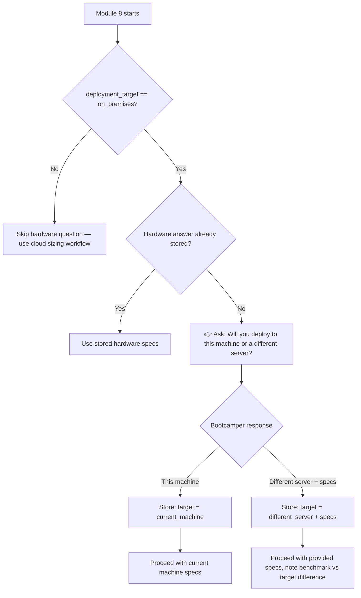

# Design: On-Premises Hardware Clarification in Performance Modules

## Overview

This feature adds a hardware clarification question to the performance-related module steering files (Modules 8, 9, 11) that fires when the bootcamper's deployment target is "on_premises." The question asks whether the production system is the current dev machine or a different server, and if different, captures the production hardware specs. The answer is stored in the bootcamper's preferences so it's only asked once.

## Architecture

### Affected Files

| File | Change Type | Purpose |
|------|-------------|---------|
| `senzing-bootcamp/steering/module-08-performance-testing.md` (or equivalent) | Modify | Add hardware clarification question at the start of hardware-dependent work |
| `senzing-bootcamp/steering/module-09-*.md` (or equivalent) | Modify | Reference stored hardware answer, skip re-asking |
| `senzing-bootcamp/steering/module-11-deployment.md` (or equivalent) | Modify | Reference stored hardware answer, skip re-asking |

### Design Rationale

The hardware clarification is asked once (in Module 8, the first performance module) and stored in the bootcamper's preferences checkpoint. Subsequent modules (9, 11) read the stored answer rather than re-asking. This avoids repetition while ensuring all hardware-dependent recommendations target the correct system.

### Workflow



## Components and Interfaces

### Component 1: Hardware Clarification Question (Module 8)

In the Module 8 steering file, before any benchmarking or hardware-dependent recommendations:

```
IF deployment_target == "on_premises" AND hardware_target NOT in preferences:
  👉 "Will you deploy to this machine, or a different on-premises server?
  If different, what are the specs (CPU cores, RAM, storage type, database server)?"
  
  🛑 STOP — End your response here. Wait for the bootcamper's answer.
  
  Store the answer in config/bootcamp_preferences.yaml under hardware_target:
  - If this machine: hardware_target: "current_machine"
  - If different: hardware_target: "different_server", with production_specs: { ... }
```

### Component 2: Hardware Answer Reference (Modules 9, 11)

In Modules 9 and 11 steering files:

```
IF deployment_target == "on_premises":
  Read hardware_target from config/bootcamp_preferences.yaml
  IF hardware_target == "different_server":
    Use production_specs for recommendations
    Note: "Benchmarks were run on your dev machine; recommendations target your production hardware"
  ELSE:
    Use current machine specs for recommendations
```

### Component 3: Conditional Skip for Non-On-Premises

When `deployment_target` is NOT "on_premises" (AWS, Azure, GCP, Kubernetes), the hardware clarification question is never asked. Cloud deployments have their own sizing workflows defined in the deployment-specific steering files.

## Data Models

### Preferences Addition

In `config/bootcamp_preferences.yaml`:

```yaml
hardware_target: "current_machine"  # or "different_server"
production_specs:  # only present if hardware_target == "different_server"
  cpu_cores: 16
  ram_gb: 64
  storage_type: "NVMe SSD"
  database: "PostgreSQL 15"
```

## Error Handling

- If the bootcamper provides incomplete specs, the agent should ask follow-up questions for the missing details
- If the bootcamper is unsure about production specs, the agent should note the uncertainty and provide recommendations for a range of hardware configurations

## Testing Strategy

- Verify that Module 8 steering contains the hardware clarification question with the on_premises conditional
- Verify the question uses the 👉 marker and has a hard-stop block
- Verify Modules 9 and 11 reference the stored hardware answer rather than re-asking
- Verify the question is NOT asked when deployment_target is not "on_premises"
- Verify the preferences schema includes the hardware_target field
