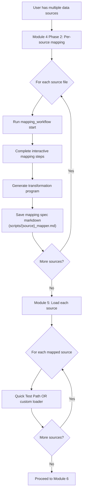

# Design: Per-Source Mapping Workflow

## Overview

This feature updates the Senzing Bootcamp Module 5 documentation and the Module 4 steering file to explicitly require a separate `mapping_workflow` run for each user-supplied data source. Currently, Module 5 references a "Quick Test Path" that runs `mapping_workflow` steps 5–8 but does not enforce per-source mapping documentation. The Module 4 steering already iterates per data source for transformation but does not emphasize producing a separate mapping specification markdown per source.

The changes are purely documentation and steering updates — no application code is modified.

### Design Rationale

In real-world entity resolution, each data source has a unique schema, field naming convention, and quality profile. Running a single mapping workflow and reusing its output across sources masks these differences and produces incorrect or incomplete mappings. Per-source mapping files provide:

- Clear documentation of each source's field-to-attribute mapping
- Easier per-source updates when schemas change
- Practice running the `mapping_workflow` tool multiple times (a key bootcamp learning objective)

## Architecture

### Affected Files

| File | Change Type | Purpose |
|------|-------------|---------|
| `senzing-bootcamp/docs/modules/MODULE_5_SINGLE_SOURCE_LOADING.md` | Modify | Add explicit per-source mapping requirement to the Quick Test Path section |
| `senzing-bootcamp/steering/module-04-data-quality-mapping.md` | Modify | Strengthen per-source mapping documentation requirement in Phase 2 workflow |

### Change Strategy

The changes follow a two-pronged approach:

1. **Module 5 doc** — Update the "Quick Test Path" section to instruct the agent to run `mapping_workflow` separately for each source file and produce a per-source mapping specification markdown before proceeding to loading.

2. **Module 4 steering** — Add an explicit step in the Phase 2 per-source workflow requiring the mapping workflow to produce a dedicated mapping specification markdown file (e.g., `scripts/toyworld_mapper.md`, `scripts/funtoys_mapper.md`) for each source, even when mapper code is shared.



## Components and Interfaces

### Component 1: Module 5 Quick Test Path Update

**Location:** `senzing-bootcamp/docs/modules/MODULE_5_SINGLE_SOURCE_LOADING.md` — "Quick Test Path" section

**Current behavior:** The Quick Test Path section offers `mapping_workflow` steps 5–8 as a single pass without specifying per-source iteration or per-source mapping output.

**New behavior:** The section will:
- State that the mapping workflow must be run separately for each user-supplied source file
- Require each run to produce its own mapping specification markdown
- Guide the user through mapping the first source, then repeating for additional sources
- Note that mapper code may be shared if schemas are identical, but mapping documentation is always per-source

### Component 2: Module 4 Steering Per-Source Mapping Spec Requirement

**Location:** `senzing-bootcamp/steering/module-04-data-quality-mapping.md` — Phase 2 workflow, step 11 (Save and document)

**Current behavior:** Step 11 saves the transformation program and mapping documentation to `docs/mapping_[name].md` but does not explicitly require a mapping specification markdown per source in the `scripts/` directory.

**New behavior:** Step 11 will additionally require:
- A per-source mapping specification markdown saved to `scripts/{source_name}_mapper.md`
- The mapping spec documents the field mappings, entity type, and transformation logic specific to that source
- This file is always per-source, even when the transformation program is shared

### Component 3: Module 4 Steering Workflow Emphasis

**Location:** `senzing-bootcamp/steering/module-04-data-quality-mapping.md` — Phase 2 workflow, step 1

**Current behavior:** Step 1 calls `mapping_workflow(action='start')` per source but doesn't emphasize that each source must complete its own full mapping workflow run.

**New behavior:** Add an agent instruction box emphasizing that each data source must go through its own complete `mapping_workflow` run, producing its own mapping specification markdown. The instruction will explicitly prohibit reusing one source's mapping output for another source.

## Data Models

No data model changes. The mapping specification markdown files follow the existing documentation pattern already established in `docs/mapping_[name].md`. The new per-source files in `scripts/` use the same structure but are named `{source_name}_mapper.md`.

### Mapping Specification Markdown Structure

Each `scripts/{source_name}_mapper.md` file will contain:

```markdown
# Mapping Specification: {SOURCE_NAME}

**Source file:** data/raw/{source_file}
**Data source name:** {DATA_SOURCE}
**Entity type:** Person / Organization / Both
**Generated by:** mapping_workflow

## Field Mappings

| Source Field | Senzing Attribute | Transformation | Notes |
|---|---|---|---|
| ... | ... | ... | ... |

## Mapping Decisions

- [Key decisions made during mapping]

## Quality Notes

- [Quality observations specific to this source]
```

## Error Handling

Not applicable — this feature modifies documentation and steering files only. No runtime error handling is involved.

## Testing Strategy

Since this feature consists entirely of documentation and steering file changes (no application code, no functions, no parsers, no data transformations), property-based testing does not apply. There are no pure functions with input/output behavior to test.

### Validation Approach

- **Manual review:** Verify that the updated Module 5 doc and Module 4 steering clearly require per-source `mapping_workflow` runs
- **Completeness check:** Confirm all four acceptance criteria from the requirements are addressed:
  1. Module 5 doc explicitly requires separate `mapping_workflow` per source ✓
  2. Each run produces its own mapping specification markdown ✓
  3. Shared mapper code is allowed but mapping docs are always per-source ✓
  4. Instructions guide through first source, then repeat for additional sources ✓
- **Consistency check:** Ensure Module 4 steering and Module 5 doc are aligned and not contradictory
